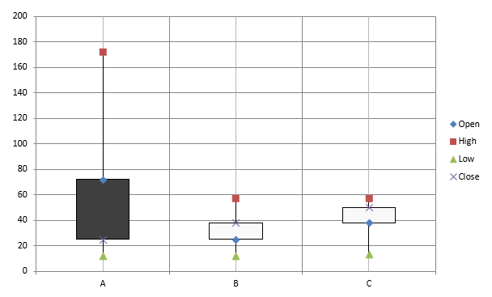
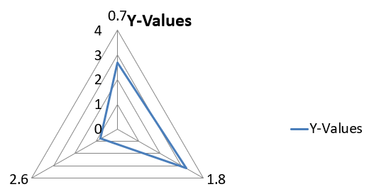

## **Overzicht**

Dit artikel biedt een uitgebreide gids over hoe je grafieken kunt maken en aanpassen met Aspose.Slides voor .NET. Je leert hoe je programmatically een grafiek aan een dia toevoegt, deze van gegevens voorziet en verschillende opmaakopties toepast om te voldoen aan je specifieke ontwerpeisen. Door het artikel heen illustreren gedetailleerde code‑voorbeelden elke stap, van het initialiseren van de presentatie en het grafiekobject tot het configureren van series, assen en legenda's. Door deze gids te volgen, krijg je een solide begrip van hoe je dynamische grafiekgeneratie in je .NET‑toepassingen kunt integreren, waardoor het proces van het maken van gegevens‑gedreven presentaties wordt gestroomlijnd.

## **Grafiek maken**

Grafieken helpen mensen snel gegevens te visualiseren en inzichten te verkrijgen die niet meteen duidelijk zijn in een tabel of spreadsheet.

**Waarom grafieken maken?**

Met grafieken kun je:

* grote hoeveelheden gegevens op één dia in een presentatie aggregeren, samenvatten of condenseren;
* patronen en trends in gegevens blootleggen;
* de richting en dynamiek van gegevens over tijd of ten opzichte van een specifieke meeteenheid afleiden;
* uitbijters, afwijkingen, fouten en onsamenhangende gegevens opsporen;
* complexe gegevens communiceren of presenteren.

In PowerPoint kun je grafieken maken via de *Insert*-functie, die sjablonen biedt voor het ontwerpen van vele soorten grafieken. Met Aspose.Slides kun je zowel gewone grafieken (gebaseerd op populaire graaftypen) als aangepaste grafieken maken.

{} 
Gebruik de [ChartType](https://reference.aspose.com/slides/nl/net/aspose.slides.charts/charttype/) enumeratie onder de [Aspose.Slides.Charts](https://reference.aspose.com/slides/nl/net/aspose.slides.charts/) namespace. De waarden in deze enumeratie komen overeen met verschillende graaftypen.
{} 

### **Maak gegroepeerde kolomgrafieken**

Deze sectie legt uit hoe je gegroepeerde kolomgrafieken maakt met Aspose.Slides voor .NET. Je leert een presentatie te initialiseren, een grafiek toe te voegen en elementen zoals titel, gegevens, series, categorieën en opmaak aan te passen. Volg de onderstaande stappen om te zien hoe een standaard gegroepeerde kolomgrafiek wordt gegenereerd:

1. Maak een instantie van de [Presentation](https://reference.aspose.com/slides/nl/net/aspose.slides/presentation) klasse.
1. Haal een referentie op naar een dia met behulp van de index.
1. Voeg een grafiek toe met enkele gegevens en specificeer het type `ChartType.ClusteredColumn`.
1. Voeg een titel toe aan de grafiek.
1. Toegang tot het gegevenswerkblad van de grafiek.
1. Verwijder alle standaard series en categorieën.
1. Voeg nieuwe series en categorieën toe.
1. Voeg nieuwe grafiekgegevens toe voor de grafiekseries.
1. Pas een vulkleur toe op de grafiekseries.
1. Voeg labels toe aan de grafiekseries.
1. Sla de gewijzigde presentatie op als een PPTX‑bestand.

Deze C#‑code toont hoe je een gegroepeerde kolomgrafiek maakt:

```c#
// Instantiate the Presentation class.
using (Presentation presentation = new Presentation())
{
    // Access the first slide.
    ISlide slide = presentation.Slides[0];

    // Add a clustered column chart with its default data.
    IChart chart = slide.Shapes.AddChart(ChartType.ClusteredColumn, 20, 20, 500, 300);

    // Set the chart title.
    chart.ChartTitle.AddTextFrameForOverriding("Sample Title");
    chart.ChartTitle.TextFrameForOverriding.TextFrameFormat.CenterText = NullableBool.True;
    chart.ChartTitle.Height = 20;
    chart.HasTitle = true;

    // Set the first series to show values.
    chart.ChartData.Series[0].Labels.DefaultDataLabelFormat.ShowValue = true;

    // Set the index of the chart data sheet.
    int worksheetIndex = 0;

    // Get the chart data workbook.
    IChartDataWorkbook workbook = chart.ChartData.ChartDataWorkbook;

    // Delete the default generated series and categories.
    chart.ChartData.Series.Clear();
    chart.ChartData.Categories.Clear();

    // Add new series.
    chart.ChartData.Series.Add(workbook.GetCell(worksheetIndex, 0, 1, "Series 1"), chart.Type);
    chart.ChartData.Series.Add(workbook.GetCell(worksheetIndex, 0, 2, "Series 2"), chart.Type);

    // Add new categories.
    chart.ChartData.Categories.Add(workbook.GetCell(worksheetIndex, 1, 0, "Category 1"));
    chart.ChartData.Categories.Add(workbook.GetCell(worksheetIndex, 2, 0, "Category 2"));
    chart.ChartData.Categories.Add(workbook.GetCell(worksheetIndex, 3, 0, "Category 3"));

    // Get the first chart series.
    IChartSeries series = chart.ChartData.Series[0];

    // Populate the series data.
    series.DataPoints.AddDataPointForBarSeries(workbook.GetCell(worksheetIndex, 1, 1, 20));
    series.DataPoints.AddDataPointForBarSeries(workbook.GetCell(worksheetIndex, 2, 1, 50));
    series.DataPoints.AddDataPointForBarSeries(workbook.GetCell(worksheetIndex, 3, 1, 30));

    // Set the fill color for the series.
    series.Format.Fill.FillType = FillType.Solid;
    series.Format.Fill.SolidFillColor.Color = Color.Red;

    // Get the second chart series.
    series = chart.ChartData.Series[1];

    // Populate the series data.
    series.DataPoints.AddDataPointForBarSeries(workbook.GetCell(worksheetIndex, 1, 2, 30));
    series.DataPoints.AddDataPointForBarSeries(workbook.GetCell(worksheetIndex, 2, 2, 10));
    series.DataPoints.AddDataPointForBarSeries(workbook.GetCell(worksheetIndex, 3, 2, 60));

    // Set the fill color for the series.
    series.Format.Fill.FillType = FillType.Solid;
    series.Format.Fill.SolidFillColor.Color = Color.Green;

    // Set the first label to show the category name.
    IDataLabel label = series.DataPoints[0].Label;
    label.DataLabelFormat.ShowCategoryName = true;

    label = series.DataPoints[1].Label;
    label.DataLabelFormat.ShowSeriesName = true;

    // Set the series to show the value for the third label.
    label = series.DataPoints[2].Label;
    label.DataLabelFormat.ShowValue = true;
    label.DataLabelFormat.ShowSeriesName = true;
    label.DataLabelFormat.Separator = "/";

    // Save the presentation to disk as a PPTX file.
    presentation.Save("AsposeChart_out.pptx", SaveFormat.Pptx);
}
```

Het resultaat:


### **Maak spreidingsgrafieken**

Spreidingsgrafieken (ook wel scatter plots of x‑y‑grafieken genoemd) worden vaak gebruikt om patronen te zoeken of correlaties tussen twee variabelen aan te tonen.

Gebruik een spreidingsgrafiek wanneer:

* Je gepaarde numerieke gegevens hebt.
* Je twee variabelen hebt die goed bij elkaar passen.
* Je wilt bepalen of de twee variabelen met elkaar verband houden.
* Je een onafhankelijke variabele hebt die meerdere waarden heeft voor een afhankelijke variabele.

Deze C#‑code laat zien hoe je een spreidingsgrafiek maakt met verschillende markeringsreeksen:

```c#
// Maak een instantie van de Presentation-klasse.
using (Presentation presentation = new Presentation())
{
    // Toegang tot de eerste dia.
    ISlide slide = presentation.Slides[0];

    // Maak de standaard spreidingsgrafiek.
    IChart chart = slide.Shapes.AddChart(ChartType.ScatterWithSmoothLines, 20, 20, 500, 300);

    // Stel de index van het grafiekgegevensblad in.
    int worksheetIndex = 0;

    // Haal het grafiekgegevenswerkboek op.
    IChartDataWorkbook workbook = chart.ChartData.ChartDataWorkbook;

    // Verwijder de standaardreeks.
    chart.ChartData.Series.Clear();

    // Voeg nieuwe series toe.
    chart.ChartData.Series.Add(workbook.GetCell(worksheetIndex, 1, 1, "Series 1"), chart.Type);
    chart.ChartData.Series.Add(workbook.GetCell(worksheetIndex, 1, 3, "Series 2"), chart.Type);

    // Haal de eerste grafiekreeks op.
    IChartSeries series = chart.ChartData.Series[0];

    // Voeg een nieuw punt (1:3) toe aan de reeks.
    series.DataPoints.AddDataPointForScatterSeries(workbook.GetCell(worksheetIndex, 2, 1, 1), workbook.GetCell(worksheetIndex, 2, 2, 3));

    // Voeg een nieuw punt (2:10) toe.
    series.DataPoints.AddDataPointForScatterSeries(workbook.GetCell(worksheetIndex, 3, 1, 2), workbook.GetCell(worksheetIndex, 3, 2, 10));

    // Wijzig het type van de reeks.
    series.Type = ChartType.ScatterWithStraightLinesAndMarkers;

    // Wijzig de marker van de grafiekreeks.
    series.Marker.Size = 10;
    series.Marker.Symbol = MarkerStyleType.Star;

    // Haal de tweede grafiekreeks op.
    series = chart.ChartData.Series[1];

    // Voeg een nieuw punt (5:2) toe aan de grafiekreeks.
    series.DataPoints.AddDataPointForScatterSeries(workbook.GetCell(worksheetIndex, 2, 3, 5), workbook.GetCell(worksheetIndex, 2, 4, 2));

    // Voeg een nieuw punt (3:1) toe.
    series.DataPoints.AddDataPointForScatterSeries(workbook.GetCell(worksheetIndex, 3, 3, 3), workbook.GetCell(worksheetIndex, 3, 4, 1));

    // Voeg een nieuw punt (2:2) toe.
    series.DataPoints.AddDataPointForScatterSeries(workbook.GetCell(worksheetIndex, 4, 3, 2), workbook.GetCell(worksheetIndex, 4, 4, 2));

    // Voeg een nieuw punt (5:1) toe.
    series.DataPoints.AddDataPointForScatterSeries(workbook.GetCell(worksheetIndex, 5, 3, 5), workbook.GetCell(worksheetIndex, 5, 4, 1));

    // Wijzig de marker van de grafiekreeks.
    series.Marker.Size = 10;
    series.Marker.Symbol = MarkerStyleType.Circle;

    // Sla de presentatie op schijf als een PPTX-bestand.
    presentation.Save("AsposeChart_out.pptx", SaveFormat.Pptx);
}
```

Het resultaat:


### **Maak taartgrafieken**

Taartgrafieken worden het best gebruikt om de deel‑tot‑geheel‑relatie in gegevens te tonen, vooral wanneer de gegevens categorische labels met numerieke waarden bevatten. Als je gegevens echter veel delen of labels bevatten, kun je beter een staafgrafiek overwegen.

1. Maak een instantie van de [Presentation](https://reference.aspose.com/slides/nl/net/aspose.slides/presentation) klasse.
1. Haal een referentie op naar een dia met behulp van de index.
1. Voeg een grafiek toe met standaardgegevens en specificeer het type `ChartType.Pie`.
1. Toegang tot het gegevenswerkboek van de grafiek ([IChartDataWorkbook](https://reference.aspose.com/slides/nl/net/aspose.slides.charts/ichartdataworkbook/)).
1. Verwijder de standaard series en categorieën.
1. Voeg nieuwe series en categorieën toe.
1. Voeg nieuwe grafiekgegevens toe voor de grafiekseries.
1. Voeg nieuwe punten toe voor de grafiek en pas aangepaste kleuren toe op de sectoren van de taartgrafiek.
1. Stel labels in voor de series.
1. Schakel leidinglijnen in voor de serielabels.
1. Stel de rotatiehoek in voor de taartgrafiek.
1. Sla de gewijzigde presentatie op als een PPTX‑bestand.

Deze C#‑code toont hoe je een taartgrafiek maakt:

```c#
// Maak een instantie van de Presentation-klasse.
using (Presentation presentation = new Presentation())
{
    // Toegang tot de eerste dia.
    ISlide slide = presentation.Slides[0];

    // Voeg een grafiek toe met de standaardgegevens.
    IChart chart = slide.Shapes.AddChart(ChartType.Pie, 20, 20, 500, 300);

    // Stel de titel van de grafiek in.
    chart.ChartTitle.AddTextFrameForOverriding("Sample Title");
    chart.ChartTitle.TextFrameForOverriding.TextFrameFormat.CenterText = NullableBool.True;
    chart.ChartTitle.Height = 20;
    chart.HasTitle = true;

    // Stel de eerste reeks in om waarden te tonen.
    chart.ChartData.Series[0].Labels.DefaultDataLabelFormat.ShowValue = true;

    // Stel de index van het grafiekgegevensblad in.
    int worksheetIndex = 0;

    // Haal het grafiekgegevenswerkboek op.
    IChartDataWorkbook workbook = chart.ChartData.ChartDataWorkbook;

    // Verwijder de standaardgegenereerde reeksen en categorieën.
    chart.ChartData.Series.Clear();
    chart.ChartData.Categories.Clear();

    // Voeg nieuwe categorieën toe.
    chart.ChartData.Categories.Add(workbook.GetCell(0, 1, 0, "1st Qtr"));
    chart.ChartData.Categories.Add(workbook.GetCell(0, 2, 0, "2nd Qtr"));
    chart.ChartData.Categories.Add(workbook.GetCell(0, 3, 0, "3rd Qtr"));

    // Voeg een nieuwe reeks toe.
    IChartSeries series = chart.ChartData.Series.Add(workbook.GetCell(0, 0, 1, "Series 1"), chart.Type);

    // Vul de reeksen met gegevens.
    series.DataPoints.AddDataPointForPieSeries(workbook.GetCell(worksheetIndex, 1, 1, 20));
    series.DataPoints.AddDataPointForPieSeries(workbook.GetCell(worksheetIndex, 2, 1, 50));
    series.DataPoints.AddDataPointForPieSeries(workbook.GetCell(worksheetIndex, 3, 1, 30));

    // Stel de sectorkleur in.
    chart.ChartData.SeriesGroups[0].IsColorVaried = true;

    IChartDataPoint point = series.DataPoints[0];
    point.Format.Fill.FillType = FillType.Solid;
    point.Format.Fill.SolidFillColor.Color = Color.Cyan;

    // Stel de sectorrand in.
    point.Format.Line.FillFormat.FillType = FillType.Solid;
    point.Format.Line.FillFormat.SolidFillColor.Color = Color.Gray;
    point.Format.Line.Width = 3.0;
    point.Format.Line.Style = LineStyle.ThinThick;
    point.Format.Line.DashStyle = LineDashStyle.LargeDash;

    IChartDataPoint point1 = series.DataPoints[1];
    point1.Format.Fill.FillType = FillType.Solid;
    point1.Format.Fill.SolidFillColor.Color = Color.Brown;

    // Stel de sectorrand in.
    point1.Format.Line.FillFormat.FillType = FillType.Solid;
    point1.Format.Line.FillFormat.SolidFillColor.Color = Color.Blue;
    point1.Format.Line.Width = 3.0;
    point1.Format.Line.Style = LineStyle.Single;
    point1.Format.Line.DashStyle = LineDashStyle.LargeDashDot;

    IChartDataPoint point2 = series.DataPoints[2];
    point2.Format.Fill.FillType = FillType.Solid;
    point2.Format.Fill.SolidFillColor.Color = Color.Coral;

    // Stel de sectorrand in.
    point2.Format.Line.FillFormat.FillType = FillType.Solid;
    point2.Format.Line.FillFormat.SolidFillColor.Color = Color.Red;
    point2.Format.Line.Width = 2.0;
    point2.Format.Line.Style = LineStyle.ThinThin;
    point2.Format.Line.DashStyle = LineDashStyle.LargeDashDotDot;

    // Maak aangepaste labels voor elke categorie in de nieuwe reeks.
    IDataLabel label1 = series.DataPoints[0].Label;

    label1.DataLabelFormat.ShowValue = true;

    IDataLabel label2 = series.DataPoints[1].Label;
    label2.DataLabelFormat.ShowValue = true;
    label2.DataLabelFormat.ShowLegendKey = true;
    label2.DataLabelFormat.ShowPercentage = true;

    IDataLabel label3 = series.DataPoints[2].Label;
    label3.DataLabelFormat.ShowSeriesName = true;
    label3.DataLabelFormat.ShowPercentage = true;

    // Stel de reeks in om leader‑lines voor de grafiek te tonen.
    series.Labels.DefaultDataLabelFormat.ShowLeaderLines = true;

    // Stel de rotatiehoek voor de taartgrafieksectoren in.
    chart.ChartData.SeriesGroups[0].FirstSliceAngle = 180;

    // Sla de presentatie op schijf als een PPTX‑bestand.
    presentation.Save("PieChart_out.pptx", SaveFormat.Pptx);
}
```

Het resultaat:


### **Maak lijngrafieken**

Lijngrafieken (ook bekend als lijndiagrammen) zijn het best geschikt voor situaties waarin je veranderingen in waarde over tijd wilt laten zien. Met een lijngrafiek kun je een grote hoeveelheid gegevens tegelijk vergelijken, trends in de tijd volgen, anomalieën in gegevensreeksen benadrukken en meer.

1. Maak een instantie van de [Presentation](https://reference.aspose.com/slides/nl/net/aspose.slides/presentation) klasse.
1. Haal een referentie op naar een dia met behulp van de index.
1. Voeg een grafiek toe met standaardgegevens en specificeer het type `ChartType.Line`.
1. Toegang tot het gegevenswerkboek van de grafiek ([IChartDataWorkbook](https://reference.aspose.com/slides/nl/net/aspose.slides.charts/ichartdataworkbook/)).
1. Verwijder de standaard series en categorieën.
1. Voeg nieuwe series en categorieën toe.
1. Voeg nieuwe grafiekgegevens toe voor de grafiekseries.
1. Sla de gewijzigde presentatie op als een PPTX‑bestand.

Deze C#‑code toont hoe je een lijngrafiek maakt:

```c#
using (Presentation presentation = new Presentation())
{
    IChart lineChart = presentation.Slides[0].Shapes.AddChart(ChartType.Line, 20, 20, 500, 300);

    presentation.Save("lineChart.pptx", SaveFormat.Pptx);
}
```

Standaard worden punten in een lijngrafiek verbonden door rechte doorlopende lijnen. Als je de punten liever met stippellijnen wilt verbinden, kun je als volgt je voorkeursstippeltype opgeven:

```c#
foreach (IChartSeries series in lineChart.ChartData.Series)
{
    series.Format.Line.DashStyle = LineDashStyle.Dash;
}
```

Het resultaat:


### **Maak boomkaart‑grafieken**

Boomkaart‑grafieken zijn het best geschikt voor verkoopgegevens wanneer je de relatieve grootte van datacategorieën wilt laten zien en snel de aandacht wilt vestigen op items die grote bijdragers zijn binnen elke categorie.

1. Maak een instantie van de [Presentation](https://reference.aspose.com/slides/nl/net/aspose.slides/presentation) klasse.
1. Haal een referentie op naar een dia met behulp van de index.
1. Voeg een grafiek toe met standaardgegevens en specificeer het type `ChartType.Treemap`.
1. Toegang tot het gegevenswerkboek van de grafiek ([IChartDataWorkbook](https://reference.aspose.com/slides/nl/net/aspose.slides.charts/ichartdataworkbook/)).
1. Verwijder de standaard series en categorieën.
1. Voeg nieuwe series en categorieën toe.
1. Voeg nieuwe grafiekgegevens toe voor de grafiekseries.
1. Sla de gewijzigde presentatie op als een PPTX‑bestand.

Deze C#‑code toont hoe je een boomkaart‑grafiek maakt:

```c#
using (Presentation presentation = new Presentation())
{
    IChart chart = presentation.Slides[0].Shapes.AddChart(ChartType.Treemap, 20, 20, 500, 300);
    chart.ChartData.Categories.Clear();
    chart.ChartData.Series.Clear();

    IChartDataWorkbook workbook = chart.ChartData.ChartDataWorkbook;
    workbook.Clear(0);

    // Tak 1
    IChartCategory leaf = chart.ChartData.Categories.Add(workbook.GetCell(0, "C1", "Leaf1"));
    leaf.GroupingLevels.SetGroupingItem(1, "Stem1");
    leaf.GroupingLevels.SetGroupingItem(2, "Branch1");

    chart.ChartData.Categories.Add(workbook.GetCell(0, "C2", "Leaf2"));

    leaf = chart.ChartData.Categories.Add(workbook.GetCell(0, "C3", "Leaf3"));
    leaf.GroupingLevels.SetGroupingItem(1, "Stem2");

    chart.ChartData.Categories.Add(workbook.GetCell(0, "C4", "Leaf4"));

    // Tak 2
    leaf = chart.ChartData.Categories.Add(workbook.GetCell(0, "C5", "Leaf5"));
    leaf.GroupingLevels.SetGroupingItem(1, "Stem3");
    leaf.GroupingLevels.SetGroupingItem(2, "Branch2");

    chart.ChartData.Categories.Add(workbook.GetCell(0, "C6", "Leaf6"));

    leaf = chart.ChartData.Categories.Add(workbook.GetCell(0, "C7", "Leaf7"));
    leaf.GroupingLevels.SetGroupingItem(1, "Stem4");

    chart.ChartData.Categories.Add(workbook.GetCell(0, "C8", "Leaf8"));

    IChartSeries series = chart.ChartData.Series.Add(ChartType.Treemap);
    series.Labels.DefaultDataLabelFormat.ShowCategoryName = true;
    series.DataPoints.AddDataPointForTreemapSeries(workbook.GetCell(0, "D1", 4));
    series.DataPoints.AddDataPointForTreemapSeries(workbook.GetCell(0, "D2", 5));
    series.DataPoints.AddDataPointForTreemapSeries(workbook.GetCell(0, "D3", 3));
    series.DataPoints.AddDataPointForTreemapSeries(workbook.GetCell(0, "D4", 6));
    series.DataPoints.AddDataPointForTreemapSeries(workbook.GetCell(0, "D5", 9));
    series.DataPoints.AddDataPointForTreemapSeries(workbook.GetCell(0, "D6", 9));
    series.DataPoints.AddDataPointForTreemapSeries(workbook.GetCell(0, "D7", 4));
    series.DataPoints.AddDataPointForTreemapSeries(workbook.GetCell(0, "D8", 3));

    series.ParentLabelLayout = ParentLabelLayoutType.Overlapping;

    presentation.Save("Treemap.pptx", SaveFormat.Pptx);
}
```

Het resultaat:


### **Maak aandelen‑grafieken**

Aandelen‑grafieken worden gebruikt om financiële gegevens zoals openings‑, hoogste, laagste en slotkoersen weer te geven, zodat markttrends en volatiliteit geanalyseerd kunnen worden. Ze bieden essentiële inzichten in de prestaties van aandelen, wat investeerders en analisten helpt weloverwogen beslissingen te nemen.

1. Maak een instantie van de [Presentation](https://reference.aspose.com/slides/nl/net/aspose.slides/presentation) klasse.
1. Haal een referentie op naar een dia met behulp van de index.
1. Voeg een grafiek toe met standaardgegevens en specificeer het type `ChartType.OpenHighLowClose`.
1. Toegang tot het gegevenswerkboek van de grafiek ([IChartDataWorkbook](https://reference.aspose.com/slides/nl/net/aspose.slides.charts/ichartdataworkbook/)).
1. Verwijder de standaard series en categorieën.
1. Voeg nieuwe series en categorieën toe.
1. Voeg nieuwe grafiekgegevens toe voor de grafiekseries.
1. Specificeer het HiLowLines‑formaat.
1. Sla de gewijzigde presentatie op als een PPTX‑bestand.

Deze C#‑code toont hoe je een aandelen‑grafiek maakt:

```c#
using (Presentation presentation = new Presentation())
{
    IChart chart = presentation.Slides[0].Shapes.AddChart(ChartType.OpenHighLowClose, 20, 20, 500, 300, false);

    IChartDataWorkbook workbook = chart.ChartData.ChartDataWorkbook;

    chart.ChartData.Categories.Add(workbook.GetCell(0, 1, 0, "A"));
    chart.ChartData.Categories.Add(workbook.GetCell(0, 2, 0, "B"));
    chart.ChartData.Categories.Add(workbook.GetCell(0, 3, 0, "C"));

    chart.ChartData.Series.Add(workbook.GetCell(0, 0, 1, "Open"), chart.Type);
    chart.ChartData.Series.Add(workbook.GetCell(0, 0, 2, "High"), chart.Type);
    chart.ChartData.Series.Add(workbook.GetCell(0, 0, 3, "Low"), chart.Type);
    chart.ChartData.Series.Add(workbook.GetCell(0, 0, 4, "Close"), chart.Type);

    IChartSeries series = chart.ChartData.Series[0];
    series.DataPoints.AddDataPointForStockSeries(workbook.GetCell(0, 1, 1, 72));
    series.DataPoints.AddDataPointForStockSeries(workbook.GetCell(0, 2, 1, 25));
    series.DataPoints.AddDataPointForStockSeries(workbook.GetCell(0, 3, 1, 38));

    series = chart.ChartData.Series[1];
    series.DataPoints.AddDataPointForStockSeries(workbook.GetCell(0, 1, 2, 172));
    series.DataPoints.AddDataPointForStockSeries(workbook.GetCell(0, 2, 2, 57));
    series.DataPoints.AddDataPointForStockSeries(workbook.GetCell(0, 3, 2, 57));

    series = chart.ChartData.Series[2];
    series.DataPoints.AddDataPointForStockSeries(workbook.GetCell(0, 1, 3, 12));
    series.DataPoints.AddDataPointForStockSeries(workbook.GetCell(0, 2, 3, 12));
    series.DataPoints.AddDataPointForStockSeries(workbook.GetCell(0, 3, 3, 13));

    series = chart.ChartData.Series[3];
    series.DataPoints.AddDataPointForStockSeries(workbook.GetCell(0, 1, 4, 25));
    series.DataPoints.AddDataPointForStockSeries(workbook.GetCell(0, 2, 4, 38));
    series.DataPoints.AddDataPointForStockSeries(workbook.GetCell(0, 3, 4, 50));

    chart.ChartData.SeriesGroups[0].UpDownBars.HasUpDownBars = true;
    chart.ChartData.SeriesGroups[0].HiLowLinesFormat.Line.FillFormat.FillType = FillType.Solid;

    foreach (IChartSeries ser in chart.ChartData.Series)
    {
        ser.Format.Line.FillFormat.FillType = FillType.NoFill;
    }

    chart.Axes.VerticalAxis.MinorGridLinesFormat.Line.FillFormat.FillType = FillType.NoFill;

    presentation.Save("Stock-chart.pptx", SaveFormat.Pptx);
}
```

Het resultaat:



### **Maak box‑en‑whisker‑grafieken**

Box‑en‑whisker‑grafieken worden gebruikt om de verdeling van gegevens weer te geven door belangrijke statistische maten, zoals mediaan, kwartielen en mogelijke uitbijters, samen te vatten. Ze zijn vooral nuttig bij verkennende data‑analyse en statistische studies om snel de variabiliteit van gegevens te begrijpen en eventuele anomalieën te identificeren.

1. Maak een instantie van de [Presentation](https://reference.aspose.com/slides/nl/net/aspose.slides/presentation) klasse.
1. Haal een referentie op naar een dia met behulp van de index.
1. Voeg een grafiek toe met standaardgegevens en specificeer het type `ChartType.BoxAndWhisker`.
1. Toegang tot het gegevenswerkboek van de grafiek ([IChartDataWorkbook](https://reference.aspose.com/slides/nl/net/aspose.slides.charts/ichartdataworkbook/)).
1. Verwijder de standaard series en categorieën.
1. Voeg nieuwe series en categorieën toe.
1. Voeg nieuwe grafiekgegevens toe voor de grafiekseries.
1. Sla de gewijzigde presentatie op als een PPTX‑bestand.

Deze C#‑code toont hoe je een box‑en‑whisker‑grafiek maakt:

```c#
using (Presentation presentation = new Presentation())
{
    IChart chart = presentation.Slides[0].Shapes.AddChart(ChartType.BoxAndWhisker, 20, 20, 500, 300);
    chart.ChartData.Categories.Clear();
    chart.ChartData.Series.Clear();

    IChartDataWorkbook workbook = chart.ChartData.ChartDataWorkbook;
    workbook.Clear(0);

    chart.ChartData.Categories.Add(workbook.GetCell(0, "A1", "Category 1"));
    chart.ChartData.Categories.Add(workbook.GetCell(0, "A2", "Category 2"));
    chart.ChartData.Categories.Add(workbook.GetCell(0, "A3", "Category 3"));
    chart.ChartData.Categories.Add(workbook.GetCell(0, "A4", "Category 4"));
    chart.ChartData.Categories.Add(workbook.GetCell(0, "A5", "Category 5"));
    chart.ChartData.Categories.Add(workbook.GetCell(0, "A6", "Category 6"));

    IChartSeries series = chart.ChartData.Series.Add(ChartType.BoxAndWhisker);

    series.QuartileMethod = QuartileMethodType.Exclusive;
    series.ShowMeanLine = true;
    series.ShowMeanMarkers = true;
    series.ShowInnerPoints = true;
    series.ShowOutlierPoints = true;

    series.DataPoints.AddDataPointForBoxAndWhiskerSeries(workbook.GetCell(0, "B1", 15));
    series.DataPoints.AddDataPointForBoxAndWhiskerSeries(workbook.GetCell(0, "B2", 41));
    series.DataPoints.AddDataPointForBoxAndWhiskerSeries(workbook.GetCell(0, "B3", 16));
    series.DataPoints.AddDataPointForBoxAndWhiskerSeries(workbook.GetCell(0, "B4", 10));
    series.DataPoints.AddDataPointForBoxAndWhiskerSeries(workbook.GetCell(0, "B5", 23));
    series.DataPoints.AddDataPointForBoxAndWhiskerSeries(workbook.GetCell(0, "B6", 16));

    presentation.Save("BoxAndWhisker.pptx", SaveFormat.Pptx);
}
```

### **Maak trechter‑grafieken**

Trechter‑grafieken worden gebruikt om processen te visualiseren die opeenvolgende fasen omvatten, waarbij het volume van gegevens afneemt naarmate het van de ene stap naar de volgende gaat. Ze zijn bijzonder nuttig voor het analyseren van conversieratio's, het identificeren van knelpunten en het volgen van de efficiëntie van verkoop‑ of marketingprocessen.

1. Maak een instantie van de [Presentation](https://reference.aspose.com/slides/nl/net/aspose.slides/presentation) klasse.
1. Haal een referentie op naar een dia met behulp van de index.
1. Voeg een grafiek toe met standaardgegevens en specificeer het type `ChartType.Funnel`.
1. Sla de gewijzigde presentatie op als een PPTX‑bestand.

Deze C#‑code toont hoe je een trechter‑grafiek maakt:

```c#
using (Presentation presentation = new Presentation("test.pptx"))
{
    IChart chart = presentation.Slides[0].Shapes.AddChart(ChartType.Funnel, 50, 50, 500, 400);
    chart.ChartData.Categories.Clear();
    chart.ChartData.Series.Clear();

    IChartDataWorkbook workbook = chart.ChartData.ChartDataWorkbook;
    workbook.Clear(0);

    chart.ChartData.Categories.Add(workbook.GetCell(0, "A1", "Category 1"));
    chart.ChartData.Categories.Add(workbook.GetCell(0, "A2", "Category 2"));
    chart.ChartData.Categories.Add(workbook.GetCell(0, "A3", "Category 3"));
    chart.ChartData.Categories.Add(workbook.GetCell(0, "A4", "Category 4"));
    chart.ChartData.Categories.Add(workbook.GetCell(0, "A5", "Category 5"));
    chart.ChartData.Categories.Add(workbook.GetCell(0, "A6", "Category 6"));

    IChartSeries series = chart.ChartData.Series.Add(ChartType.Funnel);

    series.DataPoints.AddDataPointForFunnelSeries(workbook.GetCell(0, "B1", 50));
    series.DataPoints.AddDataPointForFunnelSeries(workbook.GetCell(0, "B2", 100));
    series.DataPoints.AddDataPointForFunnelSeries(workbook.GetCell(0, "B3", 200));
    series.DataPoints.AddDataPointForFunnelSeries(workbook.GetCell(0, "B4", 300));
    series.DataPoints.AddDataPointForFunnelSeries(workbook.GetCell(0, "B5", 400));
    series.DataPoints.AddDataPointForFunnelSeries(workbook.GetCell(0, "B6", 500));

    presentation.Save("Funnel.pptx", SaveFormat.Pptx);
}
```

Het resultaat:


### **Maak zonnestraal‑grafieken**

Zonnestraal‑grafieken worden gebruikt om hiërarchische data te visualiseren, waarbij niveaus als concentrische ringen worden weergegeven. Ze helpen deel‑tot‑geheel‑relaties te illustreren en zijn ideaal voor het weergeven van geneste categorieën en subcategorieën op een duidelijke, compacte manier.

1. Maak een instantie van de [Presentation](https://reference.aspose.com/slides/nl/net/aspose.slides/presentation) klasse.
1. Haal een referentie op naar een dia met behulp van de index.
1. Voeg een grafiek toe met standaardgegevens en specificeer het type `ChartType.Sunburst`.
1. Sla de gewijzigde presentatie op als een PPTX‑bestand.

Deze C#‑code toont hoe je een zonnestraal‑grafiek maakt:

```c#
using (Presentation presentation = new Presentation())
{
    IChart chart = presentation.Slides[0].Shapes.AddChart(ChartType.Sunburst, 20, 20, 500, 300);
    chart.ChartData.Categories.Clear();
    chart.ChartData.Series.Clear();

    IChartDataWorkbook workbook = chart.ChartData.ChartDataWorkbook;
    workbook.Clear(0);

    // Tak 1
    IChartCategory leaf = chart.ChartData.Categories.Add(workbook.GetCell(0, "C1", "Leaf1"));
    leaf.GroupingLevels.SetGroupingItem(1, "Stem1");
    leaf.GroupingLevels.SetGroupingItem(2, "Branch1");

    chart.ChartData.Categories.Add(workbook.GetCell(0, "C2", "Leaf2"));

    leaf = chart.ChartData.Categories.Add(workbook.GetCell(0, "C3", "Leaf3"));
    leaf.GroupingLevels.SetGroupingItem(1, "Stem2");

    chart.ChartData.Categories.Add(workbook.GetCell(0, "C4", "Leaf4"));

    // Tak 2
    leaf = chart.ChartData.Categories.Add(workbook.GetCell(0, "C5", "Leaf5"));
    leaf.GroupingLevels.SetGroupingItem(1, "Stem3");
    leaf.GroupingLevels.SetGroupingItem(2, "Branch2");

    chart.ChartData.Categories.Add(workbook.GetCell(0, "C6", "Leaf6"));

    leaf = chart.ChartData.Categories.Add(workbook.GetCell(0, "C7", "Leaf7"));
    leaf.GroupingLevels.SetGroupingItem(1, "Stem4");

    chart.ChartData.Categories.Add(workbook.GetCell(0, "C8", "Leaf8"));

    IChartSeries series = chart.ChartData.Series.Add(ChartType.Sunburst);
    series.Labels.DefaultDataLabelFormat.ShowCategoryName = true;
    series.DataPoints.AddDataPointForSunburstSeries(workbook.GetCell(0, "D1", 4));
    series.DataPoints.AddDataPointForSunburstSeries(workbook.GetCell(0, "D2", 5));
    series.DataPoints.AddDataPointForSunburstSeries(workbook.GetCell(0, "D3", 3));
    series.DataPoints.AddDataPointForSunburstSeries(workbook.GetCell(0, "D4", 6));
    series.DataPoints.AddDataPointForSunburstSeries(workbook.GetCell(0, "D5", 9));
    series.DataPoints.AddDataPointForSunburstSeries(workbook.GetCell(0, "D6", 9));
    series.DataPoints.AddDataPointForSunburstSeries(workbook.GetCell(0, "D7", 4));
    series.DataPoints.AddDataPointForSunburstSeries(workbook.GetCell(0, "D8", 3));

    presentation.Save("Sunburst.pptx", SaveFormat.Pptx);
}
```

Het resultaat:


### **Maak histogram‑grafieken**

Histogram‑grafieken worden gebruikt om de verdeling van numerieke data weer te geven door waarden in reeksen of «bins» te groeperen. Ze zijn bijzonder nuttig om patronen zoals frequentie, scheefheid en spreiding te identificeren, en om uitbijters in een dataset te detecteren.

1. Maak een instantie van de [Presentation](https://reference.aspose.com/slides/nl/net/aspose.slides/presentation) klasse.
1. Haal een referentie op naar een dia met behulp van de index.
1. Voeg een grafiek toe met enkele gegevens en specificeer het type `ChartType.Histogram`.
1. Toegang tot het gegevenswerkboek van de grafiek ([IChartDataWorkbook](https://reference.aspose.com/slides/nl/net/aspose.slides.charts/ichartdataworkbook/)).
1. Verwijder de standaard series en categorieën.
1. Voeg nieuwe series en categorieën toe.
1. Sla de gewijzigde presentatie op als een PPTX‑bestand.

Deze C#‑code toont hoe je een histogram‑grafiek maakt:

```c#
using (Presentation presentation = new Presentation())
{
    IChart chart = presentation.Slides[0].Shapes.AddChart(ChartType.Histogram, 20, 20, 500, 300);
    chart.ChartData.Categories.Clear();
    chart.ChartData.Series.Clear();

    IChartDataWorkbook workbook = chart.ChartData.ChartDataWorkbook;
    workbook.Clear(0);

    IChartSeries series = chart.ChartData.Series.Add(ChartType.Histogram);
    series.DataPoints.AddDataPointForHistogramSeries(workbook.GetCell(0, "A1", 15));
    series.DataPoints.AddDataPointForHistogramSeries(workbook.GetCell(0, "A2", -41));
    series.DataPoints.AddDataPointForHistogramSeries(workbook.GetCell(0, "A3", 16));
    series.DataPoints.AddDataPointForHistogramSeries(workbook.GetCell(0, "A4", 10));
    series.DataPoints.AddDataPointForHistogramSeries(workbook.GetCell(0, "A5", -23));
    series.DataPoints.AddDataPointForHistogramSeries(workbook.GetCell(0, "A6", 16));

    chart.Axes.HorizontalAxis.AggregationType = AxisAggregationType.Automatic;

    presentation.Save("Histogram.pptx", SaveFormat.Pptx);
}
```

Het resultaat:


### **Maak radargrafieken**

Radargrafieken worden gebruikt om multivariate data in een twee‑dimensionaal formaat weer te geven, waardoor je meerdere variabelen tegelijk gemakkelijk kunt vergelijken. Ze zijn vooral nuttig om patronen, sterke en zwakke punten te identificeren over verschillende prestatiestatistieken of attributen.

1. Maak een instantie van de [Presentation](https://reference.aspose.com/slides/nl/net/aspose.slides/presentation) klasse.
1. Haal een referentie op naar een dia met behulp van de index.
1. Voeg een grafiek toe met enkele gegevens en specificeer het type `ChartType.Radar`.
1. Sla de gewijzigde presentatie op als een PPTX‑bestand.

Deze C#‑code toont hoe je een radargrafiek maakt:

```c#
using (Presentation presentation = new Presentation())
{
    presentation.Slides[0].Shapes.AddChart(ChartType.Radar, 20, 20, 500, 300);
    presentation.Save("Radar-chart.pptx", SaveFormat.Pptx);
}
```

Het resultaat:



### **Maak multi‑categorie‑grafieken**

Multi‑categorie‑grafieken worden gebruikt om data weer te geven die meer dan één categorische groepering omvatten, waardoor je waarden over meerdere dimensies tegelijk kunt vergelijken. Ze zijn vooral handig wanneer je trends en relaties binnen complexe, gelaagde datasets moet analyseren.

1. Maak een instantie van de [Presentation](https://reference.aspose.com/slides/nl/net/aspose.slides/presentation) klasse.
1. Haal een referentie op naar een dia met behulp van de index.
1. Voeg een grafiek toe met standaardgegevens en specificeer het type `ChartType.ClusteredColumn`.
1. Toegang tot het gegevenswerkboek van de grafiek ([IChartDataWorkbook](https://reference.aspose.com/slides/nl/net/aspose.slides.charts/ichartdataworkbook/)).
1. Verwijder de standaard series en categorieën.
1. Voeg nieuwe series en categorieën toe.
1. Voeg nieuwe grafiekgegevens toe voor de grafiekseries.
1. Sla de gewijzigde presentatie op als een PPTX‑bestand.

Deze C#‑code toont hoe je een multi‑categorie‑grafiek maakt:

```c#
using (Presentation presentation = new Presentation())
{
    ISlide slide = presentation.Slides[0];

    IChart chart = presentation.Slides[0].Shapes.AddChart(ChartType.ClusteredColumn, 20, 20, 500, 300);
    chart.ChartData.Series.Clear();
    chart.ChartData.Categories.Clear();

    IChartDataWorkbook workbook = chart.ChartData.ChartDataWorkbook;
    workbook.Clear(0);

    int worksheetIndex = 0;

    IChartCategory category = chart.ChartData.Categories.Add(workbook.GetCell(0, "c2", "A"));
    category.GroupingLevels.SetGroupingItem(1, "Group1");
    category = chart.ChartData.Categories.Add(workbook.GetCell(0, "c3", "B"));

    category = chart.ChartData.Categories.Add(workbook.GetCell(0, "c4", "C"));
    category.GroupingLevels.SetGroupingItem(1, "Group2");
    category = chart.ChartData.Categories.Add(workbook.GetCell(0, "c5", "D"));

    category = chart.ChartData.Categories.Add(workbook.GetCell(0, "c6", "E"));
    category.GroupingLevels.SetGroupingItem(1, "Group3");
    category = chart.ChartData.Categories.Add(workbook.GetCell(0, "c7", "F"));

    category = chart.ChartData.Categories.Add(workbook.GetCell(0, "c8", "G"));
    category.GroupingLevels.SetGroupingItem(1, "Group4");
    category = chart.ChartData.Categories.Add(workbook.GetCell(0, "c9", "H"));

    // Voeg een serie toe.
    IChartSeries series = chart.ChartData.Series.Add(workbook.GetCell(0, "D1", "Series 1"), ChartType.ClusteredColumn);

    series.DataPoints.AddDataPointForBarSeries(workbook.GetCell(worksheetIndex, "D2", 10));
    series.DataPoints.AddDataPointForBarSeries(workbook.GetCell(worksheetIndex, "D3", 20));
    series.DataPoints.AddDataPointForBarSeries(workbook.GetCell(worksheetIndex, "D4", 30));
    series.DataPoints.AddDataPointForBarSeries(workbook.GetCell(worksheetIndex, "D5", 40));
    series.DataPoints.AddDataPointForBarSeries(workbook.GetCell(worksheetIndex, "D6", 50));
    series.DataPoints.AddDataPointForBarSeries(workbook.GetCell(worksheetIndex, "D7", 60));
    series.DataPoints.AddDataPointForBarSeries(workbook.GetCell(worksheetIndex, "D8", 70));
    series.DataPoints.AddDataPointForBarSeries(workbook.GetCell(worksheetIndex, "D9", 80));

    // Sla de presentatie met de grafiek op.
    presentation.Save("AsposeChart_out.pptx", SaveFormat.Pptx);
}
```

Het resultaat:


### **Maak kaart‑grafieken**

Kaart‑grafieken worden gebruikt om geografische data te visualiseren door informatie te koppelen aan specifieke locaties zoals landen, provincies of steden. Ze zijn bijzonder nuttig voor het analyseren van regionale trends, demografische data en ruimtelijke distributies op een duidelijke, visueel aantrekkelijke manier.

Deze C#‑code toont hoe je een kaart‑grafiek maakt:

```c#
using (Presentation presentation = new Presentation())
{
    IChart chart = presentation.Slides[0].Shapes.AddChart(ChartType.Map, 20, 20, 500, 300);
    presentation.Save("mapChart.pptx", SaveFormat.Pptx);
}
```

Het resultaat:


### **Maak combinatiegrafieken**

Een combinatiegrafiek (of combo‑grafiek) combineert twee of meer grafiektype­sen in één diagram. Deze grafiek laat je verschillen tussen twee of meer datasets benadrukken, vergelijken of onderzoeken, zodat je relaties tussen hen kunt identificeren.


De onderstaande C#‑code laat zien hoe je de bovenstaande combinatiegrafiek maakt in een PowerPoint‑presentatie:

```c#
private static void CreateComboChart()
{
    using (Presentation presentation = new Presentation())
    {
        IChart chart = CreateChartWithFirstSeries(presentation.Slides[0]);

        AddSecondSeriesToChart(chart);
        AddThirdSeriesToChart(chart);

        SetPrimaryAxesFormat(chart);
        SetSecondaryAxesFormat(chart);

        presentation.Save("combo-chart.pptx", SaveFormat.Pptx);
    }
}

private static IChart CreateChartWithFirstSeries(ISlide slide)
{
    IChart chart = slide.Shapes.AddChart(ChartType.ClusteredColumn, 50, 50, 600, 400);

    // Stelt de titel van de grafiek in
    chart.HasTitle = true;
    chart.ChartTitle.AddTextFrameForOverriding("Chart Title");
    chart.ChartTitle.Overlay = false;
    IPortionFormat portionFormat = 
       chart.ChartTitle.TextFrameForOverriding.Paragraphs[0].ParagraphFormat.DefaultPortionFormat;
    portionFormat.FontBold = NullableBool.False;
    portionFormat.FontHeight = 18f;

    // Stelt de legenda van de grafiek in
    chart.Legend.Position = LegendPositionType.Bottom;
    chart.Legend.TextFormat.PortionFormat.FontHeight = 12f;

    // Verwijdert de standaard gegenereerde series en categorieën
    chart.ChartData.Series.Clear();
    chart.ChartData.Categories.Clear();

    int worksheetIndex = 0;
    IChartDataWorkbook workbook = chart.ChartData.ChartDataWorkbook;

    // Voegt nieuwe categorieën toe
    chart.ChartData.Categories.Add(workbook.GetCell(worksheetIndex, 1, 0, "Category 1"));
    chart.ChartData.Categories.Add(workbook.GetCell(worksheetIndex, 2, 0, "Category 2"));
    chart.ChartData.Categories.Add(workbook.GetCell(worksheetIndex, 3, 0, "Category 3"));
    chart.ChartData.Categories.Add(workbook.GetCell(worksheetIndex, 4, 0, "Category 4"));

    // Voeg de eerste reeks toe
    IChartSeries series = chart.ChartData.Series.Add(
        workbook.GetCell(worksheetIndex, 0, 1, "Series 1"), chart.Type);

    series.ParentSeriesGroup.Overlap = -25;
    series.ParentSeriesGroup.GapWidth = 220;

    series.DataPoints.AddDataPointForBarSeries(workbook.GetCell(worksheetIndex, 1, 1, 4.3));
    series.DataPoints.AddDataPointForBarSeries(workbook.GetCell(worksheetIndex, 2, 1, 2.5));
    series.DataPoints.AddDataPointForBarSeries(workbook.GetCell(worksheetIndex, 3, 1, 3.5));
    series.DataPoints.AddDataPointForBarSeries(workbook.GetCell(worksheetIndex, 4, 1, 4.5));

    return chart;
}

private static void AddSecondSeriesToChart(IChart chart)
{
    IChartDataWorkbook workbook = chart.ChartData.ChartDataWorkbook;
    const int worksheetIndex = 0;

    IChartSeries series = chart.ChartData.Series.Add(
        workbook.GetCell(worksheetIndex, 0, 2, "Series 2"), ChartType.ClusteredColumn);

    series.ParentSeriesGroup.Overlap = -25;
    series.ParentSeriesGroup.GapWidth = 220;

    series.DataPoints.AddDataPointForBarSeries(workbook.GetCell(worksheetIndex, 1, 2, 2.4));
    series.DataPoints.AddDataPointForBarSeries(workbook.GetCell(worksheetIndex, 2, 2, 4.4));
    series.DataPoints.AddDataPointForBarSeries(workbook.GetCell(worksheetIndex, 3, 2, 1.8));
    series.DataPoints.AddDataPointForBarSeries(workbook.GetCell(worksheetIndex, 4, 2, 2.8));
}

private static void AddThirdSeriesToChart(IChart chart)
{
    IChartDataWorkbook workbook = chart.ChartData.ChartDataWorkbook;
    const int worksheetIndex = 0;

    IChartSeries series = chart.ChartData.Series.Add(
        workbook.GetCell(worksheetIndex, 0, 3, "Series 3"), ChartType.Line);

    series.DataPoints.AddDataPointForLineSeries(workbook.GetCell(worksheetIndex, 1, 3, 2.0));
    series.DataPoints.AddDataPointForLineSeries(workbook.GetCell(worksheetIndex, 2, 3, 2.0));
    series.DataPoints.AddDataPointForLineSeries(workbook.GetCell(worksheetIndex, 3, 3, 3.0));
    series.DataPoints.AddDataPointForLineSeries(workbook.GetCell(worksheetIndex, 4, 3, 5.0));

    series.PlotOnSecondAxis = true;
}

private static void SetPrimaryAxesFormat(IChart chart)
{
    // Stelt de horizontale as in
    IAxis horizontalAxis = chart.Axes.HorizontalAxis;
    horizontalAxis.TextFormat.PortionFormat.FontHeight = 12f;
    horizontalAxis.Format.Line.FillFormat.FillType = FillType.NoFill;

    SetAxisTitle(horizontalAxis, "X Axis");

    // Stelt de verticale as in
    IAxis verticalAxis = chart.Axes.VerticalAxis;
    verticalAxis.TextFormat.PortionFormat.FontHeight = 12f;
    verticalAxis.Format.Line.FillFormat.FillType = FillType.NoFill;

    SetAxisTitle(verticalAxis, "Y Axis 1");

    // Stelt de kleur van de verticale hoofdroosterlijnen in
    ILineFillFormat majorGridLinesFormat = verticalAxis.MajorGridLinesFormat.Line.FillFormat;
    majorGridLinesFormat.FillType = FillType.Solid;
    majorGridLinesFormat.SolidFillColor.Color = Color.FromArgb(217, 217, 217);
}

private static void SetSecondaryAxesFormat(IChart chart)
{
    // Stelt de secundaire horizontale as in
    IAxis secondaryHorizontalAxis = chart.Axes.SecondaryHorizontalAxis;
    secondaryHorizontalAxis.Position = AxisPositionType.Bottom;
    secondaryHorizontalAxis.CrossType = CrossesType.Maximum;
    secondaryHorizontalAxis.IsVisible = false;
    secondaryHorizontalAxis.MajorGridLinesFormat.Line.FillFormat.FillType = FillType.NoFill;
    secondaryHorizontalAxis.MinorGridLinesFormat.Line.FillFormat.FillType = FillType.NoFill;

    // Stelt de secundaire verticale as in
    IAxis secondaryVerticalAxis = chart.Axes.SecondaryVerticalAxis;
    secondaryVerticalAxis.Position = AxisPositionType.Right;
    secondaryVerticalAxis.TextFormat.PortionFormat.FontHeight = 12f;
    secondaryVerticalAxis.Format.Line.FillFormat.FillType = FillType.NoFill;
    secondaryVerticalAxis.MajorGridLinesFormat.Line.FillFormat.FillType = FillType.NoFill;
    secondaryVerticalAxis.MinorGridLinesFormat.Line.FillFormat.FillType = FillType.NoFill;

    SetAxisTitle(secondaryVerticalAxis, "Y Axis 2");
}

private static void SetAxisTitle(IAxis axis, string axisTitle)
{
    axis.HasTitle = true;
    axis.Title.Overlay = false;
    IPortionFormat titlePortionFormat =
        axis.Title.AddTextFrameForOverriding(axisTitle).Paragraphs[0].ParagraphFormat.DefaultPortionFormat;
    titlePortionFormat.FontBold = NullableBool.False;
    titlePortionFormat.FontHeight = 12f;
}
```

## **Grafieken bijwerken**

Aspose.Slides voor .NET maakt het mogelijk om PowerPoint‑grafieken bij te werken door grafiekgegevens, opmaak en stijl aan te passen. Deze functionaliteit vereenvoudigt het bijwerken van presentaties met dynamische inhoud en zorgt ervoor dat grafieken nauwkeurig de huidige gegevens en visuele standaarden weergeven.

1. Instantieer de [Presentation](https://reference.aspose.com/slides/nl/net/aspose.slides/presentation) klasse die de presentatie met een grafiek vertegenwoordigt.
1. Haal een referentie op naar een dia met behulp van de index.
1. Doorloop alle shapes om de grafiek te vinden.
1. Toegang tot het gegevenswerkblad van de grafiek.
1. Wijzig de grafiekgegevensreeks door de waarden van de reeks te wijzigen.
1. Voeg een nieuwe reeks toe en vul de gegevens in.
1. Sla de gewijzigde presentatie op als een PPTX‑bestand.

Deze C#‑code toont hoe je een grafiek bijwerkt:

```c#
const string chartName = "My chart";

// Instantieer de Presentation-klasse die een PPTX-bestand vertegenwoordigt.
using (Presentation presentation = new Presentation("ExistingChart.pptx"))
{
    // Toegang tot de eerste dia.
    ISlide slide = presentation.Slides[0];

    foreach (IShape shape in slide.Shapes)
    {
        if (shape is IChart chart && chart.Name == chartName)
        {
            // Stel de index van het grafiekgegevensblad in.
            int worksheetIndex = 0;

            // Haal het grafiekgegevenswerkboek op.
            IChartDataWorkbook workbook = chart.ChartData.ChartDataWorkbook;

            // Wijzig de categorienamen van de grafiek.
            workbook.GetCell(worksheetIndex, 1, 0, "Modified Category 1");
            workbook.GetCell(worksheetIndex, 2, 0, "Modified Category 2");

            // Haal de eerste grafiekreeks op.
            IChartSeries series = chart.ChartData.Series[0];

            // Werk de reeksengegevens bij.
            workbook.GetCell(worksheetIndex, 0, 1, "New_Series 1"); // Naam van de reeks aanpassen.
            series.DataPoints[0].Value.Data = 90;
            series.DataPoints[1].Value.Data = 123;
            series.DataPoints[2].Value.Data = 44;

            // Haal de tweede grafiekreeks op.
            series = chart.ChartData.Series[1];

            // Werk de reeksengegevens bij.
            workbook.GetCell(worksheetIndex, 0, 2, "New_Series 2"); // Naam van de reeks aanpassen.
            series.DataPoints[0].Value.Data = 23;
            series.DataPoints[1].Value.Data = 67;
            series.DataPoints[2].Value.Data = 99;

            // Voeg een nieuwe reeks toe.
            series = chart.ChartData.Series.Add(workbook.GetCell(worksheetIndex, 0, 3, "Series 3"), chart.Type);

            // Vul de reeksen met gegevens.
            series.DataPoints.AddDataPointForBarSeries(workbook.GetCell(worksheetIndex, 1, 3, 20));
            series.DataPoints.AddDataPointForBarSeries(workbook.GetCell(worksheetIndex, 2, 3, 50));
            series.DataPoints.AddDataPointForBarSeries(workbook.GetCell(worksheetIndex, 3, 3, 30));

            chart.Type = ChartType.ClusteredCylinder;
        }
    }

    // Sla de presentatie met de grafiek op.
    presentation.Save("AsposeChartModified_out.pptx", SaveFormat.Pptx);
}
```

## **Gegevensbereik voor een grafiek instellen**

Aspose.Slides voor .NET biedt de flexibiliteit om een specifiek gegevensbereik uit een werkblad als bron voor de gegevens van je grafiek te definiëren. Dit betekent dat je rechtstreeks een deel van je werkblad kunt koppelen aan de grafiek, waardoor je kunt bepalen welke cellen bijdragen aan de series en categorieën van de grafiek. Hierdoor kun je je grafieken eenvoudig bijwerken en synchroniseren met de laatste gegevenswijzigingen in je werkblad, zodat je PowerPoint‑presentaties actuele en nauwkeurige informatie weergeven.

1. Instantieer de [Presentation](https://reference.aspose.com/slides/nl/net/aspose.slides/presentation) klasse die de presentatie met een grafiek vertegenwoordigt.
1. Haal een referentie op naar een dia met behulp van de index.
1. Doorloop alle shapes om de grafiek te vinden.
1. Toegang tot de grafiekgegevens en stel het bereik in.
1. Sla de gewijzigde presentatie op als een PPTX‑bestand.

Deze C#‑code toont hoe je het gegevensbereik voor een grafiek instelt:

```c#
const string chartName = "My chart";

// Instantieer de Presentation-klasse die een PPTX-bestand vertegenwoordigt.
using (Presentation presentation = new Presentation("ExistingChart.pptx"))
{
    // Toegang tot de eerste dia.
    ISlide slide = presentation.Slides[0];

    foreach (IShape shape in slide.Shapes)
    {
        if (shape is IChart chart && chart.Name == chartName)
        {
            chart.ChartData.SetRange("Sheet1!A1:B4");
        }
    }

    presentation.Save("SetDataRange_out.pptx", SaveFormat.Pptx);
}
```

## **Standaardmarkeringen in grafieken gebruiken**

Wanneer je standaardmarkeringen in grafieken gebruikt, krijgt elke grafiekreeks automatisch een ander standaardmarkering‑symbool.

Deze C#‑code toont hoe je automatisch een grafiekreeks‑markering instelt:

```c#
using (Presentation presentation = new Presentation())
{
    ISlide slide = presentation.Slides[0];
    IChart chart = slide.Shapes.AddChart(ChartType.LineWithMarkers, 10, 10, 400, 400);

    chart.ChartData.Series.Clear();
    chart.ChartData.Categories.Clear();

    IChartDataWorkbook workbook = chart.ChartData.ChartDataWorkbook;

    IChartSeries series = chart.ChartData.Series.Add(workbook.GetCell(0, 0, 1, "Series 1"), chart.Type);

    chart.ChartData.Categories.Add(workbook.GetCell(0, 1, 0, "C1"));
    series.DataPoints.AddDataPointForLineSeries(workbook.GetCell(0, 1, 1, 24));

    chart.ChartData.Categories.Add(workbook.GetCell(0, 2, 0, "C2"));
    series.DataPoints.AddDataPointForLineSeries(workbook.GetCell(0, 2, 1, 23));

    chart.ChartData.Categories.Add(workbook.GetCell(0, 3, 0, "C3"));
    series.DataPoints.AddDataPointForLineSeries(workbook.GetCell(0, 3, 1, -10));

    chart.ChartData.Categories.Add(workbook.GetCell(0, 4, 0, "C4"));
    series.DataPoints.AddDataPointForLineSeries(workbook.GetCell(0, 4, 1, null));

    IChartSeries series2 = chart.ChartData.Series.Add(workbook.GetCell(0, 0, 2, "Series 2"), chart.Type);

    // Vul de seriedata in.
    series2.DataPoints.AddDataPointForLineSeries(workbook.GetCell(0, 1, 2, 30));
    series2.DataPoints.AddDataPointForLineSeries(workbook.GetCell(0, 2, 2, 10));
    series2.DataPoints.AddDataPointForLineSeries(workbook.GetCell(0, 3, 2, 60));
    series2.DataPoints.AddDataPointForLineSeries(workbook.GetCell(0, 4, 2, 40));

    chart.HasLegend = true;
    chart.Legend.Overlay = false;

    presentation.Save("DefaultMarkersInChart.pptx", SaveFormat.Pptx);
}
```

## **FAQ**

**Welke grafiektypen worden ondersteund door Aspose.Slides voor .NET?**

Aspose.Slides voor .NET ondersteunt een breed scala aan grafiektypen, waaronder staaf, lijn, taart, gebied, spreiding, histogram, radar en nog veel meer. Deze flexibiliteit stelt je in staat het meest passende grafiektype voor je gegevensvisualisatie te kiezen.

**Hoe voeg ik een nieuwe grafiek toe aan een dia?**

Om een grafiek toe te voegen, maak je eerst een instantie van de [Presentation](https://reference.aspose.com/slides/nl/net/aspose.slides/presentation) klasse, haal je de gewenste dia op via de index en roep je vervolgens de methode aan om een grafiek toe te voegen, waarbij je het grafiektype en de initiële gegevens opgeeft. Dit proces integreert de grafiek direct in je presentatie.

**Hoe kan ik de gegevens in een grafiek bijwerken?**

Je kunt de gegevens van een grafiek bijwerken door toegang te krijgen tot het gegevenswerkboek van de grafiek ([IChartDataWorkbook](https://reference.aspose.com/slides/nl/net/aspose.slides.charts/ichartdataworkbook/)), de standaard series en categorieën te verwijderen en vervolgens je aangepaste gegevens toe te voegen. Hierdoor kun je de grafiek programmatically vernieuwen zodat deze de nieuwste gegevens weergeeft.

**Is het mogelijk om de uitstraling van de grafiek aan te passen?**

Ja, Aspose.Slides voor .NET biedt uitgebreide aanpassingsmogelijkheden. Je kunt kleuren, lettertypen, labels, legenda’s en andere opmaak‑elementen wijzigen om de uitstraling van de grafiek af te stemmen op je specifieke ontwerpeisen.