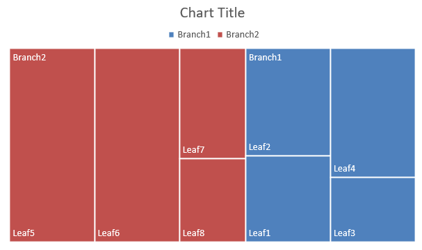
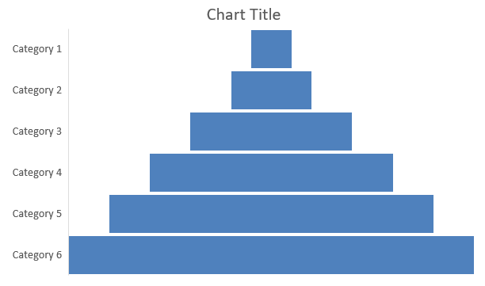
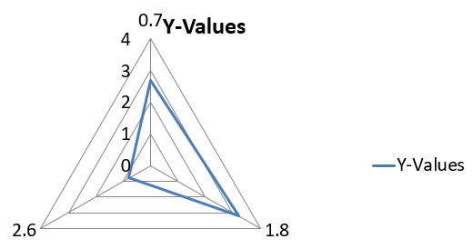

## **Overzicht**

Dit artikel biedt een uitgebreide gids over hoe je diagrammen kunt maken en aanpassen met Aspose.Slides voor .NET. Je leert hoe je programmatisch een diagram toevoegt aan een dia, het vult met gegevens, en verschillende opmaakopties toepast om te voldoen aan je specifieke ontwerpvereisten. Door het hele artikel heen illustreren gedetailleerde code‑voorbeelden elke stap, van het initialiseren van de presentatie en het diagramobject tot het configureren van series, assen en legenda’s. Door deze gids te volgen, krijg je een solide begrip van hoe je dynamische diagramgeneratie kunt integreren in je .NET‑toepassingen, waardoor het proces van het maken van gegevens‑gedreven presentaties wordt gestroomlijnd.

## **Diagram maken**

Diagrammen helpen mensen snel gegevens te visualiseren en inzichten te verkrijgen die niet meteen duidelijk zijn uit een tabel of spreadsheet.

**Waarom diagrammen maken?**

* grotere hoeveelheden gegevens samenvatten, consolideren of condenseren op één dia in een presentatie;
* patronen en trends in gegevens blootleggen;
* de richting en dynamiek van gegevens in de tijd of ten opzichte van een specifieke meeteenheid afleiden;
* uitbijters, afwijkingen, afwijkende waarden, fouten en onsamenhangende gegevens opsporen;
* complexe gegevens communiceren of presenteren.

In PowerPoint kun je diagrammen maken via de *Invoegen*-functie, die sjablonen biedt voor het ontwerpen van veel verschillende diagramtypen. Met Aspose.Slides kun je zowel reguliere diagrammen (gebaseerd op populaire diagramtypen) als aangepaste diagrammen maken.

{} 
Gebruik de [ChartType](https://reference.aspose.com/slides/net/aspose.slides.charts/charttype/) enumeratie onder de namespace [Aspose.Slides.Charts](https://reference.aspose.com/slides/net/aspose.slides.charts/). De waarden in deze enumeratie komen overeen met verschillende diagramtypen.
{} 

### **Gegroepeerde kolomdiagrammen**

Deze sectie legt uit hoe je gegroepeerde kolomdiagrammen maakt met Aspose.Slides voor .NET. Je leert een presentatie te initialiseren, een diagram toe te voegen en de elementen ervan aan te passen, zoals titel, gegevens, series, categorieën en opmaak. Volg de onderstaande stappen om te zien hoe een standaard gegroepeerd kolomdiagram wordt gegenereerd:

1. Maak een instantie van de klasse [Presentation](https://reference.aspose.com/slides/net/aspose.slides/presentation).
2. Verkrijg een referentie naar een dia via de index.
3. Voeg een diagram toe met enkele gegevens en specificeer het type `ChartType.ClusteredColumn`.
4. Voeg een titel toe aan het diagram.
5. Toegang tot het gegevenswerkblad van het diagram.
6. Verwijder alle standaard series en categorieën.
7. Voeg nieuwe series en categorieën toe.
8. Voeg nieuwe diagramgegevens toe voor de diagramseries.
9. Pas een vulkleur toe op de diagramserie.
10. Voeg labels toe aan de diagramserie.
11. Sla de gewijzigde presentatie op als een PPTX‑bestand.

Deze C#‑code toont hoe je een gegroepeerd kolomdiagram maakt:

```c#
using System.Drawing;
using Aspose.Slides;
using Aspose.Slides.Charts;
using Aspose.Slides.Export;

// Instantieer de Presentation-klasse.
using (Presentation presentation = new Presentation())
{
    // Toegang tot de eerste dia.
    ISlide slide = presentation.Slides[0];

    // Voeg een gegroepeerde kolomdiagram toe met de standaardgegevens.
    IChart chart = slide.Shapes.AddChart(ChartType.ClusteredColumn, 20, 20, 500, 300);

    // Stel de diagramtitel in.
    chart.ChartTitle.AddTextFrameForOverriding("Sample Title");
    chart.ChartTitle.TextFrameForOverriding.TextFrameFormat.CenterText = NullableBool.True;
    chart.ChartTitle.Height = 20;
    chart.HasTitle = true;

    // Stel de index van het diagramdatablad in.
    int worksheetIndex = 0;

    // Haal het diagramdatablad op.
    IChartDataWorkbook workbook = chart.ChartData.ChartDataWorkbook;

    // Verwijder de standaard gegenereerde series en categorieën.
    chart.ChartData.Series.Clear();
    chart.ChartData.Categories.Clear();

    // Voeg nieuwe series toe.
    chart.ChartData.Series.Add(workbook.GetCell(worksheetIndex, 0, 1, "Series 1"), chart.Type);
    chart.ChartData.Series.Add(workbook.GetCell(worksheetIndex, 0, 2, "Series 2"), chart.Type);

    // Voeg nieuwe categorieën toe.
    chart.ChartData.Categories.Add(workbook.GetCell(worksheetIndex, 1, 0, "Category 1"));
    chart.ChartData.Categories.Add(workbook.GetCell(worksheetIndex, 2, 0, "Category 2"));
    chart.ChartData.Categories.Add(workbook.GetCell(worksheetIndex, 3, 0, "Category 3"));

    // Haal de eerste diagramserie op.
    IChartSeries series = chart.ChartData.Series[0];

    // Vul de seriegegevens.
    series.DataPoints.AddDataPointForBarSeries(workbook.GetCell(worksheetIndex, 1, 1, 20));
    series.DataPoints.AddDataPointForBarSeries(workbook.GetCell(worksheetIndex, 2, 1, 50));
    series.DataPoints.AddDataPointForBarSeries(workbook.GetCell(worksheetIndex, 3, 1, 30));

    // Stel de vulkleur voor de serie in.
    series.Format.Fill.FillType = FillType.Solid;
    series.Format.Fill.SolidFillColor.Color = Color.Red;

    // Haal de tweede diagramserie op.
    series = chart.ChartData.Series[1];

    // Vul de seriegegevens.
    series.DataPoints.AddDataPointForBarSeries(workbook.GetCell(worksheetIndex, 1, 2, 30));
    series.DataPoints.AddDataPointForBarSeries(workbook.GetCell(worksheetIndex, 2, 2, 10));
    series.DataPoints.AddDataPointForBarSeries(workbook.GetCell(worksheetIndex, 3, 2, 60));

    // Stel de vulkleur voor de serie in.
    series.Format.Fill.FillType = FillType.Solid;
    series.Format.Fill.SolidFillColor.Color = Color.Green;

    // Stel het eerste label in om de categorienaam weer te geven.
    IDataLabel label = series.DataPoints[0].Label;
    label.DataLabelFormat.ShowCategoryName = true;

    label = series.DataPoints[1].Label;
    label.DataLabelFormat.ShowSeriesName = true;

    // Stel de serie in om de waarde voor het derde label weer te geven.
    label = series.DataPoints[2].Label;
    label.DataLabelFormat.ShowValue = true;
    label.DataLabelFormat.ShowSeriesName = true;
    label.DataLabelFormat.Separator = "/";

    // Sla de presentatie op naar schijf als een PPTX‑bestand.
    presentation.Save("AsposeChart_out.pptx", SaveFormat.Pptx);
}
```

Het resultaat:


### **Spreidingsdiagrammen**

Spreidingsdiagrammen (ook wel spreidingsplots of x‑y‑grafieken genoemd) worden vaak gebruikt om patronen te zoeken of correlaties tussen twee variabelen aan te tonen.

Gebruik een spreidingsdiagram wanneer:

* je beschikt over gekoppelde numerieke gegevens.
* je hebt twee variabelen die goed bij elkaar passen.
* je wilt bepalen of de twee variabelen met elkaar verbonden zijn.
* je hebt een onafhankelijke variabele die meerdere waarden heeft voor een afhankelijke variabele.

Deze C#‑code laat zien hoe je een spreidingsdiagram maakt met een andere reeks markers:

```c#
using Aspose.Slides;
using Aspose.Slides.Charts;
using Aspose.Slides.Export;

// Instantieer de Presentation-klasse.
using (Presentation presentation = new Presentation())
{
    // Toegang tot de eerste dia.
    ISlide slide = presentation.Slides[0];

    // Maak het standaard spreidingsdiagram.
    IChart chart = slide.Shapes.AddChart(ChartType.ScatterWithSmoothLines, 20, 20, 500, 300);

    // Stel de index van het diagramdatablad in.
    int worksheetIndex = 0;

    // Haal het diagramdatablad op.
    IChartDataWorkbook workbook = chart.ChartData.ChartDataWorkbook;

    // Verwijder de standaard series.
    chart.ChartData.Series.Clear();

    // Voeg nieuwe series toe.
    chart.ChartData.Series.Add(workbook.GetCell(worksheetIndex, 1, 1, "Series 1"), chart.Type);
    chart.ChartData.Series.Add(workbook.GetCell(worksheetIndex, 1, 3, "Series 2"), chart.Type);

    // Haal de eerste diagramserie op.
    IChartSeries series = chart.ChartData.Series[0];

    // Voeg een nieuw punt (1:3) toe aan de serie.
    series.DataPoints.AddDataPointForScatterSeries(workbook.GetCell(worksheetIndex, 2, 1, 1), workbook.GetCell(worksheetIndex, 2, 2, 3));

    // Voeg een nieuw punt (2:10) toe.
    series.DataPoints.AddDataPointForScatterSeries(workbook.GetCell(worksheetIndex, 3, 1, 2), workbook.GetCell(worksheetIndex, 3, 2, 10));

    // Wijzig het type van de serie.
    series.Type = ChartType.ScatterWithStraightLinesAndMarkers;

    // Wijzig de marker van de diagramserie.
    series.Marker.Size = 10;
    series.Marker.Symbol = MarkerStyleType.Star;

    // Haal de tweede diagramserie op.
    series = chart.ChartData.Series[1];

    // Voeg een nieuw punt (5:2) toe aan de diagramserie.
    series.DataPoints.AddDataPointForScatterSeries(workbook.GetCell(worksheetIndex, 2, 3, 5), workbook.GetCell(worksheetIndex, 2, 4, 2));

    // Voeg een nieuw punt (3:1) toe.
    series.DataPoints.AddDataPointForScatterSeries(workbook.GetCell(worksheetIndex, 3, 3, 3), workbook.GetCell(worksheetIndex, 3, 4, 1));

    // Voeg een nieuw punt (2:2) toe.
    series.DataPoints.AddDataPointForScatterSeries(workbook.GetCell(worksheetIndex, 4, 3, 2), workbook.GetCell(worksheetIndex, 4, 4, 2));

    // Voeg een nieuw punt (5:1) toe.
    series.DataPoints.AddDataPointForScatterSeries(workbook.GetCell(worksheetIndex, 5, 3, 5), workbook.GetCell(worksheetIndex, 5, 4, 1));

    // Wijzig de marker van de diagramserie.
    series.Marker.Size = 10;
    series.Marker.Symbol = MarkerStyleType.Circle;

    // Sla de presentatie op naar schijf als een PPTX‑bestand.
    presentation.Save("AsposeChart_out.pptx", SaveFormat.Pptx);
}
```

Het resultaat:


### **Taartdiagrammen**

Taartdiagrammen zijn het beste te gebruiken om de deel‑tot‑geheel‑relatie in gegevens te tonen, vooral wanneer de gegevens categorische labels met numerieke waarden bevatten. Als je gegevens echter veel delen of labels bevatten, kun je beter een staafdiagram gebruiken.

1. Maak een instantie van de klasse [Presentation](https://reference.aspose.com/slides/net/aspose.slides/presentation).
2. Verkrijg een referentie naar een dia via de index.
3. Voeg een diagram toe met standaardgegevens en specificeer het type `ChartType.Pie`.
4. Toegang tot het gegevenswerkboek van het diagram ([IChartDataWorkbook](https://reference.aspose.com/slides/net/aspose.slides.charts/ichartdataworkbook/)).
5. Verwijder de standaard series en categorieën.
6. Voeg nieuwe series en categorieën toe.
7. Voeg nieuwe diagramgegevens toe voor de diagramseries.
8. Voeg nieuwe punten toe aan het diagram en pas aangepaste kleuren toe op de sectoren van het taartdiagram.
9. Stel labels in voor de series.
10. Schakel leader‑lijnen in voor de serie‑labels.
11. Stel de rotatiehoek in voor het taartdiagram.
12. Sla de gewijzigde presentatie op als een PPTX‑bestand.

Deze C#‑code toont hoe je een taartdiagram maakt:

```c#
using System.Drawing;
using Aspose.Slides;
using Aspose.Slides.Charts;
using Aspose.Slides.Export;

// Instantieer de Presentation-klasse.
using (Presentation presentation = new Presentation())
{
    // Toegang tot de eerste dia.
    ISlide slide = presentation.Slides[0];

    // Voeg een diagram toe met de standaardgegevens.
    IChart chart = slide.Shapes.AddChart(ChartType.Pie, 20, 20, 500, 300);

    // Stel de diagramtitel in.
    chart.ChartTitle.AddTextFrameForOverriding("Sample Title");
    chart.ChartTitle.TextFrameForOverriding.TextFrameFormat.CenterText = NullableBool.True;
    chart.ChartTitle.Height = 20;
    chart.HasTitle = true;

    // Stel de eerste serie in om waarden weer te geven.
    chart.ChartData.Series[0].Labels.DefaultDataLabelFormat.ShowValue = true;

    // Stel de index van het diagramdatablad in.
    int worksheetIndex = 0;

    // Haal het diagramdatablad op.
    IChartDataWorkbook workbook = chart.ChartData.ChartDataWorkbook;

    // Verwijder de standaard gegenereerde series en categorieën.
    chart.ChartData.Series.Clear();
    chart.ChartData.Categories.Clear();

    // Voeg nieuwe categorieën toe.
    chart.ChartData.Categories.Add(workbook.GetCell(0, 1, 0, "1st Qtr"));
    chart.ChartData.Categories.Add(workbook.GetCell(0, 2, 0, "2nd Qtr"));
    chart.ChartData.Categories.Add(workbook.GetCell(0, 3, 0, "3rd Qtr"));

    // Voeg nieuwe series toe.
    IChartSeries series = chart.ChartData.Series.Add(workbook.GetCell(0, 0, 1, "Series 1"), chart.Type);

    // Vul de seriedata.
    series.DataPoints.AddDataPointForPieSeries(workbook.GetCell(worksheetIndex, 1, 1, 20));
    series.DataPoints.AddDataPointForPieSeries(workbook.GetCell(worksheetIndex, 2, 1, 50));
    series.DataPoints.AddDataPointForPieSeries(workbook.GetCell(worksheetIndex, 3, 1, 30));

    // Stel de sectorkleur in.
    chart.ChartData.SeriesGroups[0].IsColorVaried = true;

    IChartDataPoint point = series.DataPoints[0];
    point.Format.Fill.FillType = FillType.Solid;
    point.Format.Fill.SolidFillColor.Color = Color.Cyan;

    // Stel de sectorrand in.
    point.Format.Line.FillFormat.FillType = FillType.Solid;
    point.Format.Line.FillFormat.SolidFillColor.Color = Color.Gray;
    point.Format.Line.Width = 3.0;
    point.Format.Line.Style = LineStyle.ThinThick;
    point.Format.Line.DashStyle = LineDashStyle.LargeDash;

    IChartDataPoint point1 = series.DataPoints[1];
    point1.Format.Fill.FillType = FillType.Solid;
    point1.Format.Fill.SolidFillColor.Color = Color.Brown;

    // Stel de sectorrand in.
    point1.Format.Line.FillFormat.FillType = FillType.Solid;
    point1.Format.Line.FillFormat.SolidFillColor.Color = Color.Blue;
    point1.Format.Line.Width = 3.0;
    point1.Format.Line.Style = LineStyle.Single;
    point1.Format.Line.DashStyle = LineDashStyle.LargeDashDot;

    IChartDataPoint point2 = series.DataPoints[2];
    point2.Format.Fill.FillType = FillType.Solid;
    point2.Format.Fill.SolidFillColor.Color = Color.Coral;

    // Stel de sectorrand in.
    point2.Format.Line.FillFormat.FillType = FillType.Solid;
    point2.Format.Line.FillFormat.SolidFillColor.Color = Color.Red;
    point2.Format.Line.Width = 2.0;
    point2.Format.Line.Style = LineStyle.ThinThin;
    point2.Format.Line.DashStyle = LineDashStyle.LargeDashDotDot;

    // Maak aangepaste labels voor elke categorie in de nieuwe serie.
    IDataLabel label1 = series.DataPoints[0].Label;

    label1.DataLabelFormat.ShowValue = true;

    IDataLabel label2 = series.DataPoints[1].Label;
    label2.DataLabelFormat.ShowValue = true;
    label2.DataLabelFormat.ShowLegendKey = true;
    label2.DataLabelFormat.ShowPercentage = true;

    IDataLabel label3 = series.DataPoints[2].Label;
    label3.DataLabelFormat.ShowSeriesName = true;
    label3.DataLabelFormat.ShowPercentage = true;

    // Stel de serie in om leader‑lijnen weer te geven voor het diagram.
    series.Labels.DefaultDataLabelFormat.ShowLeaderLines = true;

    // Stel de rotatiehoek in voor de taartdiagramsectoren.
    chart.ChartData.SeriesGroups[0].FirstSliceAngle = 180;

    // Sla de presentatie op naar schijf als een PPTX‑bestand.
    presentation.Save("PieChart_out.pptx", SaveFormat.Pptx);
}
```

Het resultaat:


### **Lijndiagrammen**

Lijndiagrammen (ook wel lijngrafieken genoemd) zijn het beste te gebruiken wanneer je veranderingen in waarde over de tijd wilt aantonen. Met een lijndiagram kun je een grote hoeveelheid gegevens tegelijk vergelijken, wijzigingen en trends in de tijd volgen, afwijkingen in een gegevensreeks benadrukken, enzovoort.

1. Maak een instantie van de klasse [Presentation](https://reference.aspose.com/slides/net/aspose.slides/presentation).
2. Verkrijg een referentie naar een dia via de index.
3. Voeg een diagram toe met standaardgegevens en specificeer het type `ChartType.Line`.
4. Toegang tot het gegevenswerkboek van het diagram ([IChartDataWorkbook](https://reference.aspose.com/slides/net/aspose.slides.charts/ichartdataworkbook/)).
5. Verwijder de standaard series en categorieën.
6. Voeg nieuwe series en categorieën toe.
7. Voeg nieuwe diagramgegevens toe voor de diagramseries.
8. Sla de gewijzigde presentatie op als een PPTX‑bestand.

Deze C#‑code toont hoe je een lijndiagram maakt:

```c#
using Aspose.Slides;
using Aspose.Slides.Charts;
using Aspose.Slides.Export;

using (Presentation presentation = new Presentation())
{
    IChart lineChart = presentation.Slides[0].Shapes.AddChart(ChartType.Line, 20, 20, 500, 300);

    presentation.Save("lineChart.pptx", SaveFormat.Pptx);
}
```

Standaard worden punten op een lijndiagram verbonden door rechte doorlopende lijnen. Als je wilt dat de punten in plaats daarvan met stippellijnen worden verbonden, kun je het gewenste dash‑type als volgt opgeven:

```c#
using Aspose.Slides;
using Aspose.Slides.Charts;

using (Presentation presentation = new Presentation())
{
    IChart lineChart = presentation.Slides[0].Shapes.AddChart(ChartType.Line, 20, 20, 500, 300);

    foreach (IChartSeries series in lineChart.ChartData.Series)
    {
        series.Format.Line.DashStyle = LineDashStyle.Dash;
    }
}
```

Het resultaat:


### **Boomkaartdiagrammen**

Boomkaartdiagrammen zijn het beste te gebruiken voor verkoopgegevens wanneer je de relatieve grootte van gegevenscategorieën wilt weergeven en snel de aandacht wilt vestigen op items die grote bijdragers zijn binnen elke categorie.

1. Maak een instantie van de klasse [Presentation](https://reference.aspose.com/slides/net/aspose.slides/presentation).
2. Verkrijg een referentie naar een dia via de index.
3. Voeg een diagram toe met standaardgegevens en specificeer het type `ChartType.Treemap`.
4. Toegang tot het gegevenswerkboek van het diagram ([IChartDataWorkbook](https://reference.aspose.com/slides/net/aspose.slides.charts/ichartdataworkbook/)).
5. Verwijder de standaard series en categorieën.
6. Voeg nieuwe series en categorieën toe.
7. Voeg nieuwe diagramgegevens toe voor de diagramseries.
8. Sla de gewijzigde presentatie op als een PPTX‑bestand.

Deze C#‑code toont hoe je een boomkaartdiagram maakt:

```c#
using Aspose.Slides;
using Aspose.Slides.Charts;
using Aspose.Slides.Export;

using (Presentation presentation = new Presentation())
{
    IChart chart = presentation.Slides[0].Shapes.AddChart(ChartType.Treemap, 20, 20, 500, 300);
    chart.ChartData.Categories.Clear();
    chart.ChartData.Series.Clear();

    IChartDataWorkbook workbook = chart.ChartData.ChartDataWorkbook;
    workbook.Clear(0);

    // Tak 1
    IChartCategory leaf = chart.ChartData.Categories.Add(workbook.GetCell(0, "C1", "Leaf1"));
    leaf.GroupingLevels.SetGroupingItem(1, "Stem1");
    leaf.GroupingLevels.SetGroupingItem(2, "Branch1");

    chart.ChartData.Categories.Add(workbook.GetCell(0, "C2", "Leaf2"));

    leaf = chart.ChartData.Categories.Add(workbook.GetCell(0, "C3", "Leaf3"));
    leaf.GroupingLevels.SetGroupingItem(1, "Stem2");

    chart.ChartData.Categories.Add(workbook.GetCell(0, "C4", "Leaf4"));

    // Tak 2
    leaf = chart.ChartData.Categories.Add(workbook.GetCell(0, "C5", "Leaf5"));
    leaf.GroupingLevels.SetGroupingItem(1, "Stem3");
    leaf.GroupingLevels.SetGroupingItem(2, "Branch2");

    chart.ChartData.Categories.Add(workbook.GetCell(0, "C6", "Leaf6"));

    leaf = chart.ChartData.Categories.Add(workbook.GetCell(0, "C7", "Leaf7"));
    leaf.GroupingLevels.SetGroupingItem(1, "Stem4");

    chart.ChartData.Categories.Add(workbook.GetCell(0, "C8", "Leaf8"));

    IChartSeries series = chart.ChartData.Series.Add(ChartType.Treemap);
    series.Labels.DefaultDataLabelFormat.ShowCategoryName = true;
    series.DataPoints.AddDataPointForTreemapSeries(workbook.GetCell(0, "D1", 4));
    series.DataPoints.AddDataPointForTreemapSeries(workbook.GetCell(0, "D2", 5));
    series.DataPoints.AddDataPointForTreemapSeries(workbook.GetCell(0, "D3", 3));
    series.DataPoints.AddDataPointForTreemapSeries(workbook.GetCell(0, "D4", 6));
    series.DataPoints.AddDataPointForTreemapSeries(workbook.GetCell(0, "D5", 9));
    series.DataPoints.AddDataPointForTreemapSeries(workbook.GetCell(0, "D6", 9));
    series.DataPoints.AddDataPointForTreemapSeries(workbook.GetCell(0, "D7", 4));
    series.DataPoints.AddDataPointForTreemapSeries(workbook.GetCell(0, "D8", 3));

    series.ParentLabelLayout = ParentLabelLayoutType.Overlapping;

    presentation.Save("Treemap.pptx", SaveFormat.Pptx);
}
```

Het resultaat:



### **Aandelen‑diagrammen**

Aandelen‑diagrammen worden gebruikt om financiële gegevens zoals open, high, low en close prijzen weer te geven, waardoor markttendensen en volatiliteit geanalyseerd kunnen worden. Ze bieden essentiële inzichten in de prestaties van aandelen, wat beleggers en analisten helpt weloverwogen beslissingen te nemen.

1. Maak een instantie van de klasse [Presentation](https://reference.aspose.com/slides/net/aspose.slides/presentation).
2. Verkrijg een referentie naar een dia via de index.
3. Voeg een diagram toe met standaardgegevens en specificeer het type `ChartType.OpenHighLowClose`.
4. Toegang tot het gegevenswerkboek van het diagram ([IChartDataWorkbook](https://reference.aspose.com/slides/net/aspose.slides.charts/ichartdataworkbook/)).
5. Verwijder de standaard series en categorieën.
6. Voeg nieuwe series en categorieën toe.
7. Voeg nieuwe diagramgegevens toe voor de diagramseries.
8. Specificeer het HiLowLines‑formaat.
9. Sla de gewijzigde presentatie op als een PPTX‑bestand.

Deze C#‑code toont hoe je een aandelen‑diagram maakt:

```c#
using Aspose.Slides;
using Aspose.Slides.Charts;
using Aspose.Slides.Export;

using (Presentation presentation = new Presentation())
{
    IChart chart = presentation.Slides[0].Shapes.AddChart(ChartType.OpenHighLowClose, 20, 20, 500, 300, false);

    IChartDataWorkbook workbook = chart.ChartData.ChartDataWorkbook;

    chart.ChartData.Categories.Add(workbook.GetCell(0, 1, 0, "A"));
    chart.ChartData.Categories.Add(workbook.GetCell(0, 2, 0, "B"));
    chart.ChartData.Categories.Add(workbook.GetCell(0, 3, 0, "C"));

    chart.ChartData.Series.Add(workbook.GetCell(0, 0, 1, "Open"), chart.Type);
    chart.ChartData.Series.Add(workbook.GetCell(0, 0, 2, "High"), chart.Type);
    chart.ChartData.Series.Add(workbook.GetCell(0, 0, 3, "Low"), chart.Type);
    chart.ChartData.Series.Add(workbook.GetCell(0, 0, 4, "Close"), chart.Type);

    IChartSeries series = chart.ChartData.Series[0];
    series.DataPoints.AddDataPointForStockSeries(workbook.GetCell(0, 1, 1, 72));
    series.DataPoints.AddDataPointForStockSeries(workbook.GetCell(0, 2, 1, 25));
    series.DataPoints.AddDataPointForStockSeries(workbook.GetCell(0, 3, 1, 38));

    series = chart.ChartData.Series[1];
    series.DataPoints.AddDataPointForStockSeries(workbook.GetCell(0, 1, 2, 172));
    series.DataPoints.AddDataPointForStockSeries(workbook.GetCell(0, 2, 2, 57));
    series.DataPoints.AddDataPointForStockSeries(workbook.GetCell(0, 3, 2, 57));

    series = chart.ChartData.Series[2];
    series.DataPoints.AddDataPointForStockSeries(workbook.GetCell(0, 1, 3, 12));
    series.DataPoints.AddDataPointForStockSeries(workbook.GetCell(0, 2, 3, 12));
    series.DataPoints.AddDataPointForStockSeries(workbook.GetCell(0, 3, 3, 13));

    series = chart.ChartData.Series[3];
    series.DataPoints.AddDataPointForStockSeries(workbook.GetCell(0, 1, 4, 25));
    series.DataPoints.AddDataPointForStockSeries(workbook.GetCell(0, 2, 4, 38));
    series.DataPoints.AddDataPointForStockSeries(workbook.GetCell(0, 3, 4, 50));

    chart.ChartData.SeriesGroups[0].UpDownBars.HasUpDownBars = true;
    chart.ChartData.SeriesGroups[0].HiLowLinesFormat.Line.FillFormat.FillType = FillType.Solid;

    foreach (IChartSeries ser in chart.ChartData.Series)
    {
        ser.Format.Line.FillFormat.FillType = FillType.NoFill;
    }

    chart.Axes.VerticalAxis.MinorGridLinesFormat.Line.FillFormat.FillType = FillType.NoFill;

    presentation.Save("Stock-chart.pptx", SaveFormat.Pptx);
}
```

Het resultaat:


### **Box‑en‑whisker‑diagrammen**

Box‑en‑whisker‑diagrammen worden gebruikt om de distributie van gegevens weer te geven door belangrijke statistische maatstaven, zoals mediaan, kwartielen en mogelijke uitbijters, samen te vatten. Ze zijn bijzonder nuttig in verkennende data‑analyse en statistische studies om snel de variabiliteit van gegevens te begrijpen en eventuele anomalieën te identificeren.

1. Maak een instantie van de klasse [Presentation](https://reference.aspose.com/slides/net/aspose.slides/presentation).
2. Verkrijg een referentie naar een dia via de index.
3. Voeg een diagram toe met standaardgegevens en specificeer het type `ChartType.BoxAndWhisker`.
4. Toegang tot het gegevenswerkboek van het diagram ([IChartDataWorkbook](https://reference.aspose.com/slides/net/aspose.slides.charts/ichartdataworkbook/)).
5. Verwijder de standaard series en categorieën.
6. Voeg nieuwe series en categorieën toe.
7. Voeg nieuwe diagramgegevens toe voor de diagramseries.
8. Sla de gewijzigde presentatie op als een PPTX‑bestand.

Deze C#‑code toont hoe je een box‑en‑whisker‑diagram maakt:

```c#
using Aspose.Slides;
using Aspose.Slides.Charts;
using Aspose.Slides.Export;

using (Presentation presentation = new Presentation())
{
    IChart chart = presentation.Slides[0].Shapes.AddChart(ChartType.BoxAndWhisker, 20, 20, 500, 300);
    chart.ChartData.Categories.Clear();
    chart.ChartData.Series.Clear();

    IChartDataWorkbook workbook = chart.ChartData.ChartDataWorkbook;
    workbook.Clear(0);

    chart.ChartData.Categories.Add(workbook.GetCell(0, "A1", "Category 1"));
    chart.ChartData.Categories.Add(workbook.GetCell(0, "A2", "Category 2"));
    chart.ChartData.Categories.Add(workbook.GetCell(0, "A3", "Category 3"));
    chart.ChartData.Categories.Add(workbook.GetCell(0, "A4", "Category 4"));
    chart.ChartData.Categories.Add(workbook.GetCell(0, "A5", "Category 5"));
    chart.ChartData.Categories.Add(workbook.GetCell(0, "A6", "Category 6"));

    IChartSeries series = chart.ChartData.Series.Add(ChartType.BoxAndWhisker);

    series.QuartileMethod = QuartileMethodType.Exclusive;
    series.ShowMeanLine = true;
    series.ShowMeanMarkers = true;
    series.ShowInnerPoints = true;
    series.ShowOutlierPoints = true;

    series.DataPoints.AddDataPointForBoxAndWhiskerSeries(workbook.GetCell(0, "B1", 15));
    series.DataPoints.AddDataPointForBoxAndWhiskerSeries(workbook.GetCell(0, "B2", 41));
    series.DataPoints.AddDataPointForBoxAndWhiskerSeries(workbook.GetCell(0, "B3", 16));
    series.DataPoints.AddDataPointForBoxAndWhiskerSeries(workbook.GetCell(0, "B4", 10));
    series.DataPoints.AddDataPointForBoxAndWhiskerSeries(workbook.GetCell(0, "B5", 23));
    series.DataPoints.AddDataPointForBoxAndWhiskerSeries(workbook.GetCell(0, "B6", 16));

    presentation.Save("BoxAndWhisker.pptx", SaveFormat.Pptx);
}
```

### **Funnel‑diagrammen**

Funnel‑diagrammen worden gebruikt om processen te visualiseren die opeenvolgende fasen omvatten, waarbij het volume van gegevens afneemt naarmate het van de ene stap naar de volgende gaat. Ze zijn vooral nuttig voor het analyseren van conversieratio’s, het identificeren van knelpunten en het volgen van de efficiëntie van verkoop‑ of marketingprocessen.

1. Maak een instantie van de klasse [Presentation](https://reference.aspose.com/slides/net/aspose.slides/presentation).
2. Verkrijg een referentie naar een dia via de index.
3. Voeg een diagram toe met standaardgegevens en specificeer het type `ChartType.Funnel`.
4. Sla de gewijzigde presentatie op als een PPTX‑bestand.

Deze C#‑code toont hoe je een funnel‑diagram maakt:

```c#
using Aspose.Slides;
using Aspose.Slides.Charts;
using Aspose.Slides.Export;

using (Presentation presentation = new Presentation("test.pptx"))
{
    IChart chart = presentation.Slides[0].Shapes.AddChart(ChartType.Funnel, 50, 50, 500, 400);
    chart.ChartData.Categories.Clear();
    chart.ChartData.Series.Clear();

    IChartDataWorkbook workbook = chart.ChartData.ChartDataWorkbook;
    workbook.Clear(0);

    chart.ChartData.Categories.Add(workbook.GetCell(0, "A1", "Category 1"));
    chart.ChartData.Categories.Add(workbook.GetCell(0, "A2", "Category 2"));
    chart.ChartData.Categories.Add(workbook.GetCell(0, "A3", "Category 3"));
    chart.ChartData.Categories.Add(workbook.GetCell(0, "A4", "Category 4"));
    chart.ChartData.Categories.Add(workbook.GetCell(0, "A5", "Category 5"));
    chart.ChartData.Categories.Add(workbook.GetCell(0, "A6", "Category 6"));

    IChartSeries series = chart.ChartData.Series.Add(ChartType.Funnel);

    series.DataPoints.AddDataPointForFunnelSeries(workbook.GetCell(0, "B1", 50));
    series.DataPoints.AddDataPointForFunnelSeries(workbook.GetCell(0, "B2", 100));
    series.DataPoints.AddDataPointForFunnelSeries(workbook.GetCell(0, "B3", 200));
    series.DataPoints.AddDataPointForFunnelSeries(workbook.GetCell(0, "B4", 300));
    series.DataPoints.AddDataPointForFunnelSeries(workbook.GetCell(0, "B5", 400));
    series.DataPoints.AddDataPointForFunnelSeries(workbook.GetCell(0, "B6", 500));

    presentation.Save("Funnel.pptx", SaveFormat.Pptx);
}
```

Het resultaat:



### **Sunburst‑diagrammen**

Sunburst‑diagrammen worden gebruikt om hiërarchische gegevens te visualiseren, waarbij niveaus als concentrische ringen worden weergegeven. Ze helpen deel‑tot‑geheel‑relaties te illustreren en zijn ideaal voor het weergeven van geneste categorieën en subcategorieën in een duidelijk, compact formaat.

1. Maak een instantie van de klasse [Presentation](https://reference.aspose.com/slides/net/aspose.slides/presentation).
2. Verkrijg een referentie naar een dia via de index.
3. Voeg een diagram toe met standaardgegevens en specificeer het type `ChartType.Sunburst`.
4. Sla de gewijzigde presentatie op als een PPTX‑bestand.

Deze C#‑code toont hoe je een Sunburst‑diagram maakt:

```c#
using Aspose.Slides;
using Aspose.Slides.Charts;
using Aspose.Slides.Export;

using (Presentation presentation = new Presentation())
{
    IChart chart = presentation.Slides[0].Shapes.AddChart(ChartType.Sunburst, 20, 20, 500, 300);
    chart.ChartData.Categories.Clear();
    chart.ChartData.Series.Clear();

    IChartDataWorkbook workbook = chart.ChartData.ChartDataWorkbook;
    workbook.Clear(0);

    // Tak 1
    IChartCategory leaf = chart.ChartData.Categories.Add(workbook.GetCell(0, "C1", "Leaf1"));
    leaf.GroupingLevels.SetGroupingItem(1, "Stem1");
    leaf.GroupingLevels.SetGroupingItem(2, "Branch1");

    chart.ChartData.Categories.Add(workbook.GetCell(0, "C2", "Leaf2"));

    leaf = chart.ChartData.Categories.Add(workbook.GetCell(0, "C3", "Leaf3"));
    leaf.GroupingLevels.SetGroupingItem(1, "Stem2");

    chart.ChartData.Categories.Add(workbook.GetCell(0, "C4", "Leaf4"));

    // Tak 2
    leaf = chart.ChartData.Categories.Add(workbook.GetCell(0, "C5", "Leaf5"));
    leaf.GroupingLevels.SetGroupingItem(1, "Stem3");
    leaf.GroupingLevels.SetGroupingItem(2, "Branch2");

    chart.ChartData.Categories.Add(workbook.GetCell(0, "C6", "Leaf6"));

    leaf = chart.ChartData.Categories.Add(workbook.GetCell(0, "C7", "Leaf7"));
    leaf.GroupingLevels.SetGroupingItem(1, "Stem4");

    chart.ChartData.Categories.Add(workbook.GetCell(0, "C8", "Leaf8"));

    IChartSeries series = chart.ChartData.Series.Add(ChartType.Sunburst);
    series.Labels.DefaultDataLabelFormat.ShowCategoryName = true;
    series.DataPoints.AddDataPointForSunburstSeries(workbook.GetCell(0, "D1", 4));
    series.DataPoints.AddDataPointForSunburstSeries(workbook.GetCell(0, "D2", 5));
    series.DataPoints.AddDataPointForSunburstSeries(workbook.GetCell(0, "D3", 3));
    series.DataPoints.AddDataPointForSunburstSeries(workbook.GetCell(0, "D4", 6));
    series.DataPoints.AddDataPointForSunburstSeries(workbook.GetCell(0, "D5", 9));
    series.DataPoints.AddDataPointForSunburstSeries(workbook.GetCell(0, "D6", 9));
    series.DataPoints.AddDataPointForSunburstSeries(workbook.GetCell(0, "D7", 4));
    series.DataPoints.AddDataPointForSunburstSeries(workbook.GetCell(0, "D8", 3));

    presentation.Save("Sunburst.pptx", SaveFormat.Pptx);
}
```

Het resultaat:


### **Histogram‑diagrammen**

Histogram‑diagrammen worden gebruikt om de verdeling van numerieke gegevens weer te geven door waarden in klassen of “bins” te groeperen. Ze zijn bijzonder nuttig om patronen zoals frequentie, scheefheid en spreiding te identificeren en om uitbijters in een dataset te detecteren.

1. Maak een instantie van de klasse [Presentation](https://reference.aspose.com/slides/net/aspose.slides/presentation).
2. Verkrijg een referentie naar een dia via de index.
3. Voeg een diagram toe met enkele gegevens en specificeer het type `ChartType.Histogram`.
4. Toegang tot het gegevenswerkboek van het diagram ([IChartDataWorkbook](https://reference.aspose.com/slides/net/aspose.slides.charts/ichartdataworkbook/)).
5. Verwijder de standaard series en categorieën.
6. Voeg nieuwe series en categorieën toe.
7. Sla de gewijzigde presentatie op als een PPTX‑bestand.

Deze C#‑code toont hoe je een histogram‑diagram maakt:

```c#
using Aspose.Slides;
using Aspose.Slides.Charts;
using Aspose.Slides.Export;

using (Presentation presentation = new Presentation())
{
    IChart chart = presentation.Slides[0].Shapes.AddChart(ChartType.Histogram, 20, 20, 500, 300);
    chart.ChartData.Categories.Clear();
    chart.ChartData.Series.Clear();

    IChartDataWorkbook workbook = chart.ChartData.ChartDataWorkbook;
    workbook.Clear(0);

    IChartSeries series = chart.ChartData.Series.Add(ChartType.Histogram);
    series.DataPoints.AddDataPointForHistogramSeries(workbook.GetCell(0, "A1", 15));
    series.DataPoints.AddDataPointForHistogramSeries(workbook.GetCell(0, "A2", -41));
    series.DataPoints.AddDataPointForHistogramSeries(workbook.GetCell(0, "A3", 16));
    series.DataPoints.AddDataPointForHistogramSeries(workbook.GetCell(0, "A4", 10));
    series.DataPoints.AddDataPointForHistogramSeries(workbook.GetCell(0, "A5", -23));
    series.DataPoints.AddDataPointForHistogramSeries(workbook.GetCell(0, "A6", 16));

    chart.Axes.HorizontalAxis.AggregationType = AxisAggregationType.Automatic;

    presentation.Save("Histogram.pptx", SaveFormat.Pptx);
}
```

Het resultaat:


### **Radar‑diagrammen**

Radar‑diagrammen worden gebruikt om multivariabele gegevens in een tweedimensionaal formaat weer te geven, waardoor meerdere variabelen tegelijk gemakkelijk kunnen worden vergeleken. Ze zijn bijzonder nuttig om patronen, sterktes en zwaktes over verschillende prestatie‑metrics of attributen te identificeren.

1. Maak een instantie van de klasse [Presentation](https://reference.aspose.com/slides/net/aspose.slides/presentation).
2. Verkrijg een referentie naar een dia via de index.
3. Voeg een diagram toe met enkele gegevens en specificeer het type `ChartType.Radar`.
4. Sla de gewijzigde presentatie op als een PPTX‑bestand.

Deze C#‑code toont hoe je een radar‑diagram maakt:

```c#
using Aspose.Slides;
using Aspose.Slides.Charts;
using Aspose.Slides.Export;

using (Presentation presentation = new Presentation())
{
    presentation.Slides[0].Shapes.AddChart(ChartType.Radar, 20, 20, 500, 300);
    presentation.Save("Radar-chart.pptx", SaveFormat.Pptx);
}
```

Het resultaat:



### **Meervoudige‑categorie‑diagrammen**

Meervoudige‑categorie‑diagrammen worden gebruikt om gegevens weer te geven die meer dan één categorische groepering omvatten, zodat je waarden over meerdere dimensies tegelijk kunt vergelijken. Ze zijn bijzonder behulpzaam wanneer je trends en relaties binnen complexe, meerlagige datasets moet analyseren.

1. Maak een instantie van de klasse [Presentation](https://reference.aspose.com/slides/net/aspose.slides/presentation).
2. Verkrijg een referentie naar een dia via de index.
3. Voeg een diagram toe met standaardgegevens en specificeer het type `ChartType.ClusteredColumn`.
4. Toegang tot het gegevenswerkboek van het diagram ([IChartDataWorkbook](https://reference.aspose.com/slides/net/aspose.slides.charts/ichartdataworkbook/)).
5. Verwijder de standaard series en categorieën.
6. Voeg nieuwe series en categorieën toe.
7. Voeg nieuwe diagramgegevens toe voor de diagramseries.
8. Sla de gewijzigde presentatie op als een PPTX‑bestand.

Deze C#‑code toont hoe je een diagram met meerdere categorieën maakt:

```c#
using Aspose.Slides;
using Aspose.Slides.Charts;
using Aspose.Slides.Export;

using (Presentation presentation = new Presentation())
{
    ISlide slide = presentation.Slides[0];

    IChart chart = presentation.Slides[0].Shapes.AddChart(ChartType.ClusteredColumn, 20, 20, 500, 300);
    chart.ChartData.Series.Clear();
    chart.ChartData.Categories.Clear();

    IChartDataWorkbook workbook = chart.ChartData.ChartDataWorkbook;
    workbook.Clear(0);

    int worksheetIndex = 0;

    IChartCategory category = chart.ChartData.Categories.Add(workbook.GetCell(0, "c2", "A"));
    category.GroupingLevels.SetGroupingItem(1, "Group1");
    category = chart.ChartData.Categories.Add(workbook.GetCell(0, "c3", "B"));

    category = chart.ChartData.Categories.Add(workbook.GetCell(0, "c4", "C"));
    category.GroupingLevels.SetGroupingItem(1, "Group2");
    category = chart.ChartData.Categories.Add(workbook.GetCell(0, "c5", "D"));

    category = chart.ChartData.Categories.Add(workbook.GetCell(0, "c6", "E"));
    category.GroupingLevels.SetGroupingItem(1, "Group3");
    category = chart.ChartData.Categories.Add(workbook.GetCell(0, "c7", "F"));

    category = chart.ChartData.Categories.Add(workbook.GetCell(0, "c8", "G"));
    category.GroupingLevels.SetGroupingItem(1, "Group4");
    category = chart.ChartData.Categories.Add(workbook.GetCell(0, "c9", "H"));

    // Voeg een serie toe.
    IChartSeries series = chart.ChartData.Series.Add(workbook.GetCell(0, "D1", "Series 1"), ChartType.ClusteredColumn);

    series.DataPoints.AddDataPointForBarSeries(workbook.GetCell(worksheetIndex, "D2", 10));
    series.DataPoints.AddDataPointForBarSeries(workbook.GetCell(worksheetIndex, "D3", 20));
    series.DataPoints.AddDataPointForBarSeries(workbook.GetCell(worksheetIndex, "D4", 30));
    series.DataPoints.AddDataPointForBarSeries(workbook.GetCell(worksheetIndex, "D5", 40));
    series.DataPoints.AddDataPointForBarSeries(workbook.GetCell(worksheetIndex, "D6", 50));
    series.DataPoints.AddDataPointForBarSeries(workbook.GetCell(worksheetIndex, "D7", 60));
    series.DataPoints.AddDataPointForBarSeries(workbook.GetCell(worksheetIndex, "D8", 70));
    series.DataPoints.AddDataPointForBarSeries(workbook.GetCell(worksheetIndex, "D9", 80));

    // Sla de presentatie op met het diagram.
    presentation.Save("AsposeChart_out.pptx", SaveFormat.Pptx);
}
```

Het resultaat:


### **Kaart‑diagrammen**

Kaart‑diagrammen worden gebruikt om geografische gegevens te visualiseren door informatie te koppelen aan specifieke locaties zoals landen, provincies of steden. Ze zijn bijzonder nuttig voor het analyseren van regionale trends, demografische gegevens en ruimtelijke distributies op een duidelijke, visueel aantrekkelijke manier.

Deze C#‑code toont hoe je een kaart‑diagram maakt:

```c#
using Aspose.Slides;
using Aspose.Slides.Charts;
using Aspose.Slides.Export;

using (Presentation presentation = new Presentation())
{
    IChart chart = presentation.Slides[0].Shapes.AddChart(ChartType.Map, 20, 20, 500, 300);
    presentation.Save("mapChart.pptx", SaveFormat.Pptx);
}
```

Het resultaat:


{} 
De afbeelding hierboven toont de opgeslagen presentatie geopend in PowerPoint. Aspose.Slides schrijft het kaartdiagram en de bijbehorende gegevens correct, maar tekent zelf geen kaartdiagrammen: wanneer een dia met zo’n diagram wordt gerenderd naar een afbeelding of geconverteerd naar PDF of SVG, blijft het diagramgebied leeg. Andere vormen op dezelfde dia blijven onaangetast.
{} 

### **Combinatie‑diagrammen**


De volgende C#‑code toont hoe je het bovenstaande combinatie‑diagram maakt in een PowerPoint‑presentatie:

```c#
using System.Drawing;
using Aspose.Slides;
using Aspose.Slides.Charts;
using Aspose.Slides.Export;

private static void CreateComboChart()
{
    using (Presentation presentation = new Presentation())
    {
        IChart chart = CreateChartWithFirstSeries(presentation.Slides[0]);

        AddSecondSeriesToChart(chart);
        AddThirdSeriesToChart(chart);

        SetPrimaryAxesFormat(chart);
        SetSecondaryAxesFormat(chart);

        presentation.Save("combo-chart.pptx", SaveFormat.Pptx);
    }
}

private static IChart CreateChartWithFirstSeries(ISlide slide)
{
    IChart chart = slide.Shapes.AddChart(ChartType.ClusteredColumn, 50, 50, 600, 400);

    // Stelt de diagramtitel in
    chart.HasTitle = true;
    chart.ChartTitle.AddTextFrameForOverriding("Chart Title");
    chart.ChartTitle.Overlay = false;
    IPortionFormat portionFormat = 
       chart.ChartTitle.TextFrameForOverriding.Paragraphs[0].ParagraphFormat.DefaultPortionFormat;
    portionFormat.FontBold = NullableBool.False;
    portionFormat.FontHeight = 18f;

    // Stelt de diagramlegenda in
    chart.Legend.Position = LegendPositionType.Bottom;
    chart.Legend.TextFormat.PortionFormat.FontHeight = 12f;

    // Verwijdert de standaard gegenereerde series en categorieën
    chart.ChartData.Series.Clear();
    chart.ChartData.Categories.Clear();

    int worksheetIndex = 0;
    IChartDataWorkbook workbook = chart.ChartData.ChartDataWorkbook;

    // Voegt nieuwe categorieën toe
    chart.ChartData.Categories.Add(workbook.GetCell(worksheetIndex, 1, 0, "Category 1"));
    chart.ChartData.Categories.Add(workbook.GetCell(worksheetIndex, 2, 0, "Category 2"));
    chart.ChartData.Categories.Add(workbook.GetCell(worksheetIndex, 3, 0, "Category 3"));
    chart.ChartData.Categories.Add(workbook.GetCell(worksheetIndex, 4, 0, "Category 4"));

    // Voeg de eerste serie toe
    IChartSeries series = chart.ChartData.Series.Add(
        workbook.GetCell(worksheetIndex, 0, 1, "Series 1"), chart.Type);

    series.ParentSeriesGroup.Overlap = -25;
    series.ParentSeriesGroup.GapWidth = 220;

    series.DataPoints.AddDataPointForBarSeries(workbook.GetCell(worksheetIndex, 1, 1, 4.3));
    series.DataPoints.AddDataPointForBarSeries(workbook.GetCell(worksheetIndex, 2, 1, 2.5));
    series.DataPoints.AddDataPointForBarSeries(workbook.GetCell(worksheetIndex, 3, 1, 3.5));
    series.DataPoints.AddDataPointForBarSeries(workbook.GetCell(worksheetIndex, 4, 1, 4.5));

    return chart;
}

private static void AddSecondSeriesToChart(IChart chart)
{
    IChartDataWorkbook workbook = chart.ChartData.ChartDataWorkbook;
    const int worksheetIndex = 0;

    IChartSeries series = chart.ChartData.Series.Add(
        workbook.GetCell(worksheetIndex, 0, 2, "Series 2"), ChartType.ClusteredColumn);

    series.ParentSeriesGroup.Overlap = -25;
    series.ParentSeriesGroup.GapWidth = 220;

    series.DataPoints.AddDataPointForBarSeries(workbook.GetCell(worksheetIndex, 1, 2, 2.4));
    series.DataPoints.AddDataPointForBarSeries(workbook.GetCell(worksheetIndex, 2, 2, 4.4));
    series.DataPoints.AddDataPointForBarSeries(workbook.GetCell(worksheetIndex, 3, 2, 1.8));
    series.DataPoints.AddDataPointForBarSeries(workbook.GetCell(worksheetIndex, 4, 2, 2.8));
}

private static void AddThirdSeriesToChart(IChart chart)
{
    IChartDataWorkbook workbook = chart.ChartData.ChartDataWorkbook;
    const int worksheetIndex = 0;

    IChartSeries series = chart.ChartData.Series.Add(
        workbook.GetCell(worksheetIndex, 0, 3, "Series 3"), ChartType.Line);

    series.DataPoints.AddDataPointForLineSeries(workbook.GetCell(worksheetIndex, 1, 3, 2.0));
    series.DataPoints.AddDataPointForLineSeries(workbook.GetCell(worksheetIndex, 2, 3, 2.0));
    series.DataPoints.AddDataPointForLineSeries(workbook.GetCell(worksheetIndex, 3, 3, 3.0));
    series.DataPoints.AddDataPointForLineSeries(workbook.GetCell(worksheetIndex, 4, 3, 5.0));

    series.PlotOnSecondAxis = true;
}

private static void SetPrimaryAxesFormat(IChart chart)
{
    // Stelt de horizontale as in
    IAxis horizontalAxis = chart.Axes.HorizontalAxis;
    horizontalAxis.TextFormat.PortionFormat.FontHeight = 12f;
    horizontalAxis.Format.Line.FillFormat.FillType = FillType.NoFill;

    SetAxisTitle(horizontalAxis, "X Axis");

    // Stelt de verticale as in
    IAxis verticalAxis = chart.Axes.VerticalAxis;
    verticalAxis.TextFormat.PortionFormat.FontHeight = 12f;
    verticalAxis.Format.Line.FillFormat.FillType = FillType.NoFill;

    SetAxisTitle(verticalAxis, "Y Axis 1");

    // Stelt de kleur van de verticale hoofdgridlijnen in
    ILineFillFormat majorGridLinesFormat = verticalAxis.MajorGridLinesFormat.Line.FillFormat;
    majorGridLinesFormat.FillType = FillType.Solid;
    majorGridLinesFormat.SolidFillColor.Color = Color.FromArgb(217, 217, 217);
}

private static void SetSecondaryAxesFormat(IChart chart)
{
    // Stelt de secundaire horizontale as in
    IAxis secondaryHorizontalAxis = chart.Axes.SecondaryHorizontalAxis;
    secondaryHorizontalAxis.Position = AxisPositionType.Bottom;
    secondaryHorizontalAxis.CrossType = CrossesType.Maximum;
    secondaryHorizontalAxis.IsVisible = false;
    secondaryHorizontalAxis.MajorGridLinesFormat.Line.FillFormat.FillType = FillType.NoFill;
    secondaryHorizontalAxis.MinorGridLinesFormat.Line.FillFormat.FillType = FillType.NoFill;

    // Stelt de secundaire verticale as in
    IAxis secondaryVerticalAxis = chart.Axes.SecondaryVerticalAxis;
    secondaryVerticalAxis.Position = AxisPositionType.Right;
    secondaryVerticalAxis.TextFormat.PortionFormat.FontHeight = 12f;
    secondaryVerticalAxis.Format.Line.FillFormat.FillType = FillType.NoFill;
    secondaryVerticalAxis.MajorGridLinesFormat.Line.FillFormat.FillType = FillType.NoFill;
    secondaryVerticalAxis.MinorGridLinesFormat.Line.FillFormat.FillType = FillType.NoFill;

    SetAxisTitle(secondaryVerticalAxis, "Y Axis 2");
}

private static void SetAxisTitle(IAxis axis, string axisTitle)
{
    axis.HasTitle = true;
    axis.Title.Overlay = false;
    IPortionFormat titlePortionFormat =
        axis.Title.AddTextFrameForOverriding(axisTitle).Paragraphs[0].ParagraphFormat.DefaultPortionFormat;
    titlePortionFormat.FontBold = NullableBool.False;
    titlePortionFormat.FontHeight = 12f;
}
```

## **Diagrammen bijwerken**

Aspose.Slides voor .NET stelt je in staat om PowerPoint‑diagrammen bij te werken door diagramgegevens, opmaak en stijl aan te passen. Deze functionaliteit vereenvoudigt het proces van het actueel houden van presentaties met dynamische inhoud en zorgt ervoor dat diagrammen nauwkeurig de huidige gegevens en visuele standaarden weergeven.

1. Instantieer de klasse [Presentation](https://reference.aspose.com/slides/net/aspose.slides/presentation) die de presentatie met een diagram vertegenwoordigt.
2. Verkrijg een referentie naar een dia via de index.
3. Loop door alle vormen om het diagram te vinden.
4. Toegang tot het gegevenswerkblad van het diagram.
5. Pas de diagramreeks aan door de reekswerte te wijzigen.
6. Voeg een nieuwe reeks toe en vul de gegevens in.
7. Sla de gewijzigde presentatie op als een PPTX‑bestand.

Deze C#‑code toont hoe je een diagram bijwerkt:

```c#
using Aspose.Slides;
using Aspose.Slides.Charts;
using Aspose.Slides.Export;

const string chartName = "My chart";

// Instantieer de Presentation-klasse die een PPTX‑bestand voorstelt.
using (Presentation presentation = new Presentation("ExistingChart.pptx"))
{
    // Toegang tot de eerste dia.
    ISlide slide = presentation.Slides[0];

    foreach (IShape shape in slide.Shapes)
    {
        if (shape is IChart chart && chart.Name == chartName)
        {
            // Stel de index van het diagramdatablad in.
            int worksheetIndex = 0;

            // Haal het diagramdatablad op.
            IChartDataWorkbook workbook = chart.ChartData.ChartDataWorkbook;

            // Wijzig de categorienamen van het diagram.
            workbook.GetCell(worksheetIndex, 1, 0, "Modified Category 1");
            workbook.GetCell(worksheetIndex, 2, 0, "Modified Category 2");

            // Haal de eerste diagramserie op.
            IChartSeries series = chart.ChartData.Series[0];

            // Werk de seriedata bij.
            workbook.GetCell(worksheetIndex, 0, 1, "New_Series 1"); // De serienaam aanpassen.
            series.DataPoints[0].Value.Data = 90;
            series.DataPoints[1].Value.Data = 123;
            series.DataPoints[2].Value.Data = 44;

            // Haal de tweede diagramserie op.
            series = chart.ChartData.Series[1];

            // Werk de seriedata bij.
            workbook.GetCell(worksheetIndex, 0, 2, "New_Series 2"); // De serienaam aanpassen.
            series.DataPoints[0].Value.Data = 23;
            series.DataPoints[1].Value.Data = 67;
            series.DataPoints[2].Value.Data = 99;

            // Voeg een nieuwe serie toe.
            series = chart.ChartData.Series.Add(workbook.GetCell(worksheetIndex, 0, 3, "Series 3"), chart.Type);

            // Vul de seriedata.
            series.DataPoints.AddDataPointForBarSeries(workbook.GetCell(worksheetIndex, 1, 3, 20));
            series.DataPoints.AddDataPointForBarSeries(workbook.GetCell(worksheetIndex, 2, 3, 50));
            series.DataPoints.AddDataPointForBarSeries(workbook.GetCell(worksheetIndex, 3, 3, 30));

            chart.Type = ChartType.ClusteredCylinder;
        }
    }

    // Sla de presentatie op met het diagram.
    presentation.Save("AsposeChartModified_out.pptx", SaveFormat.Pptx);
}
```

## **Gegevensbereik instellen voor een diagram**

Om het bereik dat al door een bestaand diagram wordt gebruikt te bekijken, zie [Gegevensbereik van een diagram ophalen](/slides/nl/net/chart-workbook/#retrieve-a-charts-data-range).

Aspose.Slides voor .NET biedt de flexibiliteit om een specifiek gegevensbereik uit een werkblad als bron voor de diagramgegevens te definiëren. Dit betekent dat je direct een deel van je werkblad kunt koppelen aan het diagram, waardoor je kunt bepalen welke cellen bijdragen aan de series en categorieën van het diagram. Als resultaat kun je je diagrammen eenvoudig bijwerken en synchroniseren met de nieuwste gegevenswijzigingen in je werkblad, zodat je PowerPoint‑presentaties actuele en nauwkeurige informatie weergeven.

1. Instantieer de klasse [Presentation](https://reference.aspose.com/slides/net/aspose.slides/presentation) die de presentatie met een diagram vertegenwoordigt.
2. Verkrijg een referentie naar een dia via de index.
3. Loop door alle vormen om het diagram te vinden.
4. Toegang tot de diagramgegevens en stel het bereik in.
5. Sla de gewijzigde presentatie op als een PPTX‑bestand.

Deze C#‑code toont hoe je het gegevensbereik voor een diagram instelt:

```c#
using Aspose.Slides;
using Aspose.Slides.Charts;
using Aspose.Slides.Export;

const string chartName = "My chart";

// Instantieer de Presentation-klasse die een PPTX-bestand voorstelt.
using (Presentation presentation = new Presentation("ExistingChart.pptx"))
{
    // Toegang tot de eerste dia.
    ISlide slide = presentation.Slides[0];

    foreach (IShape shape in slide.Shapes)
    {
        if (shape is IChart chart && chart.Name == chartName)
        {
            chart.ChartData.SetRange("Sheet1!A1:B4");
        }
    }

    presentation.Save("SetDataRange_out.pptx", SaveFormat.Pptx);
}
```

## **Standaard‑markers gebruiken in diagrammen**

Wanneer je standaard‑markers in diagrammen gebruikt, krijgt elke diagramreeks automatisch een ander standaard‑markersymbool.

Deze C#‑code toont hoe je automatisch een marker voor een diagramreeks instelt:

```c#
using Aspose.Slides;
using Aspose.Slides.Charts;
using Aspose.Slides.Export;

using (Presentation presentation = new Presentation())
{
    ISlide slide = presentation.Slides[0];
    IChart chart = slide.Shapes.AddChart(ChartType.LineWithMarkers, 10, 10, 400, 400);

    chart.ChartData.Series.Clear();
    chart.ChartData.Categories.Clear();

    IChartDataWorkbook workbook = chart.ChartData.ChartDataWorkbook;

    IChartSeries series = chart.ChartData.Series.Add(workbook.GetCell(0, 0, 1, "Series 1"), chart.Type);

    chart.ChartData.Categories.Add(workbook.GetCell(0, 1, 0, "C1"));
    series.DataPoints.AddDataPointForLineSeries(workbook.GetCell(0, 1, 1, 24));

    chart.ChartData.Categories.Add(workbook.GetCell(0, 2, 0, "C2"));
    series.DataPoints.AddDataPointForLineSeries(workbook.GetCell(0, 2, 1, 23));

    chart.ChartData.Categories.Add(workbook.GetCell(0, 3, 0, "C3"));
    series.DataPoints.AddDataPointForLineSeries(workbook.GetCell(0, 3, 1, -10));

    chart.ChartData.Categories.Add(workbook.GetCell(0, 4, 0, "C4"));
    series.DataPoints.AddDataPointForLineSeries(workbook.GetCell(0, 4, 1, null));

    IChartSeries series2 = chart.ChartData.Series.Add(workbook.GetCell(0, 0, 2, "Series 2"), chart.Type);

    // Vul de seriedata in.
    series2.DataPoints.AddDataPointForLineSeries(workbook.GetCell(0, 1, 2, 30));
    series2.DataPoints.AddDataPointForLineSeries(workbook.GetCell(0, 2, 2, 10));
    series2.DataPoints.AddDataPointForLineSeries(workbook.GetCell(0, 3, 2, 60));
    series2.DataPoints.AddDataPointForLineSeries(workbook.GetCell(0, 4, 2, 40));

    chart.HasLegend = true;
    chart.Legend.Overlay = false;

    presentation.Save("DefaultMarkersInChart.pptx", SaveFormat.Pptx);
}
```

## **FAQ**

**Welke diagramtypen worden ondersteund door Aspose.Slides voor .NET?**

Aspose.Slides voor .NET ondersteunt een breed scala aan diagramtypen, waaronder staaf-, lijn-, taart-, gebieds-, spreidings-, histogram-, radar- en vele andere. Deze flexibiliteit stelt je in staat om het meest geschikte diagramtype voor je gegevensvisualisatie‑behoeften te kiezen.

**Hoe voeg ik een nieuw diagram toe aan een dia?**

Om een diagram toe te voegen, maak je eerst een instantie van de klasse [Presentation](https://reference.aspose.com/slides/net/aspose.slides/presentation), haal je de gewenste dia op via de index, en roep je vervolgens de methode aan om een diagram toe te voegen, waarbij je het diagramtype en de initiële gegevens opgeeft. Dit proces integreert het diagram direct in je presentatie.

**Hoe kan ik de weergegeven gegevens in een diagram bijwerken?**

Je kunt de gegevens van een diagram bijwerken door toegang te krijgen tot het gegevenswerkboek ([IChartDataWorkbook](https://reference.aspose.com/slides/net/aspose.slides.charts/ichartdataworkbook/)), eventuele standaard series en categorieën te verwijderen en vervolgens je aangepaste gegevens toe te voegen. Hiermee kun je het diagram programmatisch vernieuwen zodat het de nieuwste gegevens weergeeft.

**Is het mogelijk om het uiterlijk van het diagram aan te passen?**

Ja, Aspose.Slides voor .NET biedt uitgebreide aanpassingsopties. Je kunt kleuren, lettertypen, labels, legendes en andere opmaak‑elementen wijzigen om het uiterlijk van het diagram af te stemmen op je specifieke ontwerpvereisten.