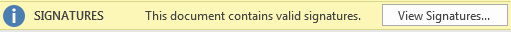

## **Overzicht**

Een digitale handtekening helpt een ontvanger bepalen wie een presentatie heeft ondertekend en of de ondertekende inhoud is gewijzigd. Drie verwante beveiligingsconcepten zijn hier belangrijk:

- Een **digitaal certificaat** is een elektronisch bewijs dat een identiteit koppelt aan een publieke sleutel. Een vertrouwde certificeringsinstantie (CA) kan een certificaat uitgeven, of een organisatie kan een zelfondertekend certificaat gebruiken voor interne workflows.
- Een **digitale handtekening** wordt gemaakt uit de presentatie‑inhoud en de privésleutel van de certificaathouder. De publieke sleutel van het certificaat kan vervolgens worden gebruikt om de handtekening te verifiëren. Een handtekening levert bewijs van oorsprong en integriteit; ze versleutelt de presentatie niet.
- **Wachtwoordbeveiliging** bepaalt of een gebruiker een presentatie kan openen of wijzigen. Het staat los van digitale ondertekening en wordt beschreven in [Wachtwoord‑beveiligde presentaties](/net/password-protected-presentation/).

PowerPoint biedt de opdracht **Digitale handtekening toevoegen** onder **Bestand > Info > Presentatie beveiligen**.


Nadat een ondertekende presentatie is geopend, kan PowerPoint een handtekeningstatusmelding weergeven.



Aspose.Slides stelt handtekeningen beschikbaar via [IPresentation.DigitalSignatures](https://reference.aspose.com/slides/nl/net/aspose.slides/ipresentation/digitalsignatures/), een [IDigitalSignatureCollection](https://reference.aspose.com/slides/nl/net/aspose.slides/idigitalsignaturecollection/) waarvan de items [IDigitalSignature](https://reference.aspose.com/slides/nl/net/aspose.slides/idigitalsignature/) implementeren. Een presentatie kan meerdere handtekeningen bevatten.

## **PFX-certificaten en wachtwoorden begrijpen**

Een PFX‑bestand, ook wel een PKCS#12‑bestand genoemd en meestal de extensie `.pfx` of `.p12` heeft, kan een X.509‑certificaat, de privésleutel en de certificaatketen bevatten. De privésleutel stelt de houder in staat een handtekening te maken. Een certificaat zonder toegankelijke privésleutel kan niet worden gebruikt om een presentatie te ondertekenen.

Het PFX‑wachtwoord beschermt het certificaat‑pakket en de privésleutel. Het is **geen** wachtwoord om de presentatie te openen of te bewerken. Commit PFX‑bestanden of hun wachtwoorden niet naar source‑control. In productie beperkt u de toegang tot het certificaatbestand en haalt u het wachtwoord op uit een geheime opslag of een andere beveiligde configuratiebron. De voorbeelden hieronder gebruiken alleen een omgevingsvariabele om te voorkomen dat het wachtwoord in de code wordt ingebed.

## **Een digitale handtekening toevoegen aan een presentatie**

Om een echte presentatie‑workflow te ondertekenen, laadt u een bestaand PPTX‑bestand, maakt u een [DigitalSignature](https://reference.aspose.com/slides/nl/net/aspose.slides/digitalsignature/) aan vanuit een PFX‑certificaat en het bijbehorende wachtwoord, voegt u de handtekening toe aan de collectie van de presentatie, en slaat u het op als een PPTX‑bestand.

```csharp
using System;
using Aspose.Slides;
using Aspose.Slides.Export;

var certificatePassword = Environment.GetEnvironmentVariable("PFX_PASSWORD")
    ?? throw new InvalidOperationException("Set the PFX_PASSWORD environment variable.");

using var presentation = new Presentation("InputPresentation.pptx");

var signature = new DigitalSignature("signing-certificate.pfx", certificatePassword)
{
    Comments = "Approved for release."
};

presentation.DigitalSignatures.Add(signature);
presentation.Save("InputPresentation-signed.pptx", SaveFormat.Pptx);
```

Het opslaan van het resultaat onder een andere naam behoudt het onondertekende bronbestand. De waarde van [DigitalSignature.Comments](https://reference.aspose.com/slides/nl/net/aspose.slides/digitalsignature/comments/) beschrijft het doel van de handtekening; het is geen beveiligingscontrole.

## **Digitale handtekeningen valideren**

Wanneer u een ondertekend PPTX‑bestand laadt, inspecteert u elk item in [IPresentation.DigitalSignatures](https://reference.aspose.com/slides/nl/net/aspose.slides/ipresentation/digitalsignatures/). De eigenschap [IDigitalSignature.IsValid](https://reference.aspose.com/slides/nl/net/aspose.slides/idigitalsignature/isvalid/) geeft aan of de ingebedde handtekening geldig is voor de huidige presentatie‑inhoud.

```csharp
using System;
using Aspose.Slides;

using var presentation = new Presentation("InputPresentation-signed.pptx");

var signatureCount = presentation.DigitalSignatures.Count;

if (signatureCount == 0)
{
    Console.WriteLine("The presentation does not contain digital signatures.");
}
else
{
    var allSignaturesAreValid = true;

    foreach (var signature in presentation.DigitalSignatures)
    {
        var signatureStatus = signature.IsValid ? "VALID" : "INVALID";
        var signerName = signature.Certificate.SubjectName.Name;

        Console.WriteLine(
            $"{signerName}, {signature.SignTime:yyyy-MM-dd HH:mm:ss} -- {signatureStatus}");

        allSignaturesAreValid &= signature.IsValid;
    }

    Console.WriteLine(allSignaturesAreValid
        ? "All embedded signatures are valid for the current presentation."
        : "At least one embedded signature is invalid.");
}
```

Een ongeldig resultaat betekent meestal dat de ondertekende presentatietekst of handtekeninggegevens na ondertekening zijn gewijzigd, of dat het bestand beschadigd is. Het verwijderen van alle handtekeningen levert een onondertekende presentatie op, dus alleen de geldigheid van items controleren is niet voldoende: een beveiligingsgevoelige workflow moet ook verifiëren dat het verwachte aantal handtekeningen en de verwachte ondertekenaaridentiteiten aanwezig zijn.

Dit geldigheidsresultaat mag niet worden beschouwd als een volledige certificaat‑vertrouwensbeslissing. Afhankelijk van uw beveiligingsbeleid moet uw toepassing mogelijk ook de X.509‑certificaatketen opbouwen en valideren, de geldigheidsdatums en intrekkingsstatus van het certificaat controleren, het verwachte onderwerp of vingerafdruk bevestigen, het sleutelgebruik verifiëren en een vertrouwde timestamp evalueren. De waarde [IDigitalSignature.SignTime](https://reference.aspose.com/slides/nl/net/aspose.slides/idigitalsignature/signtime/) op zichzelf is geen bewijs van een vertrouwde timestamp‑autoriteit.

## **Digitale handtekeningen verwijderen**

Het verwijderen van handtekeningen verandert de beveiligingsstatus van de presentatie. Het volgende voorbeeld laadt een ondertekend PPTX‑bestand, verwijdert alle handtekeningen met [IDigitalSignatureCollection.Clear](https://reference.aspose.com/slides/nl/net/aspose.slides/idigitalsignaturecollection/clear/), en slaat een onondertekende kopie op.

```csharp
using Aspose.Slides;
using Aspose.Slides.Export;

using var presentation = new Presentation("InputPresentation-signed.pptx");

presentation.DigitalSignatures.Clear();
presentation.Save("InputPresentation-unsigned.pptx", SaveFormat.Pptx);
```

Om slechts één handtekening te verwijderen, roept u [IDigitalSignatureCollection.RemoveAt](https://reference.aspose.com/slides/nl/net/aspose.slides/idigitalsignaturecollection/removeat/) aan met de nul‑gebaseerde index. Sla op naar een nieuw bestand, tenzij het overschrijven van het ondertekende origineel een expliciet onderdeel van uw workflow is.

## **Bewerkings‑ en formaatoverwegingen**

- Een handtekening maakt een presentatie niet alleen‑lezen. Gebruikers en toepassingen kunnen het bestand nog steeds bewerken, maar wijzigingen in ondertekende inhoud maken doorgaans de bestaande handtekening ongeldig.
- Voltooi alle beoogde bewerkingen vóór het ondertekenen. Als een presentatie moet worden aangepast, sla dan de herziene presentatie op en onderteken die revisie opnieuw.
- Houd de uiteindelijke uitvoer in PPTX‑formaat. Het converteren van een ondertekende presentatie naar een ander formaat draagt de oorspronkelijke PPTX‑handtekening niet over als een geldige handtekening voor het geconverteerde bestand.
- Beschouw de privésleutel van het certificaat als gevoelig. Iedereen die de privésleutel en het bijbehorende wachtwoord verkrijgt, kan handtekeningen maken die lijken te komen van die certificaathouder.
- Behoud de onondertekende bron of een andere gecontroleerde kopie wanneer uw document‑bewaarbeleid dit vereist.

## **Veelgestelde vragen**

**Versleutelt een digitale handtekening de presentatie?**

Nee. Een digitale handtekening levert bewijs over oorsprong en integriteit, maar de inhoud van de presentatie blijft leesbaar tenzij aparte versleuteling wordt toegepast. Gebruik [wachtwoordbeveiliging](/net/password-protected-presentation/) wanneer de toegang tot de inhoud moet worden beperkt.

**Is het PFX‑wachtwoord hetzelfde als een presentatiewachtwoord?**

Nee. Het PFX‑wachtwoord ontgrendelt de privésleutel die in het certificaatpakket is opgeslagen. Het bepaalt niet wie het PPTX‑bestand kan openen of bewerken.

**Kan ik een zelfondertekend certificaat gebruiken?**

Technisch kan een zelfondertekend certificaat worden gebruikt wanneer het een toegankelijke privésleutel bevat. Ontvangers zullen het echter niet automatisch vertrouwen, tenzij dat certificaat expliciet is toegevoegd aan hun vertrouwde omgeving. Publieke of cross‑organisatieworkflows gebruiken doorgaans een certificaat dat is uitgegeven door een vertrouwde CA.

**Wat maakt een handtekening ongeldig?**

Het wijzigen van de ondertekende presentatietekst of de handtekeninggegevens na ondertekening kan de handtekening ongeldig maken. Bestandscorruptie kan ook ervoor zorgen dat validatie mislukt. Als alle handtekeningen worden verwijderd, is de presentatie onondertekend in plaats van een bestand met een ongeldige handtekening.

**Betekent een geldige handtekening dat ik de ondertekenaar moet vertrouwen?**

Niet op zichzelf. De integriteit van de handtekening en het vertrouwen in de ondertekenaar zijn afzonderlijke beslissingen. Een productieverificatie‑beleid moet ook de certificaatketen, de geldigheidsperiode, de intrekkingsstatus, de verwachte identiteit, het sleutelgebruik en eventuele vereisten voor een vertrouwde timestamp controleren.

**Wat gebeurt er wanneer het certificaat verloopt?**

Het verlopen van een certificaat verandert de bytes van de presentatie niet, maar het beïnvloedt de evaluatie van het certificaat‑vertrouwen. Of een handtekening acceptabel blijft, hangt af van uw beleid en van of een geldige vertrouwde timestamp aantoont dat de ondertekening plaatsvond terwijl het certificaat nog geldig was. Vertrouw niet alleen op de weergegeven ondertekenings‑tijd als een vertrouwde timestamp.

**Kan een ondertekende presentatie nog steeds worden bewerkt?**

Ja. Ondertekenen vergrendelt het bestand niet. Het bewerken van ondertekende inhoud maakt doorgaans de bestaande handtekening ongeldig, dus voltooi de presentatie eerst en onderteken de definitieve revisie.

**Kan een presentatie meer dan één handtekening bevatten?**

Ja. Voeg elke handtekening toe aan [IPresentation.DigitalSignatures](https://reference.aspose.com/slides/nl/net/aspose.slides/ipresentation/digitalsignatures/) vóór het opslaan. Tijdens de validatie inspekteert u elke handtekening en bevestigt u dat alle vereiste ondertekenaars aanwezig zijn.

**Welke presentatie‑formaten ondersteunen deze bewerkingen?**

Aspose.Slides ondersteunt de hier beschreven digitale‑handtekening‑bewerkingen alleen voor PPTX. PPT‑ en OpenDocument‑presentatieformaten worden niet ondersteund door deze API‑workflow.

**Kan ik een handtekening verwijderen zonder de dia's te beïnvloeden?**

Ja. U kunt één handtekening verwijderen of de hele collectie leegmaken en vervolgens de presentatie opslaan. De inhoud van de dia's blijft beschikbaar, maar het opgeslagen bestand bevat de verwijderde handtekening‑bewijsmateriaal niet meer.