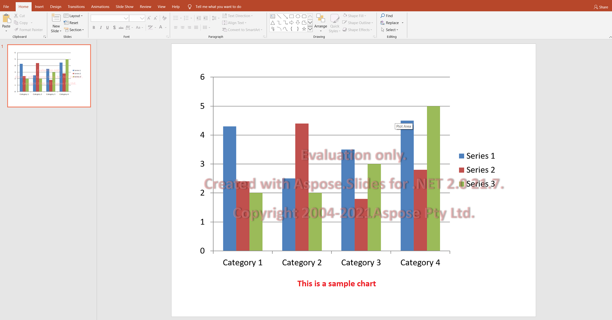

## **Aspose.Slides Evaluatie**

U kunt eenvoudig Aspose.Slides downloaden voor evaluatie. Het evaluatiepakket is hetzelfde als het gekochte pakket. De evaluatieversie wordt simpelweg gelicentieerd nadat u een paar regels code hebt toegevoegd om de licentie toe te passen. 

De evaluatieversie van Aspose.Slides (zonder gespecificeerde licentie) biedt de volledige functionaliteit van het product, maar voegt een evaluatiewatermerk toe aan de bovenkant van het document bij openen en opslaan. Daarnaast bent u beperkt tot één dia bij het extraheren van tekst uit presentatiedia's.



{} 

Als u Aspose.Slides wilt testen zonder de beperkingen van de evaluatieversie, kunt u een **30-daagse tijdelijke licentie** aanvragen. Raadpleeg [Hoe krijg ik een tijdelijke licentie?](https://purchase.aspose.com/temporary-license) voor meer informatie.

{}

## **Installeer het evaluatiepakket**

```bash
dotnet add package Aspose.Slides.NET
```

## **Pas een licentie toe**

Dit zijn de “een paar regels code” die het evaluatiepakket omzetten in een gelicentieerde versie. Pas de licentie één keer toe bij het opstarten van de applicatie, voordat een `Presentation`‑object wordt aangemaakt — een eerder geconstrueerde presentatie behoudt het evaluatiewatermerk.

```csharp
using Aspose.Slides;

var license = new License();
license.SetLicense("Aspose.Slides.NET.lic");
```

`SetLicense` accepteert ook een `Stream`, wat de betere optie is wanneer de licentie wordt meegeleverd als een ingebedde resource in plaats van een bestand op schijf. Als het pad onjuist is of het bestand is verlopen, wordt er een uitzondering gegooid, waardoor fouten direct bij het opstarten zichtbaar worden in plaats van stil terug te vallen op de evaluatiemodus.

Zodra de licentie is toegepast, verdwijnt het watermerk en wordt de limiet van één dia voor tekstextractie opgeheven.

## **FAQ**

### Kan ik meerdere presentaties parallel testen over verschillende threads in de evaluatiemodus?

Ja. U kunt verschillende documenten parallel verwerken; u moet hetzelfde presentatie‑object niet delen [over threads](/slides/nl/net/multithreading/). De evaluatiemodus heeft hier geen invloed op.

### Moet ik Microsoft PowerPoint installeren om de bibliotheek te evalueren op een server of in CI?

Nee. Aspose.Slides is een zelfstandige engine en vereist geen geïnstalleerde PowerPoint, zowel voor evaluatie als productie.

### Kan ik de conversie van PPT/PPTX naar PDF en afbeeldingen volledig testen in de evaluatiemodus?

Ja. De [converters](/slides/nl/net/convert-presentation/) werken; de output zal een watermerk bevatten.

### Kan ik een tijdelijke licentie gebruiken voor load‑testing zonder watermerk?

Ja. Een 30‑daagse tijdelijke licentie verwijdert de beperkingen van de evaluatiemodus en maakt testen zonder watermerk mogelijk.