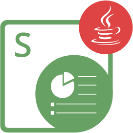

{}

**Welkom bij Aspose.Slides for Node.js via Java**

Aspose.Slides for Node.js via Java is een class library die uw toepassingen in staat stelt PowerPoint®‑documenten te lezen en te schrijven zonder Microsoft PowerPoint® te gebruiken.

Aspose.Slides for Node.js via Java is de eerste en enige component die de functionaliteit biedt om PowerPoint®‑documenten te beheren.

Aspose.Slides for Node.js via Java biedt tal van belangrijke functies, zoals het beheren van tekst, vormen, tabellen en animaties, het toevoegen van audio en video aan dia's, het voorvertonen van dia's, het exporteren van dia's naar SVG, PDF‑formaat en meer.

{}

## Aspose.Slides for Node.js via Java bronnen

{}

Aspose.Slides for Node.js via Java is overgezet vanuit Aspose.Slides for Java, zodat u de documentatie en API‑referentie van laatstgenoemde kunt gebruiken.

{}

Dit zijn links naar nuttige bronnen:

- [Aspose.Slides for Node.js via Java online documentatie](/slides/nl/nodejs-java/developer-guide/)
- [Aspose.Slides for Node.js via Java functies](/slides/nl/nodejs-java/features-overview/)
- [Aspose.Slides for Node.js via Java beperkingen en API‑verschillen](/slides/nl/nodejs-java/limitations-and-api-differences/)
- [Aspose.Slides for Node.js via Java release‑notes](https://releases.aspose.com/slides/nl/nodejs-java/release-notes/)
- [Aspose.Slides for Node.js via Java productpagina](https://products.aspose.com/slides/nl/nodejs-java/)
- [Download Aspose.Slides for Node.js via Java pakket](https://releases.aspose.com/slides/nl/nodejs-java/)
- [Installeer Aspose.Slides for Node.js via Java](/slides/nl/nodejs-java/installation/)
- [Aspose.Slides for Node.js via Java API‑referentie](https://reference.aspose.com/slides/nl/nodejs-java/)
- [Aspose.Slides for Node.js via Java gratis ondersteuningsforum](https://forum.aspose.com/c/slides/nl/)
- [Aspose.Slides for Node.js via Java betaald ondersteuningshelpdesk](https://helpdesk.aspose.com/)