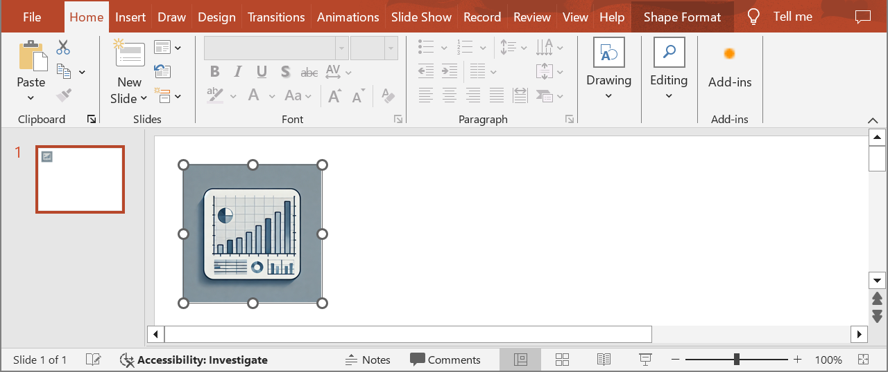

## **Introductie**

Met Aspose.Slides voor Java, wanneer je een [OleObjectFrame](https://reference.aspose.com/slides/nl/nodejs-java/aspose.slides/oleobjectframe/) aan een dia toevoegt, wordt er een bericht "EMBEDDED OLE OBJECT" weergegeven op de resulterende dia. Dit bericht is opzettelijk en GEEN fout.

Voor meer informatie over het werken met OLE‑objecten, zie [Beheer OLE](/slides/nl/nodejs-java/manage-ole/).

## **Uitleg en Oplossing**

Aspose.Slides toont het bericht "EMBEDDED OLE OBJECT" om je te informeren dat het OLE‑object is gewijzigd en dat de voorbeeldafbeelding moet worden bijgewerkt.

Bijvoorbeeld, als je een Microsoft Excel‑grafiek toevoegt als een [OleObjectFrame](https://reference.aspose.com/slides/nl/nodejs-java/aspose.slides/oleobjectframe/) aan een dia (voor meer details, zie het artikel "Manage OLE") en vervolgens de presentatie opent in Microsoft PowerPoint, zie je deze afbeelding op de dia:


Als je wilt controleren en bevestigen dat je OLE‑object aan de dia is toegevoegd, moet je dubbelklikken op het bericht "EMBEDDED OLE OBJECT", of je kunt er met de rechtermuisknop op klikken en kiezen voor **Object > Bewerken**.


PowerPoint opent vervolgens het ingebedde OLE‑object.


De dia kan het bericht "EMBEDDED OLE OBJECT" behouden. Zodra je op het OLE‑object klikt, wordt de voorbeeldweergave van de dia bijgewerkt en wordt het bericht "EMBEDDED OLE OBJECT" vervangen door de werkelijke afbeelding van het OLE‑object.


Nu wil je misschien de presentatie opslaan om ervoor te zorgen dat de afbeelding van het OLE‑object correct wordt bijgewerkt. Op die manier, na het opslaan van de presentatie, zie je bij het opnieuw openen van de presentatie het bericht "EMBEDDED OLE OBJECT" NIET meer.

## **Andere Oplossingen**

### **Oplossing 1: Het bericht "Embedded OLE Object" vervangen door een afbeelding**

Als je het bericht "EMBEDDED OLE OBJECT" niet wilt verwijderen door de presentatie in PowerPoint te openen en vervolgens op te slaan, kun je het bericht vervangen door je gewenste voorbeeldafbeelding. Deze code‑regels tonen het proces:

```javascript
const presentation = new aspose.slides.Presentation("embeddedOLE.pptx");
try {
    const slide = presentation.getSlides().get_Item(0);
    const oleFrame = slide.getShapes().get_Item(0);

    // Voeg een afbeelding toe aan de presentatiemiddelen.
    const image = aspose.slides.Images.fromFile("myImage.png");
    const oleImage = presentation.getImages().addImage(image);

    // Stel een titel en de afbeelding in voor het voorbeeld van het OLE-object.
    oleFrame.setSubstitutePictureTitle("My title");
    oleFrame.getSubstitutePictureFormat().getPicture().setImage(oleImage);
    oleFrame.setObjectIcon(false);

    presentation.save("embeddedOLE-newImage.pptx", aspose.slides.SaveFormat.Pptx);
} finally {
    if (presentation != null) presentation.dispose();
}
```

De dia die het `OleObjectFrame` bevat, verandert vervolgens in het volgende:



### **Oplossing 2: Een add‑on maken voor PowerPoint**

Je kunt ook een add‑on voor Microsoft PowerPoint maken die alle OLE‑objecten bijwerkt wanneer je presentaties in het programma opent.