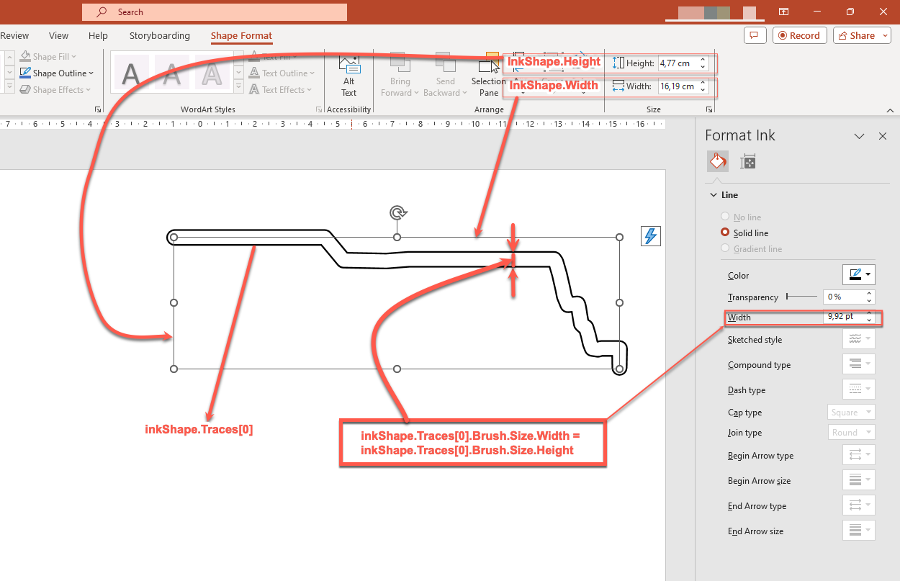

## **Introductie**

PowerPoint biedt de inkt-functie waarmee u niet-standaard figuren kunt tekenen, die u kunt gebruiken om andere objecten te markeren, verbindingen en processen weer te geven en de aandacht op specifieke items op een dia te vestigen. 

Aspose.Slides biedt alle Ink-typen (bijv. [Ink](https://reference.aspose.com/slides/nl/nodejs-java/aspose.slides/ink/) klasse) die u nodig hebt om inktobjecten te maken en te beheren.

## **Verschillen tussen reguliere objecten en inktobjecten**

Objecten op een PowerPoint-dia worden meestal weergegeven door vormobjecten. Een vormobject is in zijn eenvoudigste vorm een container die het gebied van het object zelf (het frame) definieert, samen met zijn eigenschappen. Laatstgenoemde omvat de grootte van het containergebied, de vorm van de container, de achtergrond van de container, enz. Zie voor meer informatie [Shape Layout Format](https://docs.aspose.com/slides/nl/nodejs-java/shape-manipulations/#access-layout-formats-for-shape).

Echter, wanneer PowerPoint een inktobject behandelt, negeert het alle eigenschappen van het objectframe (container) behalve de grootte. De grootte van het containergebied wordt bepaald door de standaard `width` en `height` waarden:


## **Inkshape-sporen**

Een trace is een basiselement of standaard die wordt gebruikt om de traject van een pen te registreren terwijl een gebruiker digitale inkt schrijft. Traces zijn opnamen die reeksen van verbonden punten beschrijven. 

De eenvoudigste coderingsvorm specificeert de X- en Y-coördinaten van elk monsterpunt. Wanneer alle verbonden punten worden gerenderd, produceren ze een afbeelding als deze:


## **Brush-eigenschappen voor tekenen** 

U kunt een brush gebruiken om lijnen te tekenen die de punten van trace-elementen verbinden. De brush heeft een eigen kleur en grootte, overeenkomend met de methoden `Brush.setColor` en `Brush.setSize`. 

### **Ink Brush-kleur instellen**

Deze JavaScript-code laat zien hoe u de kleur voor een brush instelt:

```javascript
var pres = new aspose.slides.Presentation("pres.pptx");
try {
    var ink = pres.getSlides().get_Item(0).getShapes().get_Item(0);
    var traces = ink.getTraces();
    var brush = traces[0].getBrush();
    var brushColor = brush.getColor();
    brush.setColor(java.getStaticFieldValue("java.awt.Color", "RED"));
} finally {
    if (pres != null) {
        pres.dispose();
    }
}
```

### **Ink Brush-grootte instellen** 

Deze JavaScript-code laat zien hoe u de grootte voor een brush instelt:

```javascript
var pres = new aspose.slides.Presentation("pres.pptx");
try {
    var ink = pres.getSlides().get_Item(0).getShapes().get_Item(0);
    var traces = ink.getTraces();
    var brush = traces[0].getBrush();
    var brushSize = brush.getSize();
    brush.setSize(java.newInstanceSync("java.awt.Dimension", 5, 10));
} finally {
    if (pres != null) {
        pres.dispose();
    }
}
```

Over het algemeen komen breedte en hoogte van een brush niet overeen, waardoor PowerPoint de brush-grootte niet weergeeft (de gegevenssectie is grijs). Maar wanneer breedte en hoogte van de brush wel overeenkomen, toont PowerPoint de grootte als volgt:


Voor de duidelijkheid verhogen we de hoogte van het inktobject en bekijken we de belangrijke afmetingen: 



De container (frame) houdt geen rekening met de grootte van de brushes – hij gaat er altijd van uit dat de lijndikte nul is (zie de laatste afbeelding). 

Daarom moeten we, om het zichtbare gebied van het volledige inktobject te bepalen, de brush-grootte van de trace-objecten in aanmerking nemen. Hier is het doelobject (het handgeschreven tekst-trace-object) geschaald naar de container- (frame-)grootte. Wanneer de grootte van de container (frame) verandert, blijft de brush-grootte constant en omgekeerd. 


PowerPoint vertoont hetzelfde gedrag bij het omgaan met teksten:


**Verdere lectuur**

* Voor algemene informatie over vormen, zie de sectie [PowerPoint Shapes](https://docs.aspose.com/slides/nl/nodejs-java/powerpoint-shapes/).
* Voor meer informatie over effectieve waarden, zie [Shape Effective Properties](https://docs.aspose.com/slides/nl/nodejs-java/shape-effective-properties/#getting-effective-font-height-value).