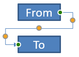

## **Overzicht**

Een connector is een lijn die aan twee vormen kan blijven bevestigd wanneer een van beide vormen wordt verplaatst. De uiteinden bevestigen zich op verbindingspunten, weergegeven door groene stippen in PowerPoint. Sommige gebogen en gekromde connectors geven ook aanpassingspunten weer, weergegeven door oranje stippen, die de positie van individuele connectorsegmenten regelen.

Aspose.Slides stelt connectors voor via de [Connector](https://reference.aspose.com/slides/nl/nodejs-java/aspose.slides/connector/) klasse. Je kunt ze maken, hun uiteinden aan vormen verbinden, verbindingspunten kiezen, ze opnieuw routeren en de geometrie van connectors die aanpassingspunten hebben wijzigen.

## **Connector‑typen**

De klasse [ShapeType](https://reference.aspose.com/slides/nl/nodejs-java/aspose.slides/shapetype/) bevat rechte, gebogen en gekromde connector‑presets. De volgende tabel toont de beschikbare connector‑geometrieën en het aantal aanpassingspunten dat door elk preset wordt gedefinieerd.

| Connector | Afbeelding | Aantal aanpassingspunten |
|---|---|---|
| `ShapeType.Line` |  | 0 |
| `ShapeType.StraightConnector1` |  | 0 |
| `ShapeType.BentConnector2` |  | 0 |
| `ShapeType.BentConnector3` |  | 1 |
| `ShapeType.BentConnector4` |  | 2 |
| `ShapeType.BentConnector5` |  | 3 |
| `ShapeType.CurvedConnector2` |  | 0 |
| `ShapeType.CurvedConnector3` |  | 1 |
| `ShapeType.CurvedConnector4` |  | 2 |
| `ShapeType.CurvedConnector5` |  | 3 |

Het aantal en de betekenis van aanpassingspunten maken deel uit van het gekozen connector‑preset. Ga niet uit van het feit dat twee verschillende connector‑typen dezelfde collectie‑indeling blootleggen.

## **Twee vormen verbinden**

Gebruik [ShapeCollection.addConnector](https://reference.aspose.com/slides/nl/nodejs-java/aspose.slides/shapecollection/addconnector/) om een connector toe te voegen, en gebruik [Connector.setStartShapeConnectedTo](https://reference.aspose.com/slides/nl/nodejs-java/aspose.slides/connector/setstartshapeconnectedto/) en [Connector.setEndShapeConnectedTo](https://reference.aspose.com/slides/nl/nodejs-java/aspose.slides/connector/setendshapeconnectedto/) om de uiteinden te bevestigen. Nadat beide uiteinden zijn bevestigd, selecteert [Connector.reroute](https://reference.aspose.com/slides/nl/nodejs-java/aspose.slides/connector/reroute/) een korte route tussen de vormen.

Het volgende voorbeeld verbindt een ellips en een rechthoek met een gebogen connector:

```javascript
const aspose = { slides: require("aspose.slides.via.java") };

const presentation = new aspose.slides.Presentation();
try {
    const slide = presentation.getSlides().get_Item(0);

    const ellipse = slide.getShapes().addAutoShape(aspose.slides.ShapeType.Ellipse, 40, 80, 120, 80);
    const rectangle = slide.getShapes().addAutoShape(aspose.slides.ShapeType.Rectangle, 320, 240, 140, 80);
    const connector = slide.getShapes().addConnector(aspose.slides.ShapeType.BentConnector2, 0, 0, 10, 10);

    connector.setStartShapeConnectedTo(ellipse);
    connector.setEndShapeConnectedTo(rectangle);
    connector.reroute();

    presentation.save("connected-shapes.pptx", aspose.slides.SaveFormat.Pptx);
} finally {
    presentation.dispose();
}
```

{}
Het aanroepen van `reroute` kan de waarden van setStartShapeConnectionSiteIndex en setEndShapeConnectionSiteIndex wijzigen. Wijs specifieke verbindingspunten toe na het opnieuw routeren als die punten vast moeten blijven.
{}

## **Kies een verbindingspunt**

Elke vorm die kan verbinden meldt zijn aantal sites via [Shape.getConnectionSiteCount](https://reference.aspose.com/slides/nl/nodejs-java/aspose.slides/shape/getconnectionsitecount/). Valideer een voorkeurs‑index (nulgebaseerd) voordat je deze toewijst aan een connectoruiteinde; het aantal sites varieert per vormgeometrie.

Dit voorbeeld bevestigt de connector aan een specifiek punt op de ellips wanneer dat punt bestaat:

```javascript
const aspose = { slides: require("aspose.slides.via.java") };

const presentation = new aspose.slides.Presentation();
try {
    const slide = presentation.getSlides().get_Item(0);

    const ellipse = slide.getShapes().addAutoShape(aspose.slides.ShapeType.Ellipse, 40, 80, 120, 80);
    const rectangle = slide.getShapes().addAutoShape(aspose.slides.ShapeType.Rectangle, 320, 240, 140, 80);
    const connector = slide.getShapes().addConnector(aspose.slides.ShapeType.BentConnector3, 0, 0, 10, 10);

    connector.setStartShapeConnectedTo(ellipse);
    connector.setEndShapeConnectedTo(rectangle);

    const preferredSiteIndex = 2;
    if (preferredSiteIndex < ellipse.getConnectionSiteCount()) {
        connector.setStartShapeConnectionSiteIndex(preferredSiteIndex);
    } else {
        console.log(`The ellipse has only ${ellipse.getConnectionSiteCount()} connection sites.`);
    }

    presentation.save("specific-connection-site.pptx", aspose.slides.SaveFormat.Pptx);
} finally {
    presentation.dispose();
}
```

## **Connectorpunt aanpassen**

Connectors met aanpassingspunten geven ze weer via [GeometryShape.getAdjustments](https://reference.aspose.com/slides/nl/nodejs-java/aspose.slides/geometryshape/). Inspecteer elke [AdjustValue](https://reference.aspose.com/slides/nl/nodejs-java/aspose.slides/adjustvalue/) en controleer de [getType](https://reference.aspose.com/slides/nl/nodejs-java/aspose.slides/adjustvalue/) waarde voordat je deze wijzigt met [setRawValue](https://reference.aspose.com/slides/nl/nodejs-java/aspose.slides/adjustvalue/setrawvalue/). De algemene regels voor het identificeren van preset‑vormaanpassingen staan beschreven in [Shape Manipulation](/slides/nl/nodejs-java/shape-manipulations/).

Het aantal, de volgorde, de betekenis en het geldige waardebereik van connector‑aanpassingen hangen af van het connector‑preset. Het aanpassingstype is alleen‑lezen, terwijl de aanpassingswaarde schrijfbaar is. De alleen‑lezen [getName](https://reference.aspose.com/slides/nl/nodejs-java/aspose.slides/adjustvalue/getname/) methode biedt extra identificatie wanneer een connector meer dan één aanpassing van hetzelfde semantische type bevat.

### **Rond een obstakel navigeren**

In de volgende lay-out gaat een `BentConnector5` connector tussen twee vormen door een derde vorm:


Deze code creëert de belemmerde connector:

```javascript
const aspose = { slides: require("aspose.slides.via.java") };
const java = require("java");

const presentation = new aspose.slides.Presentation();
try {
    const slide = presentation.getSlides().get_Item(0);

    slide.getShapes().addAutoShape(aspose.slides.ShapeType.Rectangle, 300, 150, 150, 75);
    const sourceShape = slide.getShapes().addAutoShape(aspose.slides.ShapeType.Rectangle, 500, 400, 100, 50);
    const targetShape = slide.getShapes().addAutoShape(aspose.slides.ShapeType.Rectangle, 100, 100, 70, 30);
    const connector = slide.getShapes().addConnector(aspose.slides.ShapeType.BentConnector5, 20, 20, 400, 300);

    const black = java.getStaticFieldValue("java.awt.Color", "BLACK");
    const solidFillType = java.newByte(aspose.slides.FillType.Solid);
    const triangleArrowheadStyle = java.newByte(aspose.slides.LineArrowheadStyle.Triangle);
    connector.getLineFormat().setEndArrowheadStyle(triangleArrowheadStyle);
    connector.getLineFormat().getFillFormat().setFillType(solidFillType);
    connector.getLineFormat().getFillFormat().getSolidFillColor().setColor(black);
    connector.setStartShapeConnectedTo(sourceShape);
    connector.setEndShapeConnectedTo(targetShape);
    connector.setStartShapeConnectionSiteIndex(2);

    presentation.save("connector-obstruction.pptx", aspose.slides.SaveFormat.Pptx);
} finally {
    presentation.dispose();
}
```

Het verplaatsen van de verticale bocht verandert de route zodat de connector het obstakel omzeilt:


In plaats van aan te nemen dat collectie‑index `1` altijd de verticale bocht vertegenwoordigt, zoekt dit voorbeeld naar `ConnectorBendPositionY` en wijzigt deze alleen wanneer het verwachte semantische type aanwezig is:

```javascript
const aspose = { slides: require("aspose.slides.via.java") };
const java = require("java");

const presentation = new aspose.slides.Presentation();
try {
    const slide = presentation.getSlides().get_Item(0);

    slide.getShapes().addAutoShape(aspose.slides.ShapeType.Rectangle, 300, 150, 150, 75);
    const sourceShape = slide.getShapes().addAutoShape(aspose.slides.ShapeType.Rectangle, 500, 400, 100, 50);
    const targetShape = slide.getShapes().addAutoShape(aspose.slides.ShapeType.Rectangle, 100, 100, 70, 30);
    const connector = slide.getShapes().addConnector(aspose.slides.ShapeType.BentConnector5, 20, 20, 400, 300);

    const black = java.getStaticFieldValue("java.awt.Color", "BLACK");
    const solidFillType = java.newByte(aspose.slides.FillType.Solid);
    const triangleArrowheadStyle = java.newByte(aspose.slides.LineArrowheadStyle.Triangle);
    connector.getLineFormat().setEndArrowheadStyle(triangleArrowheadStyle);
    connector.getLineFormat().getFillFormat().setFillType(solidFillType);
    connector.getLineFormat().getFillFormat().getSolidFillColor().setColor(black);
    connector.setStartShapeConnectedTo(sourceShape);
    connector.setEndShapeConnectedTo(targetShape);
    connector.setStartShapeConnectionSiteIndex(2);

    let verticalBend = null;
    for (let adjustmentIndex = 0; adjustmentIndex < connector.getAdjustments().size(); adjustmentIndex++) {
        const adjustment = connector.getAdjustments().get_Item(adjustmentIndex);
        console.log(`${adjustment.getName()}: ${adjustment.getType()}, raw value = ${adjustment.getRawValue()}`);
        if (adjustment.getType() === aspose.slides.ShapeAdjustmentType.ConnectorBendPositionY) {
            verticalBend = adjustment;
            break;
        }
    }

    if (verticalBend === null) {
        console.log("The connector does not expose a vertical bend adjustment.");
    } else {
        verticalBend.setRawValue(60000);
        presentation.save("connector-obstruction-fixed.pptx", aspose.slides.SaveFormat.Pptx);
    }
} finally {
    presentation.dispose();
}
```

Een `BentConnector5` heeft twee `ConnectorBendPositionX` aanpassingen en één `ConnectorBendPositionY` aanpassing. Als het type dat je nodig hebt vaker voorkomt, inspecteer `getName` en de bekende geometrie van dat preset voordat je er een kiest. Meldt een aanpassing `ShapeAdjustmentType.Custom`, behandel dan de betekenis en het bereik als preset‑specifiek en wijzig het niet totdat dat contract bekend is.

## **Aanpassingswaarden relateren aan connector‑geometrie**

Voor gebogen connectors kunnen aanpassingswaarden worden gebruikt om de posities van individuele segmenten te schatten. Deze berekeningen zijn specifiek voor het connector‑preset:

- `BentConnector4` exposeert normaal één `ConnectorBendPositionX` en één `ConnectorBendPositionY` aanpassing.
- Voor deze bochtposities levert het delen van de waarde verkregen via `getRawValue` door `100000` het fractiegedeelte van de connector‑framebreedte of -hoogte op, zoals in de onderstaande voorbeelden.
- Een connector‑frame kan worden geroteerd of omgekeerd, dus framecoördinaten moeten worden getransformeerd voordat ze met dia‑coördinaten worden vergeleken.

De volgende voorbeelden gebruiken `getType` om eerst de aanpassingen te identificeren. Ze behandelen collectieve indexen niet als draagbare identifiers.

### **Niet‑geroteerde connector**

De initiële lay-out bevat twee tekst‑vormen die zijn verbonden door een `BentConnector4`:


Dit voorbeeld inspecteert de connector en verkrijgt zijn horizontale en verticale bocht‑aanpassingen:

```javascript
const aspose = { slides: require("aspose.slides.via.java") };
const java = require("java");

const presentation = new aspose.slides.Presentation();
try {
    const slide = presentation.getSlides().get_Item(0);

    const sourceShape = slide.getShapes().addAutoShape(aspose.slides.ShapeType.Rectangle, 100, 100, 60, 25);
    sourceShape.getTextFrame().setText("From");
    const targetShape = slide.getShapes().addAutoShape(aspose.slides.ShapeType.Rectangle, 500, 100, 60, 25);
    targetShape.getTextFrame().setText("To");
    const connector = slide.getShapes().addConnector(aspose.slides.ShapeType.BentConnector4, 20, 20, 400, 300);

    const red = java.getStaticFieldValue("java.awt.Color", "RED");
    const solidFillType = java.newByte(aspose.slides.FillType.Solid);
    const triangleArrowheadStyle = java.newByte(aspose.slides.LineArrowheadStyle.Triangle);
    connector.getLineFormat().setEndArrowheadStyle(triangleArrowheadStyle);
    connector.getLineFormat().getFillFormat().setFillType(solidFillType);
    connector.getLineFormat().getFillFormat().getSolidFillColor().setColor(red);
    connector.getLineFormat().setWidth(3);
    connector.setStartShapeConnectedTo(sourceShape);
    connector.setStartShapeConnectionSiteIndex(3);
    connector.setEndShapeConnectedTo(targetShape);
    connector.setEndShapeConnectionSiteIndex(2);

    for (let adjustmentIndex = 0; adjustmentIndex < connector.getAdjustments().size(); adjustmentIndex++) {
        const adjustment = connector.getAdjustments().get_Item(adjustmentIndex);
        console.log(`${adjustment.getName()}: ${adjustment.getType()}, raw value = ${adjustment.getRawValue()}`);
    }
} finally {
    presentation.dispose();
}
```

Om beide bochten te wijzigen, zoek elk verwacht type op en wijzig de waarden pas nadat beide zijn gevonden:

```javascript
const aspose = { slides: require("aspose.slides.via.java") };

const presentation = new aspose.slides.Presentation();
try {
    const slide = presentation.getSlides().get_Item(0);

    const sourceShape = slide.getShapes().addAutoShape(aspose.slides.ShapeType.Rectangle, 100, 100, 60, 25);
    const targetShape = slide.getShapes().addAutoShape(aspose.slides.ShapeType.Rectangle, 500, 100, 60, 25);
    const connector = slide.getShapes().addConnector(aspose.slides.ShapeType.BentConnector4, 20, 20, 400, 300);
    connector.setStartShapeConnectedTo(sourceShape);
    connector.setStartShapeConnectionSiteIndex(3);
    connector.setEndShapeConnectedTo(targetShape);
    connector.setEndShapeConnectionSiteIndex(2);

    let horizontalBend = null;
    let verticalBend = null;
    for (let adjustmentIndex = 0; adjustmentIndex < connector.getAdjustments().size(); adjustmentIndex++) {
        const adjustment = connector.getAdjustments().get_Item(adjustmentIndex);
        if (adjustment.getType() === aspose.slides.ShapeAdjustmentType.ConnectorBendPositionX) {
            horizontalBend = adjustment;
        } else if (adjustment.getType() === aspose.slides.ShapeAdjustmentType.ConnectorBendPositionY) {
            verticalBend = adjustment;
        }
    }

    if (horizontalBend === null || verticalBend === null) {
        console.log("The connector does not expose the expected bend adjustments.");
    } else {
        horizontalBend.setRawValue(horizontalBend.getRawValue() + 20000);
        verticalBend.setRawValue(verticalBend.getRawValue() + 200000);
        presentation.save("connector-adjusted.pptx", aspose.slides.SaveFormat.Pptx);
    }
} finally {
    presentation.dispose();
}
```

Het resultaat is een connector waarvan de horizontale en verticale segmenten zijn verplaatst:


Zodra de semantische types bekend zijn, kunnen hun waarden worden omgezet naar connector‑framecoördinaten. Dit voorbeeld tekent een dunne rechthoek over het verticale segment dat wordt gecontroleerd door de twee bocht‑aanpassingen:

```javascript
const aspose = { slides: require("aspose.slides.via.java") };
const java = require("java");

const presentation = new aspose.slides.Presentation();
try {
    const slide = presentation.getSlides().get_Item(0);

    const sourceShape = slide.getShapes().addAutoShape(aspose.slides.ShapeType.Rectangle, 100, 100, 60, 25);
    const targetShape = slide.getShapes().addAutoShape(aspose.slides.ShapeType.Rectangle, 500, 100, 60, 25);
    const connector = slide.getShapes().addConnector(aspose.slides.ShapeType.BentConnector4, 20, 20, 400, 300);
    connector.setStartShapeConnectedTo(sourceShape);
    connector.setStartShapeConnectionSiteIndex(3);
    connector.setEndShapeConnectedTo(targetShape);
    connector.setEndShapeConnectionSiteIndex(2);

    let horizontalBend = null;
    let verticalBend = null;
    for (let adjustmentIndex = 0; adjustmentIndex < connector.getAdjustments().size(); adjustmentIndex++) {
        const adjustment = connector.getAdjustments().get_Item(adjustmentIndex);
        if (adjustment.getType() === aspose.slides.ShapeAdjustmentType.ConnectorBendPositionX) {
            horizontalBend = adjustment;
        } else if (adjustment.getType() === aspose.slides.ShapeAdjustmentType.ConnectorBendPositionY) {
            verticalBend = adjustment;
        }
    }

    if (horizontalBend === null || verticalBend === null) {
        console.log("The connector does not expose the expected bend adjustments.");
    } else {
        const x = connector.getX() + connector.getWidth() * horizontalBend.getRawValue() / 100000;
        const y = connector.getY();
        const height = connector.getHeight() * verticalBend.getRawValue() / 100000;
        const guideX = java.newFloat(x);
        const guideY = java.newFloat(y);
        const guideWidth = java.newFloat(1);
        const guideHeight = java.newFloat(height);
        slide.getShapes().addAutoShape(aspose.slides.ShapeType.Rectangle, guideX, guideY, guideWidth, guideHeight);
        presentation.save("connector-segment-guide.pptx", aspose.slides.SaveFormat.Pptx);
    }
} finally {
    presentation.dispose();
}
```

De gidsvorm markeert het berekende segment:


### **Geroteerde of omgekeerde connector**

Wanneer dezelfde connector‑geometrie verticaal wordt georiënteerd, beïnvloeden de waarden van [Shape.getFrame](https://reference.aspose.com/slides/nl/nodejs-java/aspose.slides/shape/getframe/), [ShapeFrame.getFlipH](https://reference.aspose.com/slides/nl/nodejs-java/aspose.slides/shapeframe/getfliph/) en [ShapeFrame.getFlipV](https://reference.aspose.com/slides/nl/nodejs-java/aspose.slides/shapeframe/getflipv/) de omzetting van connector‑framecoördinaten naar dia‑coördinaten.

Dit voorbeeld creëert en past de verticaal georiënteerde connector aan:

```javascript
const aspose = { slides: require("aspose.slides.via.java") };
const java = require("java");

const presentation = new aspose.slides.Presentation();
try {
    const slide = presentation.getSlides().get_Item(0);

    const sourceShape = slide.getShapes().addAutoShape(aspose.slides.ShapeType.Rectangle, 100, 100, 60, 25);
    sourceShape.getTextFrame().setText("From");
    const targetShape = slide.getShapes().addAutoShape(aspose.slides.ShapeType.Rectangle, 100, 400, 60, 25);
    targetShape.getTextFrame().setText("To 1");
    const connector = slide.getShapes().addConnector(aspose.slides.ShapeType.BentConnector4, 20, 20, 400, 300);

    const connectorColor = java.newInstanceSync("java.awt.Color", 102, 205, 170);
    const solidFillType = java.newByte(aspose.slides.FillType.Solid);
    const triangleArrowheadStyle = java.newByte(aspose.slides.LineArrowheadStyle.Triangle);
    connector.getLineFormat().setEndArrowheadStyle(triangleArrowheadStyle);
    connector.getLineFormat().getFillFormat().setFillType(solidFillType);
    connector.getLineFormat().getFillFormat().getSolidFillColor().setColor(connectorColor);
    connector.getLineFormat().setWidth(3);
    connector.setStartShapeConnectedTo(sourceShape);
    connector.setStartShapeConnectionSiteIndex(2);
    connector.setEndShapeConnectedTo(targetShape);
    connector.setEndShapeConnectionSiteIndex(3);

    for (let adjustmentIndex = 0; adjustmentIndex < connector.getAdjustments().size(); adjustmentIndex++) {
        const adjustment = connector.getAdjustments().get_Item(adjustmentIndex);
        if (adjustment.getType() === aspose.slides.ShapeAdjustmentType.ConnectorBendPositionX) {
            adjustment.setRawValue(adjustment.getRawValue() + 20000);
        } else if (adjustment.getType() === aspose.slides.ShapeAdjustmentType.ConnectorBendPositionY) {
            adjustment.setRawValue(adjustment.getRawValue() + 200000);
        }
    }

    presentation.save("vertical-connector-adjusted.pptx", aspose.slides.SaveFormat.Pptx);
} finally {
    presentation.dispose();
}
```

De aangepaste connector verschijnt verticaal tussen de vormen:


Voor een willekeurige rotatiehoek `alpha` rotatie je een connector‑framepunt `(x, y)` rond het frame‑centrum `(x0, y0)`:

`X = (x - x0) * cos(alpha) - (y - y0) * sin(alpha) + x0`

`Y = (x - x0) * sin(alpha) + (y - y0) * cos(alpha) + y0`

De volgende code behandelt de 90‑graden‑oriëntatie die in dit voorbeeld wordt gebruikt en tekent een rode gids over het overeenkomende connectorsegment:

```javascript
const aspose = { slides: require("aspose.slides.via.java") };
const java = require("java");

const presentation = new aspose.slides.Presentation();
try {
    const slide = presentation.getSlides().get_Item(0);

    const sourceShape = slide.getShapes().addAutoShape(aspose.slides.ShapeType.Rectangle, 100, 100, 60, 25);
    const targetShape = slide.getShapes().addAutoShape(aspose.slides.ShapeType.Rectangle, 100, 400, 60, 25);
    const connector = slide.getShapes().addConnector(aspose.slides.ShapeType.BentConnector4, 20, 20, 400, 300);
    connector.setStartShapeConnectedTo(sourceShape);
    connector.setStartShapeConnectionSiteIndex(2);
    connector.setEndShapeConnectedTo(targetShape);
    connector.setEndShapeConnectionSiteIndex(3);

    let horizontalBend = null;
    let verticalBend = null;
    for (let adjustmentIndex = 0; adjustmentIndex < connector.getAdjustments().size(); adjustmentIndex++) {
        const adjustment = connector.getAdjustments().get_Item(adjustmentIndex);
        if (adjustment.getType() === aspose.slides.ShapeAdjustmentType.ConnectorBendPositionX) {
            horizontalBend = adjustment;
        } else if (adjustment.getType() === aspose.slides.ShapeAdjustmentType.ConnectorBendPositionY) {
            verticalBend = adjustment;
        }
    }

    if (horizontalBend === null || verticalBend === null) {
        console.log("The connector does not expose the expected bend adjustments.");
    } else {
        horizontalBend.setRawValue(horizontalBend.getRawValue() + 20000);
        verticalBend.setRawValue(verticalBend.getRawValue() + 200000);

        let x = connector.getX();
        let y = connector.getY();
        if (connector.getFrame().getFlipH() === aspose.slides.NullableBool.True) {
            x += connector.getWidth();
        }
        if (connector.getFrame().getFlipV() === aspose.slides.NullableBool.True) {
            y += connector.getHeight();
        }

        x += connector.getWidth() * horizontalBend.getRawValue() / 100000;
        const rotatedX = connector.getFrame().getCenterX() - y + connector.getFrame().getCenterY();
        const rotatedY = x - connector.getFrame().getCenterX() + connector.getFrame().getCenterY();
        const segmentWidth = connector.getHeight() * verticalBend.getRawValue() / 100000;
        const guideX = java.newFloat(rotatedX);
        const guideY = java.newFloat(rotatedY);
        const guideWidth = java.newFloat(segmentWidth);
        const guideHeight = java.newFloat(1);
        const guide = slide.getShapes().addAutoShape(aspose.slides.ShapeType.Rectangle, guideX, guideY, guideWidth, guideHeight);
        const red = java.getStaticFieldValue("java.awt.Color", "RED");
        const solidFillType = java.newByte(aspose.slides.FillType.Solid);
        guide.getLineFormat().getFillFormat().setFillType(solidFillType);
        guide.getLineFormat().getFillFormat().getSolidFillColor().setColor(red);

        presentation.save("rotated-connector-segment-guide.pptx", aspose.slides.SaveFormat.Pptx);
    }
} finally {
    presentation.dispose();
}
```

De rode gids markeert het berekende segment na de coördinatentransformatie:


Deze formules beschrijven de presets die in de voorbeelden worden gebruikt, niet een universeel connector‑model. Valideer de aanpassingstypes, frame‑oriëntatie en waardebereiken voordat je dezelfde berekening toepast op een ander preset.

## **Connector‑richtingshoek vinden**

De richting van een rechte connector kan worden berekend op basis van zijn breedte en hoogte, met horizontale en verticale flips toegepast. Het volgende voorbeeld rapporteert de klokrichtinghoek vanaf de positieve horizontale as in dia‑coördinaten:

```javascript
const aspose = { slides: require("aspose.slides.via.java") };

const presentation = new aspose.slides.Presentation();
try {
    const slide = presentation.getSlides().get_Item(0);
    const connector = slide.getShapes().addConnector(aspose.slides.ShapeType.StraightConnector1, 100, 100, 200, 100);

    const flipH = connector.getFrame().getFlipH() === aspose.slides.NullableBool.True;
    const flipV = connector.getFrame().getFlipV() === aspose.slides.NullableBool.True;
    const deltaX = connector.getWidth() * (flipH ? -1 : 1);
    const deltaY = connector.getHeight() * (flipV ? -1 : 1);
    let angle = Math.atan2(deltaY, deltaX) * 180.0 / Math.PI;

    if (angle < 0) {
        angle += 360;
    }

    console.log(`Connector direction: ${angle.toFixed(2)} degrees`);
} finally {
    presentation.dispose();
}
```

## **Veelgestelde vragen**

**Hoe kan ik zien of een connector aan een vorm kan worden bevestigd?**

Controleer de waarde van de vorm‑[getConnectionSiteCount](https://reference.aspose.com/slides/nl/nodejs-java/aspose.slides/shape/getconnectionsitecount/). Een positief aantal betekent dat de vorm verbindingspunten blootlegt. Valideer de geselecteerde site‑index voordat je deze toewijst aan een van de connector‑uiteinden.

**Kan ik een connector‑aanpassing identificeren op basis van zijn collectie‑index?**

Een index is alleen betekenisvol voor een bekend connector‑preset en collectie‑indeling. Controleer [AdjustValue.getType](https://reference.aspose.com/slides/nl/nodejs-java/aspose.slides/adjustvalue/) voordat je een waarde wijzigt, en gebruik [AdjustValue.getName](https://reference.aspose.com/slides/nl/nodejs-java/aspose.slides/adjustvalue/getname/) als extra informatie wanneer hetzelfde semantische type meer dan eens voorkomt.

**Wat gebeurt er wanneer een verbonden vorm wordt verwijderd?**

Het overeenkomstige connector‑uiteinde wordt losgekoppeld. De connector blijft op de dia staan en kan worden verwijderd, als een vrije lijn worden gepositioneerd, of aan een andere vorm worden gekoppeld.

**Worden connector‑bindingen behouden wanneer een dia wordt gekopieerd?**

Bindingen blijven doorgaans behouden wanneer de verbonden vormen samen met de dia worden gekopieerd. Als een connector wordt gekopieerd zonder een van zijn doelvormen, moet het getroffen uiteinde opnieuw worden gekoppeld.