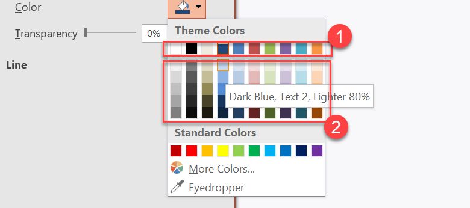

## **Introductie**

Een presentatie‑thema definieert een gecoördineerde set kleuren, lettertypen, achtergrondstijlen, vullingen, lijnen en effecten. Thema‑bewuste objecten verwijzen naar deze gedeelde definities in plaats van elke visuele eigenschap als een vaste waarde op te slaan, zodat een thema‑wijziging veel objecten tegelijk kan bijwerken.

In Aspose.Slides is het thema op presentatieniveau beschikbaar via [Presentation.getMasterTheme](https://reference.aspose.com/slides/nl/nodejs-java/aspose.slides/presentation/getmastertheme/). Een presentatie kan ook thema‑overriding op lagere niveaus bevatten. Een master kan het presentatiethema overriden via [MasterThemeManager.getOverrideTheme](https://reference.aspose.com/slides/nl/nodejs-java/aspose.slides/masterthememanager/), terwijl een lay‑out of een individuele dia zijn geërfde thema kan overriden via [BaseOverrideThemeManager.getOverrideTheme](https://reference.aspose.com/slides/nl/nodejs-java/aspose.slides/baseoverridethememanager/). In de praktijk wordt het effectieve thema voor een dia opgelost via deze erfenisketen: presentatiethema, master‑override, lay‑out‑override en dia‑override.


De secties hieronder laten de meest voorkomende thema‑workflows zien: een thema inspecteren, kleuren en lettertypen wijzigen, een thema kopiëren of toepassen, achtergrond‑ en effectstijlen bijwerken, en effectieve waarden lezen nadat erfenis en overrides zijn opgelost.

## **Een Thema Inspecteren**

Het [MasterTheme](https://reference.aspose.com/slides/nl/nodejs-java/aspose.slides/mastertheme/)‑object exposeert het kleurenschema, lettertypschema en format‑schema van het thema via [MasterTheme.getColorScheme](https://reference.aspose.com/slides/nl/nodejs-java/aspose.slides/mastertheme/), [MasterTheme.getFontScheme](https://reference.aspose.com/slides/nl/nodejs-java/aspose.slides/mastertheme/) en [MasterTheme.getFormatScheme](https://reference.aspose.com/slides/nl/nodejs-java/aspose.slides/mastertheme/). Deze collecties inspecteren vóórdat je ze wijzigt is vooral nuttig wanneer een presentatie uit een externe bron komt, omdat het aantal en de inhoud van stijl‑items kunnen variëren.

Het volgende voorbeeld leest de hoofdthema‑eigenschappen en meldt hoeveel achtergrond‑, vul‑, lijn‑ en effectstijlen er in het thema zijn opgeslagen:

```javascript
const aspose = {};
aspose.slides = require("aspose.slides.via.java");

const presentation = new aspose.slides.Presentation("input.pptx");
try {
    const theme = presentation.getMasterTheme();
    console.log("Theme name: " + theme.getName());
    console.log("Accent 1: " + theme.getColorScheme().getAccent1().getColor());
    console.log("Major Latin font: " + theme.getFontScheme().getMajor().getLatinFont().getFontName());
    console.log("Minor Latin font: " + theme.getFontScheme().getMinor().getLatinFont().getFontName());
    console.log("Background fill styles: " + theme.getFormatScheme().getBackgroundFillStyles().size());
    console.log("Fill styles: " + theme.getFormatScheme().getFillStyles().size());
    console.log("Line styles: " + theme.getFormatScheme().getLineStyles().size());
    console.log("Effect styles: " + theme.getFormatScheme().getEffectStyles().size());
} finally {
    presentation.dispose();
}
```

Als een bestand meerdere masters gebruikt, mag je niet aannemen dat elke dia hetzelfde effectieve thema heeft. Inspecteer de master die bij de dia hoort, en gebruik de effectieve‑thema‑workflow die later in dit artikel wordt getoond wanneer lay‑out‑ of dia‑overrides aanwezig kunnen zijn.

## **Themakleuren Wijzigen**

Thema‑bewuste vullingen, lijnen en tekst kunnen verwijzen naar een logische kleur uit de [SchemeColor](https://reference.aspose.com/slides/nl/nodejs-java/aspose.slides/schemecolor/)‑enumeratie. Wanneer je het overeenkomstige item in het [ColorScheme](https://reference.aspose.com/slides/nl/nodejs-java/aspose.slides/colorscheme/) wijzigt, worden alle objecten die nog steeds naar die themakleur verwijzen, tegen de nieuwe waarde afgehandeld. Objecten die een directe RGB‑kleur gebruiken, worden niet gewijzigd door een thema‑kleur‑update.

Het volgende end‑to‑end voorbeeld maakt een vorm die `Accent4` gebruikt, verandert de `Accent4`‑kleur van het thema naar rood, slaat de presentatie op, opent deze opnieuw en drukt de effectieve vulkleur af:

```javascript
const aspose = {};
aspose.slides = require("aspose.slides.via.java");
const java = require("java");

const presentation = new aspose.slides.Presentation();
try {
    const slide = presentation.getSlides().get_Item(0);
    const shape = slide.getShapes().addAutoShape(aspose.slides.ShapeType.Rectangle, 10, 10, 100, 100);
    shape.getFillFormat().setFillType(java.newByte(aspose.slides.FillType.Solid));
    shape.getFillFormat().getSolidFillColor().setSchemeColor(aspose.slides.SchemeColor.Accent4);
    presentation.getMasterTheme().getColorScheme().getAccent4().setColor(java.getStaticFieldValue("java.awt.Color", "RED"));
    presentation.save("theme-color.pptx", aspose.slides.SaveFormat.Pptx);
} finally {
    presentation.dispose();
}

const savedPresentation = new aspose.slides.Presentation("theme-color.pptx");
try {
    const savedSlide = savedPresentation.getSlides().get_Item(0);
    const savedShape = savedSlide.getShapes().get_Item(0);
    const effectiveFill = savedShape.getFillFormat().getEffective();
    console.log("Effective fill color: " + effectiveFill.getSolidFillColor());
} finally {
    savedPresentation.dispose();
}
```

Omdat het rechthoekje gekoppeld blijft aan `Accent4`, wordt de zichtbare kleur rood nadat het thema is aangepast. Als je de schema‑kleur vervangt door een directe kleur op de vorm, zullen latere wijzigingen aan `Accent4` die vulkleur niet meer beïnvloeden.

### **Kleuren Gebruiken uit het Extra Palet**

PowerPoint genereert lichtere en donkere varianten van een themakleur door kleurtransformaties toe te passen. Aspose.Slides exposeert deze transformaties via de [ColorTransformOperation](https://reference.aspose.com/slides/nl/nodejs-java/aspose.slides/colortransformoperation/)‑enumeratie.



**1** – Hoofdkleuren van het thema.  
**2** – Lichtere en donkere varianten geproduceerd uit de hoofdkleuren.

Het volgende voorbeeld maakt zes rechthoeken gebaseerd op `Accent4`, past luminantie‑transformaties toe op er vijf, en slaat het resultaat op:

```javascript
const aspose = {};
aspose.slides = require("aspose.slides.via.java");
const java = require("java");

const presentation = new aspose.slides.Presentation();
try {
    const slide = presentation.getSlides().get_Item(0);

    const shape1 = slide.getShapes().addAutoShape(aspose.slides.ShapeType.Rectangle, 10, 10, 50, 50);
    shape1.getFillFormat().setFillType(java.newByte(aspose.slides.FillType.Solid));
    shape1.getFillFormat().getSolidFillColor().setSchemeColor(aspose.slides.SchemeColor.Accent4);

    const shape2 = slide.getShapes().addAutoShape(aspose.slides.ShapeType.Rectangle, 10, 70, 50, 50);
    shape2.getFillFormat().setFillType(java.newByte(aspose.slides.FillType.Solid));
    shape2.getFillFormat().getSolidFillColor().setSchemeColor(aspose.slides.SchemeColor.Accent4);
    shape2.getFillFormat().getSolidFillColor().getColorTransform().add(aspose.slides.ColorTransformOperation.MultiplyLuminance, java.newFloat(0.2));
    shape2.getFillFormat().getSolidFillColor().getColorTransform().add(aspose.slides.ColorTransformOperation.AddLuminance, java.newFloat(0.8));

    const shape3 = slide.getShapes().addAutoShape(aspose.slides.ShapeType.Rectangle, 10, 130, 50, 50);
    shape3.getFillFormat().setFillType(java.newByte(aspose.slides.FillType.Solid));
    shape3.getFillFormat().getSolidFillColor().setSchemeColor(aspose.slides.SchemeColor.Accent4);
    shape3.getFillFormat().getSolidFillColor().getColorTransform().add(aspose.slides.ColorTransformOperation.MultiplyLuminance, java.newFloat(0.4));
    shape3.getFillFormat().getSolidFillColor().getColorTransform().add(aspose.slides.ColorTransformOperation.AddLuminance, java.newFloat(0.6));

    const shape4 = slide.getShapes().addAutoShape(aspose.slides.ShapeType.Rectangle, 10, 190, 50, 50);
    shape4.getFillFormat().setFillType(java.newByte(aspose.slides.FillType.Solid));
    shape4.getFillFormat().getSolidFillColor().setSchemeColor(aspose.slides.SchemeColor.Accent4);
    shape4.getFillFormat().getSolidFillColor().getColorTransform().add(aspose.slides.ColorTransformOperation.MultiplyLuminance, java.newFloat(0.6));
    shape4.getFillFormat().getSolidFillColor().getColorTransform().add(aspose.slides.ColorTransformOperation.AddLuminance, java.newFloat(0.4));

    const shape5 = slide.getShapes().addAutoShape(aspose.slides.ShapeType.Rectangle, 10, 250, 50, 50);
    shape5.getFillFormat().setFillType(java.newByte(aspose.slides.FillType.Solid));
    shape5.getFillFormat().getSolidFillColor().setSchemeColor(aspose.slides.SchemeColor.Accent4);
    shape5.getFillFormat().getSolidFillColor().getColorTransform().add(aspose.slides.ColorTransformOperation.MultiplyLuminance, java.newFloat(0.75));

    const shape6 = slide.getShapes().addAutoShape(aspose.slides.ShapeType.Rectangle, 10, 310, 50, 50);
    shape6.getFillFormat().setFillType(java.newByte(aspose.slides.FillType.Solid));
    shape6.getFillFormat().getSolidFillColor().setSchemeColor(aspose.slides.SchemeColor.Accent4);
    shape6.getFillFormat().getSolidFillColor().getColorTransform().add(aspose.slides.ColorTransformOperation.MultiplyLuminance, java.newFloat(0.5));

    presentation.save("theme-color-palette.pptx", aspose.slides.SaveFormat.Pptx);
} finally {
    presentation.dispose();
}
```

Deze varianten blijven gebaseerd op de themakleur. Als `Accent4` later verandert, worden de getransformeerde kleuren opnieuw berekend uit de nieuwe `Accent4`‑waarde.

### **`SchemeColor`‑Waarden Toewijzen aan `ColorScheme`‑Slots**

De [SchemeColor](https://reference.aspose.com/slides/nl/nodejs-java/aspose.slides/schemecolor/)‑enumeratie gebruikt `Text1`, `Background1`, `Text2` en `Background2`, terwijl het [ColorScheme](https://reference.aspose.com/slides/nl/nodejs-java/aspose.slides/colorscheme/) dezelfde themaslots exposeert als `Dark1`, `Light1`, `Dark2` en `Light2`. De mapping is vast:

* `Text1` = `Dark1`
* `Background1` = `Light1`
* `Text2` = `Dark2`
* `Background2` = `Light2`

Dit zijn alternatieve namen voor dezelfde themaslots; het zijn geen waarden die dynamisch van de ene vorm naar de andere worden omgezet.

## **Thema‑Lettertypen Wijzigen**

Een thema‑lettertypenschema bevat een hoofdlettertype‑set voor koppen en een secundaire lettertype‑set voor body‑tekst. De methoden [FontScheme.getMajor](https://reference.aspose.com/slides/nl/nodejs-java/aspose.slides/fontscheme/) en [FontScheme.getMinor](https://reference.aspose.com/slides/nl/nodejs-java/aspose.slides/fontscheme/) exposen die sets.

PowerPoint‑compatibele thema‑lettertype‑identifiers kunnen gebruikt worden bij tekstopmaak:

* `+mn-lt` – Body Font Latin (Minor Latin Font)  
* `+mj-lt` – Heading Font Latin (Major Latin Font)  
* `+mn-ea` – Body Font East Asian (Minor East Asian Font)  
* `+mj-ea` – Heading Font East Asian (Major East Asian Font)

Het volgende voorbeeld maakt één kop die het hoofd‑Latin‑thema‑lettertype gebruikt en één body‑regel die het secundaire Latin‑thema‑lettertype gebruikt. Vervolgens wijzigt het de thema‑lettertypen en slaat het resultaat op:

```javascript
const aspose = {};
aspose.slides = require("aspose.slides.via.java");

const presentation = new aspose.slides.Presentation();
try {
    const slide = presentation.getSlides().get_Item(0);

    const heading = slide.getShapes().addAutoShape(aspose.slides.ShapeType.Rectangle, 40, 40, 500, 60);
    heading.getTextFrame().setText("Theme heading");
    heading.getTextFrame().getParagraphs().get_Item(0).getPortions().get_Item(0).getPortionFormat().setLatinFont(new aspose.slides.FontData("+mj-lt"));

    const body = slide.getShapes().addAutoShape(aspose.slides.ShapeType.Rectangle, 40, 120, 500, 60);
    body.getTextFrame().setText("Theme body text");
    body.getTextFrame().getParagraphs().get_Item(0).getPortions().get_Item(0).getPortionFormat().setLatinFont(new aspose.slides.FontData("+mn-lt"));

    presentation.getMasterTheme().getFontScheme().getMajor().setLatinFont(new aspose.slides.FontData("Aptos Display"));
    presentation.getMasterTheme().getFontScheme().getMinor().setLatinFont(new aspose.slides.FontData("Arial"));
    presentation.save("theme-fonts.pptx", aspose.slides.SaveFormat.Pptx);
} finally {
    presentation.dispose();
}
```

De kop volgt het hoofdlettertype en de body‑tekst volgt het secundaire lettertype. Tekst die een expliciete lettertype‑naam heeft in plaats van een thema‑identifier, zal niet automatisch overschakelen wanneer het thema‑lettertypenschema verandert.

De hoofd‑ en secundaire lettertypecollecties kunnen ook lettertype‑mappingen bevatten voor individuele schrijfsystemen, zoals Cyrillisch, Arabisch, Japans, Georgisch en Thaana. Om deze mappingen te inspecteren, toe te voegen, te vervangen of te verwijderen, zie [Script‑Specific Theme Fonts](/slides/nl/nodejs-java/script-specific-font-mappings/).

{}
Voor meer informatie over presentatiefonttypen, zie [PowerPoint Fonts](/slides/nl/nodejs-java/powerpoint-fonts/).
{}

## **Een Thema Kopiëren of Toepassen**

Er zijn twee gangbare workflows, en ze lossen verschillende problemen op.

### **Bron‑Thema Behouden bij Het Verplaatsen van Dia's**

Wil je een dia naar een andere presentatie verplaatsen en het originele ontwerp behouden, kloon dan de bron‑master in de doelpresentatie met [MasterSlideCollection.addClone](https://reference.aspose.com/slides/nl/nodejs-java/aspose.slides/masterslidecollection/), en kloon vervolgens de dia met [SlideCollection.addClone](https://reference.aspose.com/slides/nl/nodejs-java/aspose.slides/slidecollection/) en de gekloonde master. Dit draagt de master, zijn lay‑outs en het gekoppelde thema mee.

```javascript
const aspose = {};
aspose.slides = require("aspose.slides.via.java");

const source = new aspose.slides.Presentation("source-theme.pptx");
try {
    const target = new aspose.slides.Presentation("target.pptx");
    try {
        const sourceSlide = source.getSlides().get_Item(0);
        const clonedMaster = target.getMasters().addClone(sourceSlide.getLayoutSlide().getMasterSlide());
        target.getSlides().addClone(sourceSlide, clonedMaster, true);
        target.save("theme-preserved.pptx", aspose.slides.SaveFormat.Pptx);
    } finally {
        target.dispose();
    }
} finally {
    source.dispose();
}
```

Dit is de aanbevolen workflow wanneer de bron‑dia er in de bestemming precies hetzelfde uit moet zien. Het simpelweg klonen van inhoud naar een niet‑gerelateerde doel‑master kan thema‑gedreven kleuren, lettertypen, achtergronden en effecten wijzigen.

### **Thema‑Waarden Toepassen op een Bestaande Dia**

Moet de doel‑dia op zijn huidige master en lay‑out blijven, initialiseert dan een dia‑niveau‑override vanuit het bron‑thema. De methoden [OverrideTheme.initColorSchemeFrom](https://reference.aspose.com/slides/nl/nodejs-java/aspose.slides/overridetheme/), [OverrideTheme.initFontSchemeFrom](https://reference.aspose.com/slides/nl/nodejs-java/aspose.slides/overridetheme/) en [OverrideTheme.initFormatSchemeFrom](https://reference.aspose.com/slides/nl/nodejs-java/aspose.slides/overridetheme/) kopiëren de drie hoofd‑thema‑componenten naar de override.

```javascript
const aspose = {};
aspose.slides = require("aspose.slides.via.java");

const source = new aspose.slides.Presentation("source-theme.pptx");
try {
    const target = new aspose.slides.Presentation("target.pptx");
    try {
        const sourceTheme = source.getMasterTheme();
        const targetSlide = target.getSlides().get_Item(0);
        const overrideTheme = targetSlide.getThemeManager().getOverrideTheme();
        overrideTheme.initColorSchemeFrom(sourceTheme.getColorScheme());
        overrideTheme.initFontSchemeFrom(sourceTheme.getFontScheme());
        overrideTheme.initFormatSchemeFrom(sourceTheme.getFormatScheme());
        target.save("theme-applied-to-slide.pptx", aspose.slides.SaveFormat.Pptx);
    } finally {
        target.dispose();
    }
} finally {
    source.dispose();
}
```

Dit verandert het thema dat door die dia wordt gebruikt zonder het thema dat andere dia's erven aan te passen. Om de lokale override te verwijderen en terug te keren naar geërfde waarden, roep [OverrideTheme.clear](https://reference.aspose.com/slides/nl/nodejs-java/aspose.slides/overridetheme/) aan.

### **Een Thema‑Override Toepassen op een Lay‑out**

Een lay‑out‑niveau‑override geldt voor dia's die die lay‑out gebruiken, tenzij een specifieke dia een eigen override heeft. Dezelfde initialisatiemethoden kunnen gebruikt worden via de [LayoutSlideThemeManager](https://reference.aspose.com/slides/nl/nodejs-java/aspose.slides/layoutslidethememanager/):

```javascript
const aspose = {};
aspose.slides = require("aspose.slides.via.java");

const source = new aspose.slides.Presentation("source-theme.pptx");
try {
    const target = new aspose.slides.Presentation("target.pptx");
    try {
        const sourceTheme = source.getMasterTheme();
        const targetSlide = target.getSlides().get_Item(0);
        const overrideTheme = targetSlide.getLayoutSlide().getThemeManager().getOverrideTheme();
        overrideTheme.initColorSchemeFrom(sourceTheme.getColorScheme());
        overrideTheme.initFontSchemeFrom(sourceTheme.getFontScheme());
        overrideTheme.initFormatSchemeFrom(sourceTheme.getFormatScheme());
        target.save("theme-applied-to-layout.pptx", aspose.slides.SaveFormat.Pptx);
    } finally {
        target.dispose();
    }
} finally {
    source.dispose();
}
```

Gebruik een master‑ of presentatiethema wanneer veel lay‑outs en dia's hetzelfde basisonwerp moeten delen, een lay‑out‑override wanneer één lay‑outfamilie een andere styling nodig heeft, en een dia‑override alleen voor echte uitzonderingen. Overmatige dia‑niveau‑overrides maken latere globale themawijzigingen moeilijker te voorspellen.

## **Achtergrondstijlen van het Thema Bijwerken**

De achtergrond‑vullingen van het thema worden opgeslagen in [FormatScheme.getBackgroundFillStyles](https://reference.aspose.com/slides/nl/nodejs-java/aspose.slides/formatscheme/). PowerPoint kan in de gebruikersinterface meer achtergrondkeuzes presenteren dan het aantal vuldefinities dat fysiek in deze collectie is opgeslagen, omdat de UI themavullingen kan combineren met themakleuren en andere stijltrefences.


Voordat je een achtergrondstijl gebruikt, inspecteer je de opgeslagen collectie en de huidige [Background.getStyleIndex](https://reference.aspose.com/slides/nl/nodejs-java/aspose.slides/background/). Een stijl‑index van `0` betekent geen themavulling; positieve waarden zijn thematische achtergrond‑stijlreferenties. Dit verschilt van het indexeren van de JavaScript‑collectie zelf, waar index `0` het eerste opgeslagen item betekent. Ga er niet van uit dat elke presentatie evenveel achtergrondvulstijlen bevat.

Het volgende voorbeeld rapporteert het aantal beschikbare achtergrondvullingen, wijst een thematische achtergrondreferentie toe aan de eerste master, en slaat de presentatie op:

```javascript
const aspose = {};
aspose.slides = require("aspose.slides.via.java");
const java = require("java");

const presentation = new aspose.slides.Presentation("input.pptx");
try {
    const backgroundStyles = presentation.getMasterTheme().getFormatScheme().getBackgroundFillStyles();
    console.log("Background fill styles: " + backgroundStyles.size());
    if (backgroundStyles.size() === 0) {
        throw new Error("The presentation theme does not contain background fill styles.");
    }

    const masterSlide = presentation.getMasters().get_Item(0);
    masterSlide.getBackground().setType(java.newByte(aspose.slides.BackgroundType.Themed));
    masterSlide.getBackground().setStyleIndex(1);
    presentation.save("theme-background.pptx", aspose.slides.SaveFormat.Pptx);
} finally {
    presentation.dispose();
}
```

Het zichtbare resultaat hangt af van de themarefere nce die door de master wordt gebruikt en van eventuele achtergrond‑overrides op lay‑out‑ of dia‑niveau. Als een dia zijn eigen achtergrond gebruikt, verandert alleen de master‑achtergrond die dia mogelijk niet. Gebruik [Background.getEffective](https://reference.aspose.com/slides/nl/nodejs-java/aspose.slides/background/) wanneer je de uiteindelijke achtergrond na erfenis wilt weten.

{}
Beschouw de stijl‑index niet als een nul‑gebaseerde collectie‑index. Vermijd ook het hard‑coderen van een stijlnummer uit één bestand en de veronderstelling dat het dezelfde uitstraling heeft in een ander bestand; themastijldefinities zijn presentatiespecifiek.
{}

{}
Voor directe achtergrondopmaak en achtergrond‑erfenis, zie [Presentation Background](/slides/nl/nodejs-java/presentation-background/).
{}

## **Thema‑Effecten Bijwerken**

Een thema‑format‑schema bevat afzonderlijke collecties voor vul‑, lijn‑ en effectstijlen, toegankelijk via [FormatScheme.getFillStyles](https://reference.aspose.com/slides/nl/nodejs-java/aspose.slides/formatscheme/), [FormatScheme.getLineStyles](https://reference.aspose.com/slides/nl/nodejs-java/aspose.slides/formatscheme/) en [FormatScheme.getEffectStyles](https://reference.aspose.com/slides/nl/nodejs-java/aspose.slides/formatscheme/). Typische Office‑thema’s bevatten vaak drie hoofd‑stijlitems die visueel overeenkomen met subtiele, matige en intensieve opmaak, maar code moet elke collectie inspecteren in plaats van een vast aantal aan te nemen.


Wanneer je deze collecties in JavaScript benadert, is de collectie‑index nul‑gebaseerd: index `0` is de eerste opgeslagen stijl en index `2` is de derde. De stijl‑referentie‑indexes van een vorm vormen een apart concept, blootgelegd via [ShapeStyle](https://reference.aspose.com/slides/nl/nodejs-java/aspose.slides/shapestyle/). Het wijzigen van een themastijl beïnvloedt vormen die naar die themastijl verwijzen; vormen met directe opmaak blijven mogelijk ongewijzigd.

Het volgende voorbeeld controleert of de vereiste stijlitems bestaan, wijzigt de eerste lijnstijl, wijzigt de derde vulstijl, zet een buitenste schaduw aan in de derde effectstijl, en slaat het resultaat op:

```javascript
const aspose = {};
aspose.slides = require("aspose.slides.via.java");
const java = require("java");

const presentation = new aspose.slides.Presentation("Subtle_Moderate_Intense.pptx");
try {
    const formatScheme = presentation.getMasterTheme().getFormatScheme();
    if (formatScheme.getLineStyles().size() < 1 || formatScheme.getFillStyles().size() < 3 || formatScheme.getEffectStyles().size() < 3) {
        throw new Error("The theme does not contain the style entries required by this example.");
    }

    formatScheme.getLineStyles().get_Item(0).getFillFormat().setFillType(java.newByte(aspose.slides.FillType.Solid));
    formatScheme.getLineStyles().get_Item(0).getFillFormat().getSolidFillColor().setColor(java.getStaticFieldValue("java.awt.Color", "RED"));
    formatScheme.getFillStyles().get_Item(2).setFillType(java.newByte(aspose.slides.FillType.Solid));
    formatScheme.getFillStyles().get_Item(2).getSolidFillColor().setColor(java.newInstanceSync("java.awt.Color", 34, 139, 34));
    const effectFormat = formatScheme.getEffectStyles().get_Item(2).getEffectFormat();
    effectFormat.enableOuterShadowEffect();
    effectFormat.getOuterShadowEffect().setDistance(10);
    presentation.save("theme-effects.pptx", aspose.slides.SaveFormat.Pptx);
} finally {
    presentation.dispose();
}
```

Voor vormen die deze slots refereren, wordt de eerste themalijnstijl rood, de derde themavulstijl een solide bosgroen, en krijgt de derde effectstijl een buitenste schaduw met een afstand van 10 punten. Het exacte visuele resultaat blijft afhangen van welke stijl‑slots elke vorm refereren en of directe opmaak de themastijl overschrijft.


## **Effectieve Thema‑Waarden Lezen**

Ruwe thema‑objecten vertellen je wat er op een bepaald niveau is gedefinieerd. Effectieve waarden vertellen je wat een dia of vorm daadwerkelijk gebruikt nadat erfenis en lokale overrides zijn opgelost. Voor een dia roep je [BaseOverrideThemeManager.createThemeEffective](https://reference.aspose.com/slides/nl/nodejs-java/aspose.slides/baseoverridethememanager/) aan. Voor een achtergrond gebruik je [Background.getEffective](https://reference.aspose.com/slides/nl/nodejs-java/aspose.slides/background/), en voor een vul, gebruik je [FillFormat.getEffective](https://reference.aspose.com/slides/nl/nodejs-java/aspose.slides/fillformat/).

Het volgende voorbeeld leest het effectieve thema, de achtergrond en de vulkleur van de eerste vorm van een dia:

```javascript
const aspose = {};
aspose.slides = require("aspose.slides.via.java");

const presentation = new aspose.slides.Presentation("input.pptx");
try {
    const slide = presentation.getSlides().get_Item(0);
    const effectiveTheme = slide.getThemeManager().createThemeEffective();
    const effectiveBackground = slide.getBackground().getEffective();
    console.log("Effective major Latin font: " + effectiveTheme.getFontScheme().getMajor().getLatinFont().getFontName());
    console.log("Effective minor Latin font: " + effectiveTheme.getFontScheme().getMinor().getLatinFont().getFontName());
    console.log("Effective background fill type: " + effectiveBackground.getFillFormat().getFillType());
    if (slide.getShapes().size() > 0) {
        const effectiveFill = slide.getShapes().get_Item(0).getFillFormat().getEffective();
        console.log("First shape effective fill type: " + effectiveFill.getFillType());
        if (effectiveFill.getFillType() === aspose.slides.FillType.Solid) {
            console.log("First shape effective fill color: " + effectiveFill.getSolidFillColor());
        }
    }
} finally {
    presentation.dispose();
}
```

Gebruik effectieve data voor diagnostiek, validatie en vergelijkingen. Als je uitsluitend [Presentation.getMasterTheme](https://reference.aspose.com/slides/nl/nodejs-java/aspose.slides/presentation/getmastertheme/) inspecteert, kun je een master‑, lay‑out‑, dia‑ of vorm‑override missen die het uiteindelijke uiterlijk wijzigt.

## **FAQ**

**Kan ik een thema op één dia toepassen zonder de master te wijzigen?**

Ja. Gebruik de [SlideThemeManager](https://reference.aspose.com/slides/nl/nodejs-java/aspose.slides/slidethememanager/) van de dia en initialiseert zijn override‑thema. De wijziging blijft lokaal voor die dia; andere dia's blijven hun bestaande thema’s erven.

**Wat is de veiligste manier om een thema van de ene presentatie naar de andere over te dragen?**

Wanneer je een dia verplaatst en zijn bron­uiterlijk wilt behouden, kloon dan de bron‑master naar de bestemming en kloon de dia met die master via [MasterSlideCollection.addClone](https://reference.aspose.com/slides/nl/nodejs-java/aspose.slides/masterslidecollection/) en [SlideCollection.addClone](https://reference.aspose.com/slides/nl/nodejs-java/aspose.slides/slidecollection/). Dit houdt de master, lay‑outs en het thema samen.

**Hoe kan ik de effectieve waarden zien na erfenis en overrides?**

Gebruik [BaseOverrideThemeManager.createThemeEffective](https://reference.aspose.com/slides/nl/nodejs-java/aspose.slides/baseoverridethememanager/) voor een dia‑ of lay‑out‑thema en de overeenkomstige effectieve‑data‑methoden voor format‑objecten zoals [Background.getEffective](https://reference.aspose.com/slides/nl/nodejs-java/aspose.slides/background/) en [FillFormat.getEffective](https://reference.aspose.com/slides/nl/nodejs-java/aspose.slides/fillformat/). Deze API’s geven de opgeloste waarden terug nadat erfenis en overrides zijn toegepast.