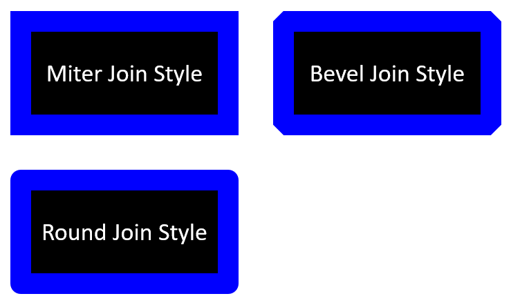

## **Inleiding**

In PowerPoint kunt u vormen aan dia's toevoegen. Omdat vormen uit lijnen bestaan, kunt u ze opmaken door de omlijning te wijzigen of effecten toe te passen. Daarnaast kunt u vormen opmaken door instellingen te specificeren die bepalen hoe de binnenkant wordt gevuld.


Aspose.Slides voor PHP via Java biedt klassen en methoden waarmee u vormen kunt opmaken met dezelfde opties als in PowerPoint.

## **Lijnen opmaken**

Met Aspose.Slides kunt u een aangepaste lijnstijl voor een vorm opgeven. De volgende stappen beschrijven de procedure:

1. Create an instance of the [Presentation](https://reference.aspose.com/slides/nl/php-java/aspose.slides/presentation/) class.
2. Get a reference to a slide by its index.
3. Add an [AutoShape](https://reference.aspose.com/slides/nl/php-java/aspose.slides/autoshape/) to the slide.
4. Set the [lijnstijl](https://reference.aspose.com/slides/nl/php-java/aspose.slides/linestyle/) of the shape.
5. Set the line width.
6. Set the [streepstijl](https://reference.aspose.com/slides/nl/php-java/aspose.slides/linedashstyle/) of the line.
7. Set the line color for the shape.
8. Save the modified presentation as a PPTX file.

The following PHP code demonstrates how to format a rectangle `AutoShape`:

```php
// Instantieer de Presentation‑klasse die een presentatie‑bestand vertegenwoordigt.
$presentation = new Presentation();
try {
    // Haalt de eerste dia op.
    $slide = $presentation->getSlides()->get_Item(0);

    // Voegt een auto‑vorm van het type Rechthoek toe.
    $shape = $slide->getShapes()->addAutoShape(ShapeType::Rectangle, 50, 150, 150, 75);

    // Stelt de vulkleur in voor de rechthoek‑vorm.
    $shape->getFillFormat()->setFillType(FillType::NoFill);

    // Past opmaak toe op de lijnen van de rechthoek.
    $shape->getLineFormat()->setStyle(LineStyle::ThickThin);
    $shape->getLineFormat()->setWidth(7);
    $shape->getLineFormat()->setDashStyle(LineDashStyle::Dash);

    // Stelt de kleur in voor de lijn van de rechthoek.
    $shape->getLineFormat()->getFillFormat()->setFillType(FillType::Solid);
    $shape->getLineFormat()->getFillFormat()->getSolidFillColor()->setColor(java("java.awt.Color")->BLUE);

    // Slaat het PPTX‑bestand op naar de schijf.
    $presentation->save("formatted_lines.pptx", SaveFormat::Pptx);
} finally {
    $presentation->dispose();
}
```

Het resultaat:


## **Samenvoegstijlen opmaken**

Hier zijn de drie opties voor het type verbinding:

* Rond
* Verstek
* Afgeschuind

Standaard gebruikt PowerPoint bij het samenvoegen van twee lijnen onder een hoek (bijvoorbeeld bij de hoek van een vorm) de **Rond**‑instelling. Als u echter een vorm met scherpe hoeken tekent, geeft u wellicht de voorkeur aan de **Verstek**‑optie.



The following PHP code demonstrates how three rectangles (as shown in the image above) were created using the Verstek, Afgeschuind, and Rond join type settings:

```php
// Instantieer de Presentation‑klasse die een presentatie‑bestand vertegenwoordigt.
$presentation = new Presentation();
try {
    // Haalt de eerste dia op.
    $slide = $presentation->getSlides()->get_Item(0);

    // Voegt drie auto‑vormen van het type Rechthoek toe.
    $shape1 = $slide->getShapes()->addAutoShape(ShapeType::Rectangle, 20, 20, 150, 75);
    $shape2 = $slide->getShapes()->addAutoShape(ShapeType::Rectangle, 210, 20, 150, 75);
    $shape3 = $slide->getShapes()->addAutoShape(ShapeType::Rectangle, 20, 135, 150, 75);

    // Stelt de vulkleur in voor elke rechthoek‑vorm.
    $shape1->getFillFormat()->setFillType(FillType::Solid);
    $shape1->getFillFormat()->getSolidFillColor()->setColor(java("java.awt.Color")->BLACK);
    $shape2->getFillFormat()->setFillType(FillType::Solid);
    $shape2->getFillFormat()->getSolidFillColor()->setColor(java("java.awt.Color")->BLACK);
    $shape3->getFillFormat()->setFillType(FillType::Solid);
    $shape3->getFillFormat()->getSolidFillColor()->setColor(java("java.awt.Color")->BLACK);

    // Stelt de lijndikte in.
    $shape1->getLineFormat()->setWidth(15);
    $shape2->getLineFormat()->setWidth(15);
    $shape3->getLineFormat()->setWidth(15);

    // Stelt de kleur in voor de lijn van elke rechthoek.
    $shape1->getLineFormat()->getFillFormat()->setFillType(FillType::Solid);
    $shape1->getLineFormat()->getFillFormat()->getSolidFillColor()->setColor(java("java.awt.Color")->BLUE);
    $shape2->getLineFormat()->getFillFormat()->setFillType(FillType::Solid);
    $shape2->getLineFormat()->getFillFormat()->getSolidFillColor()->setColor(java("java.awt.Color")->BLUE);
    $shape3->getLineFormat()->getFillFormat()->setFillType(FillType::Solid);
    $shape3->getLineFormat()->getFillFormat()->getSolidFillColor()->setColor(java("java.awt.Color")->BLUE);

    // Stelt de verbindingsstijl in.
    $shape1->getLineFormat()->setJoinStyle(LineJoinStyle::Miter);
    $shape2->getLineFormat()->setJoinStyle(LineJoinStyle::Bevel);
    $shape3->getLineFormat()->setJoinStyle(LineJoinStyle::Round);

    // Voegt tekst toe aan elke rechthoek.
    $shape1->getTextFrame()->setText("Miter Join Style");
    $shape2->getTextFrame()->setText("Bevel Join Style");
    $shape3->getTextFrame()->setText("Round Join Style");

    // Slaat het PPTX‑bestand op naar de schijf.
    $presentation->save("join_styles.pptx", SaveFormat::Pptx);
} finally {
    $presentation->dispose();
}
```

## **Vulling met kleurverloop**

In PowerPoint is Vulling met kleurverloop een opmaakoptie die u in staat stelt een continue kleurenverloop op een vorm toe te passen. Bijvoorbeeld, u kunt twee of meer kleuren toelaten waarbij de ene geleidelijk in de andere vervaagt.

Met Aspose.Slides kunt u een kleurverloop toepassen op een vorm:

1. Create an instance of the [Presentation](https://reference.aspose.com/slides/nl/php-java/aspose.slides/presentation/) class.
2. Get a reference to a slide by its index.
3. Add an [AutoShape](https://reference.aspose.com/slides/nl/php-java/aspose.slides/autoshape/) to the slide.
4. Set the shape's [FillType](https://reference.aspose.com/slides/nl/php-java/aspose.slides/filltype/) to `Gradient`.
5. Add your two preferred colors with defined positions using the `add` methods of the gradient stop collection exposed by the [GradientFormat](https://reference.aspose.com/slides/nl/php-java/aspose.slides/gradientformat/) class.
6. Save the modified presentation as a PPTX file.

The following PHP code demonstrates how to apply a gradient fill effect to an ellipse:

```php
// Instantieer de Presentation-klasse die een presentatiebestand vertegenwoordigt.
$presentation = new Presentation();
try {
    // Haalt de eerste dia op.
    $slide = $presentation->getSlides()->get_Item(0);

    // Voegt een auto‑vorm van het type Ellips toe.
    $shape = $slide->getShapes()->addAutoShape(ShapeType::Ellipse, 50, 50, 150, 75);

    // Past kleurverloop‑opmaak toe op de ellips.
    $shape->getFillFormat()->setFillType(FillType::Gradient);
    $shape->getFillFormat()->getGradientFormat()->setGradientShape(GradientShape::Linear);

    // Stelt de richting van het kleurverloop in.
    $shape->getFillFormat()->getGradientFormat()->setGradientDirection(GradientDirection::FromCorner2);

    // Voegt twee kleurverloopstops toe.
    $shape->getFillFormat()->getGradientFormat()->getGradientStops()->addPresetColor(1.0, PresetColor::Purple);
    $shape->getFillFormat()->getGradientFormat()->getGradientStops()->addPresetColor(0, PresetColor::Red);

    // Slaat het PPTX‑bestand op naar de schijf.
    $presentation->save("gradient_fill.pptx", SaveFormat::Pptx);
} finally {
    $presentation->dispose();
}
```

Het resultaat:


## **Patroonvulling**

In PowerPoint is Vulling met patroon een opmaakoptie die u in staat stelt een tweekleurig ontwerp—zoals stippen, strepen, kruisende lijnen of vakken—op een vorm toe te passen. U kunt aangepaste kleuren kiezen voor de voor‑ en achtergrond van het patroon.

Aspose.Slides biedt meer dan 45 vooraf gedefinieerde patroonstijlen die u kunt toepassen op vormen om de visuele aantrekkingskracht van uw presentaties te verhogen. Zelfs nadat u een vooraf gedefinieerd patroon hebt gekozen, kunt u nog steeds de exacte kleuren opgeven die het moet gebruiken.

Hieronder ziet u hoe u een patroonvulling op een vorm toepast met Aspose.Slides:

1. Create an instance of the [Presentation](https://reference.aspose.com/slides/nl/php-java/aspose.slides/presentation/) class.
2. Get a reference to a slide by its index.
3. Add an [AutoShape](https://reference.aspose.com/slides/nl/php-java/aspose.slides/autoshape/) to the slide.
4. Set the shape’s [FillType](https://reference.aspose.com/slides/nl/php-java/aspose.slides/filltype/) to `Pattern`.
5. Choose a pattern style from the predefined options.
6. Set the [Background Color](https://reference.aspose.com/slides/nl/php-java/aspose.slides/patternformat/#getBackColor) of the pattern.
7. Set the [Foreground Color](https://reference.aspose.com/slides/nl/php-java/aspose.slides/patternformat/#getForeColor) of the pattern.
8. Save the modified presentation as a PPTX file.

The following PHP code demonstrates how to apply a pattern fill to a rectangle:

```php
// Instantieer de Presentation-klasse die een presentatiebestand vertegenwoordigt.
$presentation = new Presentation();
try {
    // Haalt de eerste dia op.
    $slide = $presentation->getSlides()->get_Item(0);

    // Voegt een auto-vorm van het type Rechthoek toe.
    $shape = $slide->getShapes()->addAutoShape(ShapeType::Rectangle, 50, 50, 150, 75);

    // Stelt het vultype in op Patroon.
    $shape->getFillFormat()->setFillType(FillType::Pattern);

    // Stelt de patroonstijl in.
    $shape->getFillFormat()->getPatternFormat()->setPatternStyle(PatternStyle::Trellis);

    // Stelt de achtergrond- en voorgrondkleuren van het patroon in.
    $shape->getFillFormat()->getPatternFormat()->getBackColor()->setColor(java("java.awt.Color")->LIGHT_GRAY);
    $shape->getFillFormat()->getPatternFormat()->getForeColor()->setColor(java("java.awt.Color")->YELLOW);

    // Slaat het PPTX-bestand op naar de schijf.
    $presentation->save("pattern_fill.pptx", SaveFormat::Pptx);
} finally {
    $presentation->dispose();
}
```

Het resultaat:


## **Afbeeldingsvulling**

In PowerPoint is Afbeeldingsvulling een opmaakoptie die u toestaat een afbeelding in een vorm te plaatsen—effectief de afbeelding als achtergrond van de vorm te gebruiken.

Hieronder ziet u hoe u met Aspose.Slides een afbeeldingsvulling op een vorm toepast:

1. Create an instance of the [Presentation](https://reference.aspose.com/slides/nl/php-java/aspose.slides/presentation/) class.
2. Get a reference to a slide by its index.
3. Add an [AutoShape](https://reference.aspose.com/slides/nl/php-java/aspose.slides/autoshape/) to the slide.
4. Set the shape's [FillType](https://reference.aspose.com/slides/nl/php-java/aspose.slides/filltype/) to `Picture`.
5. Set the picture fill mode to `Tile` (or another preferred mode).
6. Create an [PPImage](https://reference.aspose.com/slides/nl/php-java/aspose.slides/ppimage/) object from the image you want to use.
7. Pass the image to the `SlidesPicture.setImage` method.
8. Save the modified presentation as a PPTX file.

Laten we zeggen dat we een bestand “lotus.png” hebben met de volgende afbeelding:


The following PHP code demonstrates how to fill a shape with the picture:

```php
// Instantieer de Presentation-klasse die een presentatiebestand vertegenwoordigt.
$presentation = new Presentation();
try {
    // Haalt de eerste dia op.
    $slide = $presentation->getSlides()->get_Item(0);

    // Voegt een auto‑vorm van het type Rechthoek toe.
    $shape = $slide->getShapes()->addAutoShape(ShapeType::Rectangle, 50, 50, 255, 130);

    // Stelt het vultype in op Afbeelding.
    $shape->getFillFormat()->setFillType(FillType::Picture);

    // Stelt de afbeeldingsvullingsmodus in.
    $shape->getFillFormat()->getPictureFillFormat()->setPictureFillMode(PictureFillMode::Tile);

    // Laadt een afbeelding en voegt deze toe aan de presentatie‑bronnen.
    $image = Images::fromFile("lotus.png");
    $picture = $presentation->getImages()->addImage($image);
    $image->dispose();

    // Stelt de afbeelding in.
    $shape->getFillFormat()->getPictureFillFormat()->getPicture()->setImage($picture);

    // Slaat het PPTX‑bestand op naar de schijf.
    $presentation->save("picture_fill.pptx", SaveFormat::Pptx);
} finally {
    $presentation->dispose();
}
```

Het resultaat:


### **Afbeelding als tegeltextuur**

Als u een tegelafbeelding als textuur wilt instellen en het tegelgedrag wilt aanpassen, kunt u de volgende methoden van de [PictureFillFormat](https://reference.aspose.com/slides/nl/php-java/aspose.slides/picturefillformat/)‑klasse gebruiken:

- [setPictureFillMode](https://reference.aspose.com/slides/nl/php-java/aspose.slides/picturefillformat/#setPictureFillMode): Stelt de modus van de afbeeldingsvulling in — `Tile` of `Stretch`.
- [setTileAlignment](https://reference.aspose.com/slides/nl/php-java/aspose.slides/picturefillformat/#setTileAlignment): Specificeert de uitlijning van de tegels binnen de vorm.
- [setTileFlip](https://reference.aspose.com/slides/nl/php-java/aspose.slides/picturefillformat/#setTileFlip): Bepaalt of de tegel horizontaal, verticaal of in beide richtingen wordt gespiegeld.
- [setTileOffsetX](https://reference.aspose.com/slides/nl/php-java/aspose.slides/picturefillformat/#setTileOffsetX): Stelt de horizontale offset van de tegel (in points) ten opzichte van de oorsprong van de vorm in.
- [setTileOffsetY](https://reference.aspose.com/slides/nl/php-java/aspose.slides/picturefillformat/#setTileOffsetY): Stelt de verticale offset van de tegel (in points) ten opzichte van de oorsprong van de vorm in.
- [setTileScaleX](https://reference.aspose.com/slides/nl/php-java/aspose.slides/picturefillformat/#setTileScaleX): Definieert de horizontale schaal van de tegel als percentage.
- [setTileScaleY](https://reference.aspose.com/slides/nl/php-java/aspose.slides/picturefillformat/#setTileScaleY): Definieert de verticale schaal van de tegel als percentage.

The following code sample shows how to add a rectangle shape with a tiled picture fill and configure tile options:

```php
// Instantieer de Presentation-klasse die een presentatiebestand vertegenwoordigt.
$presentation = new Presentation();
try {
    // Haalt de eerste dia op.
    $firstSlide = $presentation->getSlides()->get_Item(0);

    // Voegt een auto‑vorm van het type Rechthoek toe.
    $shape = $firstSlide->getShapes()->addAutoShape(ShapeType::Rectangle, 50, 50, 190, 95);

    // Stelt het vultype van de vorm in op Afbeelding.
    $shape->getFillFormat()->setFillType(FillType::Picture);

    // Laadt de afbeelding en voegt deze toe aan de presentatie‑bronnen.
    $sourceImage = Images::fromFile("lotus.png");
    $presentationImage = $presentation->getImages()->addImage($sourceImage);
    $sourceImage->dispose();

    // Wijs de afbeelding toe aan de vorm.
    $pictureFillFormat = $shape->getFillFormat()->getPictureFillFormat();
    $pictureFillFormat->getPicture()->setImage($presentationImage);

    // Configureer de afbeeldingsvullingsmodus en tegel‑eigenschappen.
    $pictureFillFormat->setPictureFillMode(PictureFillMode::Tile);
    $pictureFillFormat->setTileOffsetX(-32);
    $pictureFillFormat->setTileOffsetY(-32);
    $pictureFillFormat->setTileScaleX(50);
    $pictureFillFormat->setTileScaleY(50);
    $pictureFillFormat->setTileAlignment(RectangleAlignment::BottomRight);
    $pictureFillFormat->setTileFlip(TileFlip::FlipBoth);

    // Slaat het PPTX‑bestand op naar de schijf.
    $presentation->save("tile.pptx", SaveFormat::Pptx);
} finally {
    $presentation->dispose();
}
```

Het resultaat:


## **Vulling met effen kleur**

In PowerPoint is Vulling met effen kleur een opmaakoptie die een vorm vult met één enkele, uniforme kleur. Deze effen achtergrondkleur wordt toegepast zonder kleurverlopen, texturen of patronen.

Om een effen kleurvulling op een vorm toe te passen met Aspose.Slides, volgt u deze stappen:

1. Create an instance of the [Presentation](https://reference.aspose.com/slides/nl/php-java/aspose.slides/presentation/) class.
2. Get a reference to a slide by its index.
3. Add an [AutoShape](https://reference.aspose.com/slides/nl/php-java/aspose.slides/autoshape/) to the slide.
4. Set the shape’s [FillType](https://reference.aspose.com/slides/nl/php-java/aspose.slides/filltype/) to `Solid`.
5. Assign your preferred fill color to the shape.
6. Save the modified presentation as a PPTX file.

The following PHP code demonstrates how to apply a solid color fill to a rectangle in a PowerPoint slide:

```php
// Instantieer de Presentation-klasse die een presentatiedocument vertegenwoordigt.
$presentation = new Presentation();
try {
    // Haalt de eerste dia op.
    $slide = $presentation->getSlides()->get_Item(0);

    // Voegt een auto‑vorm van het type Rechthoek toe.
    $shape = $slide->getShapes()->addAutoShape(ShapeType::Rectangle, 50, 50, 150, 75);

    // Stelt het vultype in op Solid.
    $shape->getFillFormat()->setFillType(FillType::Solid);

    // Stelt de vulkleur in.
    $shape->getFillFormat()->getSolidFillColor()->setColor(java("java.awt.Color")->YELLOW);

    // Slaat het PPTX‑bestand op naar de schijf.
    $presentation->save("solid_color_fill.pptx", SaveFormat::Pptx);
} finally {
    $presentation->dispose();
}
```

Het resultaat:


## **Transparantie instellen**

In PowerPoint kunt u, wanneer u een effen kleur, kleurverloop, afbeelding of textuurvulling toepast op vormen, ook een transparantieniveau instellen om de doorzichtigheid van de vulling te regelen. Een hogere transparantiewaarde maakt de vorm meer doorschijnend, waardoor de achtergrond of onderliggende objecten gedeeltelijk zichtbaar worden.

Aspose.Slides laat u het transparantieniveau instellen door de alfawaarde van de kleur die voor de vulling wordt gebruikt aan te passen. Zo gaat u te werk:

1. Create an instance of the [Presentation](https://reference.aspose.com/slides/nl/php-java/aspose.slides/presentation/) class.
2. Get a reference to a slide by its index.
3. Add an [AutoShape](https://reference.aspose.com/slides/nl/php-java/aspose.slides/autoshape/) to the slide.
4. Set the [FillType](https://reference.aspose.com/slides/nl/php-java/aspose.slides/filltype/) to `Solid`.
5. Use `Color` to define a color with transparency (the `alpha` component controls transparency).
6. Save the presentation.

The following PHP code demonstrates how to apply a transparent fill color to a rectangle:

```php
// Instantieer de Presentation-klasse die een presentatiebestand vertegenwoordigt.
$presentation = new Presentation();
try {
    // Haalt de eerste dia op.
    $slide = $presentation->getSlides()->get_Item(0);

    // Voegt een solide rechthoek‑auto‑vorm toe.
    $solidShape = $slide->getShapes()->addAutoShape(ShapeType::Rectangle, 50, 50, 150, 75);

    // Voegt een transparante rechthoek‑auto‑vorm toe boven de solide vorm.
    $transparentShape = $slide->getShapes()->addAutoShape(ShapeType::Rectangle, 80, 80, 150, 75);
    $transparentShape->getFillFormat()->setFillType(FillType::Solid);
    $transparentShape->getFillFormat()->getSolidFillColor()->setColor(new java("java.awt.Color", 255, 255, 0, 204));

    // Slaat het PPTX‑bestand op naar de schijf.
    $presentation->save("shape_transparency.pptx", SaveFormat::Pptx);
} finally {
    $presentation->dispose();
}
```

Het resultaat:


## **Vormen roteren**

Aspose.Slides laat u vormen roteren in PowerPoint‑presentaties. Dit kan handig zijn bij het positioneren van visuele elementen met specifieke uitlijning‑ of ontwerpbehoeften.

Om een vorm op een dia te roteren, volgt u deze stappen:

1. Create an instance of the [Presentation](https://reference.aspose.com/slides/nl/php-java/aspose.slides/presentation/) class.
2. Get a reference to a slide by its index.
3. Add an [AutoShape](https://reference.aspose.com/slides/nl/php-java/aspose.slides/autoshape/) to the slide.
4. Set the shape’s rotation property to the desired angle.
5. Save the presentation.

The following PHP code demonstrates how to rotate a shape by 5 degrees:

```php
// Instantieer de Presentation-klasse die een presentatiedocument vertegenwoordigt.
$presentation = new Presentation();
try {
    // Haalt de eerste dia op.
    $slide = $presentation->getSlides()->get_Item(0);

    // Voegt een auto‑vorm van het type Rechthoek toe.
    $shape = $slide->getShapes()->addAutoShape(ShapeType::Rectangle, 50, 50, 150, 75);

    // Roteer de vorm met 5 graden.
    $shape->setRotation(5);

    // Slaat het PPTX‑bestand op naar de schijf.
    $presentation->save("shape_rotation.pptx", SaveFormat::Pptx);
} finally {
    $presentation->dispose();
}
```

Het resultaat:


## **3D‑schuineffecten toevoegen**

Aspose.Slides stelt u in staat 3D‑schuineffecten toe te passen op vormen door hun [ThreeDFormat](https://reference.aspose.com/slides/nl/php-java/aspose.slides/threedformat/)‑eigenschappen te configureren.

Om 3D‑schuineffecten aan een vorm toe te voegen, volgt u deze stappen:

1. Instantiate the [Presentation](https://reference.aspose.com/slides/nl/php-java/aspose.slides/presentation/) class.
2. Get a reference to a slide by its index.
3. Add an [AutoShape](https://reference.aspose.com/slides/nl/php-java/aspose.slides/autoshape/) to the slide.
4. Configure the shape’s [ThreeDFormat](https://reference.aspose.com/slides/nl/php-java/aspose.slides/threedformat/) to define bevel settings.
5. Save the presentation.

The following PHP code shows how to apply 3D bevel effects to a shape:

```php
// Maak een instantie van de Presentation-klasse.
$presentation = new Presentation();
try {
    $slide = $presentation->getSlides()->get_Item(0);

    // Voeg een vorm toe aan de dia.
    $shape = $slide->getShapes()->addAutoShape(ShapeType::Ellipse, 50, 50, 100, 100);
    $shape->getFillFormat()->setFillType(FillType::Solid);
    $shape->getFillFormat()->getSolidFillColor()->setColor(java("java.awt.Color")->GREEN);
    $shape->getLineFormat()->getFillFormat()->setFillType(FillType::Solid);
    $shape->getLineFormat()->getFillFormat()->getSolidFillColor()->setColor(java("java.awt.Color")->ORANGE);
    $shape->getLineFormat()->setWidth(2.0);

    // Stel de ThreeDFormat-eigenschappen van de vorm in.
    $shape->getThreeDFormat()->setDepth(4);
    $shape->getThreeDFormat()->getBevelTop()->setBevelType(BevelPresetType::Circle);
    $shape->getThreeDFormat()->getBevelTop()->setHeight(6);
    $shape->getThreeDFormat()->getBevelTop()->setWidth(6);
    $shape->getThreeDFormat()->getCamera()->setCameraType(CameraPresetType::OrthographicFront);
    $shape->getThreeDFormat()->getLightRig()->setLightType(LightRigPresetType::ThreePt);
    $shape->getThreeDFormat()->getLightRig()->setDirection(LightingDirection::Top);

    // Sla de presentatie op als een PPTX-bestand.
    $presentation->save("3D_bevel_effect.pptx", SaveFormat::Pptx);
} finally {
    $presentation->dispose();
}
```

Het resultaat:


## **3D‑rotatie‑effecten toevoegen**

Aspose.Slides stelt u in staat 3D‑rotatie‑effecten toe te passen op vormen door hun [ThreeDFormat](https://reference.aspose.com/slides/nl/php-java/aspose.slides/threedformat/)‑eigenschappen te configureren.

Om 3D‑rotatie op een vorm toe te passen:

1. Create an instance of the [Presentation](https://reference.aspose.com/slides/nl/php-java/aspose.slides/presentation/) class.
2. Get a reference to a slide by its index.
3. Add an [AutoShape](https://reference.aspose.com/slides/nl/php-java/aspose.slides/autoshape/) to the slide.
4. Use the [setCameraType](https://reference.aspose.com/slides/nl/php-java/aspose.slides/camera/#setCameraType) and [setLightType](https://reference.aspose.com/slides/nl/php-java/aspose.slides/lightrig/#setLightType) to define the 3D rotation.
5. Save the presentation.

The following PHP code demonstrates how to apply 3D rotation effects to a shape:

```php
// Maak een instantie van de Presentation-klasse.
$presentation = new Presentation();
try {
    $slide = $presentation->getSlides()->get_Item(0);

    $autoShape = $slide->getShapes()->addAutoShape(ShapeType::Rectangle, 50, 50, 150, 75);
    $autoShape->getTextFrame()->setText("Hello, Aspose!");

    $autoShape->getThreeDFormat()->setDepth(6);
    $autoShape->getThreeDFormat()->getCamera()->setRotation(40, 35, 20);
    $autoShape->getThreeDFormat()->getCamera()->setCameraType(CameraPresetType::IsometricLeftUp);
    $autoShape->getThreeDFormat()->getLightRig()->setLightType(LightRigPresetType::Balanced);

    // Sla de presentatie op als een PPTX‑bestand.
    $presentation->save("3D_rotation_effect.pptx", SaveFormat::Pptx);
} finally {
    $presentation->dispose();
}
```

Het resultaat:


## **Opmaak resetten**

De volgende Java‑code toont hoe u de opmaak van een dia kunt resetten en de positie, grootte en opmaak van alle vormen met tijdelijke aanduidingen op de [LayoutSlide](https://reference.aspose.com/slides/nl/php-java/aspose.slides/layoutslide/) terugzet naar de standaardinstellingen:

```php
$presentation = new Presentation("sample.pptx");
try {
    for ($i = 0; $i < java_values($presentation->getSlides()->size()); $i++) {
        $slide = $presentation->getSlides()->get_Item($i);
        // Reset elke vorm op de dia die een placeholder heeft op de layout.
        $slide->reset();
    }
    $presentation->save("reset_formatting.pptx", SaveFormat::Pptx);
} finally {
    $presentation->dispose();
}
```

## **FAQ**

**Heeft het opmaken van vormen invloed op de uiteindelijke bestandsgrootte van de presentatie?**

Alleen minimaal. Ingebedde afbeeldingen en media nemen het grootste deel van de bestandsgrootte in beslag, terwijl vormparameters zoals kleuren, effecten en verlopen als metadata worden opgeslagen en praktisch geen extra ruimte innemen.

**Hoe kan ik vormen op een dia detecteren die identieke opmaak hebben zodat ik ze kan groeperen?**

Vergelijk de belangrijkste opmaak‑eigenschappen van elke vorm—vullingen, lijnen en effectinstellingen. Als alle corresponderende waarden overeenkomen, kunt u de stijlen als identiek beschouwen en die vormen logisch groeperen, wat later stijlbeheer vereenvoudigt.

**Kan ik een set aangepaste vormstijlen opslaan in een apart bestand voor hergebruik in andere presentaties?**

Ja. Bewaar voorbeeldvormen met de gewenste stijlen in een sjabloondia‑set of een .POTX‑sjabloonbestand. Wanneer u een nieuwe presentatie maakt, opent u het sjabloon, kloont u de gestylede vormen die u nodig heeft en past u hun opmaak opnieuw toe waar nodig.