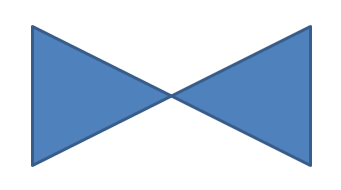

## **Overzicht**

Dit artikel legt uit hoe u presentatieshapes in Aspose.Slides kunt aanpassen door de vormgeometrie te bewerken via bewerkingspunten en geometriepaden. Het laat zien hoe u met `GeometryPath` kunt werken om bestaande shapes te wijzigen, basisbewerkingsbewerkingen op paden uit te voeren, punten toe te voegen of te verwijderen, en de bijgewerkte geometrie terug toe te passen op een shape.

Het laat ook zien hoe u aangepaste en samengestelde shapes kunt maken, shapes met afgeronde hoeken kunt bouwen, kunt bepalen of een shape‑geometrie gesloten is, en kunt converteren tussen `GeometryPath` en `java.awt.Shape` voor extra geometrie‑aanpassingsscenario's.

## **Een shape wijzigen met bewerkingspunten**
Beschouw een vierkant. In PowerPoint kunt u met **bewerkingpunten**:

* de hoek van het vierkant naar binnen of buiten verplaatsen
* de kromming van een hoek of punt specificeren
* nieuwe punten aan het vierkant toevoegen
* punten op het vierkant manipuleren, enz.

Kortom, u kunt deze handelingen uitvoeren op elke shape. Met bewerkingspunten kunt u een shape wijzigen of een nieuwe shape maken op basis van een bestaande shape. 

## **Tips voor shape‑bewerking**


Voordat u begint met het bewerken van PowerPoint shapes via bewerkingspunten, wilt u misschien rekening houden met de volgende punten over shapes:

* Een shape (of zijn pad) kan gesloten of geopend zijn.
* Wanneer een shape gesloten is, heeft hij geen begin‑ of eindpunt. Wanneer een shape geopend is, heeft hij een begin en een einde. 
* Alle shapes bestaan uit ten minste 2 ankerpunten die met elkaar verbonden zijn door lijnen
* Een lijn is recht of gebogen. Ankerpunten bepalen de aard van de lijn. 
* Ankerpunten komen voor als hoekpunten, rechte punten of soepele punten:
  * Een hoekpunt is een punt waar twee rechte lijnen onder een hoek samenkomen. 
  * Een soepel punt is een punt waar twee handvatten zich op een rechte lijn bevinden en de segmenten van de lijn elkaar in een vloeiende curve ontmoeten. In dit geval staan alle handvatten op gelijke afstand van het ankerpunt. 
  * Een recht punt is een punt waar twee handvatten zich op een rechte lijn bevinden en de segmenten van die lijn elkaar in een vloeiende curve ontmoeten. In dit geval hoeven de handvatten niet op gelijke afstand van het ankerpunt te staan. 
* Door ankerpunten te verplaatsen of te bewerken (wat de hoek van de lijnen wijzigt), kunt u de uitstraling van een shape wijzigen. 

Om PowerPoint‑shapes via bewerkingspunten te bewerken, biedt **Aspose.Slides** de [**GeometryPath**](https://reference.aspose.com/slides/nl/php-java/aspose.slides/GeometryPath)‑klasse.

* Een [GeometryPath](https://reference.aspose.com/slides/nl/php-java/aspose.slides/GeometryPath)‑instantie vertegenwoordigt een geometriepad van het [GeometryShape](https://reference.aspose.com/slides/nl/php-java/aspose.slides/geometryshape/)‑object.
* Om de `GeometryPath` uit de `GeometryShape`‑instantie op te halen, kunt u de [GeometryShape::getGeometryPaths](https://reference.aspose.com/slides/nl/php-java/aspose.slides/geometryshape/#getGeometryPaths)‑methode gebruiken.
* Om de `GeometryPath` voor een shape in te stellen, kunt u deze methoden gebruiken: [GeometryShape::setGeometryPath](https://reference.aspose.com/slides/nl/php-java/aspose.slides/geometryshape/#setGeometryPath) voor *solid shapes* en [GeometryShape::setGeometryPaths](https://reference.aspose.com/slides/nl/php-java/aspose.slides/geometryshape/#setGeometryPaths) voor *composite shapes*.
* Om segmenten toe te voegen, kunt u de methoden onder [GeometryPath](https://reference.aspose.com/slides/nl/php-java/aspose.slides/geometrypath/) gebruiken.
* Met de [GeometryPath::setStroke](https://reference.aspose.com/slides/nl/php-java/aspose.slides/geometrypath/setstroke/)‑ en [GeometryPath::setFillMode](https://reference.aspose.com/slides/nl/php-java/aspose.slides/geometrypath/setfillmode/)‑methoden kunt u het uiterlijk van een geometriepad instellen.
* Met de [GeometryPath::getPathData](https://reference.aspose.com/slides/nl/php-java/aspose.slides/geometrypath/getpathdata/)‑methode kunt u het geometriepad van een `GeometryShape` ophalen als een array van padsegmenten.
* Om extra opties voor shape‑geometrie‑aanpassing te benaderen, kunt u [GeometryPath](https://reference.aspose.com/slides/nl/php-java/aspose.slides/geometrypath/) converteren naar [java.awt.Shape](https://docs.oracle.com/javase/7/docs/api/php-java/awt/Shape.html)
* Gebruik [geometryPathToGraphicsPath](https://reference.aspose.com/slides/nl/php-java/aspose.slides/shapeutil/geometrypathtographicspath/) en [graphicsPathToGeometryPath](https://reference.aspose.com/slides/nl/php-java/aspose.slides/shapeutil/graphicspathtogeometrypath/) methoden (van de [ShapeUtil](https://reference.aspose.com/slides/nl/php-java/aspose.slides/ShapeUtil)‑klasse) om [GeometryPath](https://reference.aspose.com/slides/nl/php-java/aspose.slides/geometrypath/) naar [java.awt.Shape](https://docs.oracle.com/javase/7/docs/api/php-java/awt/Shape.html) en omgekeerd te converteren.

## **Eenvoudige bewerkingsbewerkingen**

**Voeg een lijn toe** aan het einde van een pad

```php

```
**Voeg een lijn toe** op een opgegeven positie op een pad:

```php

```
**Voeg een kubieke Bézier‑curve toe** aan het einde van een pad:

```php

```
**Voeg een kubieke Bézier‑curve toe** op de opgegeven positie op een pad:

```php

```
**Voeg een kwadratische Bézier‑curve toe** aan het einde van een pad:

```php

```
**Voeg een kwadratische Bézier‑curve toe** op de opgegeven positie op een pad:

```php

```
**Voeg een gegeven boog toe** aan een pad:

```php

```
**Sluit de huidige figuur** van een pad:

```php

```
**Stel de positie in voor het volgende punt:** 

```php

```
**Verwijder het padsegment** op een opgegeven index:

```php

```

## **Aangepaste punten aan een shape toevoegen**
1. Maak een instantie van de [GeometryShape](https://reference.aspose.com/slides/nl/php-java/aspose.slides/GeometryShape)‑klasse en stel het type [ShapeType::Rectangle](https://reference.aspose.com/slides/nl/php-java/aspose.slides/ShapeType) in.
2. Haal een instantie van de [GeometryPath](https://reference.aspose.com/slides/nl/php-java/aspose.slides/GeometryPath)‑klasse op uit de shape.
3. Voeg een nieuw punt toe tussen de twee bovenste punten op het pad.
4. Voeg een nieuw punt toe tussen de twee onderste punten op het pad.
5. Pas het pad toe op de shape.

Deze PHP‑code laat zien hoe u aangepaste punten aan een shape toevoegt:

```php
  $pres = new Presentation();
  try {
    $shape = $pres->getSlides()->get_Item(0)->getShapes()->addAutoShape(ShapeType::Rectangle, 100, 100, 200, 100);
    $geometryPath = $shape->getGeometryPaths()[0];
    $geometryPath->lineTo(100, 50, 1);
    $geometryPath->lineTo(100, 50, 4);
    $shape->setGeometryPath($geometryPath);
  } finally {
    if (!java_is_null($pres)) {
      $pres->dispose();
    }
  }
```


## **Punten van een shape verwijderen**

1. Maak een instantie van de [GeometryShape](https://reference.aspose.com/slides/nl/php-java/aspose.slides/GeometryShape)‑klasse en stel het type [ShapeType::Heart](https://reference.aspose.com/slides/nl/php-java/aspose.slides/ShapeType) in.
2. Haal een instantie van de [GeometryPath](https://reference.aspose.com/slides/nl/php-java/aspose.slides/GeometryPath)‑klasse op uit de shape.
3. Verwijder het segment van het pad.
4. Pas het pad toe op de shape.

Deze PHP‑code laat zien hoe u punten uit een shape verwijdert:

```php
  $pres = new Presentation();
  try {
    $shape = $pres->getSlides()->get_Item(0)->getShapes()->addAutoShape(ShapeType::Heart, 100, 100, 300, 300);
    $path = $shape->getGeometryPaths()[0];
    $path->removeAt(2);
    $shape->setGeometryPath($path);
  } finally {
    if (!java_is_null($pres)) {
      $pres->dispose();
    }
  }
```


## **Aangepaste shape maken**

1. Bereken de punten voor de shape.
2. Maak een instantie van de [GeometryPath](https://reference.aspose.com/slides/nl/php-java/aspose.slides/GeometryPath)‑klasse.
3. Vul het pad met de punten.
4. Maak een instantie van de [GeometryShape](https://reference.aspose.com/slides/nl/php-java/aspose.slides/GeometryShape)‑klasse.
5. Pas het pad toe op de shape.

Deze Java‑code laat zien hoe u een aangepaste shape maakt:

```php
  $points = new Java("java.util.ArrayList");
  $R = 100;
  $r = 50;
  $step = 72;
  for($angle = -90; $angle < 270; $angle += $step) {
    $radians = $angle * java("java.lang.Math")->PI / 180.0;
    $x = $R * java("java.lang.Math")->cos($radians);
    $y = $R * java("java.lang.Math")->sin($radians);
    $points->add(new Point2DFloat($x + $R, $y + $R));
    $radians = java("java.lang.Math")->PI * $angle . $step / 2 / 180.0;
    $x = $r * java("java.lang.Math")->cos($radians);
    $y = $r * java("java.lang.Math")->sin($radians);
    $points->add(new Point2DFloat($x + $R, $y + $R));
  }
  $starPath = new GeometryPath();
  $starPath->moveTo($points->get(0));
  for($i = 1; $i < java_values($points->size()) ; $i++) {
    $starPath->lineTo($points->get($i));
  }
  $starPath->closeFigure();
  $pres = new Presentation();
  try {
    $shape = $pres->getSlides()->get_Item(0)->getShapes()->addAutoShape(ShapeType::Rectangle, 100, 100, $R * 2, $R * 2);
    $shape->setGeometryPath($starPath);
  } finally {
    if (!java_is_null($pres)) {
      $pres->dispose();
    }
  }
```


## **Samengestelde aangepaste shape maken**

1. Maak een instantie van de [GeometryShape](https://reference.aspose.com/slides/nl/php-java/aspose.slides/GeometryShape)‑klasse.
2. Maak een eerste instantie van de [GeometryPath](https://reference.aspose.com/slides/nl/php-java/aspose.slides/GeometryPath)‑klasse.
3. Maak een tweede instantie van de [GeometryPath](https://reference.aspose.com/slides/nl/php-java/aspose.slides/GeometryPath)‑klasse.
4. Pas de paden toe op de shape.

Deze PHP‑code laat zien hoe u een samengestelde aangepaste shape maakt:

```php
  $pres = new Presentation();
  try {
    $shape = $pres->getSlides()->get_Item(0)->getShapes()->addAutoShape(ShapeType::Rectangle, 100, 100, 200, 100);
    $geometryPath0 = new GeometryPath();
    $geometryPath0->moveTo(0, 0);
    $geometryPath0->lineTo($shape->getWidth(), 0);
    $geometryPath0->lineTo($shape->getWidth(), $shape->getHeight() / 3);
    $geometryPath0->lineTo(0, $shape->getHeight() / 3);
    $geometryPath0->closeFigure();
    $geometryPath1 = new GeometryPath();
    $geometryPath1->moveTo(0, $shape->getHeight() / 3 * 2);
    $geometryPath1->lineTo($shape->getWidth(), $shape->getHeight() / 3 * 2);
    $geometryPath1->lineTo($shape->getWidth(), $shape->getHeight());
    $geometryPath1->lineTo(0, $shape->getHeight());
    $geometryPath1->closeFigure();
    $shape->setGeometryPaths(array($geometryPath0, $geometryPath1 ));
  } finally {
    if (!java_is_null($pres)) {
      $pres->dispose();
    }
  }
```


## **Aangepaste shape met afgeronde hoeken maken**

Deze PHP‑code laat zien hoe u een aangepaste shape met afgeronde hoeken (naar binnen) maakt;

```php
  $shapeX = 20.0;
  $shapeY = 20.0;
  $shapeWidth = 300.0;
  $shapeHeight = 200.0;
  $leftTopSize = 50.0;
  $rightTopSize = 20.0;
  $rightBottomSize = 40.0;
  $leftBottomSize = 10.0;
  $pres = new Presentation();
  try {
    $childShape = $pres->getSlides()->get_Item(0)->getShapes()->addAutoShape(ShapeType::Custom, $shapeX, $shapeY, $shapeWidth, $shapeHeight);
    $geometryPath = new GeometryPath();
    $point1 = new Point2DFloat($leftTopSize, 0);
    $point2 = new Point2DFloat($shapeWidth - $rightTopSize, 0);
    $point3 = new Point2DFloat($shapeWidth, $shapeHeight - $rightBottomSize);
    $point4 = new Point2DFloat($leftBottomSize, $shapeHeight);
    $point5 = new Point2DFloat(0, $leftTopSize);
    $geometryPath->moveTo($point1);
    $geometryPath->lineTo($point2);
    $geometryPath->arcTo($rightTopSize, $rightTopSize, 180, -90);
    $geometryPath->lineTo($point3);
    $geometryPath->arcTo($rightBottomSize, $rightBottomSize, -90, -90);
    $geometryPath->lineTo($point4);
    $geometryPath->arcTo($leftBottomSize, $leftBottomSize, 0, -90);
    $geometryPath->lineTo($point5);
    $geometryPath->arcTo($leftTopSize, $leftTopSize, 90, -90);
    $geometryPath->closeFigure();
    $childShape->setGeometryPath($geometryPath);
    $pres->save("output.pptx", SaveFormat::Pptx);
  } finally {
    if (!java_is_null($pres)) {
      $pres->dispose();
    }
  }
```

## **Nagaan of een shape‑geometrie gesloten is**

Een gesloten shape wordt gedefinieerd als een shape waarbij al zijn zijden met elkaar verbonden zijn, waardoor één omtrek ontstaat zonder gaten. Zo'n shape kan een eenvoudige geometrische vorm zijn of een complexe aangepaste omtrek. De volgende code‑voorbeeld laat zien hoe u kunt controleren of een shape‑geometrie gesloten is:

```php
function isGeometryClosed($geometryShape)
{
    $isClosed = null;

    foreach ($geometryShape->getGeometryPaths() as $geometryPath) {
        $dataLength = count(java_values($geometryPath->getPathData()));
        if ($dataLength === 0) {
            continue;
        }

        $lastSegment = java_values($geometryPath->getPathData())[$dataLength - 1];
        $isClosed = $lastSegment->getPathCommand() === PathCommandType::Close;

        if ($isClosed === false) {
            return false;
        }
    }

    return $isClosed === true;
}
```

## **GeometryPath converteren naar java.awt.Shape** 

1. Maak een instantie van de [GeometryShape](https://reference.aspose.com/slides/nl/php-java/aspose.slides/GeometryShape)‑klasse.
2. Maak een instantie van de [java.awt.Shape](https://docs.oracle.com/javase/7/docs/api/php-java/awt/Shape.html)‑klasse.
3. Converteer de [java.awt.Shape](https://docs.oracle.com/javase/7/docs/api/php-java/awt/Shape.html)‑instantie naar de [GeometryPath](https://reference.aspose.com/slides/nl/php-java/aspose.slides/GeometryPath)‑instantie met behulp van [ShapeUtil](https://reference.aspose.com/slides/nl/php-java/aspose.slides/ShapeUtil).
4. Pas de paden toe op de shape.

Deze PHP‑code – een implementatie van de bovenstaande stappen – demonstreert het conversieproces van **GeometryPath** naar **GraphicsPath**:

```php
  $pres = new Presentation();
  try {
    # Nieuwe shape maken
    $shape = $pres->getSlides()->get_Item(0)->getShapes()->addAutoShape(ShapeType::Rectangle, 100, 100, 300, 100);
    # Haal geometriepad op van de shape
    $originalPath = $shape->getGeometryPaths()[0];
    $originalPath->setFillMode(PathFillModeType::None);
    # Maak nieuw graphics path met tekst
    $graphicsPath;
    $font = new Font("Arial", Font->PLAIN, 40);
    $text = "Text in shape";
    $img = new BufferedImage(100, 100, BufferedImage->TYPE_INT_ARGB);
    $g2 = $img->createGraphics();
    try {
      $glyphVector = $font->createGlyphVector($g2->getFontRenderContext(), $text);
      $graphicsPath = $glyphVector->getOutline(20.0, -$glyphVector->getVisualBounds()->getY() + 10);
    } finally {
      $g2->dispose();
    }
    # Converteer graphics path naar geometry path
    $textPath = ShapeUtil->graphicsPathToGeometryPath($graphicsPath);
    $textPath->setFillMode(PathFillModeType::Normal);
    # Stel combinatie van nieuw geometry path en origineel geometry path in op de shape
    $shape->setGeometryPaths(array($originalPath, $textPath ));
  } finally {
    if (!java_is_null($pres)) {
      $pres->dispose();
    }
  }
```


## **FAQ**

**Wat gebeurt er met de vulling en omtrek nadat de geometrie is vervangen?**

De stijl blijft behouden bij de shape; alleen de contour verandert. De vulling en omtrek worden automatisch toegepast op de nieuwe geometrie.

**Hoe roteer ik een aangepaste shape correct samen met zijn geometrie?**

Gebruik de [setRotation](https://reference.aspose.com/slides/nl/php-java/aspose.slides/shape/setrotation/)‑methode van de shape; de geometrie roteert mee met de shape omdat deze gebonden is aan het eigen coördinatensysteem van de shape.

**Kan ik een aangepaste shape converteren naar een afbeelding om het resultaat 'vast te leggen'?**

Ja. Exporteer het benodigde [slide](/slides/nl/php-java/convert-powerpoint-to-png/)‑gebied of de [shape](/slides/nl/php-java/create-shape-thumbnails/) zelf naar een rasterformaat; dit vereenvoudigt vervolgwerk met zware geometrieën.