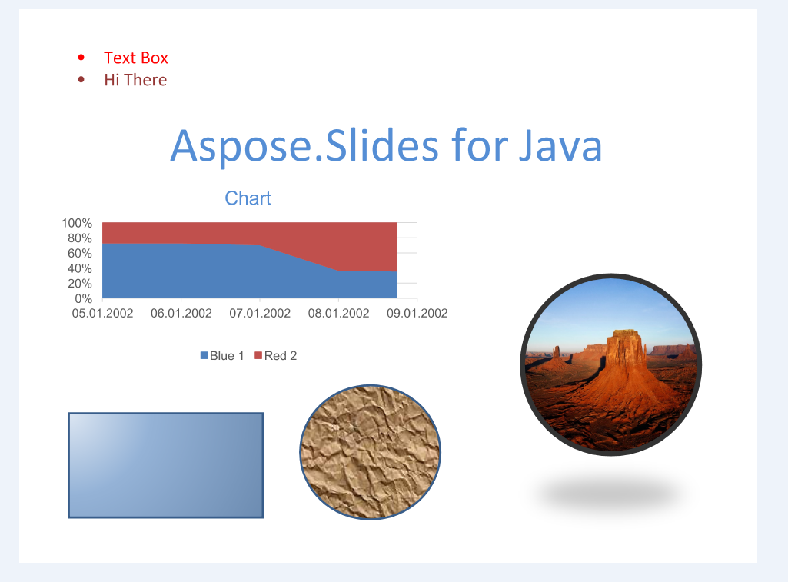

## **Over TIFF**

Het [Tagged Image File Format](https://en.wikipedia.org/wiki/TIFF) die bekend staat om het opslaan van meerdere afbeeldingen in één document, werd oorspronkelijk gemaakt door Aldus. Dit formaat wordt breed ondersteund door scannen, faxen en andere beeldbewerkingsapplicaties.

## **TIFF in Aspose.Slides voor PHP via Java**

Elk document dat kan worden geladen in Aspose.Slide for Java kan ook rechtstreeks worden geconverteerd naar een TIFF‑document door Aspose.Slides for PHP via Java, waardoor de noodzaak van een component van derden wordt geëlimineerd. Verder kunt u optioneel de afmetingen van de afbeeldingen in het resulterende TIFF‑document definiëren. U kunt informatie vinden over het exporteren van presentatiedocumenten naar TIFF‑documenten via Aspose.Slides for PHP via Java in [this topic](/slides/nl/php-java/convert-powerpoint-to-tiff/).

**Een presentatiedocument omgezet naar een TIFF‑document via Aspose.Slides for PHP via Java**

 **