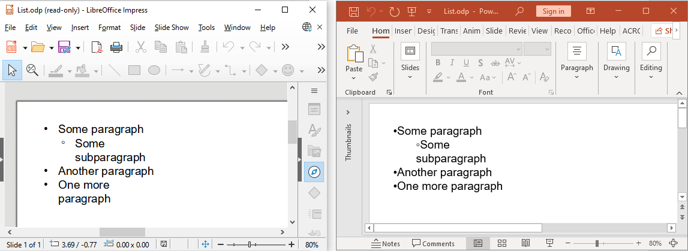

## **Inleiding**

Aspose.Slides for Python via Java stelt u in staat OpenDocument‑presentaties (ODP) te converteren naar formaten zoals PDF, HTML, TIFF, XPS, PPT en PPTX. ODP‑conversie maakt gebruik van dezelfde API als PowerPoint‑conversie: laad het bronbestand met [Presentation](https://reference.aspose.com/slides/nl/python-java/aspose.slides/presentation/) en selecteer het uitvoerformaat met [SaveFormat](https://reference.aspose.com/slides/nl/python-java/aspose.slides/saveformat/).

## **ODP naar PDF converteren**

Volg de [installatie‑instructies](/slides/nl/python-java/installation/) voordat u het voorbeeld uitvoert. Plaats een ODP‑presentatie met de naam `pres.odp` in de werkmap. De volgende code start de JVM indien nodig, laadt de presentatie en slaat deze op als `pres.pdf`.

```python
import jpype
import asposeslides

if not jpype.isJVMStarted():
    jpype.startJVM()

from asposeslides.api import Presentation, SaveFormat

presentation = Presentation("pres.odp")
try:
    presentation.save("pres.pdf", SaveFormat.Pdf)
finally:
    presentation.dispose()
```

## **OpenDocument‑presentatie in verschillende applicaties**

Een ODP‑presentatie kan er anders uitzien in PowerPoint en LibreOffice/OpenOffice Impress omdat deze applicaties verschillende presentatiefuncties en renderingsgedragingen ondersteunen. Controleer geconverteerde presentaties wanneer hun lay‑out afhangt van complexe opmaak.

Compatibiliteitsverschillen kunnen van invloed zijn op:

- Tabellen, inclusief hun stapelvolgorde ten opzichte van andere vormen en ondersteuning voor afbeeldingvullingen.
- Tekstrotatie en -uitlijning.
- Afbeeldings-, gradient‑ en patroonvullingen toegepast op tekst.
- Genummerde en opsommingstekens‑lijsten.

De afbeelding hieronder toont een lijst die is gemaakt in LibreOffice Impress:



Aspose.Slides slaat ODP‑lijsten op voor compatibiliteit met LibreOffice/OpenOffice Impress.

Voor details over functievereenvoud, zie [Microsoft‑handleiding voor het OpenDocument‑presentatieformaat](https://support.microsoft.com/en-us/office/use-powerpoint-to-save-or-open-a-presentation-in-the-opendocument-presentation-odp-format-94805e84-1b09-4c98-a8b5-0da2a52242a0).

## **Veelgestelde vragen**

**Wat gebeurt er als de opmaak van mijn ODP‑bestand verandert na conversie?**

ODP en PowerPoint gebruiken verschillende presentatiemodellen. Tabellen, lettertypen en vulstijlen kunnen anders worden weergegeven. Controleer of de benodigde lettertypen beschikbaar zijn, bekijk de output en pas de lay‑out of opmaak aan indien nodig.

**Heb ik OpenOffice of LibreOffice geïnstalleerd nodig om ODP‑bestanden te converteren?**

Nee. Aspose.Slides for Python via Java verwerkt presentaties zonder een van beide applicaties. Een compatibele Java‑runtime en het Python‑pakket zijn vereist.

**Kan ik de PDF‑output aanpassen bij het converteren van een ODP‑presentatie?**

Ja. Gebruik [PdfOptions](https://reference.aspose.com/slides/nl/python-java/aspose.slides/pdfoptions/) om PDF‑exportinstellingen te configureren, zoals beeldkwaliteit en compressie.

**Kan ik ODP‑presentaties op een server of in een container converteren?**

Ja. Installeer het Python‑pakket, een compatibele Java‑runtime en de lettertypen die uw presentaties nodig hebben in de doelomgeving. Er is geen kantoorapplicatie nodig.