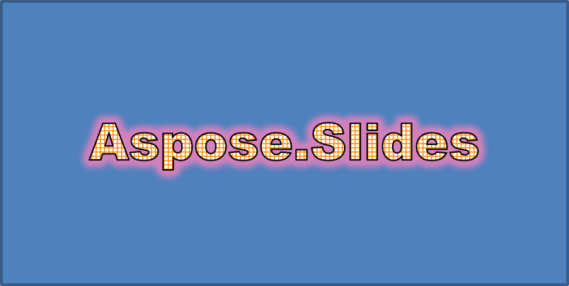

## **Overzicht**

WordArt-effecten laten u tekst opmaken met vullingen, contouren, schaduwen, reflecties, gloed, transformaties en 3D-opmaak. Dit artikel legt uit hoe u deze effecten kunt maken en aanpassen in PowerPoint‑presentaties met Aspose.Slides for Python via Java, zonder dat Microsoft Office geïnstalleerd is.

## **Maak een eenvoudige WordArt‑sjabloon en pas deze toe op tekst**

De volgende voorbeelden maken een eenvoudige WordArt‑stijl door de tekst, het lettertype, de patroonvulling en de contour in te stellen.

Elke voorbeeld maakt een nieuwe presentatie aan en voegt een rechthoek toe aan de eerste dia; er is geen invoerbestand nodig. Het eerste voorbeeld stelt de tekst in op “Aspose.Slides”. De positie en afmetingen van de vorm worden gemeten in points:

```python
import jpype
import asposeslides

if not jpype.isJVMStarted():
    jpype.startJVM()

from asposeslides.api import Presentation, ShapeType

presentation = Presentation()
try:
    slide = presentation.getSlides().get_Item(0)

    auto_shape = slide.getShapes().addAutoShape(ShapeType.Rectangle, 20, 20, 400, 200)
    text_frame = auto_shape.getTextFrame()

    portion = text_frame.getParagraphs().get_Item(0).getPortions().get_Item(0)
    portion.setText("Aspose.Slides")
finally:
    presentation.dispose()
```

Stel het lettertype in op Arial Black van 36 points om de opmaak beter zichtbaar te maken:

```python
import jpype
import asposeslides

if not jpype.isJVMStarted():
    jpype.startJVM()

from asposeslides.api import FontData, Presentation, ShapeType

presentation = Presentation()
try:
    slide = presentation.getSlides().get_Item(0)

    auto_shape = slide.getShapes().addAutoShape(ShapeType.Rectangle, 20, 20, 400, 200)

    portion = auto_shape.getTextFrame().getParagraphs().get_Item(0).getPortions().get_Item(0)
    portion.setText("Aspose.Slides")
    font = FontData("Arial Black")
    portion.getPortionFormat().setLatinFont(font)
    portion.getPortionFormat().setFontHeight(36)
finally:
    presentation.dispose()
```

Pas een [SmallGrid](https://reference.aspose.com/slides/nl/python-java/aspose.slides/patternstyle/#SmallGrid) patroon toe met een donkeroranje voorgrond en een witte achtergrond, en voeg vervolgens een zwarte tekstcontour toe met een breedte van 1 point:

```python
import jpype
import asposeslides

if not jpype.isJVMStarted():
    jpype.startJVM()

from asposeslides.api import FillType, FontData, PatternStyle, Presentation, ShapeType
from java.awt import Color

presentation = Presentation()
try:
    slide = presentation.getSlides().get_Item(0)

    auto_shape = slide.getShapes().addAutoShape(ShapeType.Rectangle, 20, 20, 400, 200)

    portion = auto_shape.getTextFrame().getParagraphs().get_Item(0).getPortions().get_Item(0)
    portion.setText("Aspose.Slides")
    font = FontData("Arial Black")
    portion.getPortionFormat().setLatinFont(font)
    portion.getPortionFormat().setFontHeight(36)

    portion.getPortionFormat().getFillFormat().setFillType(FillType.Pattern)
    dark_orange = Color(255, 140, 0)
    portion.getPortionFormat().getFillFormat().getPatternFormat().getForeColor().setColor(dark_orange)
    portion.getPortionFormat().getFillFormat().getPatternFormat().getBackColor().setColor(Color.WHITE)
    portion.getPortionFormat().getFillFormat().getPatternFormat().setPatternStyle(PatternStyle.SmallGrid)

    portion.getPortionFormat().getLineFormat().setWidth(1)
    portion.getPortionFormat().getLineFormat().getFillFormat().setFillType(FillType.Solid)
    portion.getPortionFormat().getLineFormat().getFillFormat().getSolidFillColor().setColor(Color.BLACK)
finally:
    presentation.dispose()
```

De resulterende tekst:


## **Andere WordArt‑effecten toepassen**

De volgende voorbeelden tonen hoe u schaduwen, reflecties, gloed, transformaties en 3D‑effecten op tekst kunt toepassen.

### **Buitenste schaduweffecten toepassen**

Een buitenste schaduw voegt diepte toe door een schaduw achter de tekst te plaatsen. U kunt de kleur, richting, afstand, vervagingsradius, schaal en scheefstand aanpassen.

Dit voorbeeld roept [enableOuterShadowEffect](https://reference.aspose.com/slides/nl/python-java/aspose.slides/effectformat/#enableOuterShadowEffect) aan en stelt een zwarte schaduw in met een vervagingsradius van 4 points, een richting van 230 graad en een afstand van 30 points. Schaalwaarden van 100 behouden de schaduwgrootte, terwijl horizontale scheefstand deze met 20 graad kantelt. De alfa‑transformatie zet de doorzichtigheid op 32 %:

```python
import jpype
import asposeslides

if not jpype.isJVMStarted():
    jpype.startJVM()

from asposeslides.api import ColorTransformOperation, FontData, Presentation, ShapeType
from java.awt import Color

presentation = Presentation()
try:
    slide = presentation.getSlides().get_Item(0)

    auto_shape = slide.getShapes().addAutoShape(ShapeType.Rectangle, 20, 20, 400, 200)

    portion = auto_shape.getTextFrame().getParagraphs().get_Item(0).getPortions().get_Item(0)
    portion.setText("Aspose.Slides")
    font = FontData("Arial Black")
    portion.getPortionFormat().setLatinFont(font)
    portion.getPortionFormat().setFontHeight(36)

    portion.getPortionFormat().getEffectFormat().enableOuterShadowEffect()
    portion.getPortionFormat().getEffectFormat().getOuterShadowEffect().getShadowColor().setColor(Color.BLACK)
    portion.getPortionFormat().getEffectFormat().getOuterShadowEffect().setScaleHorizontal(100)
    portion.getPortionFormat().getEffectFormat().getOuterShadowEffect().setScaleVertical(100)
    portion.getPortionFormat().getEffectFormat().getOuterShadowEffect().setBlurRadius(4)
    portion.getPortionFormat().getEffectFormat().getOuterShadowEffect().setDirection(230)
    portion.getPortionFormat().getEffectFormat().getOuterShadowEffect().setDistance(30)
    portion.getPortionFormat().getEffectFormat().getOuterShadowEffect().setSkewHorizontal(20)
    portion.getPortionFormat().getEffectFormat().getOuterShadowEffect().setSkewVertical(0)
    portion.getPortionFormat().getEffectFormat().getOuterShadowEffect().getShadowColor().getColorTransform().add(ColorTransformOperation.SetAlpha, 0.32)
finally:
    presentation.dispose()
```

De resulterende tekst:


{}
- Wanneer buitenste en vooraf ingestelde schaduwen samen worden gebruikt, wordt alleen de buitenste schaduw toegepast.
- Als buitenste en binnenste schaduwen gelijktijdig worden gebruikt, hangt het uiteindelijke effect af van de PowerPoint‑versie. Bijvoorbeeld, in PowerPoint 2013 wordt het effect verdubbeld, terwijl in PowerPoint 2007 alleen de buitenste schaduw wordt toegepast.
{}

### **Reflectie‑effecten toepassen**

Een reflectie maakt een gespiegeld exemplaar van de tekst. Pas positie, schaal, vervaging en doorzichtigheid aan om het uiterlijk te regelen.

Dit voorbeeld roept [enableReflectionEffect](https://reference.aspose.com/slides/nl/python-java/aspose.slides/effectformat/#enableReflectionEffect) aan en draait de reflectie verticaal met een schaal van -100 %. Het gebruikt een vervagingsradius van 0,5 points en een afstand van 4,72 points. De doorzichtigheid daalt van 60 % naar 0,9 % tussen posities 0 % en 60 % langs de reflectie:

```python
import jpype
import asposeslides

if not jpype.isJVMStarted():
    jpype.startJVM()

from asposeslides.api import FontData, Presentation, RectangleAlignment, ShapeType

presentation = Presentation()
try:
    slide = presentation.getSlides().get_Item(0)

    auto_shape = slide.getShapes().addAutoShape(ShapeType.Rectangle, 20, 20, 400, 200)

    portion = auto_shape.getTextFrame().getParagraphs().get_Item(0).getPortions().get_Item(0)
    portion.setText("Aspose.Slides")
    font = FontData("Arial Black")
    portion.getPortionFormat().setLatinFont(font)
    portion.getPortionFormat().setFontHeight(36)

    portion.getPortionFormat().getEffectFormat().enableReflectionEffect()
    portion.getPortionFormat().getEffectFormat().getReflectionEffect().setBlurRadius(0.5)
    portion.getPortionFormat().getEffectFormat().getReflectionEffect().setDistance(4.72)
    portion.getPortionFormat().getEffectFormat().getReflectionEffect().setStartPosAlpha(0)
    portion.getPortionFormat().getEffectFormat().getReflectionEffect().setEndPosAlpha(60)
    portion.getPortionFormat().getEffectFormat().getReflectionEffect().setDirection(90)
    portion.getPortionFormat().getEffectFormat().getReflectionEffect().setScaleHorizontal(100)
    portion.getPortionFormat().getEffectFormat().getReflectionEffect().setScaleVertical(-100)
    portion.getPortionFormat().getEffectFormat().getReflectionEffect().setStartReflectionOpacity(60)
    portion.getPortionFormat().getEffectFormat().getReflectionEffect().setEndReflectionOpacity(0.9)
    portion.getPortionFormat().getEffectFormat().getReflectionEffect().setRectangleAlign(RectangleAlignment.BottomLeft)
finally:
    presentation.dispose()
```

De resulterende tekst:


### **Gloefeffecten toepassen**

Een gloed voegt een zachte gekleurde contour rond de tekst toe. Pas kleur, doorzichtigheid en radius aan om het effect te regelen.

Dit voorbeeld roept [enableGlowEffect](https://reference.aspose.com/slides/nl/python-java/aspose.slides/effectformat/#enableGlowEffect) aan en past een rode gloed toe met 54 % doorzichtigheid en een radius van 7 points:

```python
import jpype
import asposeslides

if not jpype.isJVMStarted():
    jpype.startJVM()

from asposeslides.api import ColorTransformOperation, FontData, Presentation, ShapeType
from java.awt import Color

presentation = Presentation()
try:
    slide = presentation.getSlides().get_Item(0)

    auto_shape = slide.getShapes().addAutoShape(ShapeType.Rectangle, 20, 20, 400, 200)

    portion = auto_shape.getTextFrame().getParagraphs().get_Item(0).getPortions().get_Item(0)
    portion.setText("Aspose.Slides")
    font = FontData("Arial Black")
    portion.getPortionFormat().setLatinFont(font)
    portion.getPortionFormat().setFontHeight(36)

    portion.getPortionFormat().getEffectFormat().enableGlowEffect()
    portion.getPortionFormat().getEffectFormat().getGlowEffect().getColor().setColor(Color.RED)
    portion.getPortionFormat().getEffectFormat().getGlowEffect().getColor().getColorTransform().add(ColorTransformOperation.SetAlpha, 0.54)
    portion.getPortionFormat().getEffectFormat().getGlowEffect().setRadius(7)
finally:
    presentation.dispose()
```

De resulterende tekst:



### **WordArt‑transformaties toepassen**

WordArt‑transformaties buigen, rekken of vervormen een blok tekst.

Stel [setTransform](https://reference.aspose.com/slides/nl/python-java/aspose.slides/textframeformat/#setTransform) in op [ArchUpPour](https://reference.aspose.com/slides/nl/python-java/aspose.slides/textshapetype/#ArchUpPour) om het gehele tekstkader omhoog te buigen:

```python
import jpype
import asposeslides

if not jpype.isJVMStarted():
    jpype.startJVM()

from asposeslides.api import Presentation, ShapeType, TextShapeType

presentation = Presentation()
try:
    slide = presentation.getSlides().get_Item(0)

    auto_shape = slide.getShapes().addAutoShape(ShapeType.Rectangle, 20, 20, 400, 200)

    text_frame = auto_shape.getTextFrame()
    text_frame.setText("Aspose.Slides")
    text_frame.getTextFrameFormat().setTransform(TextShapeType.ArchUpPour)
finally:
    presentation.dispose()
```

De resulterende tekst:


{}
Aspose.Slides for Python via Java biedt een set vooraf gedefinieerde [transformation types](https://reference.aspose.com/slides/nl/python-java/aspose.slides/textshapetype/).
{}

### **3D‑effecten toepassen op vormen en tekst**

U kunt 3D‑effecten toepassen op een vorm of op de tekst ervan. Afgeschuinde randen, extrusie, verlichting en camerainstellingen bepalen het uiteindelijke uiterlijk.

Het volgende voorbeeld gebruikt [ThreeDFormat](https://reference.aspose.com/slides/nl/python-java/aspose.slides/threedformat/) om ronde afschuiningen, een oranje extrusie en een donkerrode omtrek aan de rechthoek toe te voegen. Afmetingen van de afschuining, extrusiehoogte, omtrekbreedte en diepte worden gemeten in points. Een plastic materiaal, gebalanceerde verlichting die 40 graad rond de Z‑as draait, en een perspectiefcamera definiëren het uiterlijk:

```python
import jpype
import asposeslides

if not jpype.isJVMStarted():
    jpype.startJVM()

from asposeslides.api import BevelPresetType, CameraPresetType, LightRigPresetType, LightingDirection, MaterialPresetType, Presentation, ShapeType
from java.awt import Color

presentation = Presentation()
try:
    slide = presentation.getSlides().get_Item(0)

    auto_shape = slide.getShapes().addAutoShape(ShapeType.Rectangle, 20, 20, 400, 200)
    auto_shape.getTextFrame().setText("Aspose.Slides")

    auto_shape.getThreeDFormat().getBevelBottom().setBevelType(BevelPresetType.Circle)
    auto_shape.getThreeDFormat().getBevelBottom().setHeight(10.5)
    auto_shape.getThreeDFormat().getBevelBottom().setWidth(10.5)

    auto_shape.getThreeDFormat().getBevelTop().setBevelType(BevelPresetType.Circle)
    auto_shape.getThreeDFormat().getBevelTop().setHeight(12.5)
    auto_shape.getThreeDFormat().getBevelTop().setWidth(11)

    orange = Color(255, 165, 0)
    auto_shape.getThreeDFormat().getExtrusionColor().setColor(orange)
    auto_shape.getThreeDFormat().setExtrusionHeight(6)

    dark_red = Color(139, 0, 0)
    auto_shape.getThreeDFormat().getContourColor().setColor(dark_red)
    auto_shape.getThreeDFormat().setContourWidth(1.5)

    auto_shape.getThreeDFormat().setDepth(3)

    auto_shape.getThreeDFormat().setMaterial(MaterialPresetType.Plastic)

    auto_shape.getThreeDFormat().getLightRig().setDirection(LightingDirection.Top)
    auto_shape.getThreeDFormat().getLightRig().setLightType(LightRigPresetType.Balanced)
    auto_shape.getThreeDFormat().getLightRig().setRotation(0, 0, 40)

    auto_shape.getThreeDFormat().getCamera().setCameraType(CameraPresetType.PerspectiveContrastingRightFacing)
finally:
    presentation.dispose()
```

De resulterende vorm:


Dit voorbeeld past een vergelijkbare 3D‑opmaak toe op de tekst via [TextFrameFormat.getThreeDFormat](https://reference.aspose.com/slides/nl/python-java/aspose.slides/textframeformat/#getThreeDFormat). Kleinere afschuiningen vormen de letterranden, terwijl extrusie en verlichting de tekst diepte geven:

```python
import jpype
import asposeslides

if not jpype.isJVMStarted():
    jpype.startJVM()

from asposeslides.api import BevelPresetType, CameraPresetType, LightRigPresetType, LightingDirection, MaterialPresetType, Presentation, ShapeType
from java.awt import Color

presentation = Presentation()
try:
    slide = presentation.getSlides().get_Item(0)

    auto_shape = slide.getShapes().addAutoShape(ShapeType.Rectangle, 20, 20, 400, 200)
    text_frame = auto_shape.getTextFrame()
    text_frame.setText("Aspose.Slides")

    text_frame.getTextFrameFormat().getThreeDFormat().getBevelBottom().setBevelType(BevelPresetType.Circle)
    text_frame.getTextFrameFormat().getThreeDFormat().getBevelBottom().setHeight(3.5)
    text_frame.getTextFrameFormat().getThreeDFormat().getBevelBottom().setWidth(3.5)

    text_frame.getTextFrameFormat().getThreeDFormat().getBevelTop().setBevelType(BevelPresetType.Circle)
    text_frame.getTextFrameFormat().getThreeDFormat().getBevelTop().setHeight(4)
    text_frame.getTextFrameFormat().getThreeDFormat().getBevelTop().setWidth(4)

    orange = Color(255, 165, 0)
    text_frame.getTextFrameFormat().getThreeDFormat().getExtrusionColor().setColor(orange)
    text_frame.getTextFrameFormat().getThreeDFormat().setExtrusionHeight(6)

    dark_red = Color(139, 0, 0)
    text_frame.getTextFrameFormat().getThreeDFormat().getContourColor().setColor(dark_red)
    text_frame.getTextFrameFormat().getThreeDFormat().setContourWidth(1.5)

    text_frame.getTextFrameFormat().getThreeDFormat().setDepth(3)

    text_frame.getTextFrameFormat().getThreeDFormat().setMaterial(MaterialPresetType.Plastic)

    text_frame.getTextFrameFormat().getThreeDFormat().getLightRig().setDirection(LightingDirection.Top)
    text_frame.getTextFrameFormat().getThreeDFormat().getLightRig().setLightType(LightRigPresetType.Balanced)
    text_frame.getTextFrameFormat().getThreeDFormat().getLightRig().setRotation(0, 0, 40)

    text_frame.getTextFrameFormat().getThreeDFormat().getCamera().setCameraType(CameraPresetType.PerspectiveContrastingRightFacing)
finally:
    presentation.dispose()
```

De resulterende tekst:


{}
Het toepassen van 3D‑effecten op tekst of op hun vormen – en de interactie tussen deze effecten – wordt beheerst door specifieke regels. Beschouw een scène die zowel tekst als de bijbehorende vorm omvat. Een 3D‑effect omvat de 3D‑representatie van het object en de scène waarin het geplaatst wordt.

- Als een scène is ingesteld voor zowel de vorm als de tekst, heeft de scène van de vorm voorrang en wordt de scène van de tekst genegeerd.
- Als de vorm zelf geen scène heeft maar wel een 3D‑representatie, wordt de scène van de tekst gebruikt.
- Als de vorm helemaal geen 3D‑effect heeft, wordt deze als plat behandeld en wordt het 3D‑effect alleen op de tekst toegepast.

Deze gedragingen hebben betrekking op de methoden [ThreeDFormat.getLightRig](https://reference.aspose.com/slides/nl/python-java/aspose.slides/threedformat/#getLightRig) en [ThreeDFormat.getCamera](https://reference.aspose.com/slides/nl/python-java/aspose.slides/threedformat/#getCamera).
{}

Om tekst plat en goed leesbaar te houden terwijl de 3D‑opmaak van de vorm behouden blijft, zie [Keep Text Flat on a 3D Shape](/slides/nl/python-java/3d-presentation/) voor een vergelijking van beide instellingen en een compleet Python‑voorbeeld.

## **FAQ**

**Kan ik WordArt‑effecten gebruiken met verschillende lettertypen of scripts (bijv. Arabisch, Chinees)?**

Ja, Aspose.Slides for Python via Java ondersteunt Unicode en werkt met alle gangbare lettertypen en scripts. WordArt‑effecten zoals schaduw, vulling en contour kunnen worden toegepast ongeacht de taal, hoewel de beschikbaarheid van lettertypen en de weergave kunnen afhangen van de systeemlettertypen.

**Kan ik WordArt‑effecten toepassen op elementen van de masterdia?**

Ja, u kunt WordArt‑effecten toepassen op vormen in masterdia’s, inclusief titelfuncties, voetteksten of achtergrondtekst. Wijzigingen in de masterlayout worden doorgevoerd in alle gekoppelde dia’s.

**Beïnvloeden WordArt‑effecten de bestandsgrootte van de presentatie?**

Een beetje. WordArt‑effecten zoals schaduwen, gloed en gradientvullingen kunnen de bestandsgrootte iets verhogen door toegevoegde formatteringsmetadata, maar het verschil is doorgaans verwaarloosbaar.

**Kan ik het resultaat van WordArt‑effecten bekijken zonder de presentatie op te slaan?**

Ja, u kunt dia’s met WordArt renderen naar afbeeldingen (bijv. PNG, JPEG) met behulp van [Slide.getImage](https://reference.aspose.com/slides/nl/python-java/aspose.slides/slide/#getImage), of individuele vormen renderen met [Shape.getImage](https://reference.aspose.com/slides/nl/python-java/aspose.slides/shape/#getImage). Hiermee kunt u het resultaat in het geheugen of op scherm bekijken voordat u de volledige presentatie opslaat of exporteert.