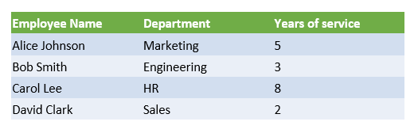

## **Inleiding**

PowerPoint‑presentaties zijn een krachtige manier om informatie weer te geven en te communiceren. Ze worden vaak samen met Excel‑werkboeken gebruikt, waarbij Excel een uitstekende bron van gestructureerde gegevens levert en PowerPoint die gegevens voor een publiek visualiseert.

Er zijn veel praktische scenario’s waarin het combineren van Excel en PowerPoint essentieel is: postverzendingen, het vullen van datatabellen, het genereren van één dia per gegevensrecord (batch‑dia‑generatie), het maken van trainingsmateriaal en het samenvoegen van meerdere Excel‑rapporten tot één presentatie, om er maar een paar te noemen.

Tot nu toe vereist het implementeren van zulke functionaliteit met de Aspose.Slides‑API het gebruik van derden‑oplossingen zoals Aspose.Cells. Hoewel deze tools robuust zijn, kunnen ze te complex en duur zijn voor gebruikers die alleen basis‑integratie van gegevens nodig hebben.

## **Hoe het werkt**

Om het werken met Excel‑gegevens makkelijker en gestroomlijnder te maken, heeft Aspose.Slides nieuwe klassen geïntroduceerd om gegevens uit Excel‑werkboeken te lezen en inhoud in een presentatie te importeren. Deze functie opent krachtige nieuwe mogelijkheden voor API‑gebruikers die Excel als gegevensbron in hun presentatie‑workflows willen benutten.

De nieuwe functionaliteit is bedoeld voor algemeen gegevens‑toegang en is niet geïntegreerd in het Presentation Document Object Model (DOM). Dat betekent dat *het niet toestaat Excel‑bestanden te bewerken of op te slaan* — het enige doel is werkboeken te openen en door hun inhoud te navigeren om celgegevens op te halen.

De kern van deze functie is de nieuwe [ExcelDataWorkbook](https://reference.aspose.com/slides/nl/python-java/aspose.slides/exceldataworkbook/)‑klasse. Deze klasse stelt u in staat een Excel‑werkboek te laden vanuit een lokaal bestand of een stream. Eenmaal geladen biedt ze verschillende overloads van de [ExcelDataWorkbook.getCell](https://reference.aspose.com/slides/nl/python-java/aspose.slides/exceldataworkbook/#getCell)‑methode, waarmee u specifieke cellen kunt ophalen op basis van hun positie (bijv. rij‑ en kolom‑indexen of benoemde bereiken).

Elke oproep naar [ExcelDataWorkbook.getCell](https://reference.aspose.com/slides/nl/python-java/aspose.slides/exceldataworkbook/#getCell) retourneert een [ExcelDataCell](https://reference.aspose.com/slides/nl/python-java/aspose.slides/exceldatacell/)‑object. Dit object vertegenwoordigt een enkele cel in het Excel‑werkboek en biedt u toegang tot de waarde op een eenvoudige en intuïtieve manier.

#### **Een Excel‑diagram importeren**

De volgende stap om de functionaliteit uit te breiden is de [ExcelWorkbookImporter](https://reference.aspose.com/slides/nl/python-java/aspose.slides/excelworkbookimporter/)‑klasse. Deze hulpprogrammaklasse beschikt over functionaliteit om inhoud uit een Excel‑werkboek in een presentatie te importeren. Ze bevat verschillende overloads van de [ExcelWorkbookImporter.addChartFromWorkbook](https://reference.aspose.com/slides/nl/python-java/aspose.slides/excelworkbookimporter/#addChartFromWorkbook)‑methode, waarmee u het geselecteerde diagram uit het opgegeven Excel‑werkboek kunt ophalen en aan het einde van de opgegeven vormcollectie kunt toevoegen op de opgegeven coördinaten.

#### **Een Excel‑tabel importeren**

De [ExcelWorkbookImporter](https://reference.aspose.com/slides/nl/python-java/aspose.slides/excelworkbookimporter/)‑klasse bevat ook verschillende overloads van de [ExcelWorkbookImporter.addTableFromWorkbook](https://reference.aspose.com/slides/nl/python-java/aspose.slides/excelworkbookimporter/#addTableFromWorkbook)‑methode. Deze methoden stellen u in staat een opgegeven celbereik van een opgegeven werkblad te importeren en als tabel toe te voegen aan het einde van de opgegeven vormcollectie op de opgegeven coördinaten.

Kortom, het is een lichte en rechttoe‑ree beta API voor het lezen van Excel‑gegevens — precies wat veel ontwikkelaars nodig hebben zonder de overhead van een volledige spreadsheet‑verwerkingsbibliotheek.

## **Laten we coderen**

### **Voorbeeld van een postverzending‑scenario**

In het volgende voorbeeld implementeren we een eenvoudig postverzending‑scenario door meerdere presentaties te genereren op basis van gegevens die zijn opgeslagen in een Excel‑werkboek.

Om te beginnen hebben we twee dingen nodig:

1. Een Excel‑werkboek met de gegevens


2. Een PowerPoint‑presentatiesjabloon


```python
import jpype
import asposeslides

if not jpype.isJVMStarted():
    jpype.startJVM()

from asposeslides.api import ExcelDataWorkbook, Presentation, SaveFormat

# Laad het Excel-werkboek met personeelsgegevens.
workbook = ExcelDataWorkbook("TemplateData.xlsx")
worksheet_index = 0

# Laad de presentatie-sjabloon.
template_presentation = Presentation("PresentationTemplate.pptx")

try:
    # Doorloop de Excel-rijen (exclusief de header op rij 0).
    for row_index in range(1, 5):

        # Maak een presentatie voor elk personeelsrecord.
        employee_presentation = Presentation()

        try:
            # Verwijder de standaard lege dia.
            employee_presentation.getSlides().removeAt(0)

            # Kloon de sjabloondia naar de presentatie.
            slide = employee_presentation.getSlides().addClone(template_presentation.getSlides().get_Item(0))

            # Haal de alinea's op uit de doelvorm (aangenomen dat vorm-index 1 wordt gebruikt).
            paragraphs = slide.getShapes().get_Item(1).getTextFrame().getParagraphs()

            # Vervang de tijdelijke aanduidingen door gegevens uit Excel.
            employee_name = str(workbook.getCell(worksheet_index, row_index, 0).getValue())
            name_portion = paragraphs.get_Item(0).getPortions().get_Item(0)
            name_portion.setText(str(name_portion.getText()).replace("{{EmployeeName}}", employee_name))

            department = str(workbook.getCell(worksheet_index, row_index, 1).getValue())
            department_portion = paragraphs.get_Item(1).getPortions().get_Item(0)
            department_portion.setText(str(department_portion.getText()).replace("{{Department}}", department))

            years_of_service = str(workbook.getCell(worksheet_index, row_index, 2).getValue())
            years_portion = paragraphs.get_Item(2).getPortions().get_Item(0)
            years_portion.setText(str(years_portion.getText()).replace("{{YearsOfService}}", years_of_service))

            # Sla de gepersonaliseerde presentatie op in een apart bestand.
            employee_presentation.save(f"{employee_name} Report.pptx", SaveFormat.Pptx)
        finally:
            employee_presentation.dispose()
finally:
    template_presentation.dispose()
```


### **Voorbeeld van een Excel‑tabel**

In het tweede voorbeeld kopiëren we simpelweg gegevens uit een Excel‑tabel en tonen we ze op een PowerPoint‑dia in een visueel aantrekkelijker formaat.

In dit voorbeeld hergebruiken we hetzelfde Excel‑werkboek uit het eerste voorbeeld, dat een eenvoudige medewerkers‑tabel bevat.

```python
import jpype
import asposeslides

if not jpype.isJVMStarted():
    jpype.startJVM()

from asposeslides.api import ExcelDataWorkbook, Presentation, SaveFormat

# Laad het Excel-werkboek met de personeelsgegevens.
workbook = ExcelDataWorkbook("TemplateData.xlsx")
worksheet_index = 0

# Maak een PowerPoint-presentatie.
presentation = Presentation()

try:
    # Voeg een tabelvorm toe aan de eerste dia.
    column_widths = jpype.JArray(jpype.JDouble)([200, 200, 200])
    row_heights = jpype.JArray(jpype.JDouble)([30, 30, 30, 30, 30])
    table = presentation.getSlides().get_Item(0).getShapes().addTable(50, 200, column_widths, row_heights)

    # Vul de PowerPoint-tabel met gegevens uit het Excel-werkboek.
    for row_index in range(5):
        for column_index in range(3):
            cell_value = str(workbook.getCell(worksheet_index, row_index, column_index).getValue())
            table.getColumns().get_Item(column_index).get_Item(row_index).getTextFrame().setText(cell_value)

    # Sla de resulterende presentatie op in een bestand.
    presentation.save("Table.pptx", SaveFormat.Pptx)
finally:
    presentation.dispose()
```


### **Voorbeeld van een Excel‑diagram importeren**

In dit voorbeeld importeren we een diagram uit het eerste werkblad van het Excel‑werkboek dat in het vorige voorbeeld werd gebruikt. Het diagram zal in de resulterende presentatie naar het externe werkboek verwijzen.

Eerst voegen we een cirkeldiagram toe aan het Excel‑werkboek op basis van de medewerkers‑tabel.


```python
import jpype
import asposeslides

if not jpype.isJVMStarted():
    jpype.startJVM()

from asposeslides.api import ExcelWorkbookImporter, Presentation, SaveFormat

# Maak een PowerPoint-presentatie.
presentation = Presentation()
try:
    # Haal de vormcollectie op van de eerste dia.
    shapes = presentation.getSlides().get_Item(0).getShapes()

    # Importeer het diagram met de naam "Chart 1" van het eerste blad van het werkboek en voeg het toe aan de vormcollectie.
    ExcelWorkbookImporter.addChartFromWorkbook(shapes, 10, 10, "TemplateData.xlsx", "Sheet1", "Chart 1", False)

    # Sla de resulterende presentatie op in een bestand.
    presentation.save("Chart.pptx", SaveFormat.Pptx)
finally:
    presentation.dispose()
```


### **Voorbeeld van alle Excel‑diagrammen importeren**

Stel u voor dat u een Excel‑werkboek vol diagrammen hebt en dat u ze allemaal in een presentatie wilt importeren. Elk diagram moet op een nieuwe dia geplaatst worden.

De onderstaande code doorloopt alle werkbladen in het bron‑Excel‑bestand, haalt de diagrammen uit elk werkblad op en voegt elk diagram toe aan een aparte dia met behulp van een lege dia‑lay‑out. In de resulterende presentatie wordt alleen de diagramdata ingebed, niet het volledige werkboek.

```python
import jpype
import asposeslides

if not jpype.isJVMStarted():
    jpype.startJVM()

from asposeslides.api import ExcelDataWorkbook, ExcelWorkbookImporter, Presentation, SaveFormat, SlideLayoutType

# Laad het Excel-werkboek met de personeelsgegevens.
workbook = ExcelDataWorkbook("ExcelWithCharts.xlsx")

# Maak een PowerPoint-presentatie.
presentation = Presentation()
try:
    # Haal de lege dia‑lay‑out op.
    blank_layout = presentation.getLayoutSlides().getByType(SlideLayoutType.Blank)

    # Verwijder de standaarddia zodat het resultaat één dia per diagram bevat.
    presentation.getSlides().removeAt(0)

    # Haal de namen op van alle werkbladen in het Excel-werkboek.
    worksheet_names = workbook.getWorksheetNames()

    for name in worksheet_names:
        # Haal een kaart op die diagram‑indexen naar diagramnamen voor het werkblad koppelt.
        worksheet_charts = workbook.getChartsFromWorksheet(name)

        for chart in worksheet_charts:
            # Voeg een dia toe met de lege lay‑out.
            slide = presentation.getSlides().addEmptySlide(blank_layout)

            # Importeer het opgegeven diagram uit het Excel-werkboek in de vormcollectie van de dia.
            ExcelWorkbookImporter.addChartFromWorkbook(slide.getShapes(), 10, 10, workbook, name, chart.getKey(), False)

    # Sla de resulterende presentatie op in een bestand.
    presentation.save("Charts.pptx", SaveFormat.Pptx)
finally:
    presentation.dispose()
```

### **Voorbeeld van een Excel‑tabel importeren**

In dit voorbeeld importeren we een opgemaakte tabel uit een Excel‑werkblad direct in een PowerPoint‑presentatie.

Het bron‑Excel‑werkblad bevat een opgemaakte tabel met medewerkersgegevens:


```python
import jpype
import asposeslides

if not jpype.isJVMStarted():
    jpype.startJVM()

from asposeslides.api import ExcelWorkbookImporter, Presentation, SaveFormat

# Maak een PowerPoint-presentatie.
presentation = Presentation()
try:
    # Haal de eerste dia en de bijbehorende vormcollectie op.
    slide = presentation.getSlides().get_Item(0)
    shapes = slide.getShapes()

    # Importeer de tabel van het eerste blad van het werkboek en voeg deze toe aan de vormcollectie.
    ExcelWorkbookImporter.addTableFromWorkbook(shapes, 10, 10, "TemplateData.xlsx", "Sheet1", "A1:C5")

    # Sla de resulterende presentatie op in een bestand.
    presentation.save("FormattedTable.pptx", SaveFormat.Pptx)
finally:
    presentation.dispose()
```



## **Samenvatting**

Dit mechanisme, direct beschikbaar in Aspose.Slides, combineert het werken met Excel‑gegevens en presentaties op één plek. Het stelt u in staat dia’s te maken met visuele diagrammen en gegevens gepresenteerd als Excel‑tabellen — zonder extra bibliotheken of complexe integraties.