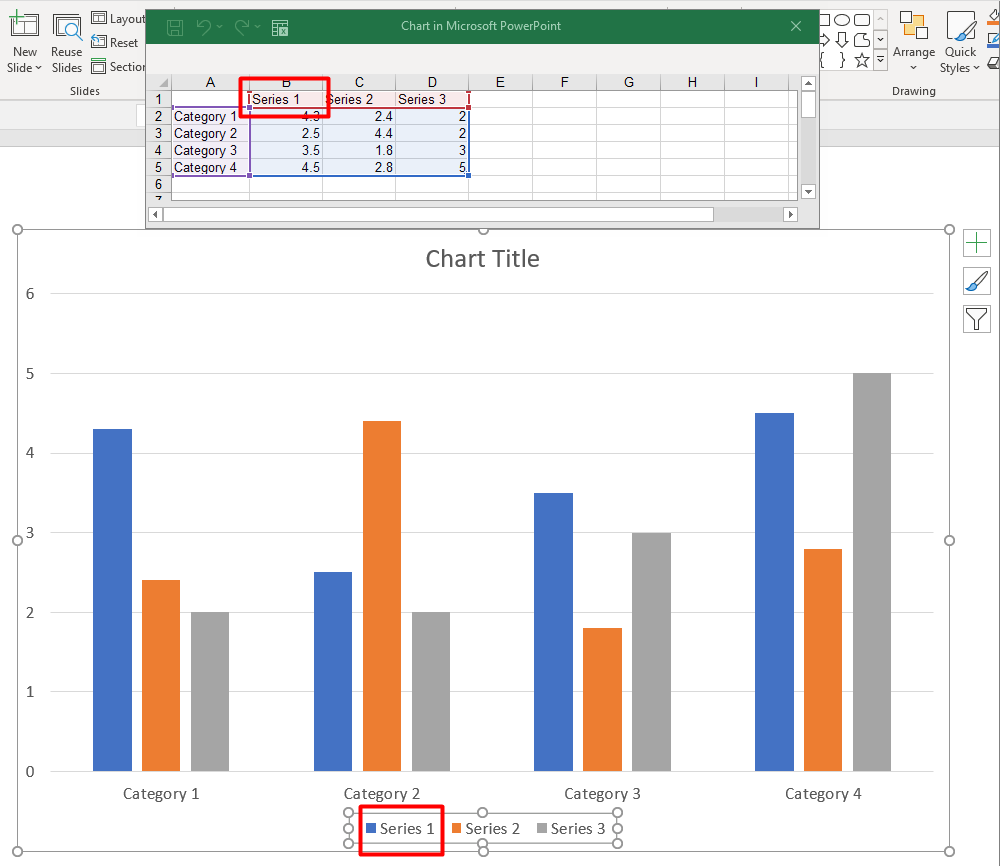

## **Overzicht**

Dit artikel beschrijft de rol van [ChartSeries](https://reference.aspose.com/slides/nl/python-net/aspose.slides.charts/chartseries/) in Aspose.Slides voor Python, met focus op hoe gegevens worden gestructureerd en gevisualiseerd binnen presentaties. Deze objecten vormen de fundamentele elementen die individuele sets datapunten, categorieën en weergave‑parameters in een diagram definiëren. Door met [ChartSeries](https://reference.aspose.com/slides/nl/python-net/aspose.slides.charts/chartseries/) te werken, kunnen ontwikkelaars onderliggende gegevensbronnen naadloos integreren en volledige controle behouden over hoe informatie wordt weergegeven, wat resulteert in dynamische, data‑gedreven presentaties die inzichten en analyses duidelijk overbrengen.

Een serie is een rij of kolom getallen die in een diagram worden uitgezet.



## **Series Overlap Instellen**

De eigenschap [ChartSeries.overlap](https://reference.aspose.com/slides/nl/python-net/aspose.slides.charts/chartseries/overlap/) bepaalt hoe balken en kolommen overlappen in een 2D‑diagram door een bereik van -100 tot 100 op te geven. Omdat deze eigenschap gekoppeld is aan de seriegroep in plaats van aan een individuele diagramserie, is hij alleen‑lezen op serieniveau. Om overlappingswaarden te configureren, gebruikt u de `parent_series_group.overlap`‑eigenschap (lezen/schrijven), die de opgegeven overlap toepast op alle series in die groep.

Hieronder staat een Python‑voorbeeld dat aantoont hoe een presentatie wordt gemaakt, een gegroepeerd kolomdiagram wordt toegevoegd, de eerste diagramserie wordt benaderd, de overlap‑instelling wordt geconfigureerd en vervolgens het resultaat wordt opgeslagen als een PPTX‑bestand:

```py
import aspose.slides as slides
import aspose.slides.charts as charts

series_overlap = 30

with slides.Presentation() as presentation:
    slide = presentation.slides[0]

    # Voeg een gegroepeerd kolomdiagram toe met standaardgegevens.
    chart = slide.shapes.add_chart(charts.ChartType.CLUSTERED_COLUMN, 20, 20, 500, 200)

    series = chart.chart_data.series[0]
    if series.overlap == 0:
        # Stel de serie-overlap in.
        series.parent_series_group.overlap = series_overlap

    # Sla het presentatiebestand op op schijf.
    presentation.save("series_overlap.pptx", slides.export.SaveFormat.PPTX)
```

Het resultaat:


## **Kleur van Serie‑Vulling Wijzigen**

Aspose.Slides maakt het eenvoudig om de vulkleuren van diagramseries aan te passen, zodat u specifieke datapunten kunt accentueren en visueel aantrekkelijke diagrammen kunt creëren. Dit gebeurt via het [Format](https://reference.aspose.com/slides/nl/python-net/aspose.slides.charts/format/)‑object, dat verschillende vultype‑opties, kleurinstellingen en andere geavanceerde stijlopties ondersteunt. Nadat u een diagram aan een dia hebt toegevoegd en de gewenste serie hebt benaderd, krijgt u de serie en past u de gewenste vulkleur toe. Naast effen vullingen kunt u ook verlopen of patroonvullingen gebruiken voor extra ontwerpflexibiliteit. Nadat u de kleuren naar wens hebt ingesteld, slaat u de presentatie op om de bijgewerkte weergave te finaliseren.

De volgende Python‑code laat zien hoe u de kleur van de eerste serie wijzigt:

```py
import aspose.slides as slides
import aspose.slides.charts as charts
import aspose.pydrawing as draw

series_color = draw.Color.blue

with slides.Presentation() as presentation:
    slide = presentation.slides[0]

    # Voeg een gegroepeerd kolomdiagram toe met standaardgegevens.
    chart = slide.shapes.add_chart(charts.ChartType.CLUSTERED_COLUMN, 20, 20, 500, 200)

    # Stel de kleur van de eerste serie in.
    series = chart.chart_data.series[0]
    series.format.fill.fill_type = slides.FillType.SOLID
    series.format.fill.solid_fill_color.color = series_color

    # Sla het presentatiebestand op op schijf.
    presentation.save("series_color.pptx", slides.export.SaveFormat.PPTX)
```

Het resultaat:


## **Een Serie Hernoemen** 

Aspose.Slides biedt een eenvoudige manier om de namen van diagramseries te wijzigen, zodat data duidelijker en zinvoller gelabeld kan worden. Door de betreffende werkbladcel in de diagramgegevens te benaderen, kunnen ontwikkelaars aanpassen hoe de gegevens worden gepresenteerd. Deze wijziging is vooral nuttig wanneer serienaam­ren moeten worden geactualiseerd of verduidelijkt op basis van de context van de data. Na het hernoemen kan de presentatie worden opgeslagen om de veranderingen te behouden. 

Hieronder staat een Python‑fragment dat dit proces in actie toont.

```py
import aspose.slides as slides
import aspose.slides.charts as charts

series_name = "New name"

with slides.Presentation() as presentation:
    slide = presentation.slides[0]

    # Voeg een gegroepeerd kolomdiagram toe met standaardgegevens.
    chart = slide.shapes.add_chart(charts.ChartType.CLUSTERED_COLUMN, 20, 20, 500, 200)
    
    # Stel de naam van de eerste serie in.
    series_cell = chart.chart_data.chart_data_workbook.get_cell(0, 0, 1)
    series_cell.value = series_name
    
    # Sla het presentatiebestand op op schijf.
    presentation.save("series_name.pptx", slides.export.SaveFormat.PPTX)
```

De volgende Python‑code laat een alternatieve manier zien om de serienaam te wijzigen:

```py
import aspose.slides as slides
import aspose.slides.charts as charts

series_name = "New name"

with slides.Presentation() as presentation:
    slide = presentation.slides[0]

    # Voeg een gegroepeerd kolomdiagram toe met standaardgegevens.
    chart = slide.shapes.add_chart(charts.ChartType.CLUSTERED_COLUMN, 20, 20, 500, 200)
    series = chart.chart_data.series[0]
    
    # Stel de naam van de eerste serie in.
    series.name.as_cells[0].value = series_name

    # Sla het presentatiebestand op op schijf.
    presentation.save("series_name.pptx", slides.export.SaveFormat.PPTX) 
```

Het resultaat:


## **Automatische Serie‑Vulkleur Ophalen**

Aspose.Slides voor Python maakt het mogelijk om de automatische vulkleur voor diagramseries binnen een plot‑gebied op te halen. Nadat u een instantie van de [Presentation](https://reference.aspose.com/slides/nl/python-net/aspose.slides/presentation/)‑klasse hebt gemaakt, kunt u via de index een referentie naar de gewenste dia verkrijgen, vervolgens een diagram toevoegen met het door u gekozen type (bijvoorbeeld `ChartType.CLUSTERED_COLUMN`). Door de series in het diagram te benaderen, kunt u de automatische vulkleur verkrijgen.

De onderstaande Python‑code demonstreert dit proces in detail.

```py
import aspose.slides as slides
import aspose.slides.charts as charts

with slides.Presentation() as presentation:
    slide = presentation.slides[0]

    # Voeg een gegroepeerd kolomdiagram toe met standaardgegevens.
    chart = slide.shapes.add_chart(charts.ChartType.CLUSTERED_COLUMN, 20, 20, 500, 200)

    for i in range(len(chart.chart_data.series)):
        # Haal de vulkleur van de serie op.
        color = chart.chart_data.series[i].get_automatic_series_color()
        print(f"Series {i} color: {color.name}")
```

Voorbeeldoutput:

```text
Series 0 color: ff4f81bd
Series 1 color: ffc0504d
Series 2 color: ff9bbb59
```

## **Omgekeerde Vulkleuren voor een Serie Instellen**

Wanneer uw dataserie zowel positieve als negatieve waarden bevat, kan het kleuren van elke kolom of balk met dezelfde kleur het diagram onleesbaar maken. Aspose.Slides voor Python laat u een omgekeerde vulkleur toewijzen – een aparte vulling die automatisch wordt toegepast op datapunten onder nul – zodat negatieve waarden in één oogopslag opvallen. In deze sectie leert u hoe u die optie inschakelt, een passende kleur kiest en de bijgewerkte presentatie opslaat.

Het volgende code‑voorbeeld toont de werking:

```py
import aspose.slides as slides
import aspose.slides.charts as charts
import aspose.pydrawing as draw

invert_color = draw.Color.red

with slides.Presentation() as presentation:
    slide = presentation.slides[0]

    chart = slide.shapes.add_chart(charts.ChartType.CLUSTERED_COLUMN, 20, 20, 500, 200)
    workBook = chart.chart_data.chart_data_workbook

    chart.chart_data.series.clear()
    chart.chart_data.categories.clear()

    # Voeg nieuwe categorieën toe.
    chart.chart_data.categories.add(workBook.get_cell(0, 1, 0, "Category 1"))
    chart.chart_data.categories.add(workBook.get_cell(0, 2, 0, "Category 2"))
    chart.chart_data.categories.add(workBook.get_cell(0, 3, 0, "Category 3"))

    # Voeg een nieuwe serie toe.
    series = chart.chart_data.series.add(workBook.get_cell(0, 0, 1, "Series 1"), chart.type)

    # Vul de gegevens van de serie.
    series.data_points.add_data_point_for_bar_series(workBook.get_cell(0, 1, 1, -20))
    series.data_points.add_data_point_for_bar_series(workBook.get_cell(0, 2, 1, 50))
    series.data_points.add_data_point_for_bar_series(workBook.get_cell(0, 3, 1, -30))

    # Stel de kleuropties voor de serie in.
    series_color = series.get_automatic_series_color()
    series.invert_if_negative = True
    series.format.fill.fill_type = slides.FillType.SOLID
    series.format.fill.solid_fill_color.color = series_color
    series.inverted_solid_fill_color.color = invert_color
    presentation.save("inverted_solid_fill_color.pptx", slides.export.SaveFormat.PPTX)
```

Het resultaat:


U kunt de vulkleur ook omkeren voor één enkel datapunt in plaats van de hele serie. Benader simpelweg de gewenste `ChartDataPoint` en stel de eigenschap `invert_if_negative` in op `True`.

Het volgende code‑voorbeeld laat zien hoe dit te doen:

```py
import aspose.slides as slides
import aspose.slides.charts as charts
import aspose.pydrawing as draw

with slides.Presentation() as presentation:
    slide = presentation.slides[0]

	chart = slide.shapes.add_chart(charts.ChartType.CLUSTERED_COLUMN, 20, 20, 500, 200, True)
	chart.chart_data.series.clear()

	series = series.add(chart.chart_data.chart_data_workbook.get_cell(0, "B1"), chart.type)

	series.data_points.add_data_point_for_bar_series(chart.chart_data.chart_data_workbook.get_cell(0, "B2", -5))
	series.data_points.add_data_point_for_bar_series(chart.chart_data.chart_data_workbook.get_cell(0, "B3", 3))
	series.data_points.add_data_point_for_bar_series(chart.chart_data.chart_data_workbook.get_cell(0, "B4", -3))
	series.data_points.add_data_point_for_bar_series(chart.chart_data.chart_data_workbook.get_cell(0, "B5", 1))

	series.invert_if_negative = False
	series.data_points[2].invert_if_negative = True

	presentation.save("data_point_invert_color_if_negative.pptx", slides.export.SaveFormat.PPTX)
```

## **Gegevens voor Specifieke Datapunten Wissen**

Soms bevat een diagram testwaarden, uitschieters of verouderde items die u moet verwijderen zonder de volledige serie opnieuw op te bouwen. Aspose.Slides voor Python stelt u in staat elk datapunt via de index te targeten, de inhoud te wissen en de plot onmiddellijk te vernieuwen zodat de resterende punten verschuiven en de assen automatisch worden herschaald.

Het volgende code‑voorbeeld demonstreert de werking:

```py
import aspose.slides as slides
import aspose.slides.charts as charts

with slides.Presentation("test_chart.pptx") as presentation:
    slide = presentation.slides[0]
    chart = slide.shapes[0]
    series = chart.chart_data.series[0]

    for data_point in series.data_points:
        data_point.x_value.as_cell.value = None
        data_point.y_value.as_cell.value = None

    series.data_points.clear()

    presentation.save("clear_data_points.pptx", slides.export.SaveFormat.PPTX)
```

## **Serie‑Tussenruimte Instellen**

De tussenruimte bepaalt de hoeveelheid lege ruimte tussen aangrenzende kolommen of balken – bredere tussenruimtes benadrukken individuele categorieën, terwijl smallere tussenruimtes een dichtere, compactere uitstraling geven. Met Aspose.Slides voor Python kunt u deze parameter voor een volledige serie nauwkeurig afstellen, waardoor u precies de visuele balans bereikt die uw presentatie vereist zonder de onderliggende data te wijzigen.

Het volgende code‑voorbeeld laat zien hoe u de tussenruimte voor een serie instelt:

```py
import aspose.slides as slides
import aspose.slides.charts as charts

gap_width = 30

# Maak een lege presentatie.
with slides.Presentation() as presentation:

    # Benader de eerste dia.
    slide = presentation.slides[0]

    # Voeg een diagram toe met standaardgegevens.
    chart = slide.shapes.add_chart(charts.ChartType.STACKED_COLUMN, 20, 20, 500, 200)

    # Sla de presentatie op op schijf.
    presentation.save("default_gap_width.pptx", slides.export.SaveFormat.PPTX)

    # Stel de gap_width-waarde in.
    series = chart.chart_data.series[0]
    series.parent_series_group.gap_width = gap_width

    # Sla de presentatie op op schijf.
    presentation.save("gap_width_30.pptx", slides.export.SaveFormat.PPTX)
```

Het resultaat:


## **FAQ**

**Is er een limiet aan het aantal series dat één diagram kan bevatten?**

Aspose.Slides legt geen vaste bovengrens op aan het aantal series dat u toevoegt. Het praktische maximum wordt bepaald door de leesbaarheid van het diagram en het geheugen dat uw applicatie tot zijn beschikking heeft.

**Wat als de kolommen binnen een cluster te dicht bij elkaar of te ver uit elkaar staan?**

Pas de [gap_width](https://reference.aspose.com/slides/nl/python-net/aspose.slides.charts/chartseries/gap_width/)‑instelling voor die serie (of de bovenliggende seriegroep) aan. Een hogere waarde vergroot de ruimte tussen kolommen, een lagere waarde brengt ze dichter bij elkaar.