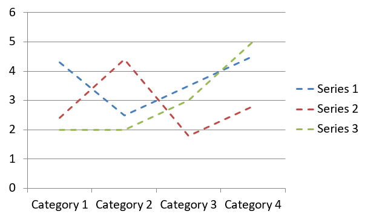
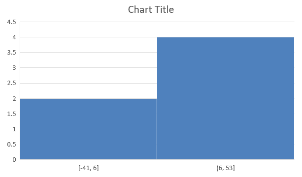
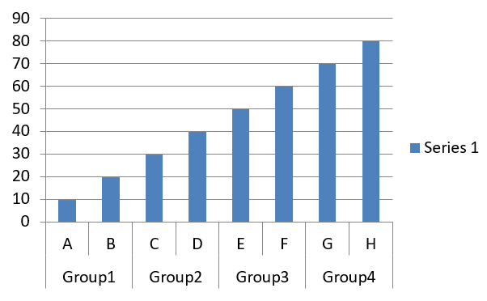

## **Overzicht**

Dit artikel biedt een uitgebreide gids over hoe u diagrammen maakt en aanpast met Aspose.Slides voor Python via .NET. U leert hoe u programmeermatig een diagram aan een dia toevoegt, het vult met gegevens, en diverse opmaakopties toepast om te voldoen aan uw specifieke ontwerpvereisten. Gedurende het artikel illustreren gedetailleerde code‑voorbeelden elke stap, van het initialiseren van de presentatie en het diagramobject tot het configureren van series, assen en legendes. Door deze gids te volgen krijgt u een solide begrip van hoe u dynamische diagramgeneratie in uw applicaties integreert, waardoor het proces van het maken van gegevens‑gedreven presentaties wordt gestroomlijnd.

## **Een diagram maken**

Diagrammen helpen mensen snel gegevens te visualiseren en inzichten te verkrijgen die niet meteen duidelijk zijn uit een tabel of spreadsheet.

**Waarom diagrammen maken?**

Met diagrammen kunt u:

* grote hoeveelheden data aggregeren, samenvatten of condenseren op één dia in een presentatie;
* patronen en trends in data blootleggen;
* de richting en momentum van data over tijd of ten opzichte van een specifieke meeteenheid afleiden;
* uitschieters, afwijkingen, fouten en onzinnige gegevens opsporen;
* complexe data communiceren of presenteren.

In PowerPoint kunt u diagrammen maken via de *Invoegen*-functie, die sjablonen biedt voor het ontwerpen van veel verschillende diagramtypen. Met Aspose.Slides kunt u zowel reguliere diagrammen (gebaseerd op populaire diagramtypen) als aangepaste diagrammen maken.

{} 
Gebruik de [ChartType](https://reference.aspose.com/slides/nl/python-net/aspose.slides.charts/charttype/)‑enumeratie onder de [Aspose.Slides.Charts](https://reference.aspose.com/slides/nl/python-net/aspose.slides.charts/) namespace. De waarden in deze enumeratie corresponderen met verschillende diagramtypen.
{} 

### **Clustered Column‑diagrammen maken**

In deze sectie wordt uitgelegd hoe u clustered column‑diagrammen maakt met Aspose.Slides voor Python via .NET. U leert een presentatie te initialiseren, een diagram toe te voegen en elementen zoals titel, gegevens, series, categorieën en opmaak aan te passen. Volg de onderstaande stappen om te zien hoe een standaard clustered column‑diagram wordt gegenereerd:

1. Maak een instantie van de [Presentation](https://reference.aspose.com/slides/nl/python-net/aspose.slides/presentation/)‑klasse.
1. Haal een referentie op naar een dia met behulp van de index.
1. Voeg een diagram toe met enkele gegevens en specificeer het type `ChartType.CLUSTERED_COLUMN`.
1. Voeg een titel toe aan het diagram.
1. Open het gegevenswerkblad van het diagram.
1. Verwijder alle standaard series en categorieën.
1. Voeg nieuwe series en categorieën toe.
1. Voeg nieuwe diagramgegevens toe voor de diagramseries.
1. Pas een vulkleur toe op de diagramseries.
1. Voeg labels toe aan de diagramseries.
1. Sla de gewijzigde presentatie op als een PPTX‑bestand.

Deze Python‑code toont hoe u een clustered column‑diagram maakt:

```py
import aspose.slides.charts as charts
import aspose.slides as slides
import aspose.pydrawing as draw

# Instantieer de Presentation‑klasse die een PPTX‑bestand representeert.
with slides.Presentation() as presentation:

    # Toegang tot de eerste dia.
    slide = presentation.slides[0]

    # Voeg een clustered column‑diagram toe met de standaardgegevens.
    chart = slide.shapes.add_chart(charts.ChartType.CLUSTERED_COLUMN, 20, 20, 500, 300)

    # Stel de diagramtitel in.
    chart.chart_title.add_text_frame_for_overriding("Sample Title")
    chart.chart_title.text_frame_for_overriding.text_frame_format.center_text = slides.NullableBool.TRUE
    chart.chart_title.height = 20
    chart.has_title = True

    # Stel de eerste serie in om waarden weer te geven.
    chart.chart_data.series[0].labels.default_data_label_format.show_value = True

    # Stel de index van het diagramdatablad in.
    worksheet_index = 0

    # Haal het diagramdatablad op.
    workbook = chart.chart_data.chart_data_workbook

    # Verwijder de standaard gegenereerde series en categorieën.
    chart.chart_data.series.clear()
    chart.chart_data.categories.clear()

    # Voeg nieuwe series toe.
    chart.chart_data.series.add(workbook.get_cell(worksheet_index, 0, 1, "Series 1"), chart.type)
    chart.chart_data.series.add(workbook.get_cell(worksheet_index, 0, 2, "Series 2"), chart.type)

    # Voeg nieuwe categorieën toe.
    chart.chart_data.categories.add(workbook.get_cell(worksheet_index, 1, 0, "Category 1"))
    chart.chart_data.categories.add(workbook.get_cell(worksheet_index, 2, 0, "Category 2"))
    chart.chart_data.categories.add(workbook.get_cell(worksheet_index, 3, 0, "Category 3"))

    # Haal de eerste diagramserie op.
    series = chart.chart_data.series[0]

    # Vul de seriedata.
    series.data_points.add_data_point_for_bar_series(workbook.get_cell(worksheet_index, 1, 1, 20))
    series.data_points.add_data_point_for_bar_series(workbook.get_cell(worksheet_index, 2, 1, 50))
    series.data_points.add_data_point_for_bar_series(workbook.get_cell(worksheet_index, 3, 1, 30))

    # Stel de vulkleur in voor de serie.
    series.format.fill.fill_type = slides.FillType.SOLID
    series.format.fill.solid_fill_color.color = draw.Color.red

    # Haal de tweede diagramserie op.
    series = chart.chart_data.series[1]

    # Vul de seriedata.
    series.data_points.add_data_point_for_bar_series(workbook.get_cell(worksheet_index, 1, 2, 30))
    series.data_points.add_data_point_for_bar_series(workbook.get_cell(worksheet_index, 2, 2, 10))
    series.data_points.add_data_point_for_bar_series(workbook.get_cell(worksheet_index, 3, 2, 60))

    # Stel de vulkleur in voor de serie.
    series.format.fill.fill_type = slides.FillType.SOLID
    series.format.fill.solid_fill_color.color = draw.Color.green

    # Stel het eerste label in om de categorienaam weer te geven.
    label = series.data_points[0].label
    label.data_label_format.show_category_name = True

    label = series.data_points[1].label
    label.data_label_format.show_series_name = True

    # Stel de serie in om de waarde weer te geven voor het derde label.
    label = series.data_points[2].label
    label.data_label_format.show_value = True
    label.data_label_format.show_series_name = True
    label.data_label_format.separator = "/"
                
    # Sla de presentatie op als een PPTX‑bestand.
    presentation.save("ClusteredColumnChart.pptx", slides.export.SaveFormat.PPTX)
```

Het resultaat:


### **Scatter‑diagrammen maken**

Scatter‑diagrammen (ook wel scatter‑plots of x‑y‑grafieken genoemd) worden vaak gebruikt om patronen te zoeken of correlaties tussen twee variabelen te demonstreren.

Gebruik een scatter‑diagram wanneer:

* u gepaarde numerieke gegevens hebt;
* u twee variabelen heeft die goed bij elkaar passen;
* u wilt bepalen of de twee variabelen gerelateerd zijn;
* u een onafhankelijke variabele heeft met meerdere waarden voor een afhankelijke variabele.

Deze Python‑code laat zien hoe u een scatter‑diagram maakt met een andere reeks markers:

```py
import aspose.slides.charts as charts
import aspose.slides as slides
import aspose.pydrawing as draw

# Instantieer de Presentation‑klasse.
with slides.Presentation() as presentation:

    # Toegang tot de eerste dia.
    slide = presentation.slides[0]

    # Maak het standaard scatter‑diagram.
    chart = slide.shapes.add_chart(charts.ChartType.SCATTER_WITH_SMOOTH_LINES, 20, 20, 500, 300)

    # Stel de index van het diagramdatablad in.
    worksheet_index = 0

    # Haal het diagramdatablad op.
    workbook = chart.chart_data.chart_data_workbook

    # Verwijder de standaard series.
    chart.chart_data.series.clear()

    # Voeg nieuwe series toe.
    chart.chart_data.series.add(workbook.get_cell(worksheet_index, 1, 1, "Series 1"), chart.type)
    chart.chart_data.series.add(workbook.get_cell(worksheet_index, 1, 3, "Series 2"), chart.type)

    # Haal de eerste diagramserie op.
    series = chart.chart_data.series[0]

    # Voeg een nieuw punt (1:3) toe aan de serie.
    series.data_points.add_data_point_for_scatter_series(workbook.get_cell(worksheet_index, 2, 1, 1), workbook.get_cell(worksheet_index, 2, 2, 3))

    # Voeg een nieuw punt (2:10) toe.
    series.data_points.add_data_point_for_scatter_series(workbook.get_cell(worksheet_index, 3, 1, 2), workbook.get_cell(worksheet_index, 3, 2, 10))

    # Wijzig het serietype.
    series.type = charts.ChartType.SCATTER_WITH_STRAIGHT_LINES_AND_MARKERS

    # Wijzig de marker van de diagramserie.
    series.marker.size = 10
    series.marker.symbol = charts.MarkerStyleType.STAR

    # Haal de tweede diagramserie op.
    series = chart.chart_data.series[1]

    # Voeg een nieuw punt (5:2) toe aan de diagramserie.
    series.data_points.add_data_point_for_scatter_series(workbook.get_cell(worksheet_index, 2, 3, 5), workbook.get_cell(worksheet_index, 2, 4, 2))

    # Voeg een nieuw punt (3:1) toe.
    series.data_points.add_data_point_for_scatter_series(workbook.get_cell(worksheet_index, 3, 3, 3), workbook.get_cell(worksheet_index, 3, 4, 1))

    # Voeg een nieuw punt (2:2) toe.
    series.data_points.add_data_point_for_scatter_series(workbook.get_cell(worksheet_index, 4, 3, 2), workbook.get_cell(worksheet_index, 4, 4, 2))

    # Voeg een nieuw punt (5:1) toe.
    series.data_points.add_data_point_for_scatter_series(workbook.get_cell(worksheet_index, 5, 3, 5), workbook.get_cell(worksheet_index, 5, 4, 1))

    # Wijzig de marker van de diagramserie.
    series.marker.size = 10
    series.marker.symbol = charts.MarkerStyleType.CIRCLE

    presentation.save("ScatterChart.pptx", slides.export.SaveFormat.PPTX)
```

Het resultaat:


### **Taart‑diagrammen maken**

Taart‑diagrammen worden het best gebruikt om de verhouding deel‑tot‑geheel in data weer te geven, vooral wanneer de data categorische labels met numerieke waarden bevat. Als uw data echter veel delen of labels bevat, kunt u overwegen een staafdiagram te gebruiken.

1. Maak een instantie van de [Presentation](https://reference.aspose.com/slides/nl/python-net/aspose.slides/presentation/)‑klasse.
1. Haal een referentie op naar een dia met behulp van de index.
1. Voeg een diagram toe met standaardgegevens en specificeer het type `ChartType.PIE`.
1. Open het gegevenswerkboek van het diagram ([ChartDataWorkbook](https://reference.aspose.com/slides/nl/python-net/aspose.slides.charts/chartdataworkbook/)).
1. Verwijder de standaard series en categorieën.
1. Voeg nieuwe series en categorieën toe.
1. Voeg nieuwe diagramgegevens toe voor de diagramseries.
1. Voeg nieuwe punten toe voor het diagram en pas aangepaste kleuren toe op de sectoren van het taart‑diagram.
1. Stel labels in voor de series.
1. Schakel leidende lijnen in voor de serienlabels.
1. Stel de rotatiehoek in voor het taart‑diagram.
1. Sla de gewijzigde presentatie op als een PPTX‑bestand.

Deze Python‑code toont hoe u een taart‑diagram maakt:

```py
import aspose.slides.charts as charts
import aspose.slides as slides
import aspose.pydrawing as draw

# Instantieer de Presentation-klasse die een PPTX-bestand vertegenwoordigt.
with slides.Presentation() as presentation:

    # Toegang tot de eerste dia.
    slide = presentation.slides[0]

    # Voeg een diagram toe met de standaardgegevens.
    chart = slide.shapes.add_chart(charts.ChartType.PIE, 20, 20, 500, 300)

    # Stel de diagramtitel in.
    chart.chart_title.add_text_frame_for_overriding("Sample Title")
    chart.chart_title.text_frame_for_overriding.text_frame_format.center_text = slides.NullableBool.TRUE
    chart.chart_title.height = 20
    chart.has_title = True

    # Stel de eerste serie in om waarden weer te geven.
    chart.chart_data.series[0].labels.default_data_label_format.show_value = True

    # Stel de index van het diagramdatablad in.
    worksheet_index = 0

    # Haal het diagramdatablad op.
    workbook = chart.chart_data.chart_data_workbook

    # Verwijder de standaardgegenereerde series en categorieën.
    chart.chart_data.series.clear()
    chart.chart_data.categories.clear()

    # Voeg nieuwe categorieën toe.
    chart.chart_data.categories.add(workbook.get_cell(0, 1, 0, "First Qtr"))
    chart.chart_data.categories.add(workbook.get_cell(0, 2, 0, "2nd Qtr"))
    chart.chart_data.categories.add(workbook.get_cell(0, 3, 0, "3rd Qtr"))

    # Voeg nieuwe series toe.
    series = chart.chart_data.series.add(workbook.get_cell(0, 0, 1, "Series 1"), chart.type)

    # Vul de seriedata.
    series.data_points.add_data_point_for_pie_series(workbook.get_cell(worksheet_index, 1, 1, 20))
    series.data_points.add_data_point_for_pie_series(workbook.get_cell(worksheet_index, 2, 1, 50))
    series.data_points.add_data_point_for_pie_series(workbook.get_cell(worksheet_index, 3, 1, 30))

    # Stel de sectorkleur in.
    chart.chart_data.series_groups[0].is_color_varied = True

    point = series.data_points[0]
    point.format.fill.fill_type = slides.FillType.SOLID
    point.format.fill.solid_fill_color.color = draw.Color.cyan

    # Stel de sectorrand in.
    point.format.line.fill_format.fill_type = slides.FillType.SOLID
    point.format.line.fill_format.solid_fill_color.color = draw.Color.gray
    point.format.line.width = 3.0
    point.format.line.style = slides.LineStyle.THIN_THICK
    point.format.line.dash_style = slides.LineDashStyle.DASH_DOT

    point1 = series.data_points[1]
    point1.format.fill.fill_type = slides.FillType.SOLID
    point1.format.fill.solid_fill_color.color = draw.Color.brown

    # Stel de sectorrand in.
    point1.format.line.fill_format.fill_type = slides.FillType.SOLID
    point1.format.line.fill_format.solid_fill_color.color = draw.Color.blue
    point1.format.line.width = 3.0
    point1.format.line.style = slides.LineStyle.SINGLE
    point1.format.line.dash_style = slides.LineDashStyle.LARGE_DASH_DOT

    point2 = series.data_points[2]
    point2.format.fill.fill_type = slides.FillType.SOLID
    point2.format.fill.solid_fill_color.color = draw.Color.coral

    # Stel de sectorrand in.
    point2.format.line.fill_format.fill_type = slides.FillType.SOLID
    point2.format.line.fill_format.solid_fill_color.color = draw.Color.red
    point2.format.line.width = 2.0
    point2.format.line.style = slides.LineStyle.THIN_THIN
    point2.format.line.dash_style = slides.LineDashStyle.LARGE_DASH_DOT_DOT

    # Maak aangepaste labels voor elke categorie in de nieuwe serie.
    label1 = series.data_points[0].label

    label1.data_label_format.show_value = True

    label2 = series.data_points[1].label
    label2.data_label_format.show_value = True
    label2.data_label_format.show_legend_key = True
    label2.data_label_format.show_percentage = True

    label3 = series.data_points[2].label
    label3.data_label_format.show_series_name = True
    label3.data_label_format.show_percentage = True

    # Stel de serie in om leidingslijnen weer te geven voor het diagram.
    series.labels.default_data_label_format.show_leader_lines = True

    # Stel de rotatiehoek in voor de taartdiagramsectoren.
    chart.chart_data.series_groups[0].first_slice_angle = 180

    # Sla de presentatie op als een PPTX-bestand.
    presentation.save("PieChart.pptx", slides.export.SaveFormat.PPTX)
```

Het resultaat:


### **Lijndiagrammen maken**

Lijndiagrammen (ook wel lijngrafieken genoemd) worden het best gebruikt in situaties waarin u veranderingen in waarden over tijd wilt demonstreren. Met een lijndiagram kunt u een grote hoeveelheid data tegelijk vergelijken, wijzigingen en trends over tijd volgen, anomalieën in dataseries benadrukken, en meer.

1. Maak een instantie van de [Presentation](https://reference.aspose.com/slides/nl/python-net/aspose.slides/presentation/)‑klasse.
1. Haal een referentie op naar een dia met behulp van de index.
1. Voeg een diagram toe met standaardgegevens en specificeer het type `ChartType.LINE`.
1. Open het gegevenswerkboek van het diagram ([ChartDataWorkbook](https://reference.aspose.com/slides/nl/python-net/aspose.slides.charts/chartdataworkbook/)).
1. Verwijder de standaard series en categorieën.
1. Voeg nieuwe series en categorieën toe.
1. Voeg nieuwe diagramgegevens toe voor de diagramseries.
1. Sla de gewijzigde presentatie op als een PPTX‑bestand.

Deze Python‑code toont hoe u een lijndiagram maakt:

```python
import aspose.slides as slides

with slides.Presentation() as presentation:
    line_chart = presentation.slides[0].shapes.add_chart(slides.charts.ChartType.LINE, 20, 20, 500, 300)
    
    presentation.save("LineChart.pptx", slides.export.SaveFormat.PPTX)
```

Standaard worden punten in een lijndiagram verbonden door rechte, doorlopende lijnen. Als u wilt dat de punten in plaats daarvan door streepjes worden verbonden, kunt u het gewenste streeptype als volgt opgeven:

```python
line_chart = pres.slides[0].shapes.add_chart(slides.charts.ChartType.LINE, 10, 50, 600, 350)

for series in line_chart.chart_data.series:
    series.format.line.dash_style = slides.charts.LineDashStyle.DASH
```

Het resultaat:



### **Tree‑Map‑diagrammen maken**

Tree‑Map‑diagrammen zijn het best geschikt voor verkoopdata wanneer u de relatieve grootte van datacategorieën wilt tonen en snel aandacht wilt vestigen op items die grote bijdragers zijn binnen elke categorie.

1. Maak een instantie van de [Presentation](https://reference.aspose.com/slides/nl/python-net/aspose.slides/presentation/)‑klasse.
1. Haal een referentie op naar een dia met behulp van de index.
1. Voeg een diagram toe met standaardgegevens en specificeer het type `ChartType.TREEMAP`.
1. Open het gegevenswerkboek van het diagram ([ChartDataWorkbook](https://reference.aspose.com/slides/nl/python-net/aspose.slides.charts/chartdataworkbook/)).
1. Verwijder de standaard series en categorieën.
1. Voeg nieuwe series en categorieën toe.
1. Voeg nieuwe diagramgegevens toe voor de diagramseries.
1. Sla de gewijzigde presentatie op als een PPTX‑bestand.

Deze Python‑code toont hoe u een tree‑map‑diagram maakt:

```py
import aspose.slides.charts as charts
import aspose.slides as slides
import aspose.pydrawing as draw

with slides.Presentation() as presentation:
    chart = presentation.slides[0].shapes.add_chart(charts.ChartType.TREEMAP, 20, 20, 500, 300)
    chart.chart_data.categories.clear()
    chart.chart_data.series.clear()

    workbook = chart.chart_data.chart_data_workbook
    workbook.clear(0)

    # Tak 1
    leaf = chart.chart_data.categories.add(workbook.get_cell(0, "C1", "Leaf1"))
    leaf.grouping_levels.set_grouping_item(1, "Stem1")
    leaf.grouping_levels.set_grouping_item(2, "Branch1")

    chart.chart_data.categories.add(workbook.get_cell(0, "C2", "Leaf2"))

    leaf = chart.chart_data.categories.add(workbook.get_cell(0, "C3", "Leaf3"))
    leaf.grouping_levels.set_grouping_item(1, "Stem2")

    chart.chart_data.categories.add(workbook.get_cell(0, "C4", "Leaf4"))

    # Tak 2
    leaf = chart.chart_data.categories.add(workbook.get_cell(0, "C5", "Leaf5"))
    leaf.grouping_levels.set_grouping_item(1, "Stem3")
    leaf.grouping_levels.set_grouping_item(2, "Branch2")

    chart.chart_data.categories.add(workbook.get_cell(0, "C6", "Leaf6"))

    leaf = chart.chart_data.categories.add(workbook.get_cell(0, "C7", "Leaf7"))
    leaf.grouping_levels.set_grouping_item(1, "Stem4")

    chart.chart_data.categories.add(workbook.get_cell(0, "C8", "Leaf8"))

    series = chart.chart_data.series.add(charts.ChartType.TREEMAP)
    series.labels.default_data_label_format.show_category_name = True
    series.data_points.add_data_point_for_treemap_series(workbook.get_cell(0, "D1", 4))
    series.data_points.add_data_point_for_treemap_series(workbook.get_cell(0, "D2", 5))
    series.data_points.add_data_point_for_treemap_series(workbook.get_cell(0, "D3", 3))
    series.data_points.add_data_point_for_treemap_series(workbook.get_cell(0, "D4", 6))
    series.data_points.add_data_point_for_treemap_series(workbook.get_cell(0, "D5", 9))
    series.data_points.add_data_point_for_treemap_series(workbook.get_cell(0, "D6", 9))
    series.data_points.add_data_point_for_treemap_series(workbook.get_cell(0, "D7", 4))
    series.data_points.add_data_point_for_treemap_series(workbook.get_cell(0, "D8", 3))

    series.parent_label_layout = charts.ParentLabelLayoutType.OVERLAPPING

    presentation.save("TreeMap.pptx", slides.export.SaveFormat.PPTX)
```

Het resultaat:


### **Aandelen‑diagrammen maken**

Aandelen‑diagrammen worden gebruikt om financiële gegevens weer te geven, zoals open‑, hoog‑, laag‑ en slotkoersen, en helpen markttrends en volatiliteit te analyseren. Ze bieden essentiële inzichten in de aandelenprestaties, wat beleggers en analisten ondersteunt bij het nemen van gefundeerde beslissingen.

1. Maak een instantie van de [Presentation](https://reference.aspose.com/slides/nl/python-net/aspose.slides/presentation/)‑klasse.
1. Haal een referentie op naar een dia met behulp van de index.
1. Voeg een diagram toe met standaardgegevens en specificeer het type `ChartType.OPEN_HIGH_LOW_CLOSE`.
1. Open het gegevenswerkboek van het diagram ([ChartDataWorkbook](https://reference.aspose.com/slides/nl/python-net/aspose.slides.charts/chartdataworkbook/)).
1. Verwijder de standaard series en categorieën.
1. Voeg nieuwe series en categorieën toe.
1. Voeg nieuwe diagramgegevens toe voor de diagramseries.
1. Specificeer het HiLowLines‑formaat.
1. Sla de gewijzigde presentatie op als een PPTX‑bestand.

Deze Python‑code toont hoe u een aandelen‑diagram maakt:

```py
import aspose.slides.charts as charts
import aspose.slides as slides
import aspose.pydrawing as draw

with slides.Presentation() as presentation:
    chart = presentation.slides[0].shapes.add_chart(charts.ChartType.OPEN_HIGH_LOW_CLOSE, 20, 20, 500, 300, False)

    chart.chart_data.series.clear()
    chart.chart_data.categories.clear()

    workbook = chart.chart_data.chart_data_workbook

    chart.chart_data.categories.add(workbook.get_cell(0, 1, 0, "A"))
    chart.chart_data.categories.add(workbook.get_cell(0, 2, 0, "B"))
    chart.chart_data.categories.add(workbook.get_cell(0, 3, 0, "C"))

    chart.chart_data.series.add(workbook.get_cell(0, 0, 1, "Open"), chart.type)
    chart.chart_data.series.add(workbook.get_cell(0, 0, 2, "High"), chart.type)
    chart.chart_data.series.add(workbook.get_cell(0, 0, 3, "Low"), chart.type)
    chart.chart_data.series.add(workbook.get_cell(0, 0, 4, "Close"), chart.type)

    series = chart.chart_data.series[0]

    series.data_points.add_data_point_for_stock_series(workbook.get_cell(0, 1, 1, 72))
    series.data_points.add_data_point_for_stock_series(workbook.get_cell(0, 2, 1, 25))
    series.data_points.add_data_point_for_stock_series(workbook.get_cell(0, 3, 1, 38))

    series = chart.chart_data.series[1]
    series.data_points.add_data_point_for_stock_series(workbook.get_cell(0, 1, 2, 172))
    series.data_points.add_data_point_for_stock_series(workbook.get_cell(0, 2, 2, 57))
    series.data_points.add_data_point_for_stock_series(workbook.get_cell(0, 3, 2, 57))

    series = chart.chart_data.series[2]
    series.data_points.add_data_point_for_stock_series(workbook.get_cell(0, 1, 3, 12))
    series.data_points.add_data_point_for_stock_series(workbook.get_cell(0, 2, 3, 12))
    series.data_points.add_data_point_for_stock_series(workbook.get_cell(0, 3, 3, 13))

    series = chart.chart_data.series[3]
    series.data_points.add_data_point_for_stock_series(workbook.get_cell(0, 1, 4, 25))
    series.data_points.add_data_point_for_stock_series(workbook.get_cell(0, 2, 4, 38))
    series.data_points.add_data_point_for_stock_series(workbook.get_cell(0, 3, 4, 50))

    chart.chart_data.series_groups[0].up_down_bars.has_up_down_bars = True
    chart.chart_data.series_groups[0].hi_low_lines_format.line.fill_format.fill_type = slides.FillType.SOLID

    for ser in chart.chart_data.series:
        ser.format.line.fill_format.fill_type = slides.FillType.NO_FILL

    presentation.save("StockChart.pptx", slides.export.SaveFormat.PPTX)
```

Het resultaat:


### **Box‑en‑Whisker‑diagrammen maken**

Box‑en‑Whisker‑diagrammen worden gebruikt om de verdeling van data weer te geven door belangrijke statistische maten samen te vatten, zoals de mediaan, kwartielen en mogelijke uitschieters. Ze zijn bijzonder nuttig bij verkennende data‑analyse en statistische studies om snel de variabiliteit van data te begrijpen en eventuele anomalieën te identificeren.

1. Maak een instantie van de [Presentation](https://reference.aspose.com/slides/nl/python-net/aspose.slides/presentation/)‑klasse.
1. Haal een referentie op naar een dia met behulp van de index.
1. Voeg een diagram toe met standaardgegevens en specificeer het type `ChartType.BOX_AND_WHISKER`.
1. Open het gegevenswerkboek van het diagram ([ChartDataWorkbook](https://reference.aspose.com/slides/nl/python-net/aspose.slides.charts/chartdataworkbook/)).
1. Verwijder de standaard series en categorieën.
1. Voeg nieuwe series en categorieën toe.
1. Voeg nieuwe diagramgegevens toe voor de diagramseries.
1. Sla de gewijzigde presentatie op als een PPTX‑bestand.

Deze Python‑code toont hoe u een box‑en‑whisker‑diagram maakt:

```py
import aspose.slides.charts as charts
import aspose.slides as slides
import aspose.pydrawing as draw

with slides.Presentation() as presentation:
    chart = presentation.slides[0].shapes.add_chart(charts.ChartType.BOX_AND_WHISKER, 20, 20, 500, 300)
    chart.chart_data.categories.clear()
    chart.chart_data.series.clear()

    workbook = chart.chart_data.chart_data_workbook
    workbook.clear(0)

    chart.chart_data.categories.add(workbook.get_cell(0, "A1", "Category 1"))
    chart.chart_data.categories.add(workbook.get_cell(0, "A2", "Category 1"))
    chart.chart_data.categories.add(workbook.get_cell(0, "A3", "Category 1"))
    chart.chart_data.categories.add(workbook.get_cell(0, "A4", "Category 1"))
    chart.chart_data.categories.add(workbook.get_cell(0, "A5", "Category 1"))
    chart.chart_data.categories.add(workbook.get_cell(0, "A6", "Category 1"))

    series = chart.chart_data.series.add(charts.ChartType.BOX_AND_WHISKER)

    series.quartile_method = charts.QuartileMethodType.EXCLUSIVE
    series.show_mean_line = True
    series.show_mean_markers = True
    series.show_inner_points = True
    series.show_outlier_points = True

    series.data_points.add_data_point_for_box_and_whisker_series(workbook.get_cell(0, "B1", 15))
    series.data_points.add_data_point_for_box_and_whisker_series(workbook.get_cell(0, "B2", 41))
    series.data_points.add_data_point_for_box_and_whisker_series(workbook.get_cell(0, "B3", 16))
    series.data_points.add_data_point_for_box_and_whisker_series(workbook.get_cell(0, "B4", 10))
    series.data_points.add_data_point_for_box_and_whisker_series(workbook.get_cell(0, "B5", 23))
    series.data_points.add_data_point_for_box_and_whisker_series(workbook.get_cell(0, "B6", 16))

    presentation.save("BoxAndWhiskerChart.pptx", slides.export.SaveFormat.PPTX)
```

### **Funnel‑diagrammen maken**

Funnel‑diagrammen worden gebruikt om processen te visualiseren die opeenvolgende fasen omvatten, waarbij het datavolume afneemt naarmate het van de ene stap naar de volgende gaat. Ze zijn vooral handig voor het analyseren van conversieratio’s, het identificeren van knelpunten en het volgen van de efficiëntie van verkoop‑ of marketingprocessen.

1. Maak een instantie van de [Presentation](https://reference.aspose.com/slides/nl/python-net/aspose.slides/presentation/)‑klasse.
1. Haal een referentie op naar een dia met behulp van de index.
1. Voeg een diagram toe met standaardgegevens en specificeer het type `ChartType.FUNNEL`.
1. Sla de gewijzigde presentatie op als een PPTX‑bestand.

Deze Python‑code toont hoe u een funnel‑diagram maakt:

```py
import aspose.slides.charts as charts
import aspose.slides as slides
import aspose.pydrawing as draw

with slides.Presentation() as presentation:
    chart = presentation.slides[0].shapes.add_chart(charts.ChartType.FUNNEL, 50, 50, 500, 400)
    chart.chart_data.categories.clear()
    chart.chart_data.series.clear()

    workbook = chart.chart_data.chart_data_workbook
    workbook.clear(0)

    chart.chart_data.categories.add(workbook.get_cell(0, "A1", "Category 1"))
    chart.chart_data.categories.add(workbook.get_cell(0, "A2", "Category 2"))
    chart.chart_data.categories.add(workbook.get_cell(0, "A3", "Category 3"))
    chart.chart_data.categories.add(workbook.get_cell(0, "A4", "Category 4"))
    chart.chart_data.categories.add(workbook.get_cell(0, "A5", "Category 5"))
    chart.chart_data.categories.add(workbook.get_cell(0, "A6", "Category 6"))

    series = chart.chart_data.series.add(charts.ChartType.FUNNEL)

    series.data_points.add_data_point_for_funnel_series(workbook.get_cell(0, "B1", 50))
    series.data_points.add_data_point_for_funnel_series(workbook.get_cell(0, "B2", 100))
    series.data_points.add_data_point_for_funnel_series(workbook.get_cell(0, "B3", 200))
    series.data_points.add_data_point_for_funnel_series(workbook.get_cell(0, "B4", 300))
    series.data_points.add_data_point_for_funnel_series(workbook.get_cell(0, "B5", 400))
    series.data_points.add_data_point_for_funnel_series(workbook.get_cell(0, "B6", 500))

    presentation.save("FunnelChart.pptx", slides.export.SaveFormat.PPTX)
```

Het resultaat:


### **Sunburst‑diagrammen maken**

Sunburst‑diagrammen worden gebruikt om hiërarchische data te visualiseren, waarbij niveaus worden weergegeven als concentrische ringen. Ze helpen de deel‑tot‑geheel‑relaties te illustreren en zijn ideaal voor het representeren van geneste categorieën en subcategorieën op een heldere, compacte manier.

1. Maak een instantie van de [Presentation](https://reference.aspose.com/slides/nl/python-net/aspose.slides/presentation/)‑klasse.
1. Haal een referentie op naar een dia met behulp van de index.
1. Voeg een diagram toe met standaardgegevens en specificeer het type `ChartType.SUNBURST`.
1. Sla de gewijzigde presentatie op als een PPTX‑bestand.

Deze Python‑code toont hoe u een sunburst‑diagram maakt:

```py
import aspose.slides.charts as charts
import aspose.slides as slides
import aspose.pydrawing as draw

with slides.Presentation() as presentation:
    chart = presentation.slides[0].shapes.add_chart(charts.ChartType.SUNBURST, 20, 20, 500, 300)
    chart.chart_data.categories.clear()
    chart.chart_data.series.clear()

    workbook = chart.chart_data.chart_data_workbook
    workbook.clear(0)

    # Tak 1
    leaf = chart.chart_data.categories.add(workbook.get_cell(0, "C1", "Leaf1"))
    leaf.grouping_levels.set_grouping_item(1, "Stem1")
    leaf.grouping_levels.set_grouping_item(2, "Branch1")

    chart.chart_data.categories.add(workbook.get_cell(0, "C2", "Leaf2"))

    leaf = chart.chart_data.categories.add(workbook.get_cell(0, "C3", "Leaf3"))
    leaf.grouping_levels.set_grouping_item(1, "Stem2")

    chart.chart_data.categories.add(workbook.get_cell(0, "C4", "Leaf4"))

    # Tak 2
    leaf = chart.chart_data.categories.add(workbook.get_cell(0, "C5", "Leaf5"))
    leaf.grouping_levels.set_grouping_item(1, "Stem3")
    leaf.grouping_levels.set_grouping_item(2, "Branch2")

    chart.chart_data.categories.add(workbook.get_cell(0, "C6", "Leaf6"))

    leaf = chart.chart_data.categories.add(workbook.get_cell(0, "C7", "Leaf7"))
    leaf.grouping_levels.set_grouping_item(1, "Stem4")

    chart.chart_data.categories.add(workbook.get_cell(0, "C8", "Leaf8"))

    series = chart.chart_data.series.add(charts.ChartType.SUNBURST)
    series.labels.default_data_label_format.show_category_name = True
    series.data_points.add_data_point_for_sunburst_series(workbook.get_cell(0, "D1", 4))
    series.data_points.add_data_point_for_sunburst_series(workbook.get_cell(0, "D2", 5))
    series.data_points.add_data_point_for_sunburst_series(workbook.get_cell(0, "D3", 3))
    series.data_points.add_data_point_for_sunburst_series(workbook.get_cell(0, "D4", 6))
    series.data_points.add_data_point_for_sunburst_series(workbook.get_cell(0, "D5", 9))
    series.data_points.add_data_point_for_sunburst_series(workbook.get_cell(0, "D6", 9))
    series.data_points.add_data_point_for_sunburst_series(workbook.get_cell(0, "D7", 4))
    series.data_points.add_data_point_for_sunburst_series(workbook.get_cell(0, "D8", 3))

    presentation.save("SunburstChart.pptx", slides.export.SaveFormat.PPTX)
```

Het resultaat:


### **Histogram‑diagrammen maken**

Histogram‑diagrammen worden gebruikt om de distributie van numerieke data weer te geven door waarden in bereiken of bakken te groeperen. Ze zijn bijzonder nuttig om datapatronen zoals frequentie, scheefheid en spreiding te identificeren, en om uitschieters in een dataset te detecteren.

1. Maak een instantie van de [Presentation](https://reference.aspose.com/slides/nl/python-net/aspose.slides/presentation/)‑klasse.
1. Haal een referentie op naar een dia met behulp van de index.
1. Voeg een diagram toe met enkele gegevens en specificeer het type `ChartType.HISTOGRAM`.
1. Open het gegevenswerkboek van het diagram ([ChartDataWorkbook](https://reference.aspose.com/slides/nl/python-net/aspose.slides.charts/chartdataworkbook/)).
1. Verwijder de standaard series en categorieën.
1. Voeg nieuwe series en categorieën toe.
1. Sla de gewijzigde presentatie op als een PPTX‑bestand.

Deze Python‑code toont hoe u een histogram‑diagram maakt:

```py
import aspose.slides.charts as charts
import aspose.slides as slides
import aspose.pydrawing as draw

with slides.Presentation() as presentation:
    chart = presentation.slides[0].shapes.add_chart(charts.ChartType.HISTOGRAM, 20, 20, 500, 300)
    chart.chart_data.categories.clear()
    chart.chart_data.series.clear()

    workbook = chart.chart_data.chart_data_workbook
    workbook.clear(0)

    series = chart.chart_data.series.add(charts.ChartType.HISTOGRAM)
    series.data_points.add_data_point_for_histogram_series(workbook.get_cell(0, "A1", 15))
    series.data_points.add_data_point_for_histogram_series(workbook.get_cell(0, "A2", -41))
    series.data_points.add_data_point_for_histogram_series(workbook.get_cell(0, "A3", 16))
    series.data_points.add_data_point_for_histogram_series(workbook.get_cell(0, "A4", 10))
    series.data_points.add_data_point_for_histogram_series(workbook.get_cell(0, "A5", -23))
    series.data_points.add_data_point_for_histogram_series(workbook.get_cell(0, "A6", 16))

    chart.axes.horizontal_axis.aggregation_type = charts.AxisAggregationType.AUTOMATIC

    presentation.save("HistogramChart.pptx", slides.export.SaveFormat.PPTX)
```

Het resultaat:



### **Radar‑diagrammen maken**

Radar‑diagrammen worden gebruikt om multivariate data weer te geven in een tweedimensionaal formaat, waardoor een eenvoudige vergelijking van meerdere variabelen tegelijk mogelijk is. Ze zijn bijzonder nuttig om patronen, sterktes en zwaktes over verschillende prestatiemaatstaven of attributen te identificeren.

1. Maak een instantie van de [Presentation](https://reference.aspose.com/slides/nl/python-net/aspose.slides/presentation/)‑klasse.
1. Haal een referentie op naar een dia met behulp van de index.
1. Voeg een diagram toe met enkele gegevens en specificeer het type `ChartType.RADAR`.
1. Sla de gewijzigde presentatie op als een PPTX‑bestand.

Deze Python‑code toont hoe u een radar‑diagram maakt:

```python
import aspose.slides as slides

with slides.Presentation() as presentation:
    presentation.slides[0].shapes.add_chart(slides.charts.ChartType.RADAR, 20, 20, 500, 300)
    presentation.save("RadarСhart.pptx", slides.export.SaveFormat.PPTX)
```

Het resultaat:


### **Multi‑category‑diagrammen maken**

Multi‑category‑diagrammen worden gebruikt om data weer te geven die meer dan één categorische groepering omvatten, waardoor u waarden over meerdere dimensies tegelijk kunt vergelijken. Ze zijn bijzonder bruikbaar wanneer u trends en relaties in complexe, meerlagige datasets moet analyseren.

1. Maak een instantie van de [Presentation](https://reference.aspose.com/slides/nl/python-net/aspose.slides/presentation/)‑klasse.
1. Haal een referentie op naar een dia met behulp van de index.
1. Voeg een diagram toe met standaardgegevens en specificeer het type `ChartType.CLUSTERED_COLUMN`.
1. Open het gegevenswerkboek van het diagram ([ChartDataWorkbook](https://reference.aspose.com/slides/nl/python-net/aspose.slides.charts/chartdataworkbook/)).
1. Verwijder de standaard series en categorieën.
1. Voeg nieuwe series en categorieën toe.
1. Voeg nieuwe diagramgegevens toe voor de diagramseries.
1. Sla de gewijzigde presentatie op als een PPTX‑bestand.

Deze Python‑code toont hoe u een multi‑category‑diagram maakt:

```py
import aspose.slides.charts as charts
import aspose.slides as slides
import aspose.pydrawing as draw

with slides.Presentation() as presentation:
    slide = presentation.slides[0]

    chart = presentation.slides[0].shapes.add_chart(charts.ChartType.CLUSTERED_COLUMN, 20, 20, 500, 300)
    chart.chart_data.series.clear()
    chart.chart_data.categories.clear()

    workbook = chart.chart_data.chart_data_workbook
    workbook.clear(0)

    worksheet_index = 0

    category = chart.chart_data.categories.add(workbook.get_cell(0, "c2", "A"))
    category.grouping_levels.set_grouping_item(1, "Group1")
    category = chart.chart_data.categories.add(workbook.get_cell(0, "c3", "B"))

    category = chart.chart_data.categories.add(workbook.get_cell(0, "c4", "C"))
    category.grouping_levels.set_grouping_item(1, "Group2")
    category = chart.chart_data.categories.add(workbook.get_cell(0, "c5", "D"))

    category = chart.chart_data.categories.add(workbook.get_cell(0, "c6", "E"))
    category.grouping_levels.set_grouping_item(1, "Group3")
    category = chart.chart_data.categories.add(workbook.get_cell(0, "c7", "F"))

    category = chart.chart_data.categories.add(workbook.get_cell(0, "c8", "G"))
    category.grouping_levels.set_grouping_item(1, "Group4")
    category = chart.chart_data.categories.add(workbook.get_cell(0, "c9", "H"))

    # Voeg een serie toe.
    series = chart.chart_data.series.add(workbook.get_cell(0, "D1", "Series 1"), charts.ChartType.CLUSTERED_COLUMN)

    series.data_points.add_data_point_for_bar_series(workbook.get_cell(worksheet_index, "D2", 10))
    series.data_points.add_data_point_for_bar_series(workbook.get_cell(worksheet_index, "D3", 20))
    series.data_points.add_data_point_for_bar_series(workbook.get_cell(worksheet_index, "D4", 30))
    series.data_points.add_data_point_for_bar_series(workbook.get_cell(worksheet_index, "D5", 40))
    series.data_points.add_data_point_for_bar_series(workbook.get_cell(worksheet_index, "D6", 50))
    series.data_points.add_data_point_for_bar_series(workbook.get_cell(worksheet_index, "D7", 60))
    series.data_points.add_data_point_for_bar_series(workbook.get_cell(worksheet_index, "D8", 70))
    series.data_points.add_data_point_for_bar_series(workbook.get_cell(worksheet_index, "D9", 80))

    # Sla de presentatie met het diagram op.
    presentation.save("MultiCategoryChart.pptx", slides.export.SaveFormat.PPTX)
```

Het resultaat:



### **Kaart‑diagrammen maken**

Kaart‑diagrammen worden gebruikt om geografische data te visualiseren door informatie te koppelen aan specifieke locaties zoals landen, provincies of steden. Ze zijn bijzonder nuttig voor het analyseren van regionale trends, demografische data en ruimtelijke distributies op een duidelijke, visueel aantrekkelijke manier.

Deze Python‑code toont hoe u een kaart‑diagram maakt:

```python
import aspose.slides as slides

with slides.Presentation() as presentation:
    chart = presentation.slides[0].shapes.add_chart(slides.charts.ChartType.MAP, 20, 20, 500, 300)
    presentation.save("mapChart.pptx", slides.export.SaveFormat.PPTX)
```

Het resultaat:


### **Combinatie‑diagrammen maken**

Een combinatie‑diagram (of combo‑diagram) combineert twee of meer diagramtypen in één grafiek. Met dit diagram kunt u verschillen tussen twee of meer datasets accentueren, vergelijken of onderzoeken, waardoor u de onderlinge relaties beter kunt identificeren.


De volgende Python‑code laat zien hoe u het bovenstaande combinatie‑diagram in een PowerPoint‑presentatie maakt:

```python
def create_combo_chart():
    with slides.Presentation() as presentation:
        chart = create_chart_with_first_series(presentation.slides[0])

        add_second_series_to_chart(chart)
        add_third_series_to_chart(chart)

        set_primary_axes_format(chart)
        set_secondary_axes_format(chart)

        presentation.save("combo-chart.pptx", slides.export.SaveFormat.PPTX)


def create_chart_with_first_series(slide):
    chart = slide.shapes.add_chart(charts.ChartType.CLUSTERED_COLUMN, 50, 50, 600, 400)

    # Stel de diagramtitel in.
    chart.has_title = True
    chart.chart_title.add_text_frame_for_overriding("Chart Title")
    chart.chart_title.overlay = False
    title_paragraph = chart.chart_title.text_frame_for_overriding.paragraphs[0]
    title_format = title_paragraph.paragraph_format.default_portion_format

    title_format.font_bold = slides.NullableBool.FALSE
    title_format.font_height = 18

    # Stel de diagramlegenda in.
    chart.legend.position = charts.LegendPositionType.BOTTOM
    chart.legend.text_format.portion_format.font_height = 12

    # Verwijder de standaardgegenereerde series en categorieën.
    chart.chart_data.series.clear()
    chart.chart_data.categories.clear()

    worksheet_index = 0
    workbook = chart.chart_data.chart_data_workbook

    # Voeg nieuwe categorieën toe.
    chart.chart_data.categories.add(workbook.get_cell(worksheet_index, 1, 0, "Category 1"))
    chart.chart_data.categories.add(workbook.get_cell(worksheet_index, 2, 0, "Category 2"))
    chart.chart_data.categories.add(workbook.get_cell(worksheet_index, 3, 0, "Category 3"))
    chart.chart_data.categories.add(workbook.get_cell(worksheet_index, 4, 0, "Category 4"))

    # Voeg de eerste serie toe.
    series_name_cell = workbook.get_cell(worksheet_index, 0, 1, "Series 1")
    series = chart.chart_data.series.add(series_name_cell, chart.type)

    series.parent_series_group.overlap = -25
    series.parent_series_group.gap_width = 220

    series.data_points.add_data_point_for_bar_series(workbook.get_cell(worksheet_index, 1, 1, 4.3))
    series.data_points.add_data_point_for_bar_series(workbook.get_cell(worksheet_index, 2, 1, 2.5))
    series.data_points.add_data_point_for_bar_series(workbook.get_cell(worksheet_index, 3, 1, 3.5))
    series.data_points.add_data_point_for_bar_series(workbook.get_cell(worksheet_index, 4, 1, 4.5))

    return chart


def add_second_series_to_chart(chart):
    workbook = chart.chart_data.chart_data_workbook
    worksheet_index = 0

    series_name_cell = workbook.get_cell(worksheet_index, 0, 2, "Series 2")
    series = chart.chart_data.series.add(series_name_cell, charts.ChartType.CLUSTERED_COLUMN)

    series.parent_series_group.overlap = -25
    series.parent_series_group.gap_width = 220

    series.data_points.add_data_point_for_bar_series(workbook.get_cell(worksheet_index, 1, 2, 2.4))
    series.data_points.add_data_point_for_bar_series(workbook.get_cell(worksheet_index, 2, 2, 4.4))
    series.data_points.add_data_point_for_bar_series(workbook.get_cell(worksheet_index, 3, 2, 1.8))
    series.data_points.add_data_point_for_bar_series(workbook.get_cell(worksheet_index, 4, 2, 2.8))


def add_third_series_to_chart(chart):
    workbook = chart.chart_data.chart_data_workbook
    worksheet_index = 0

    series_name_cell = workbook.get_cell(worksheet_index, 0, 3, "Series 3")
    series = chart.chart_data.series.add(series_name_cell, charts.ChartType.LINE)

    series.data_points.add_data_point_for_line_series(workbook.get_cell(worksheet_index, 1, 3, 2.0))
    series.data_points.add_data_point_for_line_series(workbook.get_cell(worksheet_index, 2, 3, 2.0))
    series.data_points.add_data_point_for_line_series(workbook.get_cell(worksheet_index, 3, 3, 3.0))
    series.data_points.add_data_point_for_line_series(workbook.get_cell(worksheet_index, 4, 3, 5.0))

    series.plot_on_second_axis = True


def set_primary_axes_format(chart):
    # Stel de horizontale as in.
    horizontal_axis = chart.axes.horizontal_axis
    horizontal_axis.text_format.portion_format.font_height = 12.0
    horizontal_axis.format.line.fill_format.fill_type = slides.FillType.NO_FILL

    set_axis_title(horizontal_axis, "X Axis")

    # Stel de verticale as in.
    vertical_axis = chart.axes.vertical_axis
    vertical_axis.text_format.portion_format.font_height = 12.0
    vertical_axis.format.line.fill_format.fill_type = slides.FillType.NO_FILL

    set_axis_title(vertical_axis, "Y Axis 1")

    # Stel de kleur van de verticale hoofdroosterlijnen in.
    major_grid_lines_format = vertical_axis.major_grid_lines_format.line.fill_format
    major_grid_lines_format.fill_type = slides.FillType.SOLID
    major_grid_lines_format.solid_fill_color.color = draw.Color.from_argb(217, 217, 217)


def set_secondary_axes_format(chart):
    # Stel de secundaire horizontale as in.
    secondary_horizontal_axis = chart.axes.secondary_horizontal_axis
    secondary_horizontal_axis.position = charts.AxisPositionType.BOTTOM
    secondary_horizontal_axis.cross_type = charts.CrossesType.MAXIMUM
    secondary_horizontal_axis.is_visible = False
    secondary_horizontal_axis.major_grid_lines_format.line.fill_format.fill_type = slides.FillType.NO_FILL
    secondary_horizontal_axis.minor_grid_lines_format.line.fill_format.fill_type = slides.FillType.NO_FILL

    # Stel de secundaire verticale as in.
    secondary_vertical_axis = chart.axes.secondary_vertical_axis
    secondary_vertical_axis.position = charts.AxisPositionType.RIGHT
    secondary_vertical_axis.text_format.portion_format.font_height = 12.0
    secondary_vertical_axis.format.line.fill_format.fill_type = slides.FillType.NO_FILL
    secondary_vertical_axis.major_grid_lines_format.line.fill_format.fill_type = slides.FillType.NO_FILL
    secondary_vertical_axis.minor_grid_lines_format.line.fill_format.fill_type = slides.FillType.NO_FILL

    set_axis_title(secondary_vertical_axis, "Y Axis 2")


def set_axis_title(axis, axis_title):
    axis.has_title = True
    axis.title.overlay = False
    title_portion_format = axis.title.add_text_frame_for_overriding(axis_title).paragraphs[0].paragraph_format.default_portion_format
    title_portion_format.font_bold = slides.NullableBool.FALSE
    title_portion_format.font_height = 12.0
```

## **Diagrammen bijwerken**

Aspose.Slides voor Python via .NET stelt u in staat PowerPoint‑diagrammen bij te werken door diagramgegevens, opmaak en styling aan te passen. Deze functionaliteit vereenvoudigt het up‑daten van presentaties met dynamische inhoud en zorgt ervoor dat diagrammen nauwkeurig de huidige gegevens en visuele standaarden weergeven.

1. Instantieer de [Presentation](https://reference.aspose.com/slides/nl/python-net/aspose.slides/presentation/)‑klasse die de presentatie met een diagram vertegenwoordigt.
1. Haal een referentie op naar een dia met behulp van de index.
1. Doorloop alle vormen om het diagram te vinden.
1. Open het gegevenswerkblad van het diagram.
1. Wijzig de diagramdataseries door de waarden van de series aan te passen.
1. Voeg een nieuwe serie toe en vul deze met gegevens.
1. Sla de gewijzigde presentatie op als een PPTX‑bestand.

Deze Python‑code toont hoe u een diagram bijwerkt:

```py
import aspose.slides.charts as charts
import aspose.slides as slides
import aspose.pydrawing as draw

chart_name = "My chart"

# Instantieer de Presentation‑klasse die een PPTX‑bestand representeert.
with slides.Presentation("ExistingChart.pptx") as presentation:

    # Toegang tot de eerste dia.
    slide = presentation.slides[0]

    for shape in slide.shapes:
        if isinstance(shape, charts.Chart) and shape.name == chart_name:
            chart = shape

            # Stel de index van het diagramdatablad in.
            worksheet_index = 0

            # Haal het diagramdatablad op.
            workbook = chart.chart_data.chart_data_workbook

            # Wijzig de diagramcategorie‑namen.
            workbook.get_cell(worksheet_index, 1, 0, "Modified Category 1")
            workbook.get_cell(worksheet_index, 2, 0, "Modified Category 2")

            # Haal de eerste diagramserie op.
            series = chart.chart_data.series[0]

            # Werk de seriedata bij.
            workbook.get_cell(worksheet_index, 0, 1, "New_Series1")  # De serienaam wijzigen.
            series.data_points[0].value.data = 90
            series.data_points[1].value.data = 123
            series.data_points[2].value.data = 44

            # Haal de tweede diagramserie op.
            series = chart.chart_data.series[1]

            # Werk de seriedata bij.
            workbook.get_cell(worksheet_index, 0, 2, "New_Series2")  # De serienaam wijzigen.
            series.data_points[0].value.data = 23
            series.data_points[1].value.data = 67
            series.data_points[2].value.data = 99

            # Voeg een nieuwe serie toe.
            series = chart.chart_data.series.add(workbook.get_cell(worksheet_index, 0, 3, "Series 3"), chart.type)

            # Vul de seriedata.
            series.data_points.add_data_point_for_bar_series(workbook.get_cell(worksheet_index, 1, 3, 20))
            series.data_points.add_data_point_for_bar_series(workbook.get_cell(worksheet_index, 2, 3, 50))
            series.data_points.add_data_point_for_bar_series(workbook.get_cell(worksheet_index, 3, 3, 30))

            chart.type = charts.ChartType.CLUSTERED_CYLINDER

            # Sla de presentatie met het diagram op.
            presentation.save("ModifiedChart.pptx", slides.export.SaveFormat.PPTX)
```

## **Gegevensbereik instellen voor diagrammen**

Aspose.Slides voor Python via .NET biedt de flexibiliteit om een specifiek gegevensbereik uit een werkblad te definiëren als bron voor de diagramgegevens. Daarmee kunt u direct een deel van uw werkblad koppelen aan het diagram, zodat u kunt bepalen welke cellen bijdragen aan de series en categorieën van het diagram. Hierdoor kunt u uw diagrammen eenvoudig up‑daten en synchroniseren met de laatste wijzigingen in uw werkblad, zodat uw PowerPoint‑presentaties actuele en nauwkeurige informatie weergeven.

1. Instantieer de [Presentation](https://reference.aspose.com/slides/nl/python-net/aspose.slides/presentation/)‑klasse die de presentatie met een diagram vertegenwoordigt.
1. Haal een referentie op naar een dia met behulp van de index.
1. Doorloop alle vormen om het diagram te vinden.
1. Open de diagramgegevens en stel het bereik in.
1. Sla de gewijzigde presentatie op als een PPTX‑bestand.

Deze Python‑code toont hoe u het gegevensbereik voor een diagram instelt:

```py
import aspose.slides.charts as charts
import aspose.slides as slides
import aspose.pydrawing as draw

chart_name = "My chart"

# Instantieer de Presentation‑klasse die een PPTX‑bestand vertegenwoordigt.
with slides.Presentation("ExistingChart.pptx") as presentation:

    # Toegang tot de eerste dia.
    slide = presentation.slides[0]

    for shape in slide.shapes:
        if isinstance(shape, charts.Chart) and shape.name == chart_name:
            chart = shape
            chart.chart_data.set_range("Sheet1!A1:B4")

    presentation.save("DataRange.pptx", slides.export.SaveFormat.PPTX)
```

## **Standaardmarkers gebruiken in diagrammen**

Wanneer u standaardmarkers in diagrammen gebruikt, krijgt elke diagramserie automatisch een ander standaard markersymbool.

Deze Python‑code toont hoe u automatisch een diagramserie‑marker instelt:

```py
import aspose.slides.charts as charts
import aspose.slides as slides
import aspose.pydrawing as draw

with slides.Presentation() as presentation:
    slide = presentation.slides[0]
    chart = slide.shapes.add_chart(charts.ChartType.LINE_WITH_MARKERS, 10, 10, 400, 400)

    chart.chart_data.series.clear()
    chart.chart_data.categories.clear()

    workbook = chart.chart_data.chart_data_workbook

    series = chart.chart_data.series.add(workbook.get_cell(0, 0, 1, "Series 1"), chart.type)

    chart.chart_data.categories.add(workbook.get_cell(0, 1, 0, "C1"))
    series.data_points.add_data_point_for_line_series(workbook.get_cell(0, 1, 1, 24))

    chart.chart_data.categories.add(workbook.get_cell(0, 2, 0, "C2"))
    series.data_points.add_data_point_for_line_series(workbook.get_cell(0, 2, 1, 23))

    chart.chart_data.categories.add(workbook.get_cell(0, 3, 0, "C3"))
    series.data_points.add_data_point_for_line_series(workbook.get_cell(0, 3, 1, -10))

    chart.chart_data.categories.add(workbook.get_cell(0, 4, 0, "C4"))
    series.data_points.add_data_point_for_line_series(workbook.get_cell(0, 4, 1, None))

    series2 = chart.chart_data.series.add(workbook.get_cell(0, 0, 2, "Series 2"), chart.type)

    # Vul de seriedata.
    series2.data_points.add_data_point_for_line_series(workbook.get_cell(0, 1, 2, 30))
    series2.data_points.add_data_point_for_line_series(workbook.get_cell(0, 2, 2, 10))
    series2.data_points.add_data_point_for_line_series(workbook.get_cell(0, 3, 2, 60))
    series2.data_points.add_data_point_for_line_series(workbook.get_cell(0, 4, 2, 40))

    chart.has_legend = True
    chart.legend.overlay = False

    presentation.save("DefaultMarkersInChart.pptx", slides.export.SaveFormat.PPTX)
```

## **FAQ**

**Welke diagramtypen worden ondersteund door Aspose.Slides voor Python via .NET?**

Aspose.Slides voor Python via .NET ondersteunt een breed scala aan diagramtypen, waaronder staaf, lijn, taart, gebied, scatter, histogram, radar en vele anderen. Deze flexibiliteit stelt u in staat het meest geschikte diagramtype voor uw data‑visualisatiebehoeften te kiezen.

**Hoe voeg ik een nieuw diagram toe aan een dia?**

Om een diagram toe te voegen, maakt u eerst een instantie van de [Presentation](https://reference.aspose.com/slides/nl/python-net/aspose.slides/presentation/)‑klasse, haalt u de gewenste dia op met behulp van de index, en roept u vervolgens de methode aan om een diagram toe te voegen, waarbij u het diagramtype en de initiële gegevens opgeeft. Deze procedure integreert het diagram direct in uw presentatie.

**Hoe kan ik de gegevens in een diagram bijwerken?**

U kunt de gegevens van een diagram bijwerken door toegang te krijgen tot het gegevenswerkboek van het diagram ([ChartDataWorkbook](https://reference.aspose.com/slides/nl/python-net/aspose.slides.charts/chartdataworkbook/)), de standaard series en categorieën te wissen, en vervolgens uw eigen gegevens toe te voegen. Hiermee kunt u het diagram programmatically verversen zodat het de nieuwste gegevens weergeeft.

**Is het mogelijk het uiterlijk van het diagram aan te passen?**

Ja, Aspose.Slides voor Python via .NET biedt uitgebreide aanpassingsmogelijkheden. U kunt kleuren, lettertypen, labels, legendes en andere opmaakelementen wijzigen om het diagram af te stemmen op uw specifieke ontwerpvereisten.