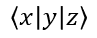

## **Overzicht**

PowerPoint slaat vergelijkingen op als Office Math Markup Language (OMML). Met Aspose.Slides voor Python via .NET kun je dezelfde soort wiskundige inhoud programmatig maken: breuken, wortels, functies, limieten, N-aire operatoren, matrices, arrays en opgemaakte wiskundige blokken.

In PowerPoint voegen gebruikers normaal gesproken vergelijkingen in via **Invoegen > Vergelijking**:


De vergelijking c² = a² + b²


Aspose.Slides bouwt die wiskundige tekst op via drie hoofdobjecten:

- Een wiskundige vorm, aangemaakt met [add_math_shape](https://reference.aspose.com/slides/nl/python-net/aspose.slides/shapecollection/add_math_shape/), is de vorm die de vergelijking bevat.
- [MathPortion](https://reference.aspose.com/slides/nl/python-net/aspose.slides.mathtext/mathportion/) slaat wiskundige inhoud op binnen het tekstkader van de vorm.
- [MathParagraph](https://reference.aspose.com/slides/nl/python-net/aspose.slides.mathtext/mathparagraph/) bevat één of meer [MathBlock](https://reference.aspose.com/slides/nl/python-net/aspose.slides.mathtext/mathblock/) objecten.

De meeste onderstaande voorbeelden gebruiken [MathematicalText](https://reference.aspose.com/slides/nl/python-net/aspose.slides.mathtext/mathematicaltext/) en de fluent‑methoden van [IMathElement](https://reference.aspose.com/slides/nl/python-net/aspose.slides.mathtext/imathelement/) zodat de code kort en leesbaar blijft.

Voor MathML‑exportscenario's, zie [Exporteer wiskundige vergelijkingen uit presentaties in Python via .NET](/slides/nl/python-net/exporting-math-equations/).

## **Maak een vergelijking**

Dit voorbeeld maakt een wiskundige vorm en voegt de stelling van Pythagoras toe:


```py
import aspose.slides as slides
import aspose.slides.mathtext as math

with slides.Presentation() as presentation:
    slide = presentation.slides[0]

    math_shape = slide.shapes.add_math_shape(20, 20, 700, 120)
    math_paragraph = math_shape.text_frame.paragraphs[0].portions[0].math_paragraph

    equation = (
        math.MathematicalText("c")
        .set_superscript("2")
        .join("=")
        .join(math.MathematicalText("a").set_superscript("2"))
        .join("+")
        .join(math.MathematicalText("b").set_superscript("2"))
    )

    math_paragraph.add(equation)

    presentation.save("pythagorean-theorem.pptx", slides.export.SaveFormat.PPTX)
```

{}
`add_math_shape` maakt een vorm die al een wiskundige alinea bevat. Toegang tot de eerste `MathPortion`, haal de `MathParagraph` op en voeg wiskundige blokken of wiskundige elementen toe.
{}

## **Voeg breuken toe**

Gebruik [`divide`](https://reference.aspose.com/slides/nl/python-net/aspose.slides.mathtext/imathelement/divide/) om een breuk te maken. Je kunt een breukstijl kiezen met [MathFractionTypes](https://reference.aspose.com/slides/nl/python-net/aspose.slides.mathtext/mathfractiontypes/).


```py
import aspose.slides as slides
import aspose.slides.mathtext as math

with slides.Presentation() as presentation:
    slide = presentation.slides[0]

    math_shape = slide.shapes.add_math_shape(20, 20, 700, 100)
    math_paragraph = math_shape.text_frame.paragraphs[0].portions[0].math_paragraph

    fraction = math.MathematicalText("1").divide("x", math.MathFractionTypes.SKEWED)

    math_paragraph.add(math.MathBlock(fraction))

    presentation.save("fraction.pptx", slides.export.SaveFormat.PPTX)
```

Voor een gestapelde breuk gebruik je `MathFractionTypes.BAR`:

```py
stacked_fraction = math.MathematicalText("x + 1").divide("y - 1", math.MathFractionTypes.BAR)
```

## **Voeg wortels toe**

Gebruik [`radical`](https://reference.aspose.com/slides/nl/python-net/aspose.slides.mathtext/imathelement/radical/) om een vierkantswortel, kubuswortel of een andere wortel te maken. Het huidige element wordt de basis en het argument wordt de graad.


```py
import aspose.slides as slides
import aspose.slides.mathtext as math

with slides.Presentation() as presentation:
    slide = presentation.slides[0]

    math_shape = slide.shapes.add_math_shape(20, 20, 700, 100)
    math_paragraph = math_shape.text_frame.paragraphs[0].portions[0].math_paragraph

    radical = math.MathematicalText("x").radical("n")

    math_paragraph.add(math.MathBlock(radical))

    presentation.save("radical.pptx", slides.export.SaveFormat.PPTX)
```

## **Voeg functies en limieten toe**

Gebruik [`as_argument_of_function`](https://reference.aspose.com/slides/nl/python-net/aspose.slides.mathtext/imathelement/as_argument_of_function/) of [`function`](https://reference.aspose.com/slides/nl/python-net/aspose.slides.mathtext/imathelement/function/) voor functies zoals `sin(x)`, `log(x)` of aangepaste functienamen. Voor limieten plaats je `lim` in een [MathLimit](https://reference.aspose.com/slides/nl/python-net/aspose.slides.mathtext/mathlimit/) of gebruik je [`set_lower_limit`](https://reference.aspose.com/slides/nl/python-net/aspose.slides.mathtext/imathelement/set_lower_limit/).


```py
import aspose.slides as slides
import aspose.slides.mathtext as math

with slides.Presentation() as presentation:
    slide = presentation.slides[0]

    math_shape = slide.shapes.add_math_shape(20, 20, 700, 100)
    math_paragraph = math_shape.text_frame.paragraphs[0].portions[0].math_paragraph

    limit = (
        math.MathematicalText("lim")
        .set_lower_limit("x\u2192\u221E")
        .function("x")
    )

    math_paragraph.add(math.MathBlock(limit))

    presentation.save("functions-and-limits.pptx", slides.export.SaveFormat.PPTX)
```

Voor een aangepaste functienaam maak je de functienaam het huidige element:

```py
custom_function = math.MathematicalText("f").function("x + 1")
```

## **Voeg N-aire operatoren en integralen toe**

Gebruik [`nary`](https://reference.aspose.com/slides/nl/python-net/aspose.slides.mathtext/imathelement/nary/) voor sommatie‑, unie‑, intersectie‑ en andere grote operatoren. Gebruik [`integral`](https://reference.aspose.com/slides/nl/python-net/aspose.slides.mathtext/imathelement/integral/) voor integralen. Beide methoden laten je onder‑ en bovengrenzen instellen.


```py
import aspose.slides as slides
import aspose.slides.mathtext as math

with slides.Presentation() as presentation:
    slide = presentation.slides[0]

    math_shape = slide.shapes.add_math_shape(20, 20, 700, 120)
    math_paragraph = math_shape.text_frame.paragraphs[0].portions[0].math_paragraph

    summation_base = (
        math.MathematicalText("x")
        .set_superscript("k")
        .join(math.MathematicalText("a").set_superscript("n-k"))
    )

    summation = summation_base.nary(math.MathNaryOperatorTypes.SUMMATION, "k=0", "n")

    math_paragraph.add(math.MathBlock(summation))

    presentation.save("nary-operators.pptx", slides.export.SaveFormat.PPTX)
```

N-aire operatoren zijn bedoeld voor grote operatoren met optionele limieten. Eenvoudige operatoren zoals `+`, `-` en `=` worden meestal toegevoegd als `MathematicalText` en samengevoegd in de uitdrukking.

Voor een integraal gebruik je `integral`:

```py
integral_base = math.MathematicalText("x").join(math.MathematicalText("dx").to_box())
integral = integral_base.integral(math.MathIntegralTypes.SIMPLE, "0", "1")
```

## **Voeg matrices toe**

Gebruik [MathMatrix](https://reference.aspose.com/slides/nl/python-net/aspose.slides.mathtext/mathmatrix/) voor rijen en kolommen. Matrices bevatten standaard geen haakjes, dus omring de matrix wanneer je ronde haakjes, vierkante haken of accolades nodig hebt.


```py
import aspose.slides as slides
import aspose.slides.mathtext as math

with slides.Presentation() as presentation:
    slide = presentation.slides[0]

    math_shape = slide.shapes.add_math_shape(20, 20, 700, 120)
    math_paragraph = math_shape.text_frame.paragraphs[0].portions[0].math_paragraph

    matrix = math.MathMatrix(2, 3)
    matrix[0, 0] = math.MathematicalText("1")
    matrix[0, 1] = math.MathematicalText("x")
    matrix[1, 0] = math.MathematicalText("x")
    matrix[1, 1] = math.MathematicalText("2")
    matrix[1, 2] = math.MathematicalText("y")

    math_paragraph.add(math.MathBlock(matrix))

    presentation.save("matrix.pptx", slides.export.SaveFormat.PPTX)
```

## **Voeg vergelijkingarrays toe**

Gebruik [`to_math_array`](https://reference.aspose.com/slides/nl/python-net/aspose.slides.mathtext/imathelement/to_math_array/) wanneer je uitgelijnde vergelijkingen of een verticale stapel van uitdrukkingen nodig hebt.


```py
import aspose.slides as slides
import aspose.slides.mathtext as math

with slides.Presentation() as presentation:
    slide = presentation.slides[0]

    math_shape = slide.shapes.add_math_shape(20, 20, 700, 140)
    math_paragraph = math_shape.text_frame.paragraphs[0].portions[0].math_paragraph

    equation_array = (
        math.MathematicalText("x")
        .join("y")
        .to_math_array()
    )

    math_paragraph.add(math.MathBlock(equation_array))

    presentation.save("equation-array.pptx", slides.export.SaveFormat.PPTX)
```

## **Voeg trigonometrische functies toe**

Gebruik [`as_argument_of_function`](https://reference.aspose.com/slides/nl/python-net/aspose.slides.mathtext/imathelement/as_argument_of_function/) wanneer het argument het huidige element is en de functienaam bekend is.


```py
import aspose.slides as slides
import aspose.slides.mathtext as math

with slides.Presentation() as presentation:
    slide = presentation.slides[0]

    math_shape = slide.shapes.add_math_shape(20, 20, 700, 100)
    math_paragraph = math_shape.text_frame.paragraphs[0].portions[0].math_paragraph

    cosine = math.MathematicalText("2x").as_argument_of_function(
        math.MathFunctionsOfOneArgument.COS
    )

    math_paragraph.add(math.MathBlock(cosine))

    presentation.save("trigonometric-function.pptx", slides.export.SaveFormat.PPTX)
```

## **Voeg subscripties en superscripties toe**

Gebruik de subscript‑ en superscript‑helpers voor indexen en exponenten. Wanneer de indexen aan de linkerkant van de basis moeten verschijnen, gebruik dan [`set_sub_superscript_on_the_left`](https://reference.aspose.com/slides/nl/python-net/aspose.slides.mathtext/imathelement/set_sub_superscript_on_the_left/).


```py
import aspose.slides as slides
import aspose.slides.mathtext as math

with slides.Presentation() as presentation:
    slide = presentation.slides[0]

    math_shape = slide.shapes.add_math_shape(20, 20, 700, 100)
    math_paragraph = math_shape.text_frame.paragraphs[0].portions[0].math_paragraph

    scripts = math.MathematicalText("Y").set_sub_superscript_on_the_left("1", "n")

    math_paragraph.add(math.MathBlock(scripts))

    presentation.save("subscript-superscript.pptx", slides.export.SaveFormat.PPTX)
```

## **Voeg begrenzers toe**

Gebruik [`enclose`](https://reference.aspose.com/slides/nl/python-net/aspose.slides.mathtext/imathelement/enclose/) om een uitdrukking binnen begrenzers te plaatsen. Je kunt ook een scheidingsteken instellen voor begrenzingsuitdrukkingen die meerdere elementen bevatten.



```py
import aspose.slides as slides
import aspose.slides.mathtext as math

with slides.Presentation() as presentation:
    slide = presentation.slides[0]

    math_shape = slide.shapes.add_math_shape(20, 20, 700, 100)
    math_paragraph = math_shape.text_frame.paragraphs[0].portions[0].math_paragraph

    delimiter = (
        math.MathematicalText("x")
        .join("y")
        .join("z")
        .enclose("<", ">")
    )
    delimiter.separator_character = "|"

    math_paragraph.add(math.MathBlock(delimiter))

    presentation.save("delimiters.pptx", slides.export.SaveFormat.PPTX)
```

## **Voeg een omkaderde vak toe**

Gebruik [`to_border_box`](https://reference.aspose.com/slides/nl/python-net/aspose.slides.mathtext/imathelement/to_border_box/) wanneer de vergelijking zelf moet worden omsloten met een rand.


```py
import aspose.slides as slides
import aspose.slides.mathtext as math

with slides.Presentation() as presentation:
    slide = presentation.slides[0]

    math_shape = slide.shapes.add_math_shape(20, 20, 700, 100)
    math_paragraph = math_shape.text_frame.paragraphs[0].portions[0].math_paragraph

    boxed_equation = (
        math.MathematicalText("a")
        .set_superscript("2")
        .join("=")
        .join(math.MathematicalText("b").set_superscript("2"))
        .join("+")
        .join(math.MathematicalText("c").set_superscript("2"))
        .to_border_box()
    )

    math_paragraph.add(math.MathBlock(boxed_equation))

    presentation.save("border-box.pptx", slides.export.SaveFormat.PPTX)
```

## **Groeperen van termen**

Gebruik [`group`](https://reference.aspose.com/slides/nl/python-net/aspose.slides.mathtext/imathelement/group/) om een groepeerteken boven of onder een uitdrukking te plaatsen. Voeg een limiet toe om de gegroepeerde termen te labelen.


```py
import aspose.slides as slides
import aspose.slides.mathtext as math

with slides.Presentation() as presentation:
    slide = presentation.slides[0]

    math_shape = slide.shapes.add_math_shape(20, 20, 700, 120)
    math_paragraph = math_shape.text_frame.paragraphs[0].portions[0].math_paragraph

    grouped = (
        math.MathematicalText("x + y")
        .group(chr(0x23DF), math.MathTopBotPositions.BOTTOM, math.MathTopBotPositions.TOP)
        .set_lower_limit("any text")
    )

    math_paragraph.add(math.MathBlock(grouped))

    presentation.save("grouped-terms.pptx", slides.export.SaveFormat.PPTX)
```

## **Formateer wiskundige elementen**

Gebruik opmaak‑helpers alleen waar ze de formule verduidelijken. Bijvoorbeeld, [`overbar`](https://reference.aspose.com/slides/nl/python-net/aspose.slides.mathtext/imathelement/overbar/) plaatst een balk boven een wiskundig element.


```py
import aspose.slides as slides
import aspose.slides.mathtext as math

with slides.Presentation() as presentation:
    slide = presentation.slides[0]

    math_shape = slide.shapes.add_math_shape(20, 20, 700, 100)
    math_paragraph = math_shape.text_frame.paragraphs[0].portions[0].math_paragraph

    overbar = math.MathematicalText("ABC").overbar()

    math_paragraph.add(math.MathBlock(overbar))

    presentation.save("overbar.pptx", slides.export.SaveFormat.PPTX)
```

## **Snelle referentie**

| Task | Main API |
| --- | --- |
| Maak wiskundige tekst | [MathematicalText](https://reference.aspose.com/slides/nl/python-net/aspose.slides.mathtext/mathematicaltext/) |
| Combineer elementen | [IMathElement.join](https://reference.aspose.com/slides/nl/python-net/aspose.slides.mathtext/imathelement/join/) |
| Maak breuken | [IMathElement.divide](https://reference.aspose.com/slides/nl/python-net/aspose.slides.mathtext/imathelement/divide/) |
| Voeg superscript of subscript toe | [set_superscript](https://reference.aspose.com/slides/nl/python-net/aspose.slides.mathtext/imathelement/set_superscript/), [set_subscript](https://reference.aspose.com/slides/nl/python-net/aspose.slides.mathtext/imathelement/set_subscript/) |
| Voeg functies toe | [function](https://reference.aspose.com/slides/nl/python-net/aspose.slides.mathtext/imathelement/function/), [as_argument_of_function](https://reference.aspose.com/slides/nl/python-net/aspose.slides.mathtext/imathelement/as_argument_of_function/) |
| Voeg wortels toe | [radical](https://reference.aspose.com/slides/nl/python-net/aspose.slides.mathtext/imathelement/radical/) |
| Voeg limieten toe | [set_lower_limit](https://reference.aspose.com/slides/nl/python-net/aspose.slides.mathtext/imathelement/set_lower_limit/), [set_upper_limit](https://reference.aspose.com/slides/nl/python-net/aspose.slides.mathtext/imathelement/set_upper_limit/) |
| Voeg scripts aan de linkerkant toe | [set_sub_superscript_on_the_left](https://reference.aspose.com/slides/nl/python-net/aspose.slides.mathtext/imathelement/set_sub_superscript_on_the_left/) |
| Voeg sommatie‑ en integralen toe | [nary](https://reference.aspose.com/slides/nl/python-net/aspose.slides.mathtext/imathelement/nary/), [integral](https://reference.aspose.com/slides/nl/python-net/aspose.slides.mathtext/imathelement/integral/) |
| Voeg matrices toe | [MathMatrix](https://reference.aspose.com/slides/nl/python-net/aspose.slides.mathtext/mathmatrix/) |
| Voeg vergelijkingarrays toe | [to_math_array](https://reference.aspose.com/slides/nl/python-net/aspose.slides.mathtext/imathelement/to_math_array/) |
| Voeg begrenzers toe | [enclose](https://reference.aspose.com/slides/nl/python-net/aspose.slides.mathtext/imathelement/enclose/) |
| Voeg balken en randen toe | [overbar](https://reference.aspose.com/slides/nl/python-net/aspose.slides.mathtext/imathelement/overbar/), [to_border_box](https://reference.aspose.com/slides/nl/python-net/aspose.slides.mathtext/imathelement/to_border_box/) |
| Groeperen van termen | [group](https://reference.aspose.com/slides/nl/python-net/aspose.slides.mathtext/imathelement/group/) |

## **Veelgestelde vragen**

**Kan ik een bestaande PowerPoint‑vergelijking bewerken?**

Ja. Open de presentatie, zoek de vorm die een `MathPortion` bevat, haal de `MathParagraph` op en werk de wiskundige blokken in die alinea bij.

**Worden vergelijkingen opgeslagen als bewerkbare PowerPoint‑wiskunde?**

Ja. Wanneer je opslaat naar PPTX, schrijft Aspose.Slides de vergelijking als bewerkbare Office‑wiskunde‑inhoud.

**Kan ik vergelijkingen exporteren naar LaTeX?**

Aspose.Slides exporteert wiskundige vergelijkingen naar MathML. Als je LaTeX nodig hebt, exporteer dan eerst naar MathML en converteer vervolgens MathML met een tool die je gewenste LaTeX‑dialect ondersteunt.