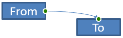

## **Introductie**

Een PowerPoint-connector is een speciale lijn die twee vormen met elkaar verbindt en bevestigd blijft wanneer de vormen worden verplaatst of herpositioneerd op een dia. Connectoren bevestigen zich aan **verbindingpunten** (groene punten) op vormen. Verbindingpunten verschijnen wanneer de cursor er dichtbij komt. **Aanpassingshandvatten** (gele punten), beschikbaar op bepaalde connectoren, stellen je in staat de positie en vorm van een connector aan te passen.

## **Connector‑typen**

In PowerPoint kun je drie soorten connectoren gebruiken: recht, elleboog (hoekig) en gebogen.

Aspose.Slides ondersteunt de volgende connector‑typen:

| Connector‑type                  | Afbeelding                                                   | Aantal aanpassingspunten |
| ------------------------------- | ------------------------------------------------------------ | ------------------------ |
| `ShapeType.LINE`                |                | 0                        |
| `ShapeType.STRAIGHT_CONNECTOR1` |      | 0                        |
| `ShapeType.BENT_CONNECTOR2`     |        | 0                        |
| `ShapeType.BENT_CONNECTOR3`     |         | 1                        |
| `ShapeType.BENT_CONNECTOR4`     |         | 2                        |
| `ShapeType.BENT_CONNECTOR5`     |         | 3                        |
| `ShapeType.CURVED_CONNECTOR2`   |       | 0                        |
| `ShapeType.CURVED_CONNECTOR3`   |       | 1                        |
| `ShapeType.CURVED_CONNECTOR4`   |       | 2                        |
| `ShapeType.CURVED_CONNECTOR5`   |       | 3                        |

## **Vormen verbinden met connectoren**

Deze sectie laat zien hoe je vormen met connectoren verbindt in Aspose.Slides. Je voegt een connector toe aan een dia, en bevestigt het begin en einde aan doelvormen. Het gebruik van verbindingpunten zorgt ervoor dat de connector “gelijmd” blijft aan de vormen, zelfs wanneer ze worden verplaatst of van formaat veranderen.

1. Maak een instantie van de [Presentation](https://reference.aspose.com/slides/nl/python-net/aspose.slides/presentation/)‑klasse.
1. Haal een referentie op naar de dia op basis van de index.
1. Voeg twee [AutoShape](https://reference.aspose.com/slides/nl/python-net/aspose.slides/autoshape/)‑objecten toe aan de dia met behulp van de `add_auto_shape`‑methode die wordt blootgesteld door het [ShapeCollection](https://reference.aspose.com/slides/nl/python-net/aspose.slides/shapecollection/)‑object.
1. Voeg een connector toe met de `add_connector`‑methode die wordt blootgesteld door het [ShapeCollection](https://reference.aspose.com/slides/nl/python-net/aspose.slides/shapecollection/)‑object en specificeer het connector‑type.
1. Verbind de vormen met de connector.
1. Roep de `reroute`‑methode aan om het kortste verbindingspad toe te passen.
1. Sla de presentatie op.

De volgende Python‑code toont hoe je een gebogen connector toevoegt tussen twee vormen (een ellips en een rechthoek):

```python
import aspose.slides as slides

# Maak een instantie van de Presentation‑klasse om een PPTX‑bestand te maken.
with slides.Presentation() as presentation:

    # Toegang tot de shapes‑collectie voor de eerste dia.
    shapes = presentation.slides[0].shapes

    # Voeg een ellips‑AutoShape toe.
    ellipse = shapes.add_auto_shape(slides.ShapeType.ELLIPSE, 50, 50, 100, 100)

    # Voeg een rechthoek‑AutoShape toe.
    rectangle = shapes.add_auto_shape(slides.ShapeType.RECTANGLE, 150, 200, 100, 100)

    # Voeg een connector toe aan de dia.
    connector = shapes.add_connector(slides.ShapeType.BENT_CONNECTOR2, 0, 0, 10, 10)

    # Verbind de vormen met de connector.
    connector.start_shape_connected_to = ellipse
    connector.end_shape_connected_to = rectangle

    # Roep reroute aan om het kortste pad in te stellen.
    connector.reroute()

    # Sla de presentatie op.
    presentation.save("connected_shapes.pptx", slides.export.SaveFormat.PPTX)
```

{}
`connector.reroute`‑methode herrouteert een connector, waardoor deze de kortst mogelijke route tussen vormen neemt. Hiervoor kan de methode de waarden van `start_shape_connection_site_index` en `end_shape_connection_site_index` wijzigen.
{}

## **Specificeer verbindingpunten**

Deze sectie legt uit hoe je een connector aan een specifiek verbindingpunt op een vorm in Aspose.Slides bevestigt. Door gerichte verbindingpunten te gebruiken, kun je de routering en lay-out van de connector beheersen, waardoor je schone, voorspelbare diagrammen in je presentaties produceert.

1. Maak een instantie van de [Presentation](https://reference.aspose.com/slides/nl/python-net/aspose.slides/presentation/)‑klasse.
1. Haal een referentie op naar de dia op basis van de index.
1. Voeg twee [AutoShape](https://reference.aspose.com/slides/nl/python-net/aspose.slides/autoshape/)‑objecten toe aan de dia met behulp van de `add_auto_shape`‑methode die wordt blootgesteld door het [ShapeCollection](https://reference.aspose.com/slides/nl/python-net/aspose.slides/shapecollection/)‑object.
1. Voeg een connector toe met de `add_connector`‑methode op het [ShapeCollection](https://reference.aspose.com/slides/nl/python-net/aspose.slides/shapecollection/)‑object en specificeer het connector‑type.
1. Verbind de vormen met de connector.
1. Stel je gewenste verbindingpunten op de vormen in.
1. Sla de presentatie op.

De volgende Python‑code demonstreert hoe je een voorkeurs‑verbindingpunt specificeert:

```python
import aspose.slides as slides

# Maak een instantie van de Presentation-klasse om een PPTX-bestand te maken.
with slides.Presentation() as presentation:

    # Toegang tot de shapes-collectie van de eerste dia.
    shapes = presentation.slides[0].shapes

    # Voeg een ellips-AutoShape toe.
    ellipse = shapes.add_auto_shape(slides.ShapeType.ELLIPSE, 50, 50, 100, 100)

    # Voeg een rechthoek-AutoShape toe.
    rectangle = shapes.add_auto_shape(slides.ShapeType.RECTANGLE, 150, 200, 100, 100)

    # Voeg een connector toe aan de shape-collectie van de dia.
    connector = shapes.add_connector(slides.ShapeType.BENT_CONNECTOR3, 0, 0, 10, 10)

    # Verbind de vormen met de connector.
    connector.start_shape_connected_to = ellipse
    connector.end_shape_connected_to = rectangle

    # Stel de voorkeurs-verbinding-site-index in op de ellips.
    site_index = 6

    # Controleer of de voorkeurs-index binnen het beschikbare aantal sites ligt.
    if  ellipse.connection_site_count > site_index:
        # Wijs de voorkeurs-verbinding-site toe op de ellips-AutoShape.
        connector.start_shape_connection_site_index = site_index

    # Sla de presentatie op.
    presentation.save("connection_points.pptx", slides.export.SaveFormat.PPTX)
```

## **Aanpassen connectorpunten**

Je kunt connectoren aanpassen via hun aanpassingspunten. Alleen connectoren die aanpassingspunten exposeren, kunnen op deze manier worden bewerkt. Voor details over welke connectoren aanpassingen ondersteunen, zie de tabel onder [Connector‑typen](/slides/nl/python-net/connector/#connector-types).

### **Eenvoudig geval**

Beschouw een geval waarbij een connector tussen twee vormen (A en B) een derde vorm (C) kruist:


Code‑voorbeeld:

```python
import aspose.slides as slides
import aspose.pydrawing as draw

with slides.Presentation() as presentation:
    slide = presentation.slides[0]

    shape = slide.shapes.add_auto_shape(slides.ShapeType.RECTANGLE, 300, 150, 150, 75)
    shape_from = slide.shapes.add_auto_shape(slides.ShapeType.RECTANGLE, 500, 400, 100, 50)
    shape_to = slide.shapes.add_auto_shape(slides.ShapeType.RECTANGLE, 100, 100, 70, 30)
    
    connector = slide.shapes.add_connector(slides.ShapeType.BENT_CONNECTOR5, 20, 20, 400, 300)
    
    connector.line_format.end_arrowhead_style = slides.LineArrowheadStyle.TRIANGLE
    connector.line_format.fill_format.fill_type = slides.FillType.SOLID
    connector.line_format.fill_format.solid_fill_color.color = draw.Color.black
    
    connector.start_shape_connected_to = shape_from
    connector.end_shape_connected_to = shape_to
    connector.start_shape_connection_site_index = 2
```

Om de derde vorm te vermijden, pas je de connector aan door het verticale segment naar links te verplaatsen:


```python
    adjustment2 = connector.adjustments[1]
    adjustment2.raw_value += 10000
```

### **Complexe gevallen**

Voor meer geavanceerde aanpassingen, overweeg het volgende:

- Het aanpasbare punt van een connector wordt bepaald door een formule die de positie berekent. Het wijzigen van dit punt kan de algehele vorm van de connector wijzigen.
- De aanpassingspunten van een connector worden opgeslagen in een strikt geordende array, genummerd vanaf het begin tot het einde van de connector.
- De waarden van aanpassingspunten vertegenwoordigen percentages van de breedte/hoogte van de connectorvorm.  
  - De vorm wordt begrensd door de start‑ en eindpunten van de connector en geschaald met 1000.  
  - Het eerste, tweede en derde aanpassingspunt stellen respectievelijk een percentage van de breedte, een percentage van de hoogte en opnieuw een percentage van de breedte voor.
- Bij het berekenen van de coördinaten van aanpassingspunten moet rekening worden gehouden met de rotatie en spiegeling van de connector. **Opmerking:** Voor alle connectoren die onder [Connector‑typen](/slides/nl/python-net/connector/#connector-types) worden vermeld, is de rotatiehoek 0.

#### **Geval 1**

Beschouw een geval waarbij twee tekstkader‑objecten met een connector worden gekoppeld:


Code‑voorbeeld:

```python
import aspose.slides as slides
import aspose.pydrawing as draw

# Maak een instantie van de Presentation-klasse om een PPTX-bestand te maken.
with slides.Presentation() as presentation:

    # Haal de eerste dia op.
    slide = presentation.slides[0]

    # Haal de eerste dia op.
    shape_from = slide.shapes.add_auto_shape(slides.ShapeType.RECTANGLE, 100, 100, 60, 25)
    shape_from.text_frame.text = "From"
    shape_to = slide.shapes.add_auto_shape(slides.ShapeType.RECTANGLE, 500, 100, 60, 25)
    shape_to.text_frame.text = "To"

    # Voeg een connector toe.
    connector = slide.shapes.add_connector(slides.ShapeType.BENT_CONNECTOR4, 20, 20, 400, 300)
    # Stel de richting van de connector in.
    connector.line_format.end_arrowhead_style = slides.LineArrowheadStyle.TRIANGLE
    # Stel de kleur van de connector in.
    connector.line_format.fill_format.fill_type = slides.FillType.SOLID
    connector.line_format.fill_format.solid_fill_color.color = draw.Color.crimson
    # Stel de lijndikte van de connector in.
    connector.line_format.width = 3

    # Koppel de vormen met de connector.
    connector.start_shape_connected_to = shape_from
    connector.start_shape_connection_site_index = 3
    connector.end_shape_connected_to = shape_to
    connector.end_shape_connection_site_index = 2

    # Haal de aanpassingspunten van de connector op.
    adjustment_0 = connector.adjustments[0]
    adjustment_1 = connector.adjustments[1]
```

**Aanpassing**

Verhoog de waarden van de aanpassingspunten van de connector door respectievelijk 20 % van de breedte en 200 % van de hoogte toe te voegen:

```python
    # Wijzig de waarden van de aanpassingspunten.
    adjustment_0.raw_value += 20000
    adjustment_1.raw_value += 200000
```

Resultaat:


Om een model te definiëren dat ons in staat stelt de coördinaten en vorm van de connectorsegmenten te bepalen, maak je een vorm die overeenkomt met het verticale onderdeel van de connector op `connector.adjustments[0]`:

```python
    # Teken het verticale component van de connector.
    x = connector.x + connector.width * adjustment_0.raw_value / 100000
    y = connector.y
    height = connector.height * adjustment_1.raw_value / 100000

    slide.shapes.add_auto_shape(slides.ShapeType.RECTANGLE, x, y, 0, height)
```

Resultaat:


#### **Geval 2**

In **Geval 1** hebben we een eenvoudige connectoraanpassing laten zien met basisprincipes. In typische scenario's moet je rekening houden met de rotatie van de connector en de weergave‑instellingen (beheerst door `connector.rotation`, `connector.frame.flip_h` en `connector.frame.flip_v`). Zo werkt het proces.

Eerst voeg je een nieuw tekstkader‑object (**To 1**) toe aan de dia (voor verbinding) en maak je een nieuwe groene connector die deze verbindt met de bestaande objecten.

```python
    # Maak een nieuw doelobject.
    shape_to_1 = sld.shapes.add_auto_shape(slides.ShapeType.RECTANGLE, 100, 400, 60, 25)
    shape_to_1.text_frame.text = "To 1"

    # Maak een nieuwe connector.
    connector = sld.shapes.add_connector(slides.ShapeType.BENT_CONNECTOR4, 20, 20, 400, 300)
    connector.line_format.end_arrowhead_style = slides.LineArrowheadStyle.TRIANGLE
    connector.line_format.fill_format.fill_type = slides.FillType.SOLID
    connector.line_format.fill_format.solid_fill_color.color = draw.Color.medium_aquamarine
    connector.line_format.width = 3

    # Verbind de objecten met de nieuw aangemaakte connector.
    connector.start_shape_connected_to = shapeFrom
    connector.start_shape_connection_site_index = 2
    connector.end_shape_connected_to = shape_to_1
    connector.end_shape_connection_site_index = 3

    # Haal de aanpassingspunten van de connector op.
    adjustment_0 = connector.adjustments[0]
    adjustment_1 = connector.adjustments[1]
    
    # Wijzig de waarden van de aanpassingspunten.
    adjustment_0.raw_value += 20000
    adjustment_1.raw_value += 200000
```

Resultaat:


Vervolgens maak je een vorm die overeenkomt met het **horizontale** segment van de connector dat door het nieuwe aanpassingspunt van de connector loopt, `connector.adjustments[0]`. Gebruik de waarden van `connector.rotation`, `connector.frame.flip_h` en `connector.frame.flip_v`, en pas de standaard coördinaten‑conversieformule toe voor rotatie rond een gegeven punt `x0`:

X = (x — x0) * cos(alpha) — (y — y0) * sin(alpha) + x0;

Y = (x — x0) * sin(alpha) + (y — y0) * cos(alpha) + y0;

In ons geval is de rotatiehoek van het object 90 graden en wordt de connector verticaal weergegeven, dus de bijbehorende code is:

```python
    # Sla de coördinaten van de connector op.
    x = connector.x
    y = connector.y
    
    # Corrigeer de coördinaten van de connector als deze is omgekeerd.
    if connector.frame.flip_h == 1:
        x += connector.width
    if connector.frame.flip_v == 1:
        y += connector.height

    # Gebruik de waarde van het aanpassingspunt als coördinaat.
    x += connector.width * adjValue_0.raw_value / 100000
    
    # Converteer de coördinaten omdat sin(90°) = 1 en cos(90°) = 0.
    xx = connector.frame.center_x - y + connector.frame.center_y
    yy = x - connector.frame.center_x + connector.frame.center_y

    # Bepaal de breedte van het horizontale segment met behulp van de waarde van het tweede aanpassingspunt.
    width = connector.height * adjValue_1.raw_value / 100000
    shape = sld.shapes.add_auto_shape(slides.ShapeType.RECTANGLE, xx, yy, width, 0)
    shape.line_format.fill_format.fill_type = slides.FillType.SOLID
    shape.line_format.fill_format.solid_fill_color.color = draw.Color.red
```

Resultaat:


We hebben berekeningen getoond die zowel eenvoudige als complexere aanpassingspunten betreffen (die rekening houden met rotatie). Met deze kennis kun je je eigen model ontwikkelen — of code schrijven — om een `GraphicsPath`‑object te verkrijgen of zelfs de aanpassingspunten van een connector in te stellen op basis van specifieke dia‑coördinaten.

## **Connector‑lijnhoeken vinden**

Gebruik het onderstaande voorbeeld om de hoek van connector‑lijnen op een dia te bepalen met Aspose.Slides. Je leert hoe je de eindpunten van een connector leest en de oriëntatie berekent zodat je pijlen, labels en andere vormen nauwkeurig kunt uitlijnen.

1. Maak een instantie van de [Presentation](https://reference.aspose.com/slides/nl/python-net/aspose.slides/presentation/)‑klasse.
1. Haal een referentie op naar de dia op basis van de index.
1. Toegang tot de connector‑lijnvorm.
1. Gebruik de breedte en hoogte van de lijn en de breedte en hoogte van het vormkader om de hoek te berekenen.

De volgende Python‑code toont hoe je de hoek van een connector‑lijnvorm berekent:

```python
import aspose.slides as slides
import math

def get_direction(w, h, flip_h, flip_v):
    end_line_x = w * (-1 if flip_h else 1)
    end_line_y = h * (-1 if flip_v else 1)
    end_y_axis_x = 0
    end_y_axis_y = h
    angle = math.atan2(end_y_axis_y, end_y_axis_x) - math.atan2(end_line_y, end_line_x)
    if (angle < 0):
         angle += 2 * math.pi
    return angle * 180.0 / math.pi

with slides.Presentation("connector_line_angle.pptx") as presentation:
    slide = presentation.slides[0]
    for shape_index in range(len(slide.shapes)):
        direction = 0.0
        shape = slide.shapes[shape_index]
        if type(shape) is slides.AutoShape and shape.shape_type == slides.ShapeType.LINE:
            direction = get_direction(shape.width, shape.height, shape.frame.flip_h, shape.frame.flip_v)
        elif type(shape) is slides.Connector:
            direction = get_direction(shape.width, shape.height, shape.frame.flip_h, shape.frame.flip_v)
        print(direction)
```

## **FAQ**

**Hoe kan ik bepalen of een connector aan een specifieke vorm kan worden "gelijmd"?**

Controleer of de vorm [verbindingpunten](https://reference.aspose.com/slides/nl/python-net/aspose.slides/shape/connection_site_count/) exposeert. Als er geen zijn of het aantal nul is, is lijmen niet beschikbaar; gebruik in dat geval vrije eindpunten en positioneer ze handmatig. Het is verstandig het aantal sites te controleren voordat je koppelt.

**Wat gebeurt er met een connector als ik een van de gekoppelde vormen verwijder?**

De uiteinden worden losgekoppeld; de connector blijft op de dia staan als een gewone lijn met vrije start/eind. Je kunt deze verwijderen of de verbindingen opnieuw toewijzen en, indien nodig, [reroute](https://reference.aspose.com/slides/nl/python-net/aspose.slides/connector/reroute/) toepassen.

**Worden connector‑bindingen behouden bij het kopiëren van een dia naar een andere presentatie?**

Over het algemeen ja, op voorwaarde dat de doel‑vormen ook worden gekopieerd. Als de dia in een ander bestand wordt ingevoegd zonder de gekoppelde vormen, worden de uiteinden vrij en moet je ze opnieuw koppelen.