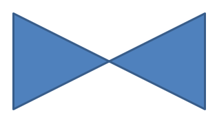

## **Inleiding**

Beschouw een vierkant. In PowerPoint, met **Edit Points**, kun je:

* een hoek van een vierkant naar binnen of naar buiten verplaatsen,
* de kromming van een hoek of punt aanpassen,
* nieuwe punten aan het vierkant toevoegen,
* de punten ervan manipuleren.

Je kunt deze bewerkingen op elke vorm toepassen. Met **Edit Points** kun je een vorm wijzigen of een nieuwe maken op basis van een bestaande vorm.

## **Tips voor het bewerken van vormen**


Voordat je begint met het bewerken van PowerPoint‑vormen met **Edit Points**, let op deze opmerkingen over vormen:

* Een vorm (of het pad ervan) kan **gesloten** of **open** zijn.  
* Een gesloten vorm heeft geen begin‑ of eindpunt; een open vorm heeft een begin en een einde.  
* Iedere vorm heeft minstens twee ankerpunten die verbonden zijn door lijnsegmenten.  
* Een segment is recht of gebogen; ankerpunten bepalen de aard van het segment.  
* Ankerpunten kunnen **hoek**, **vloeiend** of **recht** zijn:  
  * Een **hoek**‑punt is waar twee rechte segmenten elkaar onder een hoek ontmoeten.  
  * Een **vloeiend**‑punt heeft twee handvatten die collineair zijn en de aangrenzende segmenten vormen een soepele curve. In dit geval hebben beide handvatten dezelfde afstand tot het ankerpunt.  
  * Een **recht**‑punt heeft ook twee collineaire handvatten en de aangrenzende segmenten vormen een soepele curve. In dit geval hoeven de handvatten niet dezelfde afstand tot het ankerpunt te hebben.  
* Door ankerpunten te verplaatsen of te bewerken (en daarmee de hoek van segmenten te wijzigen), kun je het uiterlijk van de vorm aanpassen.

Om PowerPoint‑vormen te bewerken, biedt Aspose.Slides de [GeometryPath](https://reference.aspose.com/slides/nl/python-net/aspose.slides/geometrypath/)‑klasse.

* Een [GeometryPath](https://reference.aspose.com/slides/nl/python-net/aspose.slides/geometrypath/)‑instantie vertegenwoordigt het geometrische pad van een [GeometryShape](https://reference.aspose.com/slides/nl/python-net/aspose.slides/geometryshape/)‑object.  
* Om de [GeometryPath](https://reference.aspose.com/slides/nl/python-net/aspose.slides/geometrypath/) van een [GeometryShape](https://reference.aspose.com/slides/nl/python-net/aspose.slides/geometryshape/)‑instantie op te halen, gebruik je de methode [GeometryShape.get_geometry_paths](https://reference.aspose.com/slides/nl/python-net/aspose.slides/geometryshape/get_geometry_paths/).  
* Om de [GeometryPath](https://reference.aspose.com/slides/nl/python-net/aspose.slides/geometrypath/) voor een vorm in te stellen, gebruik je [GeometryShape.set_geometry_path](https://reference.aspose.com/slides/nl/python-net/aspose.slides/geometryshape/set_geometry_path/) voor *solide vormen* en [GeometryShape.set_geometry_paths](https://reference.aspose.com/slides/nl/python-net/aspose.slides/geometryshape/set_geometry_paths/) voor *samengestelde vormen*.  
* Om segmenten toe te voegen, gebruik je de methoden op [GeometryPath](https://reference.aspose.com/slides/nl/python-net/aspose.slides/geometrypath/).  
* Gebruik de eigenschappen [GeometryPath.stroke](https://reference.aspose.com/slides/nl/python-net/aspose.slides/geometrypath/stroke/) en [GeometryPath.fill_mode](https://reference.aspose.com/slides/nl/python-net/aspose.slides/geometrypath/fill_mode/) om het uiterlijk van een geometrisch pad te regelen.  
* Gebruik de eigenschap [GeometryPath.path_data](https://reference.aspose.com/slides/nl/python-net/aspose.slides/geometrypath/path_data/) om het geometrische pad van een vorm op te halen als een array van padsegmenten.

## **Eenvoudige bewerkingsbewerkingen**

De volgende methoden worden gebruikt voor eenvoudige bewerkingsbewerkingen.

**Voeg een lijn toe** aan het einde van een pad:

```py
line_to(point)
line_to(x, y)
```

**Voeg een lijn toe** op een opgegeven positie in een pad:

```py    
line_to(point, index)
line_to(x, y, index)
```

**Voeg een kubieke Bézier‑curve toe** aan het einde van een pad:

```py
cubic_bezier_to(point1, point2, point3)
cubic_bezier_to(x1, y1, x2, y2, x3, y3)
```

**Voeg een kubieke Bézier‑curve toe** op een opgegeven positie in een pad:

```py
cubic_bezier_to(point1, point2, point3, index)
cubic_bezier_to(x1, y1, x2, y2, x3, y3, index)
```

**Voeg een kwadratische Bézier‑curve toe** aan het einde van een pad:

```py
quadratic_bezier_to(point1, point2)
quadratic_bezier_to(x1, y1, x2, y2)
```

**Voeg een kwadratische Bézier‑curve toe** op een opgegeven positie in een pad:

```py
quadratic_bezier_to(point1, point2, index)
quadratic_bezier_to(x1, y1, x2, y2, index)
```

**Voeg een boog toe** aan een pad:

```py
arc_to(width, heigth, startAngle, sweepAngle)
```

**Sluit de huidige figuur** in een pad:

```py
close_figure()
```

**Stel de positie in voor het volgende punt**:

```py
move_to(point)
move_to(x, y)
```

**Verwijder het padsegment** op een gegeven index:

```py
remove_at(index)
```

## **Aangepaste punten aan vormen toevoegen**

Hier leer je hoe je een vrije vorm definieert door je eigen reeks punten toe te voegen. Door geordende punten en segmenttypen (recht of gebogen) op te geven en eventueel het pad te sluiten, kun je precieze aangepaste grafische elementen – polygonen, pictogrammen, call‑outs of logo’s – rechtstreeks op je dia’s tekenen.

1. Maak een instantie van de [GeometryShape](https://reference.aspose.com/slides/nl/python-net/aspose.slides/geometryshape/)‑klasse en stel het [ShapeType.RECTANGLE] in.  
2. Haal een [GeometryPath](https://reference.aspose.com/slides/nl/python-net/aspose.slides/geometrypath/)‑instantie op uit de vorm.  
3. Voeg een nieuw punt in tussen de twee bovenste punten op het pad.  
4. Voeg een nieuw punt in tussen de twee onderste punten op het pad.  
5. Pas het bijgewerkte pad toe op de vorm.

De volgende Python‑code laat zien hoe je aangepaste punten aan een vorm toevoegt:

```py
import aspose.slides as slides

with slides.Presentation() as presentation:
    slide = presentation.slides[0]

    shape = slide.shapes.add_auto_shape(slides.ShapeType.RECTANGLE, 100, 100, 200, 100)

    geometry_path = shape.get_geometry_paths()[0]
    geometry_path.line_to(100, 50, 1)
    geometry_path.line_to(100, 50, 4)

    shape.set_geometry_path(geometry_path)

    presentation.save("custom_points.pptx", slides.export.SaveFormat.PPTX)
```



## **Punten van vormen verwijderen**

Soms bevat een aangepaste vorm onnodige punten die de geometrie compliceren of de weergave beïnvloeden. Deze sectie laat zien hoe je specifieke punten uit het pad van een vorm verwijdert zodat je de omtrek kunt vereenvoudigen en een schoner, nauwkeuriger resultaat krijgt.

1. Maak een instantie van de [GeometryShape](https://reference.aspose.com/slides/nl/python-net/aspose.slides/geometryshape/)‑klasse en stel het [ShapeType.HEART] type in.  
2. Haal een [GeometryPath](https://reference.aspose.com/slides/nl/python-net/aspose.slides/geometrypath/)‑instantie op uit de vorm.  
3. Verwijder een segment uit het pad.  
4. Pas het bijgewerkte pad toe op de vorm.

De volgende Python‑code laat zien hoe je punten uit een vorm verwijdert:

```py
import aspose.slides as slides

with slides.Presentation() as presentation:
    slide = presentation.slides[0]

    shape = slide.shapes.add_auto_shape(slides.ShapeType.HEART, 100, 100, 300, 300)

    path = shape.get_geometry_paths()[0]
    path.remove_at(2)

    shape.set_geometry_path(path)

    presentation.save("removed_points.pptx", slides.export.SaveFormat.PPTX)
```


## **Aangepaste vormen maken**

Maak op maat gemaakte vectorvormen door een [GeometryPath](https://reference.aspose.com/slides/nl/python-net/aspose.slides/geometrypath/) te definiëren en deze samen te stellen uit lijnen, boogsegmenten en Bézier‑curves. Deze sectie laat zien hoe je een aangepaste geometrie vanaf nul opbouwt en de resulterende vorm aan je dia toevoegt.

1. Bepaal de punten voor de vorm.  
2. Maak een instantie van de [GeometryPath](https://reference.aspose.com/slides/nl/python-net/aspose.slides/geometrypath/)‑klasse.  
3. Vul het pad met de punten.  
4. Maak een instantie van de [GeometryShape](https://reference.aspose.com/slides/nl/python-net/aspose.slides/geometryshape/)‑klasse.  
5. Pas het pad toe op de vorm.

De volgende Python‑code laat zien hoe je een aangepaste vorm maakt:

```py
import aspose.slides as slides
import aspose.pydrawing as draw
import math

points = []

R = 100
r = 50
step = 72

for angle in range(-90, 270, step):
    radians = angle * (math.pi / 180)
    x = R * math.cos(radians)
    y = R * math.sin(radians)
    points.append(draw.PointF(x + R, y + R))

    radians = math.pi * (angle + step / 2) / 180.0
    x = r * math.cos(radians)
    y = r * math.sin(radians)
    points.append(draw.PointF(x + R, y + R))

star_path = slides.GeometryPath()
star_path.move_to(points[0])

for i in range(len(points)):
    star_path.line_to(points[i])

star_path.close_figure()

with slides.Presentation() as presentation:
    slide = presentation.slides[0]

    shape = slide.shapes.add_auto_shape(slides.ShapeType.RECTANGLE, 100, 100, R * 2, R * 2)
    shape.set_geometry_path(star_path)

    presentation.save("custom_shape.pptx", slides.export.SaveFormat.PPTX)
```


## **Samengestelde aangepaste vormen maken**

Het maken van een samengestelde aangepaste vorm stelt je in staat meerdere geometrische paden te combineren tot één herbruikbare vorm op een dia. Definieer en voeg deze paden samen om complexe visualisaties te bouwen die verder gaan dan de standaardvormen.

1. Maak een instantie van de [GeometryShape](https://reference.aspose.com/slides/nl/python-net/aspose.slides/geometryshape/)‑klasse.  
2. Maak de eerste instantie van de [GeometryPath](https://reference.aspose.com/slides/nl/python-net/aspose.slides/geometrypath/)‑klasse.  
3. Maak de tweede instantie van de [GeometryPath](https://reference.aspose.com/slides/nl/python-net/aspose.slides/geometrypath/)‑klasse.  
4. Pas beide paden toe op de vorm.

De volgende Python‑code laat zien hoe je een samengestelde aangepaste vorm maakt:

```py
import aspose.slides as slides

with slides.Presentation() as presentation:
    slide = presentation.slides[0]

    shape = slide.shapes.add_auto_shape(slides.ShapeType.RECTANGLE, 100, 100, 200, 100)

    geometry_path_0 = slides.GeometryPath()
    geometry_path_0.move_to(0, 0)
    geometry_path_0.line_to(shape.width, 0)
    geometry_path_0.line_to(shape.width, shape.height/3)
    geometry_path_0.line_to(0, shape.height / 3)
    geometry_path_0.close_figure()

    geometry_path_1 = slides.GeometryPath()
    geometry_path_1.move_to(0, shape.height/3 * 2)
    geometry_path_1.line_to(shape.width, shape.height / 3 * 2)
    geometry_path_1.line_to(shape.width, shape.height)
    geometry_path_1.line_to(0, shape.height)
    geometry_path_1.close_figure()

    shape.set_geometry_paths([ geometry_path_0, geometry_path_1])

    presentation.save("composite_shape.pptx", slides.export.SaveFormat.PPTX)
```


## **Aangepaste vormen maken met gebogen hoeken**

Deze sectie laat zien hoe je een aangepaste vorm met soepel gebogen hoeken tekent met behulp van een geometrisch pad. Je combineert rechte segmenten en cirkelboogsegmenten om de omtrek te vormen en voegt de voltooide vorm toe aan je dia.

De volgende Python‑code laat zien hoe je een aangepaste vorm met gebogen hoeken maakt:

```py
import aspose.slides as slides
import aspose.pydrawing as draw

shape_x = 20
shape_y = 20
shape_width = 300
shape_height = 200

left_top_size = 50
right_top_size = 20
right_bottom_size = 40
left_bottom_size = 10

with slides.Presentation() as presentation:
    slide = presentation.slides[0]

    shape = slide.shapes.add_auto_shape(
        slides.ShapeType.CUSTOM, shape_x, shape_y, shape_width, shape_height)

    point1 = draw.PointF(left_top_size, 0)
    point2 = draw.PointF(shape_width - right_top_size, 0)
    point3 = draw.PointF(shape_width, shape_height - right_bottom_size)
    point4 = draw.PointF(left_bottom_size, shape_height)
    point5 = draw.PointF(0, left_top_size)

    geometry_path = slides.GeometryPath()
    geometry_path.move_to(point1)
    geometry_path.line_to(point2)
    geometry_path.arc_to(right_top_size, right_top_size, 180, -90)
    geometry_path.line_to(point3)
    geometry_path.arc_to(right_bottom_size, right_bottom_size, -90, -90)
    geometry_path.line_to(point4)
    geometry_path.arc_to(left_bottom_size, left_bottom_size, 0, -90)
    geometry_path.line_to(point5)
    geometry_path.arc_to(left_top_size, left_top_size, 90, -90)
    geometry_path.close_figure()

    shape.set_geometry_path(geometry_path)

    presentation.save("curved_corners.pptx", slides.export.SaveFormat.PPTX)
```


## **Bepalen of de geometrie van een vorm gesloten is**

Een gesloten vorm wordt gedefinieerd als een vorm waarbij alle zijden met elkaar verbonden zijn, waardoor één aaneengesloten rand ontstaat zonder gaten. Zo’n vorm kan een eenvoudige geometrische figuur zijn of een complexe aangepaste omtrek. De volgende code‑voorbeeld laat zien hoe je controleert of de geometrie van een vorm gesloten is:

```py
def is_geometry_closed(geometry_shape):
    is_closed = None

    for geometry_path in geometry_shape.get_geometry_paths():
        data_length = len(geometry_path.path_data)
        if data_length == 0:
            continue

        last_segment = geometry_path.path_data[data_length - 1]
        is_closed = last_segment.path_command == PathCommandType.CLOSE

        if not is_closed:
            return False

    return is_closed
```

## **FAQ**

**Wat gebeurt er met de opvulling en de contour nadat de geometrie is vervangen?**

De stijl blijft bij de vorm; alleen de contour verandert. De opvulling en de contour worden automatisch toegepast op de nieuwe geometrie.

**Hoe roteer ik een aangepaste vorm correct samen met de geometrie?**

Gebruik de [rotation]-eigenschap van de vorm; de geometrie roteert mee met de vorm omdat deze gekoppeld is aan het eigen coördinatensysteem van de vorm.

**Kan ik een aangepaste vorm converteren naar een afbeelding om het resultaat vast te zetten?**

Ja. Exporteer het benodigde [slide](/slides/nl/python-net/convert-powerpoint-to-png/)‑gebied of de [shape](/slides/nl/python-net/create-shape-thumbnails/) zelf naar een rasterformaat; dit maakt verdere bewerking met zware geometrieën eenvoudiger.