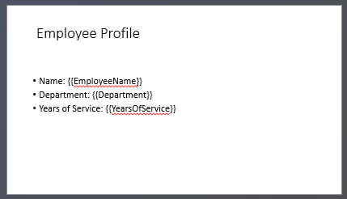

## **Introductie**

PowerPoint‑presentaties zijn een krachtige manier om informatie te tonen en te communiceren. Ze worden vaak gebruikt in combinatie met Excel‑werkmappen, waarbij Excel een uitstekende bron van gestructureerde gegevens is en PowerPoint uitblinkt in het visualiseren van die gegevens voor een publiek.

Er zijn veel praktische scenario's waarbij het combineren van Excel en PowerPoint essentieel is: mail merges, het vullen van gegevenstabellen, het genereren van één dia per gegevensrecord (batch‑dia‑generatie), het maken van trainingsmateriaal en het consolideren van meerdere Excel‑rapporten in één presentatie, om er maar een paar te noemen.

Tot nu toe vereiste het implementeren van zulke functionaliteiten met de Aspose.Slides‑API het gebruik van oplossingen van derden zoals Aspose.Cells. Hoewel deze hulpmiddelen robuust zijn, kunnen ze te complex en kostbaar zijn voor gebruikers die alleen basisgegevensintegratie nodig hebben.

## **Hoe het werkt**

Om het werken met Excel‑gegevens gemakkelijker en gestroomlijnder te maken, heeft Aspose.Slides nieuwe klassen geïntroduceerd voor het lezen van gegevens uit Excel‑werkmappen en het importeren van inhoud in een presentatie. Deze functionaliteit biedt krachtige nieuwe mogelijkheden voor API‑gebruikers die Excel willen benutten als gegevensbron binnen hun presentatieworkflows.

De nieuwe functionaliteit is ontworpen voor algemeen gegevenstoegang en is niet geïntegreerd in het Presentation Document Object Model (DOM). Dat betekent dat *het geen bewerking of opslaan van Excel‑bestanden toestaat* — het enige doel is om werkmappen te openen en door hun inhoud te navigeren om celgegevens op te halen.

In de kern van deze functionaliteit bevindt zich de nieuwe [ExcelDataWorkbook](https://reference.aspose.com/slides/nl/python-net/aspose.slides.excel/exceldataworkbook/) klasse. Deze klasse stelt je in staat een Excel‑werkmap te laden vanaf een lokaal bestand of een stream. Zodra geladen, biedt hij verschillende overloads van de [get_cell](https://reference.aspose.com/slides/nl/python-net/aspose.slides.excel/exceldataworkbook/get_cell/) methode, die je kunt gebruiken om specifieke cellen op te halen op basis van hun positie (bijv. rij‑ en kolomindexen of benoemde bereiken).

Elke oproep aan [get_cell](https://reference.aspose.com/slides/nl/python-net/aspose.slides.excel/exceldataworkbook/get_cell/) retourneert een instantie van de [ExcelDataCell](https://reference.aspose.com/slides/nl/python-net/aspose.slides.excel/exceldatacell/) klasse. Dit object vertegenwoordigt een enkele cel in de Excel‑werkmap en geeft je op een eenvoudige en intuïtieve manier toegang tot de waarde ervan.

#### **Importeer een Excel‑grafiek**

De volgende stap om de functionaliteit uit te breiden is de [ExcelWorkbookImporter](https://reference.aspose.com/slides/nl/python-net/aspose.slides.importing/excelworkbookimporter/) klasse. Deze hulpprogrammaklasse biedt functionaliteit voor het importeren van inhoud uit een Excel‑werkmap in een presentatie. Hij bevat verschillende overloads van de [add_chart_from_workbook](https://reference.aspose.com/slides/nl/python-net/aspose.slides.importing/excelworkbookimporter/add_chart_from_workbook/) methode, die je helpen de geselecteerde grafiek uit de opgegeven Excel‑werkmap op te halen en aan het einde van de opgegeven vormverzameling toe te voegen op de gespecificeerde coördinaten.

Kort samengevat is het een lichte en eenvoudige API voor het lezen van Excel‑gegevens — precies wat veel ontwikkelaars nodig hebben zonder de overhead van een volledige spreadsheet‑verwerkingsbibliotheek.

## **Laten we coderen**

### **Voorbeeld van mail‑merge scenario**

In het volgende voorbeeld implementeren we een eenvoudig mail‑merge scenario door meerdere presentaties te genereren op basis van gegevens die zijn opgeslagen in een Excel‑werkmap.

Om te beginnen hebben we twee dingen nodig:
1. Een Excel‑werkmap met de gegevens


2. PowerPoint‑presentatiesjabloon



```py
import aspose.slides as slides

# Laad de Excel-werkmap met werknemergegevens.
workbook = slides.excel.ExcelDataWorkbook("TemplateData.xlsx")
worksheet_index = 0

# Laad de presentatiesjabloon.
with slides.Presentation("PresentationTemplate.pptx") as template_presentation:

    # Doorloop de Excel‑rijen (exclusief de koprij op rij 0).
    for row_index in range(1, 5):

        # Maak een nieuwe presentatie aan voor elk werknemerrecord.
        with slides.Presentation() as employee_presentation:

            # Verwijder de standaard lege dia.
            employee_presentation.slides.remove_at(0)

            # Kloon de sjabloondia naar de nieuwe presentatie.
            slide = employee_presentation.slides.add_clone(template_presentation.slides[0])

            # Haal de alinea's op van de doelvorm (aangenomen dat vormindex 1 wordt gebruikt).
            paragraphs = slide.shapes[1].text_frame.paragraphs

            # Vervang de tijdelijke aanduidingen door gegevens uit Excel.
            employee_name = workbook.get_cell(worksheet_index, row_index, 0).value
            name_portion = paragraphs[0].portions[0]
            name_portion.text = name_portion.text.replace("{{EmployeeName}}", employee_name)

            department = workbook.get_cell(worksheet_index, row_index, 1).value
            department_portion = paragraphs[1].portions[0]
            department_portion.text = department_portion.text.replace("{{Department}}", department)

            years_of_service = str(workbook.get_cell(worksheet_index, row_index, 2).value)
            years_portion = paragraphs[2].portions[0]
            years_portion.text = years_portion.text.replace("{{YearsOfService}}", years_of_service)

            # Sla de gepersonaliseerde presentatie op in een apart bestand.
            employee_presentation.save(f"{employee_name} Report.pptx", slides.export.SaveFormat.PPTX)
```


### **Voorbeeld van Excel‑tabel**

In het tweede voorbeeld kopiëren we eenvoudig gegevens uit een Excel‑tabel en tonen we deze op een PowerPoint‑dia in een visueel aantrekkelijker formaat.

In dit voorbeeld hergebruiken we dezelfde Excel‑werkmap als in het eerste voorbeeld, die een eenvoudige werknemers‑tabel bevat.

```py
# Laad de Excel-werkmap met de werknemergegevens.
workbook = slides.excel.ExcelDataWorkbook("TemplateData.xlsx")
worksheet_index = 0

# Maak een nieuwe PowerPoint-presentatie aan.
with slides.Presentation() as presentation:

    # Voeg een tabelvorm toe aan de eerste dia.
    table = presentation.slides[0].shapes.add_table(
        50, 200,
        [200, 200, 200],
        [30, 30, 30, 30, 30]
    )

    # Vul de PowerPoint-tabel met gegevens uit de Excel-werkmap.
    for row_index in range(0, 5):
        for column_index in range(0, 3):
            cell_value = str(workbook.get_cell(worksheet_index, row_index, column_index).value)
            table.columns[column_index][row_index].text_frame.text = cell_value

    # Sla de resulterende presentatie op naar een bestand.
    presentation.save("Table.pptx", slides.export.SaveFormat.PPTX)
```


### **Voorbeeld van een Excel‑grafiek importeren**

In dit voorbeeld importeren we een grafiek uit het eerste werkblad van de Excel‑werkmap die in het vorige voorbeeld werd gebruikt. De grafiek zal in de resulterende presentatie naar de externe werkmap linken.

Eerst voegen we een cirkeldiagram toe aan de Excel‑werkmap op basis van de werknemers‑tabel.


```py
# Maak een nieuwe PowerPoint-presentatie.
with slides.Presentation() as presentation:
    # Haal de vormverzameling op van de eerste dia.
    shapes = presentation.slides[0].shapes

    # Importeer de grafiek met de naam "Chart 1" van het eerste blad van de werkmap en voeg deze toe aan de vormverzameling.
    slides.importing.ExcelWorkbookImporter.add_chart_from_workbook(
        shapes, 10, 10, "TemplateData.xlsx", "Sheet1", "Chart 1", False)

    # Sla de resulterende presentatie op in een bestand.
    presentation.save("Chart.pptx", slides.export.SaveFormat.PPTX)
```


### **Voorbeeld van alle Excel‑grafieken importeren**

Stel je voor dat je een Excel‑werkmap vol grafieken hebt en je ze allemaal in een presentatie moet importeren. Elke grafiek moet op een nieuwe dia worden geplaatst.

De volgende code doorloopt alle werkbladen in het bron‑Excel‑bestand, haalt de grafieken uit elk werkblad en voegt elke grafiek toe aan een afzonderlijke dia met een lege dia‑lay‑out. In de resulterende presentatie wordt alleen de grafiekdata ingesloten, niet de volledige werkmap.

```py
# Laad de Excel-werkmap met de werknemergegevens.
workbook = slides.excel.ExcelDataWorkbook("ExcelWithCharts.xlsx")

# Maak een nieuwe PowerPoint-presentatie.
with slides.Presentation() as presentation:
    # Haal de lege dia‑lay‑out op.
    blank_layout = presentation.layout_slides.get_by_type(slides.SlideLayoutType.BLANK)

    # Haal de namen op van alle werkbladen in de Excel-werkmap.
    worksheet_names = workbook.get_worksheet_names()

    for name in worksheet_names:
        # Haal een woordenboek op dat chart‑indexen naar chart‑namen voor het werkblad mapt.
        worksheet_charts = workbook.get_charts_from_worksheet(name)
        
        for chart in worksheet_charts:
            # Voeg een nieuwe dia toe met behulp van de lege lay‑out.
            slide = presentation.slides.add_empty_slide(blank_layout)

            # Importeer de opgegeven chart uit de Excel-werkmap in de vormverzameling van de dia.
            slides.importing.ExcelWorkbookImporter.add_chart_from_workbook(
                slide.shapes, 10, 10, workbook, name, chart.key, False)

    # Sla de resulterende presentatie op in een bestand.
    presentation.save("Charts.pptx", slides.export.SaveFormat.PPTX)
```

## **Samenvatting**

Dit mechanisme, direct beschikbaar in Aspose.Slides, combineert het werken met Excel‑gegevens en presentaties op één plek. Het stelt je in staat dia's te maken met visuele grafieken en gegevens gepresenteerd als Excel‑tabellen — zonder extra bibliotheken of complexe integraties.