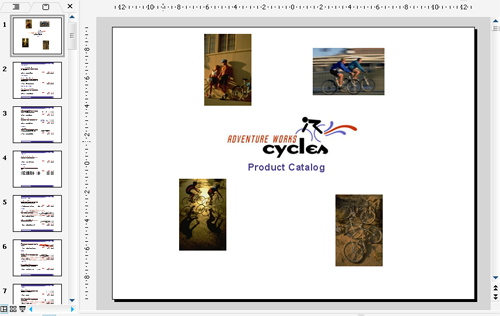

{} 

Aspose.Slides for Reporting Services ondersteunt volledig alle RDL-specificaties. Dit betekent twee geweldige dingen: 

- Geen noodzaak om bestaande rapporten opnieuw te ontwerpen. U kunt elk bestaand RDL-rapport exporteren als een Microsoft PowerPoint‑presentatie en het zal precies overeenkomen met het RDL‑ontwerp.
- Geen noodzaak om een specifieke rapportontwerper te gebruiken. U kunt elke RDL‑rapportontwerper gebruiken en het rapport wordt exact geëxporteerd zoals u het hebt ontworpen.

{} 

Aspose.Slides for Reporting Services ondersteunt de volgende RDL-elementen: 

- Pagina, kopteksten, voetteksten
- Tekstvakken
- Afbeeldingen
- Subrapporten
- Grafieken
- Lijsten
- Tabellen
- Matrizen
- Stijlen
- Rechthoeken

**Een voorbeeld van een rapport met kopteksten, voetteksten, afbeeldingen, subrapporten, tabellen, tekstvakken en rechthoeken geëxporteerd als een Microsoft PowerPoint (PPT)-presentatie.** 

Voor meer voorbeeldrapporten, zie de [Galerij van voorbeeldrapporten](/slides/nl/reportingservices/sample-reports-gallery/) sectie.