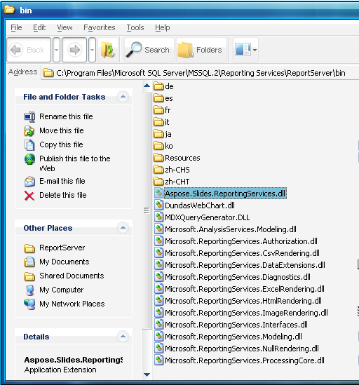

{} 

Aspose.Slides for Reporting Services is een renderingextensie voor Microsoft SQL Server Reporting Services.  
Aspose.Slides for Reporting Services wordt geleverd als één MSI‑installer die kan worden geïnstalleerd op computers met een van de volgende: 

- Microsoft SQL Server 2005 Reporting Services (32-bit en 64-bit)
- Microsoft SQL Server 2008 Reporting Services (32-bit en 64-bit)

Het is bovendien eenvoudig om Aspose.Slides for Reporting Services handmatig te implementeren en te beheren, omdat het bestaat uit slechts één .NET‑assembly *Aspose.Slides* *.ReportingServices.dll* , volledig geschreven in C#, CLS‑conform en die alleen veilige beheerde code bevat. 

{} 

De MSI‑installer en de ZIP‑download bevatten Aspose.Slides for ReportingServices: 

- Bin\SSRS2005\Aspose.Slides.ReportingServices.dll – gebouwd voor Microsoft SQL Server 2005 en .NET Framework 2.0 (te gebruiken voor x86 en x64)
- Bin\SSRS2008\Aspose.Slides.ReportingServices.dll – gebouwd voor Microsoft SQL Server 2008 en .NET Framework 2.0 (te gebruiken voor x86 en x64)

Tijdens de installatie wordt Aspose.Slides.ReportingServices.dll gekopieerd naar de ReportServer\bin map en wordt het configuratiebestand bijgewerkt zodat Reporting Services op de hoogte is van de nieuwe renderingextensie. Deze stappen worden uitgevoerd door de Aspose.Slides for Reporting Services installer, maar u kunt ze ook handmatig uitvoeren zoals later in deze documentatie beschreven. 

**Figuur**: Aspose.Slides.ReportingServices.dll wordt gekopieerd naar de **ReportServer\bin** map.