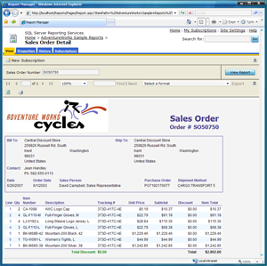

{} 

Aspose.Slides for Reporting Services exporteert rapporten als Microsoft PowerPoint‑presentaties op zodanige wijze dat ze identiek lijken aan rapporten die geëxporteerd worden door de ingebouwde renderers van Microsoft SQL Server Reporting Services. 

{} 

|**HTML, geëxporteerd door de ingebouwde renderer van Microsoft SQL Server Reporting Services** |**PPT, geëxporteerd door Aspose.Slides for Reporting Services** |
| :- | :- |
|||
|**HTML, geëxporteerd door de ingebouwde renderer van Microsoft SQL Server Reporting Services** |**PPT, geëxporteerd door Aspose.Slides for Reporting Services** |
|||