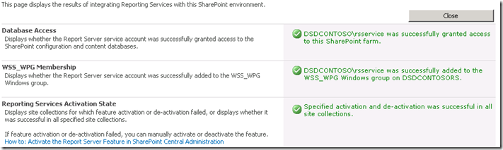

{} 

Nu SharePoint is geïnstalleerd en geconfigureerd op de RS‑server en RS is ingesteld via de Reporting Services Configuration Manager, kunnen we verder gaan met de configuratie in Central Admin. RS 2008 R2 heeft dit proces sterk vereenvoudigd. Voorheen moesten er drie stappen worden uitgevoerd om dit te laten werken. Nu is er slechts één stap. 

We gaan naar de website van Central Administrator en vervolgens naar General Application Settings. Onderaan zien we Reporting Services. 

{} 

**Figuur 17**: SharePoint‑configuratie 

{} 

Klik op **Reporting Services Integration**. 

{} 
## **Web Service‑URL**
We voeren de URL van de Report Server in die we hebben gevonden in de Reporting Services Configuration Manager. 
## **Authenticatiemodus**
We selecteren ook een Authenticatiemodus. De volgende MSDN‑link bespreekt in detail wat deze zijn. 
[Overzicht van beveiliging voor Reporting Services in SharePoint‑geïntegreerde modus](https://docs.microsoft.com/en-us/previous-versions/sql/sql-server-2008-r2/bb283324(v=sql.105)) 

Kort samengevat, als uw site **Claims‑authenticatie** gebruikt, zult u altijd Trusted Authentication gebruiken, ongeacht wat u hier kiest. Als u Windows‑referenties wilt doorgeven, kiest u Windows Authentication. Voor Trusted Authentication geven we het SPUser‑token door en vertrouwen we niet op de Windows‑referentie. 

U wilt Trusted Authentication ook gebruiken als u uw Classic‑Mode‑sites hebt geconfigureerd voor NTLM en RS is ingesteld op NTLM. Kerberos is nodig om Windows Authentication te gebruiken en dit door te geven aan uw gegevensbron. 

**Figuur 18**: Instellen van Reporting Services Integration‑referenties
## **Feature activeren**
Dit biedt u de mogelijkheid om Reporting Services te activeren voor alle site‑collecties, of u kunt kiezen op welke u het wilt activeren. Dit betekent in feite welke sites Reporting Services kunnen gebruiken. Wanneer het voltooid is, ziet u de volgende figuur. 

**Figuur 19**: Succesvolle integratie van Reporting Services met de SharePoint‑omgeving 

Als we teruggaan naar de Report Server‑URL zoals weergegeven in Figuur 14, zouden we iets soortgelijks als de volgende figuur moeten zien. 

**Figuur 20**: Succesvolle verificatie van Reporting Services met de SharePoint‑omgeving 

{} 

Als uw SharePoint‑site is geconfigureerd voor SSL, verschijnt deze niet in deze lijst. Het is een bekend probleem en betekent niet dat er een fout is. Uw rapporten zouden nog steeds moeten werken. 

{} 

Nu zijn we klaar om Reporting Services te gebruiken in SharePoint 2010. Net als bij de vorige versie hebben we een feature (geactiveerd wanneer we Reporting Services Integration configureren) in de “Site Collection Feature”. De installatie heeft ook drie content‑types toegevoegd aan onze site. In Figuur 21 zien we twee van die content‑types in een documentbibliotheek om een aangepast rapport te maken, zoals te zien in Figuur 21. 

**Figuur 21**: Report Builder 

De “**Reporter Builder**” is een ActiveX‑component die we op de server moeten downloaden, zoals te zien in Figuur 22. 

**Figuur 22**: Download en installatie van Report Builder 

Wanneer de download is voltooid, start u **Report Builder**. Nu kunnen we ons eerste rapport ontwerpen, zoals te zien in Figuur 23. 

**Figuur 23**: Report Builder - wizard voor nieuwe rapportgeneratie 

Nadat we ons rapport hebben gemaakt, kunnen we het opslaan in de aangemaakte documentbibliotheek om de rapporten in onze SharePoint 2010 te plaatsen. 

Het andere content‑type moet worden gebruikt om een gedeelde verbinding als gegevensbron te maken en deze op te slaan in een documentbibliotheek in SharePoint. We kunnen een documentbibliotheek maken, dit content‑type toevoegen en vervolgens onze verbindingen beschikbaar hebben om de gegevensbron van de rapporten te wijzigen. 

**Figuur 24**: Succesvolle export van rapport naar Report Server