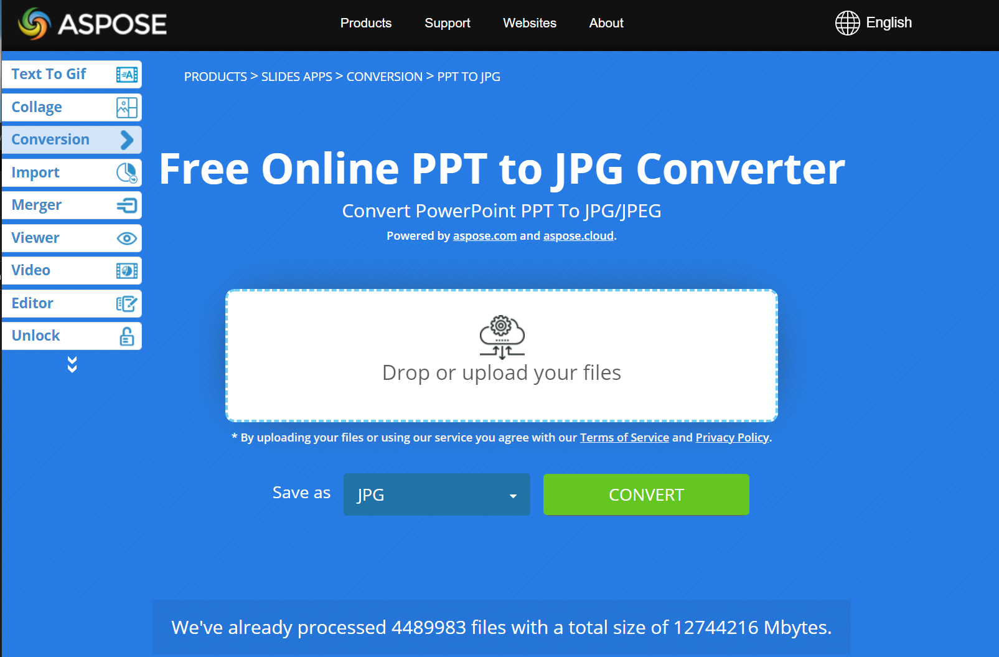

## **About PowerPoint to JPG Conversion**
With [**Aspose.Slides API**](https://products.aspose.com/slides/java/) you can convert PowerPoint PPT or PPTX presentation to JPG image. It is also possible to convert PPT/PPTX to JPEG, PNG or SVG. With this features it's easy to implement your own presentation viewer, create  the thumbnail for every slide. This may be useful if you want to protect presentation slides from copywriting, demonstrate presentation in read-only mode. Aspose.Slides allows to convert the whole presentation or a certain slide into image formats. 

{} 

To see how Aspose.Slides converts PowerPoint to JPG images, you may want to try these free online converters: PowerPoint [PPTX to JPG](https://products.aspose.app/slides/conversion/pptx-to-jpg) and [PPT to JPG](https://products.aspose.app/slides/conversion/ppt-to-jpg). 

{} 

[

## **Convert PowerPoint PPT/PPTX to JPG**
Here are the steps to convert PPT/PPTX to JPG:

1. Create an instance of [Presentation](https://reference.aspose.com/slides/nodejs-java/aspose.slides/Presentation) type.
2. Get the slide object of [ISlide](https://reference.aspose.com/slides/nodejs-java/aspose.slides/ISlide) type from [Presentation.getSlides()](https://reference.aspose.com/slides/nodejs-java/aspose.slides/Presentation#getSlides--) collection.
3. Create the thumbnail of each slide and then convert it into JPG. [**ISlide.getImage(float scaleX, float scaleY)**](https://reference.aspose.com/slides/nodejs-java/aspose.slides/ISlide#getImage-float-float-) method is used to get a thumbnail of a slide, it returns [Images](https://reference.aspose.com/slides/nodejs-java/aspose.slides/Images) object as a result. [getImage](https://reference.aspose.com/slides/nodejs-java/aspose.slides/ISlide#getImage-aspose.slides.IRenderingOptions-float-float-) method has to be called from the needed slide of [ISlide](https://reference.aspose.com/slides/nodejs-java/aspose.slides/ISlide) type, the scales of the resulting thumbnail are passed into the method.
4. After you get the slide thumbnail, call [**IImage.save(String formatName, int imageFormat)**](https://reference.aspose.com/slides/nodejs-java/aspose.slides/IImage#save(String formatName, int imageFormat)) method from the thumbnail object. Pass the resulting file name and the image format into it. 

{}

**Note**: PPT/PPTX to JPG conversion differs from the conversion to other types in Aspose.Slides API. For other types, you usually use [**IPresentation.Save(String fname, int format, ISaveOptions options)**](https://reference.aspose.com/slides/nodejs-java/aspose.slides/IPresentation#save-java.lang.String-int-aspose.slides.ISaveOptions-) method, but here you need [**IImage.save(String formatName, int imageFormat)**](https://reference.aspose.com/slides/nodejs-java/aspose.slides/IImage#save(String formatName, int imageFormat)) method.

{} 

```javascript
    var pres = new  aspose.slides.Presentation("PowerPoint-Presentation.pptx");
    try {
        pres.getSlides().forEach(function(sld) {
            // Creates a full scale image
            var slideImage = sld.getImage(1.0, 1.0);
            // Saves the image to disk in JPEG format
            try {
                slideImage.save(java.callStaticMethodSync("java.lang.String", "format", "Slide_%d.jpg", sld.getSlideNumber()), aspose.slides.ImageFormat.Jpeg);
            } finally {
                if (slideImage != null) {
                    slideImage.dispose();
                }
            }
        });
    } finally {
        if (pres != null) {
            pres.dispose();
        }
    }
```

## **Convert PowerPoint PPT/PPTX to JPG with Customized Dimensions**
To change the dimension of the resulting thumbnail and JPG image, you can set the *ScaleX* and *ScaleY* values by passing them into the [**ISlide.getImage(float scaleX, float scaleY)**](https://reference.aspose.com/slides/nodejs-java/aspose.slides/ISlide#getImage-float-float-) methods:

```javascript
    var pres = new  aspose.slides.Presentation("PowerPoint-Presentation.pptx");
    try {
        // Defines dimensions
        var desiredX = 1200;
        var desiredY = 800;
        // Gets scaled values of X and Y
        var ScaleX = 1.0 / pres.getSlideSize().getSize().getWidth() * desiredX;
        var ScaleY = 1.0 / pres.getSlideSize().getSize().getHeight() * desiredY;
        pres.getSlides().forEach(function(sld) {
            // Creates a full scale image
            var slideImage = sld.getImage(ScaleX, ScaleY);
            // Saves the image to disk in JPEG format
            try {
                slideImage.save(java.callStaticMethodSync("java.lang.String", "format", "Slide_%d.jpg", sld.getSlideNumber()), aspose.slides.ImageFormat.Jpeg);
            } finally {
                if (slideImage != null) {
                    slideImage.dispose();
                }
            }
        });
    } finally {
        if (pres != null) {
            pres.dispose();
        }
    }
```

## **Render Comments when saving Presentation into Image**
Aspose.Slides for Java provides a facility that allows you to render comments in a presentation's slides when you are converting those slides into images. This Java code demonstrates the operation:

```javascript
    var pres = new  aspose.slides.Presentation("presentation.pptx");
    try {
        var notesOptions = new  aspose.slides.NotesCommentsLayoutingOptions();
        notesOptions.setNotesPosition(aspose.slides.NotesPositions.BottomTruncated);
        var opts = new  aspose.slides.RenderingOptions();
        opts.setSlidesLayoutOptions(notesOptions);
        pres.getSlides().forEach(function(sld) {
            var slideImage = sld.getImage(opts, java.newInstanceSync("java.awt.Dimension", 740, 960));
            try {
                slideImage.save(java.callStaticMethodSync("java.lang.String", "format", "Slide_%d.png", sld.getSlideNumber()));
            } finally {
                if (slideImage != null) {
                    slideImage.dispose();
                }
            }
        });
    } finally {
        if (pres != null) {
            pres.dispose();
        }
    }
```

{}

Aspose provides a [FREE Collage web app](https://products.aspose.app/slides/collage). Using this online service, you can merge [JPG to JPG](https://products.aspose.app/slides/collage/jpg) or PNG to PNG images, create [photo grids](https://products.aspose.app/slides/collage/photo-grid), and so on. 

Using the same principles described in this article, you can convert images from one format to another. For more information, see these pages: convert [image to JPG](https://products.aspose.com/slides/java/conversion/image-to-jpg/); convert [JPG to image](https://products.aspose.com/slides/java/conversion/jpg-to-image/); convert [JPG to PNG](https://products.aspose.com/slides/java/conversion/jpg-to-png/), convert [PNG to JPG](https://products.aspose.com/slides/java/conversion/png-to-jpg/); convert [PNG to SVG](https://products.aspose.com/slides/java/conversion/png-to-svg/), convert [SVG to PNG](https://products.aspose.com/slides/java/conversion/svg-to-png/).

{}

## **See also**

See other options to convert PPT/PPTX into image like:

- [PPT/PPTX to SVG conversion](/slides/java/render-a-slide-as-an-svg-image/).
