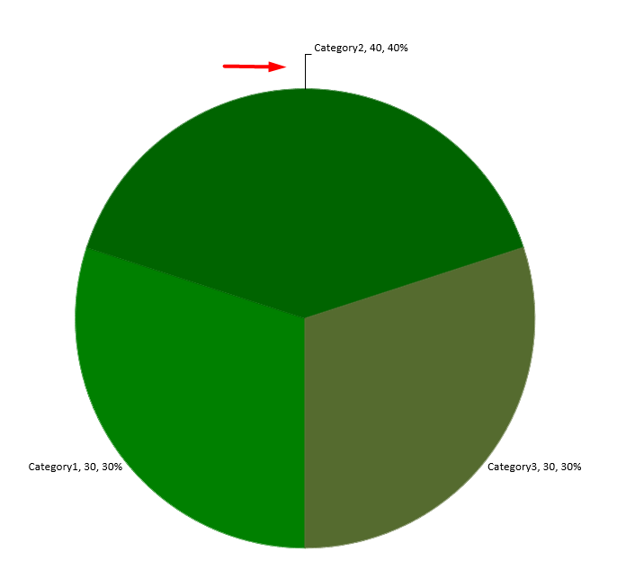

Data labels on a chart show details about the chart data series or individual data points. They allow readers to quickly identify data series and they also make charts easier to understand.

## **Set Precision of Data in Chart Data Labels**

This Java code shows you how to set the data precision in a chart data label:

```javascript
    var pres = new  com.aspose.slides.Presentation();
    try {
        var chart = pres.getSlides().get_Item(0).getShapes().addChart(com.aspose.slides.ChartType.Line, 50, 50, 450, 300);
        chart.setDataTable(true);
        chart.getChartData().getSeries().get_Item(0).setNumberFormatOfValues("#,##0.00");
        pres.save("output.pptx", com.aspose.slides.SaveFormat.Pptx);
    } finally {
        if (pres != null) {
            pres.dispose();
        }
    }
```

## **Display Percentage as Labels**
Aspose.Slides for Java allows you to set percentage labels on displayed charts. This Java code demonstrates the operation:

```javascript
    // Creates an instance of the Presentation class
    var pres = new  com.aspose.slides.Presentation();
    try {
        // Gets the first slide
        var slide = pres.getSlides().get_Item(0);
        var chart = slide.getShapes().addChart(com.aspose.slides.ChartType.StackedColumn, 20, 20, 400, 400);
        var series;
        var total_for_Cat = new double[chart.getChartData().getCategories().size()];
        for (var k = 0; k < chart.getChartData().getCategories().size(); k++) {
            var cat = chart.getChartData().getCategories().get_Item(k);
            for (var i = 0; i < chart.getChartData().getSeries().size(); i++) {
                total_for_Cat[k] = total_for_Cat[k] + chart.getChartData().getSeries().get_Item(i).getDataPoints().get_Item(k).getValue().getData();
            }
        }
        var dataPontPercent = 0.0;
        for (var x = 0; x < chart.getChartData().getSeries().size(); x++) {
            series = chart.getChartData().getSeries().get_Item(x);
            series.getLabels().getDefaultDataLabelFormat().setShowLegendKey(false);
            for (var j = 0; j < series.getDataPoints().size(); j++) {
                var lbl = series.getDataPoints().get_Item(j).getLabel();
                dataPontPercent = (series.getDataPoints().get_Item(j).getValue().getData() / total_for_Cat[j]) * 100;
                var port = new  com.aspose.slides.Portion();
                port.setText(java.callStaticMethodSync("java.lang.String", "format", "{0:F2} %.2f", dataPontPercent));
                port.getPortionFormat().setFontHeight(8.0);
                lbl.getTextFrameForOverriding().setText("");
                var para = lbl.getTextFrameForOverriding().getParagraphs().get_Item(0);
                para.getPortions().add(port);
                lbl.getDataLabelFormat().setShowSeriesName(false);
                lbl.getDataLabelFormat().setShowPercentage(false);
                lbl.getDataLabelFormat().setShowLegendKey(false);
                lbl.getDataLabelFormat().setShowCategoryName(false);
                lbl.getDataLabelFormat().setShowBubbleSize(false);
            }
        }
        // Saves the presentation containing the chart
        pres.save("output.pptx", com.aspose.slides.SaveFormat.Pptx);
    } finally {
        if (pres != null) {
            pres.dispose();
        }
    }
```

## **Set Percentage Sign with Chart Data Labels**
This Java code shows you to set the percentage sign for a chart data label:

```javascript
    // Creates an instance of the Presentation class
    var pres = new  com.aspose.slides.Presentation();
    try {
        // Gets a slide's reference through its index
        var slide = pres.getSlides().get_Item(0);
        // Creates the PercentsStackedColumn chart on a slide
        var chart = slide.getShapes().addChart(com.aspose.slides.ChartType.PercentsStackedColumn, 20, 20, 500, 400);
        // Sets the NumberFormatLinkedToSource to false
        chart.getAxes().getVerticalAxis().setNumberFormatLinkedToSource(false);
        chart.getAxes().getVerticalAxis().setNumberFormat("0.00%");
        chart.getChartData().getSeries().clear();
        var defaultWorksheetIndex = 0;
        // Gets the chart data worksheet
        var workbook = chart.getChartData().getChartDataWorkbook();
        // Adds new series
        var series = chart.getChartData().getSeries().add(workbook.getCell(defaultWorksheetIndex, 0, 1, "Reds"), chart.getType());
        series.getDataPoints().addDataPointForBarSeries(workbook.getCell(defaultWorksheetIndex, 1, 1, 0.3));
        series.getDataPoints().addDataPointForBarSeries(workbook.getCell(defaultWorksheetIndex, 2, 1, 0.5));
        series.getDataPoints().addDataPointForBarSeries(workbook.getCell(defaultWorksheetIndex, 3, 1, 0.8));
        series.getDataPoints().addDataPointForBarSeries(workbook.getCell(defaultWorksheetIndex, 4, 1, 0.65));
        // Sets the fill color of series
        series.getFormat().getFill().setFillType(com.aspose.slides.FillType.Solid);
        series.getFormat().getFill().getSolidFillColor().setColor(java.getStaticFieldValue("java.awt.Color", "RED"));
        // Sets the LabelFormat properties
        series.getLabels().getDefaultDataLabelFormat().setShowValue(true);
        series.getLabels().getDefaultDataLabelFormat().setNumberFormatLinkedToSource(false);
        series.getLabels().getDefaultDataLabelFormat().setNumberFormat("0.0%");
        series.getLabels().getDefaultDataLabelFormat().getTextFormat().getPortionFormat().setFontHeight(10);
        series.getLabels().getDefaultDataLabelFormat().getTextFormat().getPortionFormat().getFillFormat().setFillType(com.aspose.slides.FillType.Solid);
        series.getLabels().getDefaultDataLabelFormat().getTextFormat().getPortionFormat().getFillFormat().getSolidFillColor().setColor(java.getStaticFieldValue("java.awt.Color", "WHITE"));
        series.getLabels().getDefaultDataLabelFormat().setShowValue(true);
        // Adds new series
        var series2 = chart.getChartData().getSeries().add(workbook.getCell(defaultWorksheetIndex, 0, 2, "Blues"), chart.getType());
        series2.getDataPoints().addDataPointForBarSeries(workbook.getCell(defaultWorksheetIndex, 1, 2, 0.7));
        series2.getDataPoints().addDataPointForBarSeries(workbook.getCell(defaultWorksheetIndex, 2, 2, 0.5));
        series2.getDataPoints().addDataPointForBarSeries(workbook.getCell(defaultWorksheetIndex, 3, 2, 0.2));
        series2.getDataPoints().addDataPointForBarSeries(workbook.getCell(defaultWorksheetIndex, 4, 2, 0.35));
        // Sets Fill type and color
        series2.getFormat().getFill().setFillType(com.aspose.slides.FillType.Solid);
        series2.getFormat().getFill().getSolidFillColor().setColor(java.getStaticFieldValue("java.awt.Color", "BLUE"));
        series2.getLabels().getDefaultDataLabelFormat().setShowValue(true);
        series2.getLabels().getDefaultDataLabelFormat().setNumberFormatLinkedToSource(false);
        series2.getLabels().getDefaultDataLabelFormat().setNumberFormat("0.0%");
        series2.getLabels().getDefaultDataLabelFormat().getTextFormat().getPortionFormat().setFontHeight(10);
        series2.getLabels().getDefaultDataLabelFormat().getTextFormat().getPortionFormat().getFillFormat().setFillType(com.aspose.slides.FillType.Solid);
        series2.getLabels().getDefaultDataLabelFormat().getTextFormat().getPortionFormat().getFillFormat().getSolidFillColor().setColor(java.getStaticFieldValue("java.awt.Color", "WHITE"));
        // Writes the presentation to disk
        pres.save("SetDataLabelsPercentageSign_out.pptx", com.aspose.slides.SaveFormat.Pptx);
    } finally {
        if (pres != null) {
            pres.dispose();
        }
    }
```

## **Set Label Distances** From Axis
This Java code shows you how to set the label distance from a category axis when you are dealing with a chart plotted from axes:

```javascript
    // Creates an instance of the Presentation class
    var pres = new  com.aspose.slides.Presentation();
    try {
        // Gets a slide's reference
        var sld = pres.getSlides().get_Item(0);
        // Creates a chart on the slide
        var ch = sld.getShapes().addChart(com.aspose.slides.ChartType.ClusteredColumn, 20, 20, 500, 300);
        // Sets the label distance from an axis
        ch.getAxes().getHorizontalAxis().setLabelOffset(500);
        // WriteS the presentation to disk
        pres.save("output.pptx", com.aspose.slides.SaveFormat.Pptx);
    } finally {
        if (pres != null) {
            pres.dispose();
        }
    }
```

## **Adjust Label Location**

When you create a chart that does not rely on any axis such as a pie chart, the chart's data labels may end up being too close to its edge. In such a case, you have to adjust the location of the data label so that the leader lines get displayed clearly.

This Java code shows you how to adjust the label location on a pie chart:

```javascript
    var pres = new  com.aspose.slides.Presentation();
    try {
        var chart = pres.getSlides().get_Item(0).getShapes().addChart(com.aspose.slides.ChartType.Pie, 50, 50, 200, 200);
        var series = chart.getChartData().getSeries();
        var label = series.get_Item(0).getLabels().get_Item(0);
        label.getDataLabelFormat().setShowValue(true);
        label.getDataLabelFormat().setPosition(com.aspose.slides.LegendDataLabelPosition.OutsideEnd);
        label.setX(0.71);
        label.setY(0.04);
        pres.save("pres.pptx", com.aspose.slides.SaveFormat.Pptx);
    } finally {
        if (pres != null) {
            pres.dispose();
        }
    }
```


