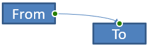
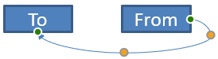
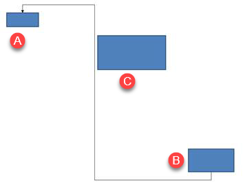

A PowerPoint connector is a special line that connects or links two shapes together and stays attached to shapes even when they are moved or repositioned on a given slide. 

Connectors are typically connected to *connection dots* (green dots), which exist on all shapes by default. Connection dots appear when a cursor comes close to them.

*Adjustment points* (orange dots), which exist only on certain connectors, are used to modify connectors' positions and shapes.

## **Types of Connectors**

In PowerPoint, you can use straight, elbow (angled), and curved connectors. 

Aspose.Slides provides these connectors:

| Connector                      | Image                                                        | Number of adjustment points |
| ------------------------------ | ------------------------------------------------------------ | --------------------------- |
| `ShapeType.Line`               |       | 0                           |
| `ShapeType.StraightConnector1` |  | 0                           |
| `ShapeType.BentConnector2`     |   | 0                           |
| `ShapeType.BentConnector3`     |     | 1                           |
| `ShapeType.BentConnector4`     |     | 2                           |
| `ShapeType.BentConnector5`     |     | 3                           |
| `ShapeType.CurvedConnector2`   |  | 0                           |
| `ShapeType.CurvedConnector3`   |  | 1                           |
| `ShapeType.CurvedConnector4`   |  | 2                           |
| `ShapeType.CurvedConnector5`   |  | 3                           |

## **Connect Shapes Using Connectors**

1. Create an instance of the [Presentation](https://apireference.aspose.com/slides/java/com.aspose.slides/Presentation) class.
1. Get a slide's reference through its index.
1. Add two [AutoShape](https://reference.aspose.com/slides/java/com.aspose.slides/AutoShape) to the slide using the `addAutoShape` method exposed by the `Shapes` object.
1. Add a connector using the `addConnector` method exposed by the `Shapes` object by defining the connector type.
1. Connect the shapes using the connector. 
1. Call the `reroute` method to apply the shortest connection path.
1. Save the presentation. 

This Java code shows you how to add a connector (a bent connector) between two shapes (an ellipse and rectangle):

```javascript
    // Instantiates a presentation class that represents the PPTX file
    var pres = new  com.aspose.slides.Presentation();
    try {
        // Accesses the shapes collection for a specific slide
        var shapes = pres.getSlides().get_Item(0).getShapes();
        // Adds an Ellipse autoshape
        var ellipse = shapes.addAutoShape(com.aspose.slides.ShapeType.Ellipse, 0, 100, 100, 100);
        // Adds a Rectangle autoshape
        var rectangle = shapes.addAutoShape(com.aspose.slides.ShapeType.Rectangle, 100, 300, 100, 100);
        // Adds a connector shape to the slide shape collection
        var connector = shapes.addConnector(com.aspose.slides.ShapeType.BentConnector2, 0, 0, 10, 10);
        // Connects the shapes using the connector
        connector.setStartShapeConnectedTo(ellipse);
        connector.setEndShapeConnectedTo(rectangle);
        // Calls reroute that sets the automatic shortest path between shapes
        connector.reroute();
        // Saves the presentation
        pres.save("output.pptx", com.aspose.slides.SaveFormat.Pptx);
    } finally {
        if (pres != null) {
            pres.dispose();
        }
    }
```

{} 

The `Connector.reroute` method reroutes a connector and forces it to take the shortest possible path between shapes. To achieve its aim, the method may change the `setStartShapeConnectionSiteIndex` and `setEndShapeConnectionSiteIndex` points. 

{} 

## **Specify Connection Dot**

If you want a connector to link two shapes using specific dots on the shapes, you have to specify your preferred connection dots this way:

1. Create an instance of the [Presentation](https://reference.aspose.com/slides/java/com.aspose.slides/Presentation) class.
1. Get a slide's reference through its index.
1. Add two [AutoShape](https://reference.aspose.com/slides/java/com.aspose.slides/AutoShape) to the slide using the `addAutoShape` method exposed by the `Shapes` object.
1. Add a connector using the `addConnector` method exposed by the `Shapes` object by defining the connector type.
1. Connect the shapes using the connector. 
1. Set your preferred connection dots on the shapes. 
1. Save the presentation.

This Java code demonstrates an operation where a preferred connection dot is specified:

```javascript
    // Instantiates a presentation class that represents a PPTX file
    var pres = new  com.aspose.slides.Presentation();
    try {
        // Accesses the shapes collection for a specific slide
        var shapes = pres.getSlides().get_Item(0).getShapes();
        // Add an Ellipse autoshape
        var ellipse = shapes.addAutoShape(com.aspose.slides.ShapeType.Ellipse, 0, 100, 100, 100);
        // Add a Rectangle autoshape
        var rectangle = shapes.addAutoShape(com.aspose.slides.ShapeType.Rectangle, 100, 300, 100, 100);
        // Adds a connector shape to the slide's shape collection
        var connector = shapes.addConnector(com.aspose.slides.ShapeType.BentConnector2, 0, 0, 10, 10);
        // Connects the shapes using the connector
        connector.setStartShapeConnectedTo(ellipse);
        connector.setEndShapeConnectedTo(rectangle);
        // Sets the preferred connection dot index on the Ellipse shape
        var wantedIndex = 6;
        // Checks whether the preferred index is less than the maximum site index count
        if (ellipse.getConnectionSiteCount() > wantedIndex) {
            // Sets the preferred connection dot on the Ellipse autoshape
            connector.setStartShapeConnectionSiteIndex(wantedIndex);
        }
        // Saves the presentation
        pres.save("output.pptx", com.aspose.slides.SaveFormat.Pptx);
    } finally {
        if (pres != null) {
            pres.dispose();
        }
    }
```

## **Adjust Connector Point**

You can adjust an existing connector through its adjustment points. Only connectors with adjustment points can be altered in this manner. See the table under **[Types of connectors.](/slides/java/connector/#types-of-connectors)** 

#### **Simple Case**

Consider a case where a connector between two shapes (A and B) passes through a third shape (C):


```javascript
    var pres = new  com.aspose.slides.Presentation();
    try {
        var sld = pres.getSlides().get_Item(0);
        var shape = sld.getShapes().addAutoShape(com.aspose.slides.ShapeType.Rectangle, 300, 150, 150, 75);
        var shapeFrom = sld.getShapes().addAutoShape(com.aspose.slides.ShapeType.Rectangle, 500, 400, 100, 50);
        var shapeTo = sld.getShapes().addAutoShape(com.aspose.slides.ShapeType.Rectangle, 100, 100, 70, 30);
        var connector = sld.getShapes().addConnector(com.aspose.slides.ShapeType.BentConnector5, 20, 20, 400, 300);
        connector.getLineFormat().setEndArrowheadStyle(com.aspose.slides.LineArrowheadStyle.Triangle);
        connector.getLineFormat().getFillFormat().setFillType(com.aspose.slides.FillType.Solid);
        connector.getLineFormat().getFillFormat().getSolidFillColor().setColor(java.getStaticFieldValue("java.awt.Color", "BLACK"));
        connector.setStartShapeConnectedTo(shapeFrom);
        connector.setEndShapeConnectedTo(shapeTo);
        connector.setStartShapeConnectionSiteIndex(2);
    } finally {
        if (pres != null) {
            pres.dispose();
        }
    }
```

To avoid or bypass the third shape, we can adjust the connector by moving its vertical line to the left this way:



```javascript
    var adj2 = connector.getAdjustments().get_Item(1);
    adj2.setRawValue(adj2.getRawValue() + 10000);
```

### **Complex Cases** 

To perform more complicated adjustments, you have to take these things into account:

* A connector's adjustable point is strongly linked to a formula that calculates and determines its position. So changes to the point's location may alter the connector's shape.
* A connector's adjustment points are defined in a strict order in an array. The adjustment points are numbered from a connector's start point to its end.
* Adjustment point values reflect the percentage of a connector shape's width/height. 
  * The shape is bounded by the connector's start and end points multiplied by 1000. 
  * The first point, second point, and third point defines the percentage from the width, the percentage from the height, and the percentage from the width (again) respectively.
* For calculations that determine the coordinates of a connector's adjustment points, you have to take the connector's rotation and its reflection into account. **Note** that the rotation angle for all connectors shown under **[Types of connectors](/slides/java/connector/#types-of-connectors)** is 0.

#### **Case 1**

Consider a case where two text frame objects are linked together through a connector:


```javascript
    // Instantiates a presentation class that represents a PPTX file
    var pres = new  com.aspose.slides.Presentation();
    try {
        // Gets the first slide in the presentation
        var sld = pres.getSlides().get_Item(0);
        // Adds shapes that will be joined together through a connector
        var shapeFrom = sld.getShapes().addAutoShape(com.aspose.slides.ShapeType.Rectangle, 100, 100, 60, 25);
        shapeFrom.getTextFrame().setText("From");
        var shapeTo = sld.getShapes().addAutoShape(com.aspose.slides.ShapeType.Rectangle, 500, 100, 60, 25);
        shapeTo.getTextFrame().setText("To");
        // Adds a connector
        var connector = sld.getShapes().addConnector(com.aspose.slides.ShapeType.BentConnector4, 20, 20, 400, 300);
        // Specifies the connector's direction
        connector.getLineFormat().setEndArrowheadStyle(com.aspose.slides.LineArrowheadStyle.Triangle);
        // Specifies the connector's color
        connector.getLineFormat().getFillFormat().setFillType(com.aspose.slides.FillType.Solid);
        connector.getLineFormat().getFillFormat().getSolidFillColor().setColor(java.getStaticFieldValue("java.awt.Color", "RED"));
        // Specifies the thickness of the connector's line
        connector.getLineFormat().setWidth(3);
        // Links the shapes together with the connector
        connector.setStartShapeConnectedTo(shapeFrom);
        connector.setStartShapeConnectionSiteIndex(3);
        connector.setEndShapeConnectedTo(shapeTo);
        connector.setEndShapeConnectionSiteIndex(2);
        // Gets adjustment points for the connector
        var adjValue_0 = connector.getAdjustments().get_Item(0);
        var adjValue_1 = connector.getAdjustments().get_Item(1);
    } finally {
        if (pres != null) {
            pres.dispose();
        }
    }
```

**Adjustment**

We can change the connector's adjustment point values by increasing the corresponding width and height percentage by 20% and 200%, respectively:

```javascript
    // Changes the values of the adjustment points
    adjValue_0.setRawValue(adjValue_0.getRawValue() + 20000);
    adjValue_1.setRawValue(adjValue_1.getRawValue() + 200000);
```

The result:


To define a model that allows us determine the coordinates and the shape of individual parts of the connector, let's create a shape that corresponds to the horizontal component of the connector at the connector.getAdjustments().get_Item(0) point:

```javascript
    // Draw the vertical component of the connector
    var x = connector.getX() + ((connector.getWidth() * adjValue_0.getRawValue()) / 100000);
    var y = connector.getY();
    var height = (connector.getHeight() * adjValue_1.getRawValue()) / 100000;
    sld.getShapes().addAutoShape(com.aspose.slides.ShapeType.Rectangle, x, y, 0, height);
```

The result:


#### **Case 2**

In **Case 1**, we demonstrated a simple connector adjustment operation using basic principles. In normal situations, you have to take the connector rotation and its display (which are set by the connector.getRotation(), connector.getFrame().getFlipH(), and connector.getFrame().getFlipV()) into account. We will now demonstrate the process.

First, let's add a new text frame object (**To 1**) to the slide (for connection purposes) and create a new (green) connector that connects it to the objects we already created.

```javascript
    // Creates a new binding object
    var shapeTo_1 = sld.getShapes().addAutoShape(com.aspose.slides.ShapeType.Rectangle, 100, 400, 60, 25);
    shapeTo_1.getTextFrame().setText("To 1");
    // Creates a new connector
    connector = sld.getShapes().addConnector(com.aspose.slides.ShapeType.BentConnector4, 20, 20, 400, 300);
    connector.getLineFormat().setEndArrowheadStyle(com.aspose.slides.LineArrowheadStyle.Triangle);
    connector.getLineFormat().getFillFormat().setFillType(com.aspose.slides.FillType.Solid);
    connector.getLineFormat().getFillFormat().getSolidFillColor().setColor(java.getStaticFieldValue("java.awt.Color", "CYAN"));
    connector.getLineFormat().setWidth(3);
    // Connects objects using the newly created connector
    connector.setStartShapeConnectedTo(shapeFrom);
    connector.setStartShapeConnectionSiteIndex(2);
    connector.setEndShapeConnectedTo(shapeTo_1);
    connector.setEndShapeConnectionSiteIndex(3);
    // Gets the connector adjustment points
    adjValue_0 = connector.getAdjustments().get_Item(0);
    adjValue_1 = connector.getAdjustments().get_Item(1);
    // Changes the values of the adjustment points
    adjValue_0.setRawValue(adjValue_0.getRawValue() + 20000);
    adjValue_1.setRawValue(adjValue_1.getRawValue() + 200000);
```

The result:


Second, let's create a shape that will correspond to the horizonal component of the connector that passes through the new connector's adjustment point connector.getAdjustments().get_Item(0). We will use the values from the connector data for connector.getRotation(), connector.getFrame().getFlipH(), and connector.getFrame().getFlipV() and apply the popular coordinate conversion formula for rotation round a given point x0:

X = (x — x0) * cos(alpha) — (y — y0) * sin(alpha) + x0;

Y = (x — x0) * sin(alpha) + (y — y0) * cos(alpha) + y0;

In our case, the object's angle of rotation is 90 degrees and the connector is displayed vertically, so this is the corresponding code:

```javascript
    // Saves the connector coordinates
    x = connector.getX();
    y = connector.getY();
    // Corrects the connector coordinates in case it appears
    if (connector.getFrame().getFlipH() == com.aspose.slides.NullableBool.True) {
        x += connector.getWidth();
    }
    if (connector.getFrame().getFlipV() == com.aspose.slides.NullableBool.True) {
        y += connector.getHeight();
    }
    // Takes in the adjustment point value as the coordinate
    x += (connector.getWidth() * adjValue_0.getRawValue()) / 100000;
    // Converts the coordinates since Sin(90) = 1 and Cos(90) = 0
    var xx = (connector.getFrame().getCenterX() - y) + connector.getFrame().getCenterY();
    var yy = (x - connector.getFrame().getCenterX()) + connector.getFrame().getCenterY();
    // Determines the width of the horizontal component using the second adjustment point value
    var width = (connector.getHeight() * adjValue_1.getRawValue()) / 100000;
    var shape = sld.getShapes().addAutoShape(com.aspose.slides.ShapeType.Rectangle, xx, yy, width, 0);
    shape.getLineFormat().getFillFormat().setFillType(com.aspose.slides.FillType.Solid);
    shape.getLineFormat().getFillFormat().getSolidFillColor().setColor(java.getStaticFieldValue("java.awt.Color", "RED"));
```

The result:


We demonstrated calculations involving simple adjustments and complicated adjustment points (adjustment points with rotation angles). Using the knowledge acquired, you can develop your own model (or write a code) to get a `GraphicsPath` object or even set a connector's adjustment point values based on specific slide coordinates.

## **Find Angle of Connector Lines**

1. Create an instance of the class.
1. Get a slide's reference through its index.
1. Access the connector line shape.
1. Use the line width, height, shape frame height, and shape frame width to calculate the angle.

This Java code demonstrates an operation in which we calculated the angle for a connector line shape:

```javascript
    var pres = new  com.aspose.slides.Presentation("ConnectorLineAngle.pptx");
    try {
        var slide = pres.getSlides().get_Item(0);
        for (var i = 0; i < slide.getShapes().size(); i++) {
            var dir = 0.0;
            var shape = slide.getShapes().get_Item(i);
            if (shape instanceof com.aspose.slides.AutoShape) {
                var ashp = shape;
                if (ashp.getShapeType() == com.aspose.slides.ShapeType.Line) {
                    dir = getDirection(ashp.getWidth(), ashp.getHeight(), ashp.getFrame().getFlipH() > 0, ashp.getFrame().getFlipV() > 0);
                }
            } else if (shape instanceof com.aspose.slides.Connector) {
                var ashp = shape;
                dir = getDirection(ashp.getWidth(), ashp.getHeight(), ashp.getFrame().getFlipH() > 0, ashp.getFrame().getFlipV() > 0);
            }
            java.getStaticFieldValue("java.lang.System", "out").println(dir);
        }
    } finally {
        if (pres != null) {
            pres.dispose();
        }
    }
```

```javascript
```
