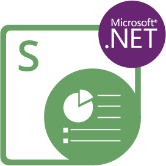

{}

**Welcome to Aspose.Slides for Node.js via .NET**

Aspose.Slides for Node.js via .NET is a class library that enables your applications to read and write PowerPoint® documents without using Microsoft PowerPoint®.

Aspose.Slides for Node.js via .NET is the first and only component that provides the functionality to manage PowerPoint® documents.

Aspose.Slides for Node.js via .NET provides a lot of key features such as managing text, shapes, tables & animations, adding audio and video to slides, previewing slides, exporting slides to SVG, PDF format and more.

{}

## Aspose.Slides for Node.js via .NET Resources

{}

Aspose.Slides for Node.js via .NET is ported from Aspose.Slides for .NET, so you can use the latter documentation and API reference.

{}

These are links to useful to resources:

- [Aspose.Slides for Node.js via .NET Features](/slides/nodejs-net/features-overview/)
- [Aspose.Slides for Node.js via .NET Release Notes](https://releases.aspose.com/slides/nodejs-net/release-notes/)
- [Aspose.Slides for Node.js via .NET Product Page](https://products.aspose.com/slides/nodejs-net/)
- [Download Aspose.Slides for Node.js via .NET Package](https://releases.aspose.com/slides/nodejs-net/)
- [Install Aspose.Slides for Node.js via .NET](/slides/nodejs-net/installation/)
- [Aspose.Slides for Node.js via .NET API Reference](https://reference.aspose.com/slides/nodejs-net/)
- [Aspose.Slides for Node.js via .NET Free Support Forum](https://forum.aspose.com/c/slides/11)
- [Aspose.Slides for Node.js via .NET Paid Support Helpdesk](https://helpdesk.aspose.com/)
