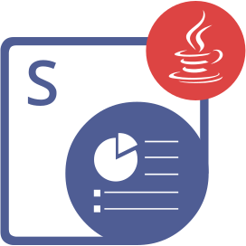

{}

**Welcome to Aspose.Slides for PHP via Java**

Aspose.Slides for PHP via Java is a class library that enables your applications to read and write PowerPoint® documents without using Microsoft PowerPoint®.

Aspose.Slides for PHP via Java is the first and only component that provides the functionality to manage PowerPoint® documents.

Aspose.Slides for PHP via Java provides a lot of key features such as managing text, shapes, tables & animations, adding audio and video to slides, previewing slides, exporting slides to SVG, PDF format and more.

{}

## Aspose.Slides for PHP via Java Resources

{}

Aspose.Slides for PHP via Java is ported from Aspose.Slides for Java, so you can use the latter documentation and API reference.

{}

These are links to useful to resources:

- [Aspose.Slides for PHP via Java Online Documentation](/slides/php-java/)
- [Aspose.Slides for PHP via Java Features](/slides/php-java/features-overview/)
- [Aspose.Slides for PHP via Java Limitations and API Differences](/slides/php-java/limitations-and-api-differences/)
- [Aspose.Slides for PHP via Java Release Notes](https://releases.aspose.com/slides/php-java/release-notes/)
- [Aspose.Slides for PHP via Java Product Page](https://products.aspose.com/slides/php-java/)
- [Download Aspose.Slides for PHP via Java Package](https://releases.aspose.com/slides/php-java/))
- [Install Aspose.Slides for PHP via Java](/slides/php-java/installation/)
- [Aspose.Slides for PHP via Java API Reference](https://reference.aspose.com/slides/php-java/)
- [Aspose.Slides for PHP via Java Free Support Forum](https://forum.aspose.com/c/slides/11)
- [Aspose.Slides for PHP via Java Paid Support Helpdesk](https://helpdesk.aspose.com/)
