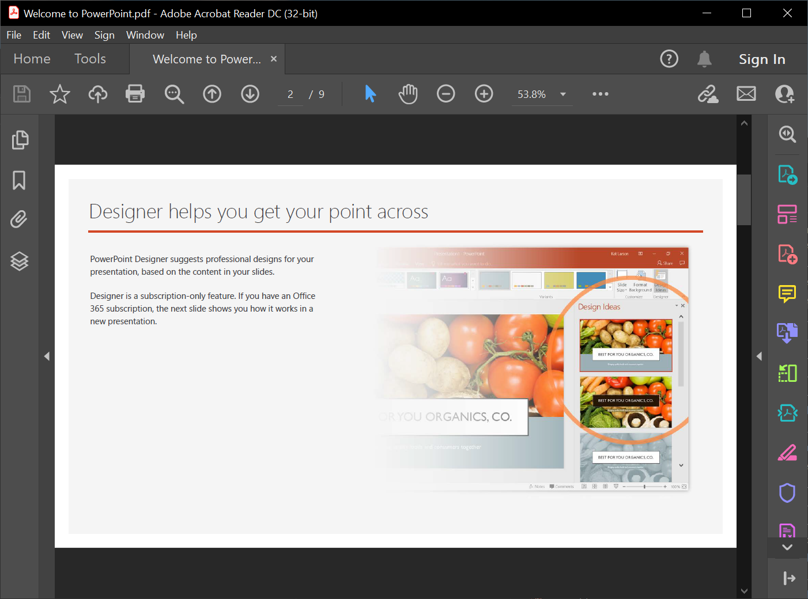

Using [**Aspose.Slides for PHP via Java**](https://products.aspose.com/slides/php-java/), you can import presentations from files in other formats. Aspose.Slides provides the [SlideCollection](https://reference.aspose.com/slides/php-java/aspose.slides/slidecollection/) class to allow you to import presentations from PDFs, HTML documents, etc.

## **Import PowerPoint from PDF**

In this case, you get to convert a PDF to a PowerPoint presentation.



1. Create an instance of the [Presentation](https://reference.aspose.com/slides/php-java/aspose.slides/) class.
2. Call the [addFromPdf()](https://reference.aspose.com/slides/php-java/aspose.slides/SlideCollection#addFromPdf-java.lang.String-) method and pass the PDF file.
3. Use the [save()](https://reference.aspose.com/slides/php-java/aspose.slides/Presentation#save-java.lang.String-int-) method to save the file in the PowerPoint format.

This PHP code demonstrates the PDF to PowerPoint operation:

```php
  $pres = new Presentation();
  try {
    $pres->getSlides()->addFromPdf("InputPDF.pdf");
    $pres->save("OutputPresentation.pptx", SaveFormat::Pptx);
  } finally {
    if (!java_is_null($pres)) {
      $pres->dispose();
    }
  }
```

{} 

You may want to check out **Aspose free** [PDF to PowerPoint](https://products.aspose.app/slides/import/pdf-to-powerpoint) web app because it is a live implementation of the process described here. 

{} 

## **Import PowerPoint from HTML**

In this case, you get to convert a HTML document to a PowerPoint presentation.

1. Create an instance of the [Presentation](https://reference.aspose.com/slides/php-java/aspose.slides/) class.
2. Call the [addFromHtml()](https://reference.aspose.com/slides/php-java/aspose.slides/slidecollection/#addFromHtml-java.io.InputStream-) method and pass the PDF file.
3. Use the [save()](https://reference.aspose.com/slides/php-java/aspose.slides/Presentation#save-java.lang.String-int-) method to save the file in the PowerPoint format.

This PHP code demonstrates the HTML to PowerPoint operation:

```php
  $presentation = new Presentation();
  try {
    $htmlStream = new Java("java.io.FileInputStream", "page.html");
    try {
      $presentation->getSlides()->addFromHtml($htmlStream);
    } finally {
      if (!java_is_null($htmlStream)) {
        $htmlStream->close();
      }
    }
    $presentation->save("MyPresentation.pptx", SaveFormat::Pptx);
  } catch (JavaException $e) {
  } finally {
    if (!java_is_null($presentation)) {
      $presentation->dispose();
    }
  }
```

{} 

You may also use Aspose.Slides to convert HTML to other popular file formats: 

* [HTML to image](https://products.aspose.com/slides/php-java/conversion/html-to-image/)
* [HTML to JPG](https://products.aspose.com/slides/php-java/conversion/html-to-jpg/)
* [HTML to XML](https://products.aspose.com/slides/php-java/conversion/html-to-xml/)
* [HTML to TIFF](https://products.aspose.com/slides/php-java/conversion/html-to-tiff/)

{}
