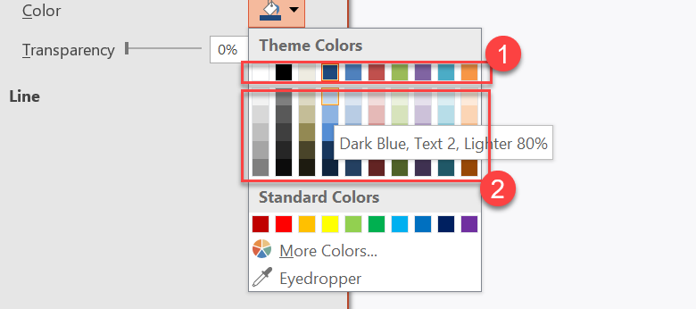

A presentation theme defines the properties of design elements. When you select a presentation theme, you are essentially choosing a specific set of visual elements and their properties.

In PowerPoint, a theme comprises colors, [fonts](/slides/php-java/powerpoint-fonts/), [background styles](/slides/php-java/presentation-background/), and effects.


## **Change Theme Color**

A PowerPoint theme uses a specific set of colors for different elements on a slide. If you don't like the colors, you change them colors by applying new colors for the theme. To allow you select a new theme color, Aspose.Slides provides values under the [SchemeColor](https://reference.aspose.com/slides/php-java/aspose.slides/SchemeColor) enumeration.

This PHP code shows you how to change the accent color for a theme:

```php
  $pres = new Presentation();
  try {
    $shape = $pres->getSlides()->get_Item(0)->getShapes()->addAutoShape(ShapeType::Rectangle, 10, 10, 100, 100);
    $shape->getFillFormat()->setFillType(FillType::Solid);
    $shape->getFillFormat()->getSolidFillColor()->setSchemeColor(SchemeColor->Accent4);
  } finally {
    if (!java_is_null($pres)) {
      $pres->dispose();
    }
  }
```

You can determine the resulting color's effective value this way:

```php
  $fillEffective = $shape->getFillFormat()->getEffective();
  $effectiveColor = $fillEffective->getSolidFillColor();
  echo(sprintf("Color [A=%d, R=%d, G=%d, B=%d]", $effectiveColor->getAlpha(), $effectiveColor->getRed(), $effectiveColor->getGreen(), $effectiveColor->getBlue()));

```

To further demonstrate the color change operation, we create another element and assign the accent color (from the initial operation) to it. Then we change the color in the theme:

```php
  $otherShape = $pres->getSlides()->get_Item(0)->getShapes()->addAutoShape(ShapeType::Rectangle, 10, 120, 100, 100);
  $otherShape->getFillFormat()->setFillType(FillType::Solid);
  $otherShape->getFillFormat()->getSolidFillColor()->setSchemeColor(SchemeColor->Accent4);
  $pres->getMasterTheme()->getColorScheme()->getAccent4()->setColor(java("java.awt.Color")->RED);

```

The new color is applied automatically on both elements.

### **Set Theme Color from Additional Palette**

When you apply luminance transformations to the main theme color(1), colors from the additional palette(2) are formed. You can then set and get those theme colors. 



**1** - Main theme colors

**2** - Colors from the additional palette.

This PHP code demonstrates an operation where additional palette colors are obtained from the main theme color and then used in shapes:

```php
  $presentation = new Presentation();
  try {
    $slide = $presentation->getSlides()->get_Item(0);
    // Accent 4
    $shape1 = $slide->getShapes()->addAutoShape(ShapeType::Rectangle, 10, 10, 50, 50);
    $shape1->getFillFormat()->setFillType(FillType::Solid);
    $shape1->getFillFormat()->getSolidFillColor()->setSchemeColor(SchemeColor->Accent4);
    // Accent 4, Lighter 80%
    $shape2 = $slide->getShapes()->addAutoShape(ShapeType::Rectangle, 10, 70, 50, 50);
    $shape2->getFillFormat()->setFillType(FillType::Solid);
    $shape2->getFillFormat()->getSolidFillColor()->setSchemeColor(SchemeColor->Accent4);
    $shape2->getFillFormat()->getSolidFillColor()->getColorTransform()->add(ColorTransformOperation->MultiplyLuminance, 0.2);
    $shape2->getFillFormat()->getSolidFillColor()->getColorTransform()->add(ColorTransformOperation->AddLuminance, 0.8);
    // Accent 4, Lighter 60%
    $shape3 = $slide->getShapes()->addAutoShape(ShapeType::Rectangle, 10, 130, 50, 50);
    $shape3->getFillFormat()->setFillType(FillType::Solid);
    $shape3->getFillFormat()->getSolidFillColor()->setSchemeColor(SchemeColor->Accent4);
    $shape3->getFillFormat()->getSolidFillColor()->getColorTransform()->add(ColorTransformOperation->MultiplyLuminance, 0.4);
    $shape3->getFillFormat()->getSolidFillColor()->getColorTransform()->add(ColorTransformOperation->AddLuminance, 0.6);
    // Accent 4, Lighter 40%
    $shape4 = $slide->getShapes()->addAutoShape(ShapeType::Rectangle, 10, 190, 50, 50);
    $shape4->getFillFormat()->setFillType(FillType::Solid);
    $shape4->getFillFormat()->getSolidFillColor()->setSchemeColor(SchemeColor->Accent4);
    $shape4->getFillFormat()->getSolidFillColor()->getColorTransform()->add(ColorTransformOperation->MultiplyLuminance, 0.6);
    $shape4->getFillFormat()->getSolidFillColor()->getColorTransform()->add(ColorTransformOperation->AddLuminance, 0.4);
    // Accent 4, Darker 25%
    $shape5 = $slide->getShapes()->addAutoShape(ShapeType::Rectangle, 10, 250, 50, 50);
    $shape5->getFillFormat()->setFillType(FillType::Solid);
    $shape5->getFillFormat()->getSolidFillColor()->setSchemeColor(SchemeColor->Accent4);
    $shape5->getFillFormat()->getSolidFillColor()->getColorTransform()->add(ColorTransformOperation->MultiplyLuminance, 0.75);
    // Accent 4, Darker 50%
    $shape6 = $slide->getShapes()->addAutoShape(ShapeType::Rectangle, 10, 310, 50, 50);
    $shape6->getFillFormat()->setFillType(FillType::Solid);
    $shape6->getFillFormat()->getSolidFillColor()->setSchemeColor(SchemeColor->Accent4);
    $shape6->getFillFormat()->getSolidFillColor()->getColorTransform()->add(ColorTransformOperation->MultiplyLuminance, 0.5);
    $presentation->save($path . "example_accent4.pptx", SaveFormat->Pptx);
  } finally {
    if (!java_is_null($presentation)) {
      $presentation->dispose();
    }
  }
```

## **Change Theme Font**

To allow you select fonts for themes and other purposes, Aspose.Slides uses these special identifiers (similar to those used in PowerPoint):

* **+mn-lt** - Body Font Latin (Minor Latin Font)
* **+mj-lt** -Heading Font Latin (Major Latin Font)
* **+mn-ea** - Body Font East Asian (Minor East Asian Font)
* **+mj-ea** - Body Font East Asian (Major East Asian Font)

This PHP code shows you how to assign the Latin font to a theme element:

```php
  $shape = $pres->getSlides()->get_Item(0)->getShapes()->addAutoShape(ShapeType::Rectangle, 10, 10, 100, 100);
  $paragraph = new Paragraph();
  $portion = new Portion("Theme text format");
  $paragraph->getPortions()->add($portion);
  $shape->getTextFrame()->getParagraphs()->add($paragraph);
  $portion->getPortionFormat()->setLatinFont(new FontData("+mn-lt"));

```

This PHP code shows you how to change the presentation theme font:

```php
  $pres->getMasterTheme()->getFontScheme()->getMinor()->setLatinFont(new FontData("Arial"));

```

The font in all text boxes will be updated.

{} 

You may want to see [PowerPoint fonts](/slides/php-java/powerpoint-fonts/).

{}

## **Change Theme Background Style**

By default, the PowerPoint app provides 12 predefined backgrounds but only 3 from those 12 backgrounds are saved in a typical presentation. 


For example, after you save a presentation in the PowerPoint app, you can run this PHP code to find out the number of predefined backgrounds in the presentation:

```php
  $pres = new Presentation("pres.pptx");
  try {
    $numberOfBackgroundFills = $pres->getMasterTheme()->getFormatScheme()->getBackgroundFillStyles()->size();
    echo("Number of background fill styles for theme is " . $numberOfBackgroundFills);
  } finally {
    if (!java_is_null($pres)) {
      $pres->dispose();
    }
  }
```

{} 

Using the [BackgroundFillStyles](https://reference.aspose.com/slides/php-java/aspose.slides/FormatScheme#getBackgroundFillStyles--) property from the [FormatScheme](https://reference.aspose.com/slides/php-java/aspose.slides/FormatScheme) class, you can add or access the background style in a PowerPoint theme.

{} 

This PHP code shows you how to set the background for a presentation:

```php
  $pres->getMasters()->get_Item(0)->getBackground()->setStyleIndex(2);

```

**Index guide**: 0 is used for no fill. The index starts from 1.

{} 

You may want to see [PowerPoint Background](/slides/php-java/presentation-background/).

{}

## **Change Theme Effect**

A PowerPoint theme usually contains 3 values for each style array. Those arrays are combined into these 3 effects: subtle, moderate, and intense. For example, this is the outcome when the effects are applied to a specific shape:


Using 3 properties ([FillStyles](https://reference.aspose.com/slides/php-java/aspose.slides/FormatScheme#getFillStyles--), [LineStyles](https://reference.aspose.com/slides/php-java/aspose.slides/FormatScheme#getLineStyles--), [EffectStyles](https://reference.aspose.com/slides/php-java/aspose.slides/FormatScheme#getEffectStyles--)) from the  [FormatScheme](https://reference.aspose.com/slides/php-java/aspose.slides/FormatScheme) class you can change the elements in a theme (even more flexibly than the options in PowerPoint).

This PHP code shows you how to change a theme effect by altering parts of elements:

```php
  $pres = new Presentation("Subtle_Moderate_Intense.pptx");
  try {
    $pres->getMasterTheme()->getFormatScheme()->getLineStyles()->get_Item(0)->getFillFormat()->getSolidFillColor()->setColor(java("java.awt.Color")->RED);
    $pres->getMasterTheme()->getFormatScheme()->getFillStyles()->get_Item(2)->setFillType(FillType::Solid);
    $pres->getMasterTheme()->getFormatScheme()->getFillStyles()->get_Item(2)->getSolidFillColor()->setColor(java("java.awt.Color")->GREEN);
    $pres->getMasterTheme()->getFormatScheme()->getEffectStyles()->get_Item(2)->getEffectFormat()->getOuterShadowEffect()->setDistance(10.0);
    $pres->save("Design_04_Subtle_Moderate_Intense-out.pptx", SaveFormat->Pptx);
  } finally {
    if (!java_is_null($pres)) {
      $pres->dispose();
    }
  }
```

The resulting changes in fill color, fill type, shadow effect, etc:


