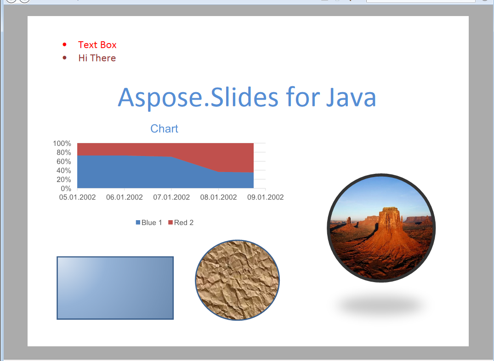

{} 

The [XML Parser Specification](https://en.wikipedia.org/wiki/Open_XML_Paper_Specification) is a page description language and a fixed-document format originally developed by Microsoft. Like PDF, XPS is designed to preserve document fidelity and provide device-independent document appearance. 

{} 

## **XPS in Aspose.Slides for PHP via Java**
Any presentation document that can be loaded by Aspose.Slides for PHP via Java can be converted to XPS format. Aspose.Slides for PHP via Java uses the high-fidelity page layout and rendering engine to produce output in fixed-layout XPS document format.
You can learn about exporting the presentation documents to XPS documents through Aspose.Slides for PHP via Java in [Converting to XPS](https://docs.aspose.com/slides/php-java/convert-powerpoint-to-xps/).

**The input presentation** 

**A presentation converted to XPS** 

