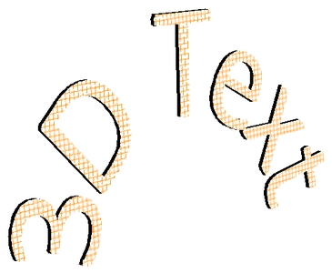

## **Przegląd**

Aspose.Slides for Android via Java może tworzyć, edytować, zachowywać i renderować formatowanie 3D w stylu PowerPoint dla kształtów i tekstu. Ten artykuł opisuje efekty 3D, takie jak obrót, ekstruzja, fazety, oświetlenie, materiał, wypełnienia gradientowe lub obrazkowe oraz tekst 3D.

{}
Ten artykuł dotyczy efektów formatowania 3D na kształtach i tekście w PowerPoint. Nie dotyczy wstawiania ani edytowania samodzielnych plików modeli 3D. Gdy eksportujesz slajd do obrazu, PDF lub HTML, Aspose.Slides renderuje te efekty 3D w wyjściowym dwuwymiarowym formacie.
{}

## **Koncepcje formatowania 3D**

Użyj metody [IShape.getThreeDFormat](https://reference.aspose.com/slides/pl/androidjava/com.aspose.slides/ishape/#getThreeDFormat--) aby zastosować formatowanie 3D do kształtu. Metoda zwraca [IThreeDFormat](https://reference.aspose.com/slides/pl/androidjava/com.aspose.slides/ithreedformat/), które steruje sceną 3D dla tego kształtu.

Dla tekstu użyj metody [ITextFrameFormat.getThreeDFormat](https://reference.aspose.com/slides/pl/androidjava/com.aspose.slides/itextframeformat/#getThreeDFormat--) . Zastosuje to formatowanie 3D do ramki tekstowej zamiast ciała kształtu.

Najważniejsze członki API to:

| Członek API | Co kontroluje | Kiedy używać |
|---|---|---|
| [getCamera](https://reference.aspose.com/slides/pl/androidjava/com.aspose.slides/ithreedformat/#getCamera--) | Punkt widzenia, typ kamery wstępnie ustawiony, obrót, przybliżenie i perspektywa. | Obróć obiekt w przestrzeni 3D lub dopasuj do wstępnie ustawionego obrotu 3D w PowerPoint. |
| [getLightRig](https://reference.aspose.com/slides/pl/androidjava/com.aspose.slides/ithreedformat/#getLightRig--) | Ustawienia światła, kierunek i obrót światła. | Zmień sposób, w jaki refleksy i cienie pojawiają się na powierzchni 3D. |
| [getMaterial](https://reference.aspose.com/slides/pl/androidjava/com.aspose.slides/ithreedformat/#getMaterial--) i [setMaterial](https://reference.aspose.com/slides/pl/androidjava/com.aspose.slides/ithreedformat/#setMaterial-int-) | Materiał powierzchni, np. płaski, matowy, plastikowy lub metalowy. | Spraw, aby ta sama geometria wyglądała bardziej płasko, miękko, błyszcząco lub metalicznie. |
| [getExtrusionHeight](https://reference.aspose.com/slides/pl/androidjava/com.aspose.slides/ithreedformat/#getExtrusionHeight--) i [setExtrusionHeight](https://reference.aspose.com/slides/pl/androidjava/com.aspose.slides/ithreedformat/#setExtrusionHeight-double-) | Jak daleko kształt wystaje w tył od swojej przedniej powierzchni. | Przekształć płaski kształt w widocznie gruby obiekt 3D. |
| [getExtrusionColor](https://reference.aspose.com/slides/pl/androidjava/com.aspose.slides/ithreedformat/#getExtrusionColor--) | Kolor wyciągniętych boków. | Umożliw widoczność głębi lub skoordynuj kolor boków z wypełnieniem przedniej części. |
| [getDepth](https://reference.aspose.com/slides/pl/androidjava/com.aspose.slides/ithreedformat/#getDepth--) i [setDepth](https://reference.aspose.com/slides/pl/androidjava/com.aspose.slides/ithreedformat/#setDepth-double-) | Dodatkowa głębia 3D używana w formatowaniu 3D PowerPointa. | Doprecyzuj głębokość dla kształtów lub tekstu, szczególnie w połączeniu z ustawieniami fazety i materiału. |
| [getBevelTop](https://reference.aspose.com/slides/pl/androidjava/com.aspose.slides/ithreedformat/#getBevelTop--) i [getBevelBottom](https://reference.aspose.com/slides/pl/androidjava/com.aspose.slides/ithreedformat/#getBevelBottom--) | Podniesione lub zaokrąglone krawędzie na przedniej i tylnej powierzchni. | Dodaj zmiękczony lub formowany brzeg zamiast ostrej płaskiej powierzchni. |
| [getContourColor](https://reference.aspose.com/slides/pl/androidjava/com.aspose.slides/ithreedformat/#getContourColor--), [getContourWidth](https://reference.aspose.com/slides/pl/androidjava/com.aspose.slides/ithreedformat/#getContourWidth--), i [setContourWidth](https://reference.aspose.com/slides/pl/androidjava/com.aspose.slides/ithreedformat/#setContourWidth-double-) | Obrys wokół obiektu 3D. | Podkreśl granicę obiektu w renderowanym wyjściu. |

## **Utworzenie kształtu 3D**

Kształt zazwyczaj wymaga czterech rodzajów ustawień, aby wyglądał przekonująco 3D:

- Ustawienia kamery, ponieważ domyślny widok z przodu może ukrywać ekstruzję.
- Ustawienia światła, ponieważ oświetlenie sprawia, że powierzchnie i boki są widoczne.
- Ustawienia materiału, ponieważ powierzchnia wpływa na sposób renderowania światła.
- Ustawienia ekstruzji lub głębokości, ponieważ płaski kształt potrzebuje grubości.

Przykład poniżej tworzy prostokąt, dodaje tekst do jego przedniej powierzchni, stosuje formatowanie 3D, zapisuje prezentację jako PPTX i renderuje slajd do obrazu PNG.

```java
import com.aspose.slides.*;
import java.awt.Color;

final float imageScale = 2;

Presentation presentation = new Presentation();
try {
    ISlide slide = presentation.getSlides().get_Item(0);
    IAutoShape shape = slide.getShapes().addAutoShape(ShapeType.Rectangle, 200, 150, 200, 200);
    shape.getTextFrame().setText("3D");
    shape.getTextFrame().getParagraphs().get_Item(0).getParagraphFormat().getDefaultPortionFormat().setFontHeight(64);

    shape.getFillFormat().setFillType(FillType.Solid);
    shape.getFillFormat().getSolidFillColor().setColor(new Color(100, 149, 237));

    shape.getThreeDFormat().getCamera().setCameraType(CameraPresetType.OrthographicFront);
    shape.getThreeDFormat().getCamera().setRotation(20, 30, 40);
    shape.getThreeDFormat().getLightRig().setLightType(LightRigPresetType.Flat);
    shape.getThreeDFormat().getLightRig().setDirection(LightingDirection.Top);
    shape.getThreeDFormat().setMaterial(MaterialPresetType.Flat);
    shape.getThreeDFormat().setExtrusionHeight(100);
    shape.getThreeDFormat().getExtrusionColor().setColor(Color.BLUE);

    IImage thumbnail = slide.getImage(imageScale, imageScale);
    try {
        thumbnail.save("shape_3d.png", ImageFormat.Png);
    } finally {
        thumbnail.dispose();
    }

    presentation.save("shape_3d.pptx", SaveFormat.Pptx);
} finally {
    presentation.dispose();
}
```

Renderowany obraz slajdu przedstawia prostokąt jako gruby blok 3D:


## **Obrócenie kształtu za pomocą kamery**

W PowerPoint obrót 3D konfiguruje się w panelu 3‑D Rotation. Wartości obrotu X, Y i Z odpowiadają obrotowi ustawionemu przez API kamery.


W Aspose.Slides ustaw typ kamery i obrót za pomocą [IThreeDFormat.getCamera](https://reference.aspose.com/slides/pl/androidjava/com.aspose.slides/ithreedformat/#getCamera--):

```java
import com.aspose.slides.*;

Presentation presentation = new Presentation();
try {
    ISlide slide = presentation.getSlides().get_Item(0);
    IAutoShape shape = slide.getShapes().addAutoShape(ShapeType.Rectangle, 200, 150, 200, 200);

    shape.getThreeDFormat().getCamera().setCameraType(CameraPresetType.OrthographicFront);
    shape.getThreeDFormat().getCamera().setRotation(20, 30, 40);
} finally {
    presentation.dispose();
}
```

Użyj kamery, gdy potrzebujesz zmienić sposób, w jaki widz widzi obiekt. Nie zmienia to geometrii 2D kształtu na slajdzie. Zmienia to punkt widzenia 3D używany przez PowerPoint i przez Aspose.Slides podczas renderowania.

## **Dodanie ekstruzji i głębokości**

Ekstruzja sprawia, że kształt wygląda na gruby, wydłużając go za przednią powierzchnię. W PowerPoint kontrolka głębokości ustawia tę widoczną grubość, a kontrolka koloru ustawia kolor boków.


Ustaw [IThreeDFormat.setExtrusionHeight](https://reference.aspose.com/slides/pl/androidjava/com.aspose.slides/ithreedformat/#setExtrusionHeight-double-) dla grubości i [IThreeDFormat.getExtrusionColor](https://reference.aspose.com/slides/pl/androidjava/com.aspose.slides/ithreedformat/#getExtrusionColor--) dla koloru boków:

```java
import com.aspose.slides.*;
import java.awt.Color;

Presentation presentation = new Presentation();
try {
    ISlide slide = presentation.getSlides().get_Item(0);
    IAutoShape shape = slide.getShapes().addAutoShape(ShapeType.Rectangle, 200, 150, 200, 200);

    shape.getThreeDFormat().getCamera().setRotation(20, 30, 40);
    shape.getThreeDFormat().setExtrusionHeight(100);
    shape.getThreeDFormat().getExtrusionColor().setColor(new Color(128, 0, 128));
} finally {
    presentation.dispose();
}
```

Użyj [IThreeDFormat.setDepth](https://reference.aspose.com/slides/pl/androidjava/com.aspose.slides/ithreedformat/#setDepth-double-) gdy musisz pracować bezpośrednio z wartością głębokości w PowerPoint lub łączyć głębokość z fazetą, materiałem i efektami tekstu. W wielu sytuacjach kształtu, `setExtrusionHeight` jest bardziej przejrzystym ustawieniem, ponieważ bezpośrednio określa widoczną ekstruzję.

## **Użycie wypełnień gradientowych lub obrazkowych z efektami 3D**

Formatowanie 3D jest niezależne od wypełnienia kształtu. Możesz zastosować jednolity kolor, gradient, wzór lub wypełnienie obrazem na przedniej powierzchni i nadal używać tych samych ustawień kamery, światła, materiału i ekstruzji.

Ten przykład stosuje wypełnienie gradientowe do kształtu i ciemniejszy kolor ekstruzji na bokach:

```java
import com.aspose.slides.*;
import java.awt.Color;

final float imageScale = 2;

Presentation presentation = new Presentation();
try {
    ISlide slide = presentation.getSlides().get_Item(0);
    IAutoShape shape = slide.getShapes().addAutoShape(ShapeType.Rectangle, 200, 150, 250, 250);
    shape.getTextFrame().setText("3D Gradient");
    shape.getTextFrame().getParagraphs().get_Item(0).getParagraphFormat().getDefaultPortionFormat().setFontHeight(64);

    shape.getFillFormat().setFillType(FillType.Gradient);
    shape.getFillFormat().getGradientFormat().getGradientStops().add(0, Color.BLUE);
    shape.getFillFormat().getGradientFormat().getGradientStops().add(100, new Color(255, 165, 0));

    shape.getThreeDFormat().getCamera().setCameraType(CameraPresetType.OrthographicFront);
    shape.getThreeDFormat().getCamera().setRotation(10, 20, 30);
    shape.getThreeDFormat().getLightRig().setLightType(LightRigPresetType.Flat);
    shape.getThreeDFormat().getLightRig().setDirection(LightingDirection.Top);
    shape.getThreeDFormat().setMaterial(MaterialPresetType.Flat);
    shape.getThreeDFormat().setExtrusionHeight(150);
    shape.getThreeDFormat().getExtrusionColor().setColor(new Color(255, 140, 0));

    IImage thumbnail = slide.getImage(imageScale, imageScale);
    try {
        thumbnail.save("gradient_3d.png", ImageFormat.Png);
    } finally {
        thumbnail.dispose();
    }
} finally {
    presentation.dispose();
}
```

Renderowany wynik zachowuje gradient na przedniej powierzchni i renderuje ekstruzję oddzielnie:


Aby zamiast tego użyć wypełnienia obrazem, dodaj obraz do prezentacji i przypisz go jako wypełnienie kształtu:

```java
import com.aspose.slides.*;
import java.awt.Color;
import java.io.FileInputStream;

Presentation presentation = new Presentation();
try {
    ISlide slide = presentation.getSlides().get_Item(0);
    IAutoShape shape = slide.getShapes().addAutoShape(ShapeType.Rectangle, 200, 150, 250, 250);

    IPPImage image;
    try (FileInputStream imageStream = new FileInputStream("image.png")) {
        image = presentation.getImages().addImage(imageStream);
    }

    shape.getFillFormat().setFillType(FillType.Picture);
    shape.getFillFormat().getPictureFillFormat().getPicture().setImage(image);
    shape.getFillFormat().getPictureFillFormat().setPictureFillMode(PictureFillMode.Stretch);

    shape.getThreeDFormat().getCamera().setCameraType(CameraPresetType.OrthographicFront);
    shape.getThreeDFormat().getCamera().setRotation(10, 20, 30);
    shape.getThreeDFormat().setExtrusionHeight(150);
    shape.getThreeDFormat().getExtrusionColor().setColor(new Color(255, 140, 0));
} finally {
    presentation.dispose();
}
```

Obraz jest renderowany na przedniej powierzchni, podczas gdy ekstruzja jest renderowana jako 3D powierzchnia boczna:


## **Zastosowanie formatowania 3D do tekstu**

Formatowanie 3D kształtu wpływa na ciało kształtu. Formatowanie 3D tekstu wpływa na ramkę tekstową. Jest to przydatne w efektach podobnych do WordArt, gdzie same litery wymagają ekstruzji, materiału, oświetlenia i ustawień kamery.

Poniższy przykład tworzy tekst z wypełnieniem wzorem, stosuje przekształcenie WordArt i konfiguruje ustawienia 3D na [ITextFrameFormat](https://reference.aspose.com/slides/pl/androidjava/com.aspose.slides/itextframeformat/):

```java
import com.aspose.slides.*;
import java.awt.Color;

final float imageScale = 2;

Presentation presentation = new Presentation();
try {
    ISlide slide = presentation.getSlides().get_Item(0);
    IAutoShape shape = slide.getShapes().addAutoShape(ShapeType.Rectangle, 200, 150, 250, 250);
    shape.getFillFormat().setFillType(FillType.NoFill);
    shape.getLineFormat().getFillFormat().setFillType(FillType.NoFill);
    shape.getTextFrame().setText("3D Text");

    IPortion portion = shape.getTextFrame().getParagraphs().get_Item(0).getPortions().get_Item(0);
    portion.getPortionFormat().getFillFormat().setFillType(FillType.Pattern);
    portion.getPortionFormat().getFillFormat().getPatternFormat().getForeColor().setColor(new Color(255, 140, 0));
    portion.getPortionFormat().getFillFormat().getPatternFormat().getBackColor().setColor(Color.WHITE);
    portion.getPortionFormat().getFillFormat().getPatternFormat().setPatternStyle(PatternStyle.LargeGrid);

    shape.getTextFrame().getParagraphs().get_Item(0).getParagraphFormat().getDefaultPortionFormat().setFontHeight(128);

    ITextFrameFormat textFrameFormat = shape.getTextFrame().getTextFrameFormat();
    textFrameFormat.setTransform(TextShapeType.ArchUp);

    textFrameFormat.getThreeDFormat().setExtrusionHeight(3.5);
    textFrameFormat.getThreeDFormat().setDepth(3);
    textFrameFormat.getThreeDFormat().setMaterial(MaterialPresetType.Plastic);
    textFrameFormat.getThreeDFormat().getLightRig().setDirection(LightingDirection.Top);
    textFrameFormat.getThreeDFormat().getLightRig().setLightType(LightRigPresetType.Balanced);
    textFrameFormat.getThreeDFormat().getLightRig().setRotation(0, 0, 40);
    textFrameFormat.getThreeDFormat().getCamera().setCameraType(CameraPresetType.PerspectiveContrastingRightFacing);

    IImage thumbnail = slide.getImage(imageScale, imageScale);
    try {
        thumbnail.save("text_3d.png", ImageFormat.Png);
    } finally {
        thumbnail.dispose();
    }

    presentation.save("text_3d.pptx", SaveFormat.Pptx);
} finally {
    presentation.dispose();
}
```

Tekst jest renderowany jako zakrzywione, ekstruzowane litery 3D:



## **Zachowanie przy eksporcie i renderowaniu**

Aspose.Slides zachowuje formatowanie 3D przy zapisie do formatów PowerPoint, takich jak PPTX. Podczas renderowania lub eksportu do formatów o stałym układzie scena 3D jest rasteryzowana lub rysowana w wyjściu jako wynik 2D. Dotyczy to renderowania slajdów do [PNG](/slides/pl/androidjava/convert-powerpoint-to-png/), eksportu do [PDF](/slides/pl/androidjava/convert-powerpoint-to-pdf/), eksportu do [HTML](/slides/pl/androidjava/convert-powerpoint-to-html/), czy generowania klatek do [video conversion](/slides/pl/androidjava/convert-powerpoint-to-video/).

- Wyeksportowane obrazy i pliki PDF nie są interaktywne. Obiekt nie może być obracany przez widza po eksporcie.
- Ostateczny wygląd zależy od kombinacji kamery, zestawu świateł, materiału, ekstruzji, wypełnienia i skalowania slajdu.
- Jeśli musisz sprawdzić dziedziczone lub oparte na motywie wartości formatowania, przeczytaj [właściwości efektywne kształtu](/slides/pl/androidjava/shape-effective-properties/).
- Niektóre formaty wyjściowe nie mogą przechowywać edytowalnego formatowania 3D PowerPoint. W tych formatach wynik wizualny jest renderowany, a nie zachowywany jako edytowalne ustawienia 3D.

## **FAQ**

### Czy Aspose.Slides może tworzyć interaktywne prezentacje 3D?

Aspose.Slides tworzy i renderuje efekty 3D PowerPoint dla kształtów i tekstu. Nie sprawia, że wyeksportowane obrazy, pliki PDF ani strony HTML stają się interaktywnymi scenami 3D, które widz może obracać. W PPTX formatowanie 3D pozostaje edytowalne w PowerPoint, o ile format to obsługuje.

### Jaka jest różnica między modelem 3D a efektem 3D?

Model 3D to oddzielny obiekt 3D wstawiany do prezentacji. Efekt 3D to formatowanie zastosowane do zwykłego kształtu lub tekstu w PowerPoint, takie jak obrót, ekstruzja, fazeta, oświetlenie i materiał. Ten artykuł opisuje efekty 3D.

### Jakie ustawienia są wymagane dla widocznego kształtu 3D?

Minimum to ustaw obrót kamery oraz ekstruzję lub głębokość. W praktyce warto także ustawić zestaw świateł i materiał, aby renderowane powierzchnie miały wyraźne refleksy i cienie.

### Czy mogę zastosować efekty 3D zarówno do kształtów, jak i tekstu?

Tak. Użyj [IShape.getThreeDFormat](https://reference.aspose.com/slides/pl/androidjava/com.aspose.slides/ishape/#getThreeDFormat--) dla ciała kształtu i [ITextFrameFormat.getThreeDFormat](https://reference.aspose.com/slides/pl/androidjava/com.aspose.slides/itextframeformat/#getThreeDFormat--) dla tekstu.

### Czy efekty 3D pojawią się przy eksporcie do obrazów, PDF, HTML lub klatek wideo?

Tak. Aspose.Slides renderuje efekty 3D przy tworzeniu obrazów slajdów, wyjścia PDF, HTML oraz klatek używanych przy konwersji wideo. Wyeksportowany wynik zawiera renderowany wygląd, a nie edytowalny obiekt 3D.

### Czy mogę odczytać końcowe wartości 3D po zastosowaniu dziedziczenia i ustawień motywu?

Tak. Użyj skutecznych interfejsów API formatowania opisanych w [Shape Effective Properties](/slides/pl/androidjava/shape-effective-properties/), aby odczytać końcowe wartości kamery, zestawu świateł, fazety i powiązane wartości 3D.