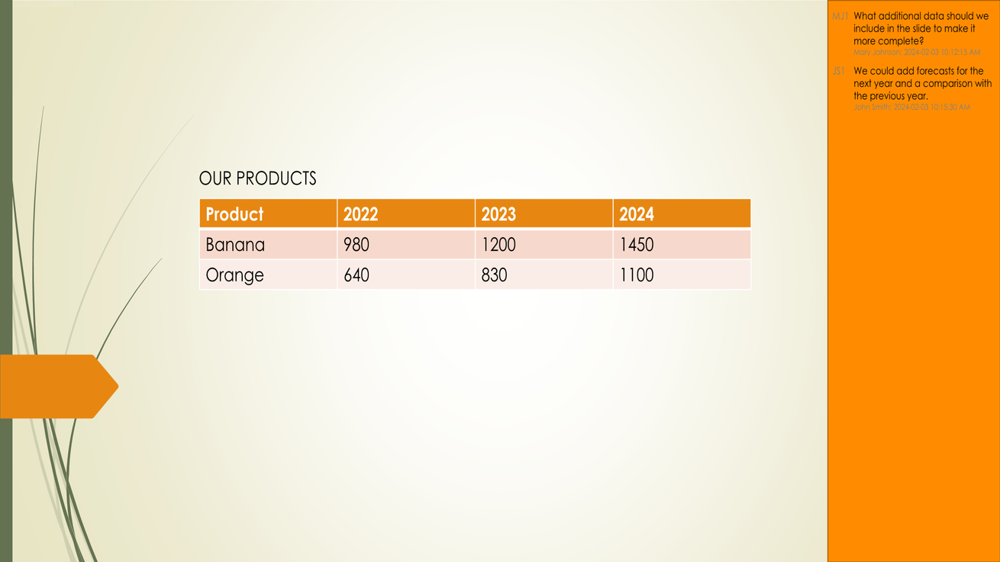

## **Wprowadzenie**

Konwertowanie prezentacji PowerPoint i OpenDocument do obrazów JPG pomaga w udostępnianiu slajdów, optymalizacji wydajności oraz osadzaniu treści w witrynach internetowych lub aplikacjach. Aspose.Slides dla Androida za pośrednictwem Java umożliwia przekształcanie plików PPTX, PPT i ODP na wysokiej jakości obrazy JPEG. Ten przewodnik wyjaśnia różne metody konwersji.

Dzięki tym funkcjom łatwo zaimplementować własną przeglądarkę prezentacji i utworzyć miniaturkę dla każdego slajdu. Może to być przydatne, jeśli chcesz chronić slajdy przed kopiowaniem lub przedstawić prezentację w trybie tylko do odczytu. Aspose.Slides pozwala konwertować całą prezentację lub wybrany slajd na formaty obrazów.

## **Konwertowanie slajdów prezentacji na obrazy JPG**

Oto kroki, aby przekonwertować plik PPT, PPTX lub ODP na JPG:

1. Utwórz instancję klasy [Presentation](https://reference.aspose.com/slides/pl/androidjava/com.aspose.slides/presentation/).
2. Pobierz obiekt slajdu typu [ISlide](https://reference.aspose.com/slides/pl/androidjava/com.aspose.slides/islide/) z kolekcji zwróconej przez metodę [Presentation.getSlides()](https://reference.aspose.com/slides/pl/androidjava/com.aspose.slides/presentation/#getSlides--) .
3. Utwórz obraz slajdu przy użyciu metody [ISlide.getImage(float, float)](https://reference.aspose.com/slides/pl/androidjava/com.aspose.slides/islide/#getImage-float-float-) .
4. Wywołaj metodę [IImage.save(string, ImageFormat)](https://reference.aspose.com/slides/pl/androidjava/com.aspose.slides/iimage/#save-java.lang.String-int-) na obiekcie obrazu. Przekaż nazwę pliku wyjściowego oraz format obrazu jako argumenty.

{} 

**Uwaga:** Konwersja PPT, PPTX lub ODP do JPG różni się od konwersji do innych formatów w API Aspose.Slides dla Androida za pośrednictwem Java. Dla innych formatów zazwyczaj używasz metody [IPresentation.save(String, SaveFormat, ISaveOptions)](https://reference.aspose.com/slides/pl/androidjava/com.aspose.slides/ipresentation/#save-java.lang.String-int-com.aspose.slides.ISaveOptions-) . Jednak w przypadku konwersji do JPG musisz użyć metody [IImage.save(string, ImageFormat)](https://reference.aspose.com/slides/pl/androidjava/com.aspose.slides/iimage/#save-java.lang.String-int-) .

{} 

```java
int scaleX = 1;
int scaleY = scaleX;

Presentation presentation = new Presentation("PowerPoint_Presentation.pptx");
try {
    for (ISlide slide : presentation.getSlides()) {
        // Utwórz obraz slajdu w określonej skali.
        IImage slideImage = slide.getImage(scaleX, scaleY);

        try {
            // Zapisz obraz na dysk w formacie JPEG.
            String fileName = String.format("Slide_%d.jpg", slide.getSlideNumber());
            slideImage.save(fileName, ImageFormat.Jpeg);
        } finally {
            slideImage.dispose();
        }
    }
} finally {
    presentation.dispose();
}
```

## **Konwertowanie slajdów na JPG z niestandardowymi wymiarami**

Aby zmienić wymiary uzyskanych obrazów JPG, możesz ustawić rozmiar obrazu, przekazując go do metody [ISlide.getImage(Size)](https://reference.aspose.com/slides/pl/androidjava/com.aspose.slides/islide/#getImage-com.aspose.slides.android.Size-) . Pozwala to generować obrazy o określonej szerokości i wysokości, zapewniając, że wynik spełnia wymagania dotyczące rozdzielczości i proporcji. Taka elastyczność jest szczególnie przydatna przy generowaniu obrazów dla aplikacji internetowych, raportów lub dokumentacji, gdzie wymagane są precyzyjne wymiary obrazów.

```java
Size imageSize = new Size(1200, 800);

Presentation presentation = new Presentation("PowerPoint_Presentation.pptx");
try {
    for (ISlide slide : presentation.getSlides()) {
        // Utwórz obraz slajdu w określonym rozmiarze.
        IImage slideImage = slide.getImage(imageSize);

        try {
            // Zapisz obraz na dysk w formacie JPEG.
            String fileName = String.format("Slide_%d.jpg", slide.getSlideNumber());
            slideImage.save(fileName, ImageFormat.Jpeg);
        } finally {
            slideImage.dispose();
        }
    }
} finally {
    presentation.dispose();
}
```

## **Renderowanie komentarzy podczas zapisywania slajdów jako obrazy**

Aspose.Slides dla Androida za pośrednictwem Java oferuje funkcję umożliwiającą renderowanie komentarzy na slajdach prezentacji podczas ich konwersji do obrazów JPG. Funkcjonalność ta jest szczególnie przydatna do zachowania adnotacji, opinii lub dyskusji dodanych przez współpracowników w prezentacjach PowerPoint. Włączając tę opcję, zapewniasz, że komentarze będą widoczne w wygenerowanych obrazach, co ułatwia przeglądanie i udostępnianie uwag bez konieczności otwierania oryginalnego pliku prezentacji.

Załóżmy, że mamy plik prezentacji „sample.pptx” ze slajdem zawierającym komentarze:


Poniższy kod Java konwertuje slajd na obraz JPG, zachowując komentarze:

```java
int scaleX = 2;
int scaleY = scaleX;

Presentation presentation = new Presentation("sample.pptx");
try {
    NotesCommentsLayoutingOptions commentsOptions = new NotesCommentsLayoutingOptions();
    commentsOptions.setCommentsPosition(CommentsPositions.Right);
    commentsOptions.setCommentsAreaWidth(200);
    commentsOptions.setCommentsAreaColor(Color.rgb(255, 140, 0));

    IRenderingOptions options = new RenderingOptions();
    options.setSlidesLayoutOptions(commentsOptions);

    // Przekonwertuj pierwszy slajd na obraz.
    IImage slideImage = presentation.getSlides().get_Item(0).getImage(options, scaleX, scaleY);
    try {
        slideImage.save("Slide_1.jpg", ImageFormat.Jpeg);
    } finally {
        slideImage.dispose();
    }
} finally {
    presentation.dispose();
}
```

Wynik:



## **Zobacz także**

Zobacz inne opcje konwersji PPT, PPTX lub ODP na obrazy, takie jak:

- [Konwertuj PowerPoint do GIF](/slides/pl/androidjava/convert-powerpoint-to-animated-gif/)
- [Konwertuj PowerPoint do PNG](/slides/pl/androidjava/convert-powerpoint-to-png/)
- [Konwertuj PowerPoint do TIFF](/slides/pl/androidjava/convert-powerpoint-to-tiff/)
- [Konwertuj PowerPoint do SVG](/slides/pl/androidjava/render-a-slide-as-an-svg-image/)

{} 

Aby zobaczyć, jak Aspose.Slides konwertuje prezentacje PowerPoint na obrazy JPG, wypróbuj te darmowe konwertery online: PowerPoint [PPTX to JPG](https://products.aspose.app/slides/pl/conversion/pptx-to-jpg) i [PPT to JPG](https://products.aspose.app/slides/pl/conversion/ppt-to-jpg). 

{} 


{}

Aspose udostępnia [DARMOWĄ aplikację internetową Collage](https://products.aspose.app/slides/pl/collage). Korzystając z tej usługi online, możesz scalować obrazy [JPG do JPG](https://products.aspose.app/slides/pl/collage/jpg) lub PNG do PNG, tworzyć [siatki zdjęć](https://products.aspose.app/slides/pl/collage/photo-grid) i tak dalej. 

Korzystając z tych samych zasad opisanych w tym artykule, możesz konwertować obrazy z jednego formatu na inny. Aby uzyskać więcej informacji, zobacz następujące strony: konwertuj [obraz do JPG](https://products.aspose.com/slides/pl/java/conversion/image-to-jpg/); konwertuj [JPG do obrazu](https://products.aspose.com/slides/pl/java/conversion/jpg-to-image/); konwertuj [JPG do PNG](https://products.aspose.com/slides/pl/java/conversion/jpg-to-png/), konwertuj [PNG do JPG](https://products.aspose.com/slides/pl/java/conversion/png-to-jpg/); konwertuj [PNG do SVG](https://products.aspose.com/slides/pl/java/conversion/png-to-svg/), konwertuj [SVG do PNG](https://products.aspose.com/slides/pl/java/conversion/svg-to-png/).

{}

## **FAQ**

**Czy ta metoda obsługuje konwersję wsadową?**

Tak, Aspose.Slides umożliwia wsadową konwersję wielu slajdów do JPG w jednej operacji.

**Czy konwersja obsługuje SmartArt, wykresy i inne złożone obiekty?**

Tak, Aspose.Slides renderuje całą zawartość, w tym SmartArt, wykresy, tabele, kształty i więcej. Jednak dokładność renderowania może nieco różnić się od PowerPoint, zwłaszcza przy użyciu niestandardowych lub brakujących czcionek.

**Czy istnieją ograniczenia dotyczące liczby slajdów, które można przetworzyć?**

Aspose.Slides nie narzuca ścisłych limitów liczby slajdów, które możesz przetworzyć. Jednak przy dużych prezentacjach lub obrazach o wysokiej rozdzielczości możesz napotkać błąd braku pamięci.