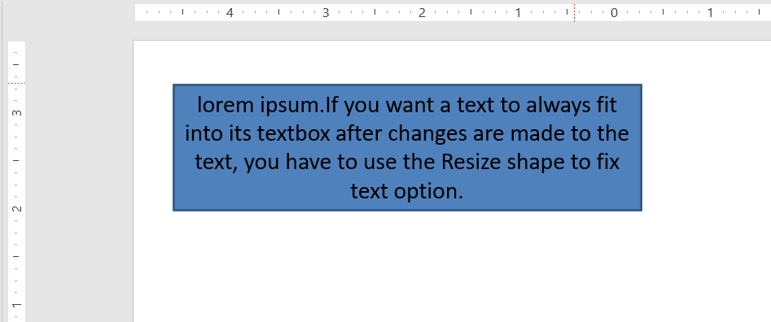

## **Wprowadzenie**

Domyślnie, gdy dodajesz pole tekstowe, Microsoft PowerPoint używa ustawienia **Resize shape to fix text** dla tego pola — automatycznie zmienia rozmiar pola tekstowego, aby jego tekst zawsze mieścił się w nim. 


* Gdy tekst w polu tekstowym staje się dłuższy lub większy, PowerPoint automatycznie powiększa pole tekstowe — zwiększa jego wysokość — aby pomieścić więcej tekstu. 
* Gdy tekst w polu tekstowym staje się krótszy lub mniejszy, PowerPoint automatycznie zmniejsza pole tekstowe — zmniejsza jego wysokość — aby usunąć zbędną przestrzeń. 

W PowerPoint są to 4 ważne parametry lub opcje, które kontrolują zachowanie autofitu dla pola tekstowego: 

* **Nie dopasowuj automatycznie**
* **Zmniejsz tekst przy przepełnieniu**
* **Zmień rozmiar kształtu, aby dopasować tekst**
* **Zawijaj tekst w kształcie.**


Aspose.Slides for Android via Java udostępnia podobne opcje — niektóre właściwości w klasie [TextFrameFormat](https://reference.aspose.com/slides/pl/androidjava/com.aspose.slides/TextFrameFormat) — które pozwalają kontrolować zachowanie autofitu dla pól tekstowych w prezentacjach.

## **Zmienianie rozmiaru kształtu, aby dopasować tekst**

Jeśli chcesz, aby tekst w ramce zawsze mieścił się w niej po wprowadzeniu zmian, musisz użyć opcji **Resize shape to fix text**. Aby określić to ustawienie, ustaw właściwość [AutofitType](https://reference.aspose.com/slides/pl/androidjava/com.aspose.slides/TextFrameFormat#getAutofitType--) (z klasy [TextFrameFormat](https://reference.aspose.com/slides/pl/androidjava/com.aspose.slides/TextFrameFormat)) na `Shape`.



Ten kod Java pokazuje, jak określić, że tekst musi zawsze mieścić się w swojej ramce w prezentacji PowerPoint:

```java
Presentation pres = new Presentation();
try {
    ISlide slide = pres.getSlides().get_Item(0);
    IAutoShape autoShape = slide.getShapes().addAutoShape(ShapeType.Rectangle, 30, 30, 350, 100);

    Portion portion = new Portion("lorem ipsum...");
    portion.getPortionFormat().getFillFormat().getSolidFillColor().setColor(Color.BLACK);
    portion.getPortionFormat().getFillFormat().setFillType(FillType.Solid);
    autoShape.getTextFrame().getParagraphs().get_Item(0).getPortions().add(portion);

    ITextFrameFormat textFrameFormat = autoShape.getTextFrame().getTextFrameFormat();
    textFrameFormat.setAutofitType(TextAutofitType.Shape);

    pres.save("Output-presentation.pptx", SaveFormat.Pptx);
} finally {
    if (pres != null) pres.dispose();
}
```

Jeśli tekst stanie się dłuższy lub większy, pole tekstowe zostanie automatycznie zmienione (zwiększenie wysokości), aby cały tekst w nim się zmieścił. Jeśli tekst stanie się krótszy, nastąpi odwrotne działanie. 

## **Nie dopasowuj automatycznie**

Jeśli chcesz, aby pole tekstowe lub kształt zachowały swoje wymiary niezależnie od wprowadzonych zmian w zawartym tekście, musisz użyć opcji **Do not Autofit**. Aby określić to ustawienie, ustaw właściwość [AutofitType](https://reference.aspose.com/slides/pl/androidjava/com.aspose.slides/TextFrameFormat#getAutofitType--) (z klasy [TextFrameFormat](https://reference.aspose.com/slides/pl/androidjava/com.aspose.slides/TextFrameFormat)) na `None`.


Ten kod Java pokazuje, jak określić, że pole tekstowe musi zawsze zachować swoje wymiary w prezentacji PowerPoint:

```java
Presentation pres = new Presentation();
try {
    ISlide slide = pres.getSlides().get_Item(0);
    IAutoShape autoShape = slide.getShapes().addAutoShape(ShapeType.Rectangle, 30, 30, 350, 100);
	
    Portion portion = new Portion("lorem ipsum...");
    portion.getPortionFormat().getFillFormat().getSolidFillColor().setColor(Color.BLACK);
    portion.getPortionFormat().getFillFormat().setFillType(FillType.Solid);
    autoShape.getTextFrame().getParagraphs().get_Item(0).getPortions().add(portion);
	
    ITextFrameFormat textFrameFormat = autoShape.getTextFrame().getTextFrameFormat();
    textFrameFormat.setAutofitType(TextAutofitType.None);
	
    pres.save("Output-presentation.pptx", SaveFormat.Pptx);
} finally {
    if (pres != null) pres.dispose();
}
```

Gdy tekst stanie się zbyt długi dla swojej ramki, wycieka poza nią. 

## **Zmniejsz tekst przy przepełnieniu**

Jeśli tekst stanie się zbyt długi dla swojej ramki, za pomocą opcji **Shrink text on overflow** możesz określić, że rozmiar i odstępy tekstu mają zostać zmniejszone, aby zmieściły się w ramce. Aby określić to ustawienie, ustaw właściwość [AutofitType](https://reference.aspose.com/slides/pl/androidjava/com.aspose.slides/TextFrameFormat#getAutofitType--) (z klasy [TextFrameFormat](https://reference.aspose.com/slides/pl/androidjava/com.aspose.slides/TextFrameFormat)) na `Normal`.


Ten kod Java pokazuje, jak określić, że tekst ma być zmniejszany przy przepełnieniu w prezentacji PowerPoint:

```java
Presentation pres = new Presentation();
try {
    ISlide slide = pres.getSlides().get_Item(0);
    IAutoShape autoShape = slide.getShapes().addAutoShape(ShapeType.Rectangle, 30, 30, 350, 100);
	
    Portion portion = new Portion("lorem ipsum...");
    portion.getPortionFormat().getFillFormat().getSolidFillColor().setColor(Color.BLACK);
    portion.getPortionFormat().getFillFormat().setFillType(FillType.Solid);
    autoShape.getTextFrame().getParagraphs().get_Item(0).getPortions().add(portion);
	
    ITextFrameFormat textFrameFormat = autoShape.getTextFrame().getTextFrameFormat();
    textFrameFormat.setAutofitType(TextAutofitType.Normal);
	
    pres.save("Output-presentation.pptx", SaveFormat.Pptx);
} finally {
    if (pres != null) pres.dispose();
}
```

{}
Gdy użyta jest opcja **Shrink text on overflow**, ustawienie jest stosowane tylko wtedy, gdy tekst stanie się zbyt długi dla swojej ramki. 
{}

## **Zawijaj tekst**

Jeśli chcesz, aby tekst w kształcie był zawijany wewnątrz tego kształtu, gdy wykracza poza jego granicę (tylko szerokość), musisz użyć parametru **Wrap text in shape**. Aby określić to ustawienie, należy ustawić właściwość [WrapText](https://reference.aspose.com/slides/pl/androidjava/com.aspose.slides/TextFrameFormat#getWrapText--) (z klasy [TextFrameFormat](https://reference.aspose.com/slides/pl/androidjava/com.aspose.slides/TextFrameFormat)) na `true`.


Ten kod Java pokazuje, jak używać ustawienia Wrap Text w prezentacji PowerPoint:

```java
Presentation pres = new Presentation();
try {
    ISlide slide = pres.getSlides().get_Item(0);
    IAutoShape autoShape = slide.getShapes().addAutoShape(ShapeType.Rectangle, 30, 30, 350, 100);

    Portion portion = new Portion("lorem ipsum...");
    portion.getPortionFormat().getFillFormat().getSolidFillColor().setColor(Color.BLACK);
    portion.getPortionFormat().getFillFormat().setFillType(FillType.Solid);
    autoShape.getTextFrame().getParagraphs().get_Item(0).getPortions().add(portion);

    ITextFrameFormat textFrameFormat = autoShape.getTextFrame().getTextFrameFormat();
    textFrameFormat.setWrapText(NullableBool.True);

    pres.save("Output-presentation.pptx", SaveFormat.Pptx);
} finally {
    if (pres != null) pres.dispose();
}
```

{} 
Jeśli ustawisz właściwość `WrapText` na `False` dla kształtu, gdy tekst wewnątrz kształtu stanie się dłuższy niż jego szerokość, tekst zostanie wydłużony poza granice kształtu w jednej linii. 
{}

## **FAQ**

**Czy wewnętrzne marginesy ramki tekstowej wpływają na AutoFit?**

Tak. Padding (wewnętrzne marginesy) zmniejsza dostępny obszar dla tekstu, więc AutoFit uruchomi się wcześniej — zmniejszając czcionkę lub rozmiar kształtu szybciej. Sprawdź i dostosuj marginesy przed regulacją AutoFit.

**Jak AutoFit współpracuje z ręcznymi i miękkimi podziałami linii?**

Wymuszone podziały pozostają na miejscu, a AutoFit dostosowuje rozmiar czcionki i odstępy wokół nich. Usunięcie niepotrzebnych podziałów często zmniejsza agresywność, z jaką AutoFit musi zmniejszać tekst.

**Czy zmiana czcionki motywu lub wywołanie podstawienia czcionki wpływa na wyniki AutoFit?**

Tak. Zastąpienie czcionką o innych metrykach glifów zmienia szerokość/wysokość tekstu, co może zmienić ostateczny rozmiar czcionki i zawijanie linii. Po każdej zmianie czcionki lub jej podstawieniu należy ponownie sprawdzić slajdy.