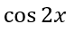
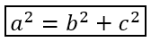

## **Przegląd**

PowerPoint przechowuje równania jako Office Math Markup Language (OMML). Za pomocą Aspose.Slides for Android via Java można programowo tworzyć tego samego rodzaju zawartość matematyczną: ułamki, pierwiastki, funkcje, granice, operatory N-ary, macierze, tablice i sformatowane bloki matematyczne.

W PowerPoint użytkownicy zazwyczaj dodają równania z **Insert > Equation**:


Wynik to edytowalny tekst matematyczny na slajdzie:


Aspose.Slides buduje ten tekst matematyczny przy użyciu trzech głównych obiektów:

- Kształt matematyczny, utworzony przy pomocy [addMathShape](https://reference.aspose.com/slides/pl/androidjava/com.aspose.slides/ishapecollection/), jest kształtem zawierającym równanie.
- Obiekt [MathPortion](https://reference.aspose.com/slides/pl/androidjava/com.aspose.slides/mathportion/) przechowuje zawartość matematyczną wewnątrz ramki tekstowej kształtu.
- [MathParagraph](https://reference.aspose.com/slides/pl/androidjava/com.aspose.slides/mathparagraph/) zawiera jeden lub więcej obiektów [MathBlock](https://reference.aspose.com/slides/pl/androidjava/com.aspose.slides/mathblock/).

Większość przykładów poniżej używa [MathematicalText](https://reference.aspose.com/slides/pl/androidjava/com.aspose.slides/mathematicaltext/) oraz płynnych metod z [IMathElement](https://reference.aspose.com/slides/pl/androidjava/com.aspose.slides/imathelement/), aby kod był krótki i czytelny.

W scenariuszach eksportu MathML zobacz [Export Math Equations from Presentations on Android](/slides/pl/androidjava/exporting-math-equations/).

## **Utwórz równanie**

Ten przykład tworzy kształt matematyczny i dodaje twierdzenie Pitagorasa:


```java
Presentation presentation = new Presentation();
try {
    ISlide slide = presentation.getSlides().get_Item(0);

    IAutoShape mathShape = slide.getShapes().addMathShape(20, 20, 700, 120);
    IMathParagraph mathParagraph = ((MathPortion) mathShape.getTextFrame().getParagraphs()
            .get_Item(0).getPortions().get_Item(0)).getMathParagraph();

    IMathBlock equation = new MathematicalText("c")
            .setSuperscript("2")
            .join("=")
            .join(new MathematicalText("a").setSuperscript("2"))
            .join("+")
            .join(new MathematicalText("b").setSuperscript("2"));

    mathParagraph.add(equation);

    presentation.save("pythagorean-theorem.pptx", SaveFormat.Pptx);
} finally {
    presentation.dispose();
}
```

{}
`addMathShape` tworzy kształt, który już zawiera akapit matematyczny. Uzyskaj dostęp do pierwszego `MathPortion`, pobierz jego `MathParagraph` i dodaj do niego bloki matematyczne lub elementy matematyczne.
{}

## **Dodaj ułamki**

Użyj `divide`, aby utworzyć ułamek. Możesz wybrać styl ułamka za pomocą [MathFractionTypes](https://reference.aspose.com/slides/pl/androidjava/com.aspose.slides/mathfractiontypes/).


```java
Presentation presentation = new Presentation();
try {
    ISlide slide = presentation.getSlides().get_Item(0);

    IAutoShape mathShape = slide.getShapes().addMathShape(20, 20, 700, 100);
    IMathParagraph mathParagraph = ((MathPortion) mathShape.getTextFrame().getParagraphs()
            .get_Item(0).getPortions().get_Item(0)).getMathParagraph();

    IMathFraction fraction = new MathematicalText("1")
            .divide("x", MathFractionTypes.Skewed);

    mathParagraph.add(new MathBlock(fraction));

    presentation.save("fraction.pptx", SaveFormat.Pptx);
} finally {
    presentation.dispose();
}
```

Aby uzyskać ułamek składowany, użyj `MathFractionTypes.Bar`:

```java
IMathFraction stackedFraction = new MathematicalText("x + 1").divide("y - 1", MathFractionTypes.Bar);
```

## **Dodaj pierwiastki**

Użyj `radical`, aby stworzyć pierwiastek kwadratowy, sześcienny lub inny. Bieżący element staje się podstawą, a argument określa stopień.


```java
Presentation presentation = new Presentation();
try {
    ISlide slide = presentation.getSlides().get_Item(0);

    IAutoShape mathShape = slide.getShapes().addMathShape(20, 20, 700, 100);
    IMathParagraph mathParagraph = ((MathPortion) mathShape.getTextFrame().getParagraphs()
            .get_Item(0).getPortions().get_Item(0)).getMathParagraph();

    IMathRadical radical = new MathematicalText("x")
            .radical("n");

    mathParagraph.add(new MathBlock(radical));

    presentation.save("radical.pptx", SaveFormat.Pptx);
} finally {
    presentation.dispose();
}
```

## **Dodaj funkcje i granice**

Użyj `asArgumentOfFunction` lub `function` dla funkcji takich jak `sin(x)`, `log(x)` lub własnych nazw funkcji. Dla granic umieść `lim` w obiekcie [MathLimit](https://reference.aspose.com/slides/pl/androidjava/com.aspose.slides/mathlimit/) lub użyj `setLowerLimit`.


```java
Presentation presentation = new Presentation();
try {
    ISlide slide = presentation.getSlides().get_Item(0);

    IAutoShape mathShape = slide.getShapes().addMathShape(20, 20, 700, 100);
    IMathParagraph mathParagraph = ((MathPortion) mathShape.getTextFrame().getParagraphs()
            .get_Item(0).getPortions().get_Item(0)).getMathParagraph();

    IMathFunction limit = new MathematicalText("lim")
            .setLowerLimit("x→∞")
            .function("x");

    mathParagraph.add(new MathBlock(limit));

    presentation.save("functions-and-limits.pptx", SaveFormat.Pptx);
} finally {
    presentation.dispose();
}
```

Aby użyć własnej nazwy funkcji, ustaw nazwę funkcji jako bieżący element:

```java
IMathFunction customFunction = new MathematicalText("f").function("x + 1");
```

## **Dodaj operatory N-ary i całki**

Użyj `nary` dla sumacji, sum, przecięć i innych dużych operatorów. Użyj `integral` dla całek. Obie metody pozwalają ustawić dolne i górne granice.


```java
Presentation presentation = new Presentation();
try {
    ISlide slide = presentation.getSlides().get_Item(0);

    IAutoShape mathShape = slide.getShapes().addMathShape(20, 20, 700, 120);
    IMathParagraph mathParagraph = ((MathPortion) mathShape.getTextFrame().getParagraphs()
            .get_Item(0).getPortions().get_Item(0)).getMathParagraph();

    IMathBlock summationBase = new MathematicalText("x")
            .setSuperscript("k")
            .join(new MathematicalText("a").setSuperscript("n-k"));

    IMathNaryOperator summation = summationBase.nary(MathNaryOperatorTypes.Summation, "k=0", "n");

    mathParagraph.add(new MathBlock(summation));

    presentation.save("nary-operators.pptx", SaveFormat.Pptx);
} finally {
    presentation.dispose();
}
```

Operatory N-ary służą do dużych operatorów z opcjonalnymi granicami. Proste operatory takie jak `+`, `-` i `=` są zwykle dodawane jako `MathematicalText` i łączone w wyrażeniu.

Dla całki użyj `integral`:

```java
IMathBlock integralBase = new MathematicalText("x").join(new MathematicalText("dx").toBox());
IMathNaryOperator integral = integralBase.integral(MathIntegralTypes.Simple, "0", "1");
```

## **Dodaj macierze**

Użyj [MathMatrix](https://reference.aspose.com/slides/pl/androidjava/com.aspose.slides/mathmatrix/) dla wierszy i kolumn. Macierze domyślnie nie zawierają nawiasów, więc otaczaj macierz, gdy potrzebujesz nawiasów okrągłych, kwadratowych lub klamrowych.


```java
Presentation presentation = new Presentation();
try {
    ISlide slide = presentation.getSlides().get_Item(0);

    IAutoShape mathShape = slide.getShapes().addMathShape(20, 20, 700, 120);
    IMathParagraph mathParagraph = ((MathPortion) mathShape.getTextFrame().getParagraphs()
            .get_Item(0).getPortions().get_Item(0)).getMathParagraph();

    MathMatrix matrix = new MathMatrix(2, 3);
    matrix.set_Item(0, 0, new MathematicalText("1"));
    matrix.set_Item(0, 1, new MathematicalText("x"));
    matrix.set_Item(1, 0, new MathematicalText("x"));
    matrix.set_Item(1, 1, new MathematicalText("2"));
    matrix.set_Item(1, 2, new MathematicalText("y"));

    mathParagraph.add(new MathBlock(matrix));

    presentation.save("matrix.pptx", SaveFormat.Pptx);
} finally {
    presentation.dispose();
}
```

## **Dodaj tablice równań**

Użyj `toMathArray`, gdy potrzebujesz wyrównanych równań lub pionowego stosu wyrażeń.


```java
Presentation presentation = new Presentation();
try {
    ISlide slide = presentation.getSlides().get_Item(0);

    IAutoShape mathShape = slide.getShapes().addMathShape(20, 20, 700, 140);
    IMathParagraph mathParagraph = ((MathPortion) mathShape.getTextFrame().getParagraphs()
            .get_Item(0).getPortions().get_Item(0)).getMathParagraph();

    IMathArray equationArray = new MathematicalText("x")
            .join("y")
            .toMathArray();

    mathParagraph.add(new MathBlock(equationArray));

    presentation.save("equation-array.pptx", SaveFormat.Pptx);
} finally {
    presentation.dispose();
}
```

## **Dodaj funkcje trygonometryczne**

Użyj `asArgumentOfFunction`, gdy argument jest bieżącym elementem, a nazwa funkcji jest znana.



```java
Presentation presentation = new Presentation();
try {
    ISlide slide = presentation.getSlides().get_Item(0);

    IAutoShape mathShape = slide.getShapes().addMathShape(20, 20, 700, 100);
    IMathParagraph mathParagraph = ((MathPortion) mathShape.getTextFrame().getParagraphs()
            .get_Item(0).getPortions().get_Item(0)).getMathParagraph();

    IMathFunction cosine = new MathematicalText("2x")
            .asArgumentOfFunction(MathFunctionsOfOneArgument.Cos);

    mathParagraph.add(new MathBlock(cosine));

    presentation.save("trigonometric-function.pptx", SaveFormat.Pptx);
} finally {
    presentation.dispose();
}
```

## **Dodaj indeksy dolne i górne**

Użyj pomocników indeksów dolnych i górnych dla indeksów i potęg. Gdy indeksy mają pojawić się po lewej stronie podstawy, użyj `setSubSuperscriptOnTheLeft`.


```java
Presentation presentation = new Presentation();
try {
    ISlide slide = presentation.getSlides().get_Item(0);

    IAutoShape mathShape = slide.getShapes().addMathShape(20, 20, 700, 100);
    IMathParagraph mathParagraph = ((MathPortion) mathShape.getTextFrame().getParagraphs()
            .get_Item(0).getPortions().get_Item(0)).getMathParagraph();

    IMathLeftSubSuperscriptElement scripts = new MathematicalText("Y")
            .setSubSuperscriptOnTheLeft("1", "n");

    mathParagraph.add(new MathBlock(scripts));

    presentation.save("subscript-superscript.pptx", SaveFormat.Pptx);
} finally {
    presentation.dispose();
}
```

## **Dodaj delimitery**

Użyj `enclose`, aby umieścić wyrażenie wewnątrz delimiterów. Możesz także ustawić znak separatora dla wyrażeń delimiterowych zawierających wiele elementów.


```java
Presentation presentation = new Presentation();
try {
    ISlide slide = presentation.getSlides().get_Item(0);

    IAutoShape mathShape = slide.getShapes().addMathShape(20, 20, 700, 100);
    IMathParagraph mathParagraph = ((MathPortion) mathShape.getTextFrame().getParagraphs()
            .get_Item(0).getPortions().get_Item(0)).getMathParagraph();

    IMathDelimiter delimiter = new MathematicalText("x")
            .join("y")
            .join("z")
            .enclose('<', '>');
    delimiter.setSeparatorCharacter('|');

    mathParagraph.add(new MathBlock(delimiter));

    presentation.save("delimiters.pptx", SaveFormat.Pptx);
} finally {
    presentation.dispose();
}
```

## **Dodaj ramkę otaczającą**

Użyj `toBorderBox`, gdy samo równanie powinno być otoczone ramką.



```java
Presentation presentation = new Presentation();
try {
    ISlide slide = presentation.getSlides().get_Item(0);

    IAutoShape mathShape = slide.getShapes().addMathShape(20, 20, 700, 100);
    IMathParagraph mathParagraph = ((MathPortion) mathShape.getTextFrame().getParagraphs()
            .get_Item(0).getPortions().get_Item(0)).getMathParagraph();

    IMathBorderBox boxedEquation = new MathematicalText("a")
            .setSuperscript("2")
            .join("=")
            .join(new MathematicalText("b").setSuperscript("2"))
            .join("+")
            .join(new MathematicalText("c").setSuperscript("2"))
            .toBorderBox();

    mathParagraph.add(new MathBlock(boxedEquation));

    presentation.save("border-box.pptx", SaveFormat.Pptx);
} finally {
    presentation.dispose();
}
```

## **Grupuj wyrażenia**

Użyj `group`, aby umieścić znak grupujący nad lub pod wyrażeniem. Dodaj limit, aby oznaczyć zgrupowane wyrażenia.


```java
Presentation presentation = new Presentation();
try {
    ISlide slide = presentation.getSlides().get_Item(0);

    IAutoShape mathShape = slide.getShapes().addMathShape(20, 20, 700, 120);
    IMathParagraph mathParagraph = ((MathPortion) mathShape.getTextFrame().getParagraphs()
            .get_Item(0).getPortions().get_Item(0)).getMathParagraph();

    IMathLimit grouped = new MathematicalText("x + y")
            .group('\u23DF', MathTopBotPositions.Bottom, MathTopBotPositions.Top)
            .setLowerLimit("any text");

    mathParagraph.add(new MathBlock(grouped));

    presentation.save("grouped-terms.pptx", SaveFormat.Pptx);
} finally {
    presentation.dispose();
}
```

## **Formatuj elementy matematyczne**

Używaj pomocników formatowania tylko tam, gdzie wyjaśniają formułę. Na przykład `overbar` umieszcza pasek nad elementem matematycznym.


```java
Presentation presentation = new Presentation();
try {
    ISlide slide = presentation.getSlides().get_Item(0);

    IAutoShape mathShape = slide.getShapes().addMathShape(20, 20, 700, 100);
    IMathParagraph mathParagraph = ((MathPortion) mathShape.getTextFrame().getParagraphs()
            .get_Item(0).getPortions().get_Item(0)).getMathParagraph();

    IMathBar overbar = new MathematicalText("ABC").overbar();

    mathParagraph.add(new MathBlock(overbar));

    presentation.save("overbar.pptx", SaveFormat.Pptx);
} finally {
    presentation.dispose();
}
```

## **Szybka referencja**

| Zadanie | Główne API |
| --- | --- |
| Utwórz tekst matematyczny | [MathematicalText](https://reference.aspose.com/slides/pl/androidjava/com.aspose.slides/mathematicaltext/) |
| Połącz elementy | [IMathElement.join](https://reference.aspose.com/slides/pl/androidjava/com.aspose.slides/imathelement/) |
| Utwórz ułamki | [IMathElement.divide](https://reference.aspose.com/slides/pl/androidjava/com.aspose.slides/imathelement/) |
| Dodaj indeks górny lub dolny | [setSuperscript](https://reference.aspose.com/slides/pl/androidjava/com.aspose.slides/imathelement/), [setSubscript](https://reference.aspose.com/slides/pl/androidjava/com.aspose.slides/imathelement/) |
| Dodaj funkcje | [function](https://reference.aspose.com/slides/pl/androidjava/com.aspose.slides/imathelement/), [asArgumentOfFunction](https://reference.aspose.com/slides/pl/androidjava/com.aspose.slides/imathelement/) |
| Dodaj pierwiastki | [IMathElement.radical](https://reference.aspose.com/slides/pl/androidjava/com.aspose.slides/imathelement/) |
| Dodaj granice | [setLowerLimit](https://reference.aspose.com/slides/pl/androidjava/com.aspose.slides/imathelement/), [setUpperLimit](https://reference.aspose.com/slides/pl/androidjava/com.aspose.slides/imathelement/) |
| Dodaj skrypty po lewej stronie | [setSubSuperscriptOnTheLeft](https://reference.aspose.com/slides/pl/androidjava/com.aspose.slides/imathelement/) |
| Dodaj sumacje i całki | [nary](https://reference.aspose.com/slides/pl/androidjava/com.aspose.slides/imathelement/), [integral](https://reference.aspose.com/slides/pl/androidjava/com.aspose.slides/imathelement/) |
| Dodaj macierze | [MathMatrix](https://reference.aspose.com/slides/pl/androidjava/com.aspose.slides/mathmatrix/) |
| Dodaj tablice równań | [toMathArray](https://reference.aspose.com/slides/pl/androidjava/com.aspose.slides/imathelement/) |
| Dodaj delimitery | [enclose](https://reference.aspose.com/slides/pl/androidjava/com.aspose.slides/imathelement/) |
| Dodaj paski i obramowania | [overbar](https://reference.aspose.com/slides/pl/androidjava/com.aspose.slides/imathelement/), [toBorderBox](https://reference.aspose.com/slides/pl/androidjava/com.aspose.slides/imathelement/) |
| Grupuj wyrażenia | [group](https://reference.aspose.com/slides/pl/androidjava/com.aspose.slides/imathelement/) |

## **FAQ**

**Czy mogę edytować istniejące równanie PowerPoint?**

Tak. Otwórz prezentację, znajdź kształt zawierający `MathPortion`, pobierz jego `MathParagraph` i zaktualizuj bloki matematyczne w tym akapicie.

**Czy równania są zapisywane jako edytowalna matematyka PowerPoint?**

Tak. Podczas zapisu do formatu PPTX, Aspose.Slides zapisuje równanie jako edytowalną zawartość Office Math.

**Czy mogę wyeksportować równania do LaTeX?**

Aspose.Slides eksportuje równania matematyczne do MathML. Jeśli potrzebujesz LaTeX, najpierw wyeksportuj do MathML, a następnie przekształć MathML przy pomocy narzędzia obsługującego docelowy dialekt LaTeX.