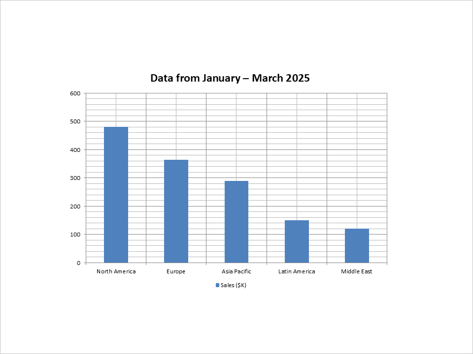

## **Wprowadzenie**

Tworzenie prezentacji PowerPoint ręcznie może być czasochłonnym i powtarzalnym zadaniem — szczególnie gdy treść opiera się na dynamicznych danych, które często się zmieniają. Niezależnie od tego, czy generujesz cotygodniowe raporty biznesowe, przygotowujesz materiały edukacyjne, czy tworzysz gotowe do prezentacji oferty sprzedażowe, automatyzacja może zaoszczędzić niezliczone godziny i zapewnić spójność w całych zespołach.

Dla programistów Androida automatyzacja tworzenia prezentacji PowerPoint otwiera potężne możliwości. Możesz integrować generowanie slajdów z portalami internetowymi, narzędziami desktopowymi, usługami backendowymi lub platformami chmurowymi, aby dynamicznie przekształcać dane w profesjonalne, markowe prezentacje — na żądanie.

W tym artykule przyjrzymy się typowym scenariuszom użycia automatycznego generowania PowerPoint w aplikacjach Android (w tym wdrożeniom w chmurze) oraz wyjaśnimy, dlaczego staje się to niezbędną funkcją we współczesnych rozwiązaniach. Od pobierania danych biznesowych w czasie rzeczywistym po konwertowanie tekstu lub obrazów na slajdy, celem jest przekształcenie surowej treści w ustrukturyzowane, wizualne formaty, które odbiorca od razu zrozumie.

## **Typowe przypadki użycia automatyzacji PowerPoint na Androidzie**

Automatyzacja generowania PowerPoint jest szczególnie przydatna w sytuacjach, gdy zawartość prezentacji musi być dynamicznie zestawiana, personalizowana lub często aktualizowana. Najczęstsze rzeczywiste scenariusze obejmują:

- **Raporty biznesowe i pulpity nawigacyjne**  
  Generowanie podsumowań sprzedaży, KPI lub raportów finansowych poprzez pobieranie danych na żywo z baz danych lub interfejsów API.

- **Spersonalizowane materiały sprzedażowe i marketingowe**  
  Automatyczne tworzenie decków pitchowych dostosowanych do klienta przy użyciu danych z CRM lub formularzy, zapewniając szybki czas realizacji i spójność marki.

- **Treści edukacyjne**  
  Konwertowanie materiałów szkoleniowych, quizów lub podsumowań kursów w ustrukturyzowane decki slajdów dla platform e‑learningowych.

- **Wnioski oparte na danych i AI**  
  Wykorzystanie przetwarzania języka naturalnego lub silników analitycznych do przekształcania surowych danych lub długich tekstów w zwięzłe prezentacje.

- **Slajdy oparte na multimediach**  
  Tworzenie prezentacji z przesłanych obrazów, oznaczonych zrzutów ekranu lub klatek wideo wraz z opisami.

- **Konwersja dokumentów**  
  Automatyczne przekształcanie dokumentów Word, PDF lub danych z formularzy w wizualne prezentacje przy minimalnym nakładzie pracy ręcznej.

- **Narzędzia deweloperskie i techniczne**  
  Tworzenie demo technicznych, przeglądów dokumentacji lub changelogów w formacie slajdów bezpośrednio z kodu lub treści markdown.

Automatyzując te przepływy pracy, organizacje mogą skalować produkcję treści, utrzymywać spójność i uwolnić czas na bardziej strategiczne zadania.

## **Zacznijmy kodować**

W tym przykładzie wybraliśmy **[Aspose.Slides for Android](https://products.aspose.com/slides/pl/android-java/)** do demonstracji automatyzacji PowerPoint ze względu na kompleksowy zestaw funkcji i łatwość użycia przy programowym tworzeniu prezentacji.

W przeciwieństwie do bibliotek niskiego poziomu, które wymagają od programistów pracy bezpośrednio ze strukturą Open XML (co często prowadzi do rozbudowanego i mniej czytelnego kodu), Aspose.Slides udostępnia wyższy poziom API. Abstrahuje on złożoność, pozwalając programistom skupić się na logice prezentacji — takiej jak układ, formatowanie i powiązania danych — bez konieczności dogłębnej znajomości formatu pliku PowerPoint.

Choć Aspose.Slides jest biblioteką komercyjną, oferuje wersję [bezpłatna wersja próbna](https://releases.aspose.com/slides/pl/androidjava/), która w pełni wystarcza do uruchomienia przykładów zamieszczonych w tym artykule. Do celów demonstracji pomysłów, testowania funkcji lub budowania proof of concept, wersja próbna jest więcej niż wystarczająca. Dzięki temu jest to wygodna opcja do eksperymentowania z automatycznym generowaniem PowerPoint bez konieczności natychmiastowego zakupu licencji.

Dobrze, przejdźmy krok po kroku przez tworzenie przykładowej prezentacji przy użyciu rzeczywistych danych.

### **Utwórz slajd tytułowy**

Zaczniemy od stworzenia nowej prezentacji i dodania slajdu tytułowego z nagłówkiem i podtytułem.

```java
Presentation presentation = new Presentation();

ISlide slide0 = presentation.getSlides().get_Item(0);

ILayoutSlide layoutSlide = presentation.getLayoutSlides().getByType(SlideLayoutType.Title);
slide0.setLayoutSlide(layoutSlide);

IAutoShape titleShape = (IAutoShape)slide0.getShapes().get_Item(0);
IAutoShape subtitleShape = (IAutoShape)slide0.getShapes().get_Item(1);

titleShape.getTextFrame().setText("Quarterly Business Review – Q1 2025");
subtitleShape.getTextFrame().setText("Prepared for Executive Team");
```


### **Dodaj slajd z wykresem kolumnowym**

Następnie utworzymy slajd przedstawiający wyniki sprzedaży regionalnej w formie wykresu kolumnowego.

```java
ILayoutSlide layoutSlide1 = presentation.getLayoutSlides().getByType(SlideLayoutType.Blank);
ISlide slide1 = presentation.getSlides().addEmptySlide(layoutSlide1);

IChart chart = slide1.getShapes().addChart(ChartType.ClusteredColumn, 100, 100, 500, 350, false);
chart.getLegend().setPosition(LegendPositionType.Bottom);
chart.setTitle(true);
chart.getChartTitle().addTextFrameForOverriding("Data from January – March 2025");
chart.getChartTitle().setOverlay(false);

IChartDataWorkbook workbook = chart.getChartData().getChartDataWorkbook();
int worksheetIndex = 0;

chart.getChartData().getCategories().add(workbook.getCell(worksheetIndex, 1, 0, "North America"));
chart.getChartData().getCategories().add(workbook.getCell(worksheetIndex, 2, 0, "Europe"));
chart.getChartData().getCategories().add(workbook.getCell(worksheetIndex, 3, 0, "Asia Pacific"));
chart.getChartData().getCategories().add(workbook.getCell(worksheetIndex, 4, 0, "Latin America"));
chart.getChartData().getCategories().add(workbook.getCell(worksheetIndex, 5, 0, "Middle East"));

IChartSeries series = chart.getChartData().getSeries().add(workbook.getCell(worksheetIndex, 0, 1, "Sales ($K)"), chart.getType());
series.getDataPoints().addDataPointForBarSeries(workbook.getCell(worksheetIndex, 1, 1, 480));
series.getDataPoints().addDataPointForBarSeries(workbook.getCell(worksheetIndex, 2, 1, 365));
series.getDataPoints().addDataPointForBarSeries(workbook.getCell(worksheetIndex, 3, 1, 290));
series.getDataPoints().addDataPointForBarSeries(workbook.getCell(worksheetIndex, 4, 1, 150));
series.getDataPoints().addDataPointForBarSeries(workbook.getCell(worksheetIndex, 5, 1, 120));
```



### **Dodaj slajd z tabelą**

Teraz dodamy slajd prezentujący kluczowe wskaźniki wydajności w formacie tabeli.

```java
ILayoutSlide layoutSlide2 = presentation.getLayoutSlides().getByType(SlideLayoutType.Blank);
ISlide slide2 = presentation.getSlides().addEmptySlide(layoutSlide2);

double[] columnWidths = {200, 100};
double[] rowHeights = {40, 40, 40, 40, 40};

ITable table = slide2.getShapes().addTable(200, 200, columnWidths, rowHeights);
table.getColumns().get_Item(0).get_Item(0).getTextFrame().setText("Metric");
table.getColumns().get_Item(1).get_Item(0).getTextFrame().setText("Value");
table.getColumns().get_Item(0).get_Item(1).getTextFrame().setText("Total Revenue");
table.getColumns().get_Item(1).get_Item(1).getTextFrame().setText("$1.4M");
table.getColumns().get_Item(0).get_Item(2).getTextFrame().setText("Gross Margin");
table.getColumns().get_Item(1).get_Item(2).getTextFrame().setText("54%");
table.getColumns().get_Item(0).get_Item(3).getTextFrame().setText("New Customers");
table.getColumns().get_Item(1).get_Item(3).getTextFrame().setText("340");
table.getColumns().get_Item(0).get_Item(4).getTextFrame().setText("Customer Retention");
table.getColumns().get_Item(1).get_Item(4).getTextFrame().setText("87%");
```


### **Dodaj slajd podsumowujący z punktami wypunktowanymi**

Na koniec dołączymy podsumowanie i plan działania przy użyciu prostej listy wypunktowanej.

```java
static IParagraph createBulletParagraph(String text) {
    Paragraph paragraph = new Paragraph();
    paragraph.getParagraphFormat().getBullet().setType(BulletType.Symbol);
    paragraph.getParagraphFormat().setIndent(15);
    paragraph.getParagraphFormat().getDefaultPortionFormat().getFillFormat().setFillType(FillType.Solid);
    paragraph.getParagraphFormat().getDefaultPortionFormat().getFillFormat().getSolidFillColor().setColor(Color.BLACK);
    paragraph.setText(text);
    return paragraph;
}
```
```java
ILayoutSlide layoutSlide3 = presentation.getLayoutSlides().getByType(SlideLayoutType.Blank);
ISlide slide3 = presentation.getSlides().addEmptySlide(layoutSlide3);

IAutoShape bulletList = slide3.getShapes().addAutoShape(ShapeType.Rectangle, 100, 50, 600, 200);
bulletList.getFillFormat().setFillType(FillType.NoFill);
bulletList.getLineFormat().getFillFormat().setFillType(FillType.NoFill);

bulletList.getTextFrame().getParagraphs().clear();
bulletList.getTextFrame().getParagraphs().add(createBulletParagraph("Strong performance in North America; growth opportunity in Asia Pacific"));
bulletList.getTextFrame().getParagraphs().add(createBulletParagraph("Improve marketing outreach in underperforming regions"));
bulletList.getTextFrame().getParagraphs().add(createBulletParagraph("Prepare new campaign strategy for Q2"));
bulletList.getTextFrame().getParagraphs().add(createBulletParagraph("Schedule follow-up review in early July"));
```


### **Zapisz prezentację**

Na zakończenie zapisujemy prezentację na dysku:

```java
presentation.save("presentation.pptx", SaveFormat.Pptx);
```

## **Podsumowanie**

Automatyzacja generowania PowerPoint w aplikacjach Android przynosi wyraźne korzyści w postaci oszczędności czasu i redukcji ręcznej pracy. Dzięki integracji dynamicznych treści, takich jak wykresy, tabele i tekst, programiści mogą szybko tworzyć spójne, profesjonalne prezentacje — idealne do raportów biznesowych, spotkań z klientami czy materiałów edukacyjnych.

W tym artykule pokazaliśmy, jak automatycznie stworzyć prezentację od podstaw, w tym dodanie slajdu tytułowego, wykresów i tabel. Takie podejście można zastosować w różnych scenariuszach, w których potrzebne są automatyczne, oparte na danych prezentacje.

Wykorzystując odpowiednie narzędzia, programiści Android mogą efektywnie automatyzować tworzenie PowerPoint, zwiększając produktywność i zapewniając spójność prezentacji.