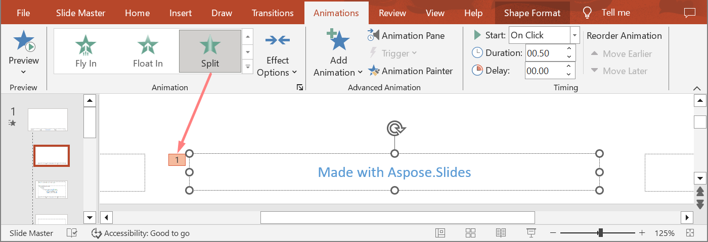

## **Przegląd**

Aspose.Slides for C++ reprezentuje animacje slajdów jako efekty w osi czasu slajdu. Efekt posiada docelowy kształt, typ i podtyp animacji, wyzwalacz, ustawienia czasowe oraz opcjonalne właściwości, takie jak dźwięk lub zachowanie po animacji.

Oś czasu zawiera dwa rodzaje sekwencji:

- **Główna sekwencja** odtwarzana jest podczas przechodzenia slajdu.  
- **Sekwencja interaktywna** rozpoczyna się, gdy jej kształt wyzwalający zostanie kliknięty.

Ponieważ pola tekstowe, obrazy, wykresy, tabele i inne obiekty slajdu implementują [IShape](https://reference.aspose.com/slides/pl/cpp/aspose.slides/ishape/), używasz tej samej metody [ISequence::AddEffect](https://reference.aspose.com/slides/pl/cpp/aspose.slides.animation/isequence/addeffect/) dla większości treści slajdu. Dostępne efekty są wymienione w wyliczeniu [EffectType](https://reference.aspose.com/slides/pl/cpp/aspose.slides.animation/effecttype/).

## **Dodawanie animacji kształtów**

Aby dodać animację, pobierz główną sekwencję slajdu i wywołaj [ISequence::AddEffect](https://reference.aspose.com/slides/pl/cpp/aspose.slides.animation/isequence/addeffect/) z docelowym kształtem, typem efektu, podtypem i wyzwalaczem. Dla efektu, który rozpoczyna się po kliknięciu innego kształtu, utwórz sekwencję interaktywną, której wyzwalaczem jest ten inny kształt.

Poniższy przykład tworzy oba typy animacji i zapisuje wynik do pliku `shape-animations.pptx`.

```cpp
#include <DOM/Animation/EffectSubtype.h>
#include <DOM/Animation/EffectTriggerType.h>
#include <DOM/Animation/EffectType.h>
#include <DOM/Animation/IEffect.h>
#include <DOM/Animation/ISequence.h>
#include <DOM/Animation/ISequenceCollection.h>
#include <DOM/Animation/ITiming.h>
#include <DOM/IAnimationTimeLine.h>
#include <DOM/IAutoShape.h>
#include <DOM/IShapeCollection.h>
#include <DOM/ISlide.h>
#include <DOM/ISlideCollection.h>
#include <DOM/ITextFrame.h>
#include <DOM/Presentation.h>
#include <DOM/ShapeType.h>
#include <Export/SaveFormat.h>

using namespace Aspose::Slides;
using namespace Aspose::Slides::Animation;
using namespace Aspose::Slides::Export;
using namespace System;

auto presentation = MakeObject<Presentation>();
auto slide = presentation->get_Slide(0);

auto targetShape = slide->get_Shapes()->AddAutoShape(ShapeType::RoundCornerRectangle, 120.0f, 100.0f, 320.0f, 80.0f);
targetShape->get_TextFrame()->set_Text(u"Click to animate this shape");

auto mainSequence = slide->get_Timeline()->get_MainSequence();
auto entranceEffect = mainSequence->AddEffect(targetShape, EffectType::Fade, EffectSubtype::None, EffectTriggerType::OnClick);
entranceEffect->get_Timing()->set_Duration(1.5f);

auto triggerShape = slide->get_Shapes()->AddAutoShape(ShapeType::Bevel, 20.0f, 20.0f, 100.0f, 40.0f);
triggerShape->get_TextFrame()->set_Text(u"Move");

auto interactiveSequence = slide->get_Timeline()->get_InteractiveSequences()->Add(triggerShape);
interactiveSequence->AddEffect(targetShape, EffectType::PathFootball, EffectSubtype::None, EffectTriggerType::OnClick);

presentation->Save(u"shape-animations.pptx", SaveFormat::Pptx);
presentation->Dispose();
```

Wyzwalacz określa, kiedy efekt się rozpoczyna:

- [EffectTriggerType::OnClick](https://reference.aspose.com/slides/pl/cpp/aspose.slides.animation/effecttriggertype/) oczekuje na kliknięcie w głównej sekwencji lub na kliknięcie kształtu wyzwalającego w sekwencji interaktywnej.  
- [EffectTriggerType::WithPrevious](https://reference.aspose.com/slides/pl/cpp/aspose.slides.animation/effecttriggertype/) rozpoczyna się razem z poprzedzającym efektem.  
- [EffectTriggerType::AfterPrevious](https://reference.aspose.com/slides/pl/cpp/aspose.slides.animation/effecttriggertype/) rozpoczyna się po zakończeniu poprzedzającego efektu.

Aby animować obraz, wykres lub inny typ kształtu, przekaż ten obiekt do [ISequence::AddEffect](https://reference.aspose.com/slides/pl/cpp/aspose.slides.animation/isequence/addeffect/) zamiast `targetShape`. Aby uzyskać opcje grupowania specyficzne dla wykresów, zobacz [Animowane wykresy](/slides/pl/cpp/animated-charts/).

## **Odczytywanie animacji kształtów**

Użyj [ISequence::GetEffectsByShape](https://reference.aspose.com/slides/pl/cpp/aspose.slides.animation/isequence/geteffectsbyshape/) gdy znasz docelowy kształt. Aby przejrzeć każdy efekt, wyliczaj główną sekwencję oraz wszystkie sekwencje interaktywne. Wyliczanie zapobiega zakładaniu, że sekwencja zawiera efekt o indeksie `0`.

Poniższy przykład tworzy kształt z efektami w głównej sekwencji i sekwencji interaktywnej, pobiera efekty skierowane do tego kształtu, a następnie wylicza wszystkie sekwencje na slajdzie.

```cpp
#include <DOM/Animation/EffectSubtype.h>
#include <DOM/Animation/EffectTriggerType.h>
#include <DOM/Animation/EffectType.h>
#include <DOM/Animation/IEffect.h>
#include <DOM/Animation/ISequence.h>
#include <DOM/Animation/ISequenceCollection.h>
#include <DOM/Animation/ITiming.h>
#include <DOM/IAnimationTimeLine.h>
#include <DOM/IAutoShape.h>
#include <DOM/IShape.h>
#include <DOM/IShapeCollection.h>
#include <DOM/ISlide.h>
#include <DOM/ISlideCollection.h>
#include <DOM/ITextFrame.h>
#include <DOM/Presentation.h>
#include <DOM/ShapeType.h>
#include <system/console.h>
#include <system/string.h>

using namespace Aspose::Slides;
using namespace Aspose::Slides::Animation;
using namespace System;

auto printSequence = [](const String& label, const SharedPtr<ISequence>& sequence)
{
    Console::WriteLine(String::Format(u"  {0}: {1} effect(s)", label, sequence->get_Count()));

    for (const auto& effect : sequence)
    {
        auto targetName = effect->get_TargetShape() == nullptr ? u"unknown" : effect->get_TargetShape()->get_Name();
        auto effectDescription = String::Format(u"{0} {1}; target: {2}; trigger: {3}", effect->get_Type(), effect->get_Subtype(), targetName, effect->get_Timing()->get_TriggerType());
        Console::WriteLine(u"    " + effectDescription);
    }
};

auto presentation = MakeObject<Presentation>();
auto slide = presentation->get_Slide(0);
auto targetShape = slide->get_Shapes()->AddAutoShape(ShapeType::Rectangle, 120.0f, 100.0f, 320.0f, 80.0f);
targetShape->get_TextFrame()->set_Text(u"Animated shape");

auto mainSequence = slide->get_Timeline()->get_MainSequence();
mainSequence->AddEffect(targetShape, EffectType::Fade, EffectSubtype::None, EffectTriggerType::OnClick);

auto triggerShape = slide->get_Shapes()->AddAutoShape(ShapeType::Bevel, 20.0f, 20.0f, 100.0f, 40.0f);
triggerShape->get_TextFrame()->set_Text(u"Move");

auto interactiveSequence = slide->get_Timeline()->get_InteractiveSequences()->Add(triggerShape);
interactiveSequence->AddEffect(targetShape, EffectType::PathFootball, EffectSubtype::None, EffectTriggerType::OnClick);

auto targetEffects = mainSequence->GetEffectsByShape(targetShape);
Console::WriteLine(String::Format(u"The main sequence contains {0} effect(s) for {1}.", targetEffects->get_Length(), targetShape->get_Name()));

printSequence(u"Main sequence", mainSequence);

int32_t interactiveIndex = 1;
for (const auto& sequence : slide->get_Timeline()->get_InteractiveSequences())
{
    auto triggerName = sequence->get_TriggerShape() == nullptr ? u"unknown" : sequence->get_TriggerShape()->get_Name();
    auto sequenceLabel = String::Format(u"Interactive sequence {0}, trigger: {1}", interactiveIndex, triggerName);
    printSequence(sequenceLabel, sequence);
    interactiveIndex++;
}

presentation->Dispose();
```

Jeśli potrzebujesz efektów tylko dla jednego kształtu, najpierw zidentyfikuj kształt według nazwy, typu placeholdera lub innej stabilnej właściwości; następnie wywołaj [ISequence::GetEffectsByShape](https://reference.aspose.com/slides/pl/cpp/aspose.slides.animation/isequence/geteffectsbyshape/). Nie zakładaj, że [IShapeCollection::idx_get](https://reference.aspose.com/slides/pl/cpp/aspose.slides/ishapecollection/idx_get/) o indeksie `0` jest zawsze zamierzonym obiektem.

## **Praca z odziedziczonymi efektami placeholderów**

Placeholder na zwykłym slajdzie może dziedziczyć zachowanie animacji z odpowiadającego mu placeholdera na slajdzie układu i slajdzie nadrzędnym. [IShape::GetBasePlaceholder](https://reference.aspose.com/slides/pl/cpp/aspose.slides/ishape/getbaseplaceholder/) zwraca ten nadrzędny placeholder lub `nullptr`, gdy nie istnieje rodzic.

W poniższej prezentacji przykład, stopka ma **Random Bars** na zwykłym slajdzie, **Split** na slajdzie układu oraz **Fly In** na slajdzie nadrzędnym.





Następny przykład buduje samą hierarchię placeholderów. Dodaje efekty do placeholdera nadrzędnego, placeholdera układu oraz odpowiadającego mu placeholdera na zwykłym slajdzie. Każde wywołanie [IShape::GetBasePlaceholder](https://reference.aspose.com/slides/pl/cpp/aspose.slides/ishape/getbaseplaceholder/) jest sprawdzane przed użyciem zwróconego kształtu.

```cpp
#include <DOM/Animation/EffectSubtype.h>
#include <DOM/Animation/EffectTriggerType.h>
#include <DOM/Animation/EffectType.h>
#include <DOM/Animation/IEffect.h>
#include <DOM/Animation/ISequence.h>
#include <DOM/IAnimationTimeLine.h>
#include <DOM/IAutoShape.h>
#include <DOM/IGlobalLayoutSlideCollection.h>
#include <DOM/ILayoutPlaceholderManager.h>
#include <DOM/ILayoutSlide.h>
#include <DOM/IMasterSlide.h>
#include <DOM/IShape.h>
#include <DOM/IShapeCollection.h>
#include <DOM/ISlide.h>
#include <DOM/ISlideCollection.h>
#include <DOM/Presentation.h>
#include <DOM/SlideLayoutType.h>
#include <Export/SaveFormat.h>
#include <system/array.h>
#include <system/console.h>
#include <system/exceptions.h>
#include <system/string.h>

using namespace Aspose::Slides;
using namespace Aspose::Slides::Animation;
using namespace Aspose::Slides::Export;
using namespace System;

auto findPlaceholderWithBase = [](const SharedPtr<ISlide>& slide) -> SharedPtr<IShape>
{
    for (const auto& shape : slide->get_Shapes())
    {
        if (shape->GetBasePlaceholder() != nullptr)
            return shape;
    }

    return nullptr;
};

auto printEffects = [](const String& source, const ArrayPtr<SharedPtr<IEffect>>& effects)
{
    Console::WriteLine(String::Format(u"{0}: {1} effect(s)", source, effects->get_Length()));

    for (const auto& effect : effects)
        Console::WriteLine(String::Format(u"  {0} {1}", effect->get_Type(), effect->get_Subtype()));
};

auto presentation = MakeObject<Presentation>();
auto layoutSlide = presentation->get_LayoutSlides()->GetByType(SlideLayoutType::Blank);
auto layoutPlaceholder = layoutSlide->get_PlaceholderManager()->AddTextPlaceholder(100.0f, 100.0f, 400.0f, 80.0f);
layoutSlide->get_Timeline()->get_MainSequence()->AddEffect(layoutPlaceholder, EffectType::Split, EffectSubtype::VerticalIn, EffectTriggerType::OnClick);

auto masterPlaceholder = layoutPlaceholder->GetBasePlaceholder();
if (masterPlaceholder != nullptr)
{
    auto masterSequence = layoutSlide->get_MasterSlide()->get_Timeline()->get_MainSequence();
    masterSequence->AddEffect(masterPlaceholder, EffectType::Fly, EffectSubtype::Bottom, EffectTriggerType::OnClick);
}

auto slide = presentation->get_Slides()->AddEmptySlide(layoutSlide);
auto slidePlaceholder = findPlaceholderWithBase(slide);

if (slidePlaceholder == nullptr)
    throw InvalidOperationException(u"The slide does not contain a placeholder linked to its layout slide.");

slide->get_Timeline()->get_MainSequence()->AddEffect(slidePlaceholder, EffectType::RandomBars, EffectSubtype::Horizontal, EffectTriggerType::OnClick);
printEffects(u"Normal slide", slide->get_Timeline()->get_MainSequence()->GetEffectsByShape(slidePlaceholder));

auto baseLayoutPlaceholder = slidePlaceholder->GetBasePlaceholder();
if (baseLayoutPlaceholder != nullptr)
{
    printEffects(u"Layout slide", layoutSlide->get_Timeline()->get_MainSequence()->GetEffectsByShape(baseLayoutPlaceholder));

    auto baseMasterPlaceholder = baseLayoutPlaceholder->GetBasePlaceholder();
    if (baseMasterPlaceholder != nullptr)
        printEffects(u"Master slide", layoutSlide->get_MasterSlide()->get_Timeline()->get_MainSequence()->GetEffectsByShape(baseMasterPlaceholder));
}

presentation->Save(u"placeholder-animations.pptx", SaveFormat::Pptx);
presentation->Dispose();
```

## **Zmiana czasu animacji**

Okno dialogowe PowerPoint **Timing** (Czas) odnosi się do metod [ITiming](https://reference.aspose.com/slides/pl/cpp/aspose.slides.animation/itiming/).


- **Start** mapuje do [ITiming::set_TriggerType](https://reference.aspose.com/slides/pl/cpp/aspose.slides.animation/itiming/set_triggertype/).  
- **Duration** mapuje do [ITiming::set_Duration](https://reference.aspose.com/slides/pl/cpp/aspose.slides.animation/itiming/set_duration/), w sekundach.  
- **Delay** mapuje do [ITiming::set_TriggerDelayTime](https://reference.aspose.com/slides/pl/cpp/aspose.slides.animation/itiming/set_triggerdelaytime/), w sekundach.  
- **Repeat** mapuje do [ITiming::set_RepeatCount](https://reference.aspose.com/slides/pl/cpp/aspose.slides.animation/itiming/set_repeatcount/), [ITiming::set_RepeatUntilNextClick](https://reference.aspose.com/slides/pl/cpp/aspose.slides.animation/itiming/set_repeatuntilnextclick/), lub [ITiming::set_RepeatUntilEndSlide](https://reference.aspose.com/slides/pl/cpp/aspose.slides.animation/itiming/set_repeatuntilendslide/).  
- **Rewind when done playing** mapuje do [ITiming::set_Rewind](https://reference.aspose.com/slides/pl/cpp/aspose.slides.animation/itiming/set_rewind/).

Ten niezależny przykład dodaje efekt, zmienia jego czas przy użyciu obiektu zwróconego przez [ISequence::AddEffect](https://reference.aspose.com/slides/pl/cpp/aspose.slides.animation/isequence/addeffect/), i zapisuje wynik. Zachowanie zwróconego odwołania do [IEffect](https://reference.aspose.com/slides/pl/cpp/aspose.slides.animation/ieffect/) zapobiega konieczności użycia niepotrzebnego indeksu kolekcji.

```cpp
#include <DOM/Animation/EffectSubtype.h>
#include <DOM/Animation/EffectTriggerType.h>
#include <DOM/Animation/EffectType.h>
#include <DOM/Animation/IEffect.h>
#include <DOM/Animation/ISequence.h>
#include <DOM/Animation/ITiming.h>
#include <DOM/IAnimationTimeLine.h>
#include <DOM/IAutoShape.h>
#include <DOM/IShapeCollection.h>
#include <DOM/ISlide.h>
#include <DOM/ISlideCollection.h>
#include <DOM/ITextFrame.h>
#include <DOM/Presentation.h>
#include <DOM/ShapeType.h>
#include <Export/SaveFormat.h>

using namespace Aspose::Slides;
using namespace Aspose::Slides::Animation;
using namespace Aspose::Slides::Export;
using namespace System;

auto presentation = MakeObject<Presentation>();
auto slide = presentation->get_Slide(0);
auto shape = slide->get_Shapes()->AddAutoShape(ShapeType::Rectangle, 120.0f, 100.0f, 320.0f, 80.0f);
shape->get_TextFrame()->set_Text(u"Timed animation");

auto effect = slide->get_Timeline()->get_MainSequence()->AddEffect(shape, EffectType::Fade, EffectSubtype::None, EffectTriggerType::OnClick);
effect->get_Timing()->set_TriggerType(EffectTriggerType::OnClick);
effect->get_Timing()->set_Duration(2.0f);
effect->get_Timing()->set_TriggerDelayTime(0.5f);
effect->get_Timing()->set_RepeatUntilNextClick(false);
effect->get_Timing()->set_RepeatUntilEndSlide(false);
effect->get_Timing()->set_RepeatCount(2.0f);
effect->get_Timing()->set_Rewind(true);

presentation->Save(u"shape-animation-timing.pptx", SaveFormat::Pptx);
presentation->Dispose();
```

Używaj jednego trybu powtarzania świadomie. Łączenie liczby powtórzeń z flagą „until” może powodować niejasne wyniki w różnych odtwarzaczach. Przy zmianie trybów powtarzania wywołaj [ITiming::set_RepeatUntilNextClick](https://reference.aspose.com/slides/pl/cpp/aspose.slides.animation/itiming/set_repeatuntilnextclick/) i [ITiming::set_RepeatUntilEndSlide](https://reference.aspose.com/slides/pl/cpp/aspose.slides.animation/itiming/set_repeatuntilendslide/) przed [ITiming::set_RepeatCount](https://reference.aspose.com/slides/pl/cpp/aspose.slides.animation/itiming/set_repeatcount/), ponieważ ustawienie którejkolwiek flagi zmienia aktywny tryb powtarzania.

## **Dodawanie i wyodrębnianie dźwięków animacji**

Efekt animacji może odwoływać się do osadzonego dźwięku za pomocą [IEffect::set_Sound](https://reference.aspose.com/slides/pl/cpp/aspose.slides.animation/ieffect/set_sound/). [IEffect::set_StopPreviousSound](https://reference.aspose.com/slides/pl/cpp/aspose.slides.animation/ieffect/set_stopprevioussound/) instruuje efekt, aby zatrzymał dźwięk rozpoczęty przez wcześniejszy efekt.

### **Dodaj dźwięk do efektu**

Poniższy przykład wymaga lokalnego pliku audio o nazwie `animation-sound.wav`. Tworzy dwa efekty, osadza ten plik jako dźwięk pierwszego efektu i konfiguruje drugi efekt, aby zatrzymywał dźwięk. Używa obiektów zwróconych przez [ISequence::AddEffect](https://reference.aspose.com/slides/pl/cpp/aspose.slides.animation/isequence/addeffect/), więc nie jest wymagany indeks sekwencji.

```cpp
#include <DOM/Animation/EffectSubtype.h>
#include <DOM/Animation/EffectTriggerType.h>
#include <DOM/Animation/EffectType.h>
#include <DOM/Animation/IEffect.h>
#include <DOM/Animation/ISequence.h>
#include <DOM/IAnimationTimeLine.h>
#include <DOM/IAudio.h>
#include <DOM/IAudioCollection.h>
#include <DOM/IAutoShape.h>
#include <DOM/IShapeCollection.h>
#include <DOM/ISlide.h>
#include <DOM/ISlideCollection.h>
#include <DOM/ITextFrame.h>
#include <DOM/Presentation.h>
#include <DOM/ShapeType.h>
#include <Export/SaveFormat.h>
#include <system/io/file.h>

using namespace Aspose::Slides;
using namespace Aspose::Slides::Animation;
using namespace Aspose::Slides::Export;
using namespace System;
using namespace System::IO;

auto presentation = MakeObject<Presentation>();
auto slide = presentation->get_Slide(0);
auto firstShape = slide->get_Shapes()->AddAutoShape(ShapeType::Rectangle, 80.0f, 100.0f, 240.0f, 80.0f);
auto secondShape = slide->get_Shapes()->AddAutoShape(ShapeType::Rectangle, 400.0f, 100.0f, 240.0f, 80.0f);
firstShape->get_TextFrame()->set_Text(u"Starts sound");
secondShape->get_TextFrame()->set_Text(u"Stops sound");

auto sequence = slide->get_Timeline()->get_MainSequence();
auto firstEffect = sequence->AddEffect(firstShape, EffectType::Fade, EffectSubtype::None, EffectTriggerType::OnClick);
auto secondEffect = sequence->AddEffect(secondShape, EffectType::Fade, EffectSubtype::None, EffectTriggerType::OnClick);

auto audioData = File::ReadAllBytes(u"animation-sound.wav");
auto effectSound = presentation->get_Audios()->AddAudio(audioData);
firstEffect->set_Sound(effectSound);
secondEffect->set_StopPreviousSound(true);

presentation->Save(u"shape-animation-sound.pptx", SaveFormat::Pptx);
presentation->Dispose();
```

### **Wyodrębnij osadzone dźwięki efektów**

Poniższy przykład wymaga lokalnej prezentacji o nazwie `presentation-with-animation-sounds.pptx`. Przeszukuje zarówno główne, jak i interaktywne sekwencje i zapisuje każdy osadzony dźwięk efektu do katalogu `extracted-animation-sounds`. Rozszerzenie jest wybrane na podstawie typu MIME audio udostępnionego przez [IAudio::get_ContentType](https://reference.aspose.com/slides/pl/cpp/aspose.slides/iaudio/get_contenttype/).

```cpp
#include <DOM/Animation/IEffect.h>
#include <DOM/Animation/ISequence.h>
#include <DOM/Animation/ISequenceCollection.h>
#include <DOM/IAnimationTimeLine.h>
#include <DOM/IAudio.h>
#include <DOM/ISlide.h>
#include <DOM/ISlideCollection.h>
#include <DOM/Presentation.h>
#include <system/console.h>
#include <system/io/directory.h>
#include <system/io/file.h>
#include <system/io/path.h>
#include <system/string.h>

using namespace Aspose::Slides;
using namespace Aspose::Slides::Animation;
using namespace System;
using namespace System::IO;

auto getAudioExtension = [](const String& contentType)
{
    auto normalizedType = String::IsNullOrEmpty(contentType) ? String::Empty : contentType.ToLowerInvariant();

    if (normalizedType == u"audio/mpeg")
        return String(u".mp3");

    if (normalizedType == u"audio/mp4")
        return String(u".m4a");

    if (normalizedType == u"audio/ogg")
        return String(u".ogg");

    if (normalizedType == u"audio/wav" || normalizedType == u"audio/x-wav")
        return String(u".wav");

    return String(u".bin");
};

auto saveSounds = [&getAudioExtension](const SharedPtr<ISequence>& sequence, const String& outputDirectory, int32_t& soundIndex)
{
    for (const auto& effect : sequence)
    {
        if (effect->get_Sound() == nullptr)
            continue;

        auto extension = getAudioExtension(effect->get_Sound()->get_ContentType());
        auto outputPath = Path::Combine(outputDirectory, String::Format(u"effect-sound-{0}{1}", soundIndex, extension));
        File::WriteAllBytes(outputPath, effect->get_Sound()->get_BinaryData());
        soundIndex++;
    }
};

auto inputPath = String(u"presentation-with-animation-sounds.pptx");
auto outputDirectory = String(u"extracted-animation-sounds");

Directory::CreateDirectory_(outputDirectory);

auto presentation = MakeObject<Presentation>(inputPath);
int32_t soundIndex = 1;

for (const auto& slide : presentation->get_Slides())
{
    saveSounds(slide->get_Timeline()->get_MainSequence(), outputDirectory, soundIndex);

    for (const auto& sequence : slide->get_Timeline()->get_InteractiveSequences())
        saveSounds(sequence, outputDirectory, soundIndex);
}

Console::WriteLine(String::Format(u"Extracted {0} sound file(s) to {1}.", soundIndex - 1, Path::GetFullPath(outputDirectory)));
presentation->Dispose();
```

Dla dużych obiektów audio użyj [IAudio::GetStream](https://reference.aspose.com/slides/pl/cpp/aspose.slides/iaudio/getstream/) i skopiuj strumień do pliku zamiast ładować cały obiekt do tablicy bajtów.

## **Ustaw zachowanie po animacji**

Opcja **After animation** (Po animacji) kontroluje, co dzieje się z kształtem po zakończeniu jego efektu.


Wyliczenie [AfterAnimationType](https://reference.aspose.com/slides/pl/cpp/aspose.slides.animation/afteranimationtype/) obsługuje pozostawienie kształtu niezmienionego, zmianę jego koloru, ukrycie po animacji lub ukrycie przy następnym kliknięciu. Gdy typ jest [AfterAnimationType::Color](https://reference.aspose.com/slides/pl/cpp/aspose.slides.animation/afteranimationtype/), wywołaj [IEffect::get_AfterAnimationColor](https://reference.aspose.com/slides/pl/cpp/aspose.slides.animation/ieffect/get_afteranimationcolor/), aby ustawić również kolor.

Ten niezależny przykład tworzy efekt, ustawia jego zachowanie po animacji przy użyciu zwróconego obiektu efektu i zapisuje wynik.

```cpp
#include <DOM/Animation/AfterAnimationType.h>
#include <DOM/Animation/EffectSubtype.h>
#include <DOM/Animation/EffectTriggerType.h>
#include <DOM/Animation/EffectType.h>
#include <DOM/Animation/IEffect.h>
#include <DOM/Animation/ISequence.h>
#include <DOM/IAnimationTimeLine.h>
#include <DOM/IAutoShape.h>
#include <DOM/IColorFormat.h>
#include <DOM/IShapeCollection.h>
#include <DOM/ISlide.h>
#include <DOM/ISlideCollection.h>
#include <DOM/ITextFrame.h>
#include <DOM/Presentation.h>
#include <DOM/ShapeType.h>
#include <Export/SaveFormat.h>
#include <drawing/color.h>

using namespace Aspose::Slides;
using namespace Aspose::Slides::Animation;
using namespace Aspose::Slides::Export;
using namespace System;
using namespace System::Drawing;

auto presentation = MakeObject<Presentation>();
auto slide = presentation->get_Slide(0);
auto shape = slide->get_Shapes()->AddAutoShape(ShapeType::Rectangle, 120.0f, 100.0f, 320.0f, 80.0f);
shape->get_TextFrame()->set_Text(u"Dim after animation");

auto effect = slide->get_Timeline()->get_MainSequence()->AddEffect(shape, EffectType::Fade, EffectSubtype::None, EffectTriggerType::OnClick);
effect->set_AfterAnimationType(AfterAnimationType::Color);
effect->get_AfterAnimationColor()->set_Color(Color::get_LightGray());

presentation->Save(u"shape-animation-after-effect.pptx", SaveFormat::Pptx);
presentation->Dispose();
```

Zmiana typu z [AfterAnimationType::Color](https://reference.aspose.com/slides/pl/cpp/aspose.slides.animation/afteranimationtype/) usuwa ustawienie koloru po animacji.

## **Animowanie tekstu**

Animacja tekstu posiada dwa powiązane elementy sterujące:

- [ITextAnimation::set_BuildType](https://reference.aspose.com/slides/pl/cpp/aspose.slides.animation/itextanimation/set_buildtype/) kontroluje, czy akapity pojawiają się jednocześnie, czy poziomowo.  
- [IEffect::set_AnimateTextType](https://reference.aspose.com/slides/pl/cpp/aspose.slides.animation/ieffect/set_animatetexttype/) kontroluje, czy tekst pojawia się jednorazowo, słowo po słowie lub litera po literze. [IEffect::set_DelayBetweenTextParts](https://reference.aspose.com/slides/pl/cpp/aspose.slides.animation/ieffect/set_delaybetweentextparts/) ustawia opóźnienie między słowami lub literami. Wartość dodatnia jest procentem czasu trwania efektu; wartość ujemna jest opóźnieniem w sekundach.

Poniższy niezależny przykład animuje słowa w polu tekstowym. [BuildType::AsOneObject](https://reference.aspose.com/slides/pl/cpp/aspose.slides.animation/buildtype/) wyłącza budowanie akapit po akapicie, tak aby ustawienie słowa dotyczyło całej ramki tekstowej.

```cpp
#include <DOM/Animation/AnimateTextType.h>
#include <DOM/Animation/BuildType.h>
#include <DOM/Animation/EffectSubtype.h>
#include <DOM/Animation/EffectTriggerType.h>
#include <DOM/Animation/EffectType.h>
#include <DOM/Animation/IEffect.h>
#include <DOM/Animation/ISequence.h>
#include <DOM/Animation/ITextAnimation.h>
#include <DOM/IAnimationTimeLine.h>
#include <DOM/IAutoShape.h>
#include <DOM/IShapeCollection.h>
#include <DOM/ISlide.h>
#include <DOM/ISlideCollection.h>
#include <DOM/ITextFrame.h>
#include <DOM/Presentation.h>
#include <DOM/ShapeType.h>
#include <Export/SaveFormat.h>

using namespace Aspose::Slides;
using namespace Aspose::Slides::Animation;
using namespace Aspose::Slides::Export;
using namespace System;

auto presentation = MakeObject<Presentation>();
auto slide = presentation->get_Slide(0);
auto textBox = slide->get_Shapes()->AddAutoShape(ShapeType::Rectangle, 80.0f, 80.0f, 560.0f, 100.0f);
textBox->get_TextFrame()->set_Text(u"Aspose.Slides animates this sentence word by word.");

auto effect = slide->get_Timeline()->get_MainSequence()->AddEffect(textBox, EffectType::Fade, EffectSubtype::None, EffectTriggerType::OnClick);
effect->get_TextAnimation()->set_BuildType(BuildType::AsOneObject);
effect->set_AnimateTextType(AnimateTextType::ByWord);
effect->set_DelayBetweenTextParts(20.0f);

presentation->Save(u"animated-text.pptx", SaveFormat::Pptx);
presentation->Dispose();
```

Aby budować pole tekstowe akapit po akapicie, użyj [ITextAnimation::set_BuildType](https://reference.aspose.com/slides/pl/cpp/aspose.slides.animation/itextanimation/set_buildtype/) z [BuildType::ByLevelParagraphs1](https://reference.aspose.com/slides/pl/cpp/aspose.slides.animation/buildtype/) lub innym poziomem akapitu. Aby skierować pojedynczy akapit do własnego efektu, użyj przeciążenia [ISequence::AddEffect](https://reference.aspose.com/slides/pl/cpp/aspose.slides.animation/isequence/addeffect/) akceptującego [IParagraph](https://reference.aspose.com/slides/pl/cpp/aspose.slides/iparagraph/). Zobacz [Animowany tekst](/slides/pl/cpp/animated-text/) po przykłady na poziomie akapitu.

## **Uwagi dotyczące eksportu i kompatybilności**

- Zapisywanie do PPT lub PPTX zachowuje model animacji, ale ostateczne odtwarzanie jest kontrolowane przez przeglądarkę prezentacji.  
- PDF i obrazy statyczne nie odtwarzają animacji. Użyj [Eksport HTML5](/slides/pl/cpp/export-to-html5/), animowanego GIF lub [konwersji wideo](/slides/pl/cpp/convert-powerpoint-to-video/), gdy wyjście musi pokazywać ruch.  
- Dla HTML5 włącz [Html5Options::set_AnimateShapes](https://reference.aspose.com/slides/pl/cpp/aspose.slides.export/html5options/set_animateshapes/) oraz, w razie potrzeby, [Html5Options::set_AnimateTransitions](https://reference.aspose.com/slides/pl/cpp/aspose.slides.export/html5options/set_animatetransitions/).  
- Renderowanie wideo obsługuje wiele popularnych efektów wejścia, podkreślenia, wyjścia i ścieżek ruchu, ale nie każdy efekt PowerPoint jest obsługiwany. Sprawdź bieżącą [obsługiwane animacje i efekty](/slides/pl/cpp/convert-powerpoint-to-video/#supported-animations-and-effects) i przetestuj krytyczne prezentacje w wersji Aspose.Slides, której używasz.  
- Zaawansowane efekty niestandardowe i efekty zaimportowane z innych formatów prezentacji mogą być zachowane w pliku, ale renderowane inaczej w PowerPoint, HTML5 lub wideo. Zweryfikuj wyeksportowany rezultat, zamiast polegać wyłącznie na nazwie efektu.

## **FAQ**

**Dlaczego animacja pojawia się w PowerPoint, ale nie w PDF?**

PDF jest formatem statycznym, więc animacje i przejścia slajdów nie są odtwarzane. Eksportuj do HTML5, animowanego GIF lub wideo, gdy wymagana jest zachowanie ruchu.

**Dlaczego efekt odtwarza się inaczej w wideo?**

Eksport wideo renderuje animacje zamiast przechowywać oryginalne zachowanie PowerPoint. Niektóre zaawansowane efekty są nieobsługiwane lub przybliżone. Przejrzyj tabelę obsługiwanych efektów i przetestuj rzeczywistą prezentację przed użyciem produkcyjnym.

**Czy przeniesienie kształtu do przodu lub do tyłu zmienia kolejność jego animacji?**

Nie. Z‑order kształtu kontroluje nakładanie się, podczas gdy kolejność sekwencji i wyzwalacze kontrolują odtwarzanie animacji. Zmień oś czasu, jeśli potrzebujesz innej kolejności odtwarzania.