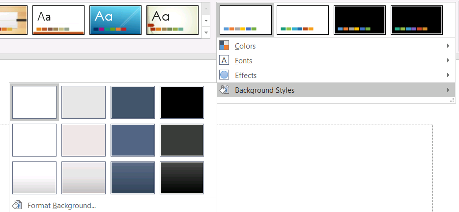

## **Wprowadzenie**

Motyw prezentacji definiuje właściwości elementów projektowych. Wybierając motyw prezentacji, w zasadzie wybierasz określony zestaw elementów wizualnych oraz ich właściwości.

W programie PowerPoint motyw składa się z kolorów, [czcionek](/slides/pl/cpp/powerpoint-fonts/), [stylów tła](/slides/pl/cpp/presentation-background/) oraz efektów.


## **Zmień kolor motywu**

Motyw PowerPoint używa określonego zestawu kolorów dla różnych elementów na slajdzie. Jeśli nie podoba Ci się kolorystyka, możesz ją zmienić, stosując nowe kolory w motywie. Aby umożliwić wybór nowego koloru motywu, Aspose.Slides udostępnia wartości w wyliczeniu [SchemeColor](https://reference.aspose.com/slides/pl/cpp/class/aspose.slides.i_color_format#aad82c1d2daf9d92e4d44a5a9b3bbcf28) .

Poniższy kod C++ pokazuje, jak zmienić kolor akcentu w motywie:

```c++
auto pres = System::MakeObject<Presentation>();

auto shape = pres->get_Slides()->idx_get(0)->get_Shapes()->AddAutoShape(ShapeType::Rectangle, 10.0f, 10.0f, 100.0f, 100.0f);

shape->get_FillFormat()->set_FillType(FillType::Solid);
shape->get_FillFormat()->get_SolidFillColor()->set_SchemeColor(SchemeColor::Accent4);
```

Możesz określić efektywną wartość uzyskanego koloru w następujący sposób:

```c++
auto fillEffective = shape->get_FillFormat()->GetEffective();
    
Console::WriteLine(u"{0} ({1})", fillEffective->get_SolidFillColor().get_Name(), fillEffective->get_SolidFillColor());
// ff8064a2 (Kolor [A=255, R=128, G=100, B=162])
```

Aby dodatkowo zilustrować operację zmiany koloru, tworzymy kolejny element i przypisujemy mu kolor akcentu (z początkowej operacji). Następnie zmieniamy kolor w motywie:

```c++
auto otherShape = pres->get_Slides()->idx_get(0)->get_Shapes()->AddAutoShape(ShapeType::Rectangle, 10.0f, 120.0f, 100.0f, 100.0f);
    
otherShape->get_FillFormat()->set_FillType(FillType::Solid);
otherShape->get_FillFormat()->get_SolidFillColor()->set_SchemeColor(SchemeColor::Accent4);

pres->get_MasterTheme()->get_ColorScheme()->get_Accent4()->set_Color(Color::get_Red());
```

Nowy kolor jest stosowany automatycznie w obu elementach.

### **Ustaw kolor motywu z dodatkowej palety**

Gdy stosujesz transformacje luminancji do głównego koloru motywu (1), powstają kolory z dodatkowej palety (2). Następnie możesz ustawiać i pobierać te kolory motywu.


**1**‑ Główne kolory motywu  
**2**‑ Kolory z dodatkowej palety.

Poniższy kod C++ demonstruje operację, w której kolory dodatkowej palety są pobierane z głównego koloru motywu i następnie używane w kształtach:

```c++
auto presentation = System::MakeObject<Presentation>();

auto slide = presentation->get_Slide(0);
auto shapes = slide->get_Shapes();

// Akcent 4
auto shape1 = shapes->AddAutoShape(ShapeType::Rectangle, 10.0f, 10.0f, 50.0f, 50.0f);
auto fillFormat1 = shape1->get_FillFormat();

fillFormat1->set_FillType(FillType::Solid);
fillFormat1->get_SolidFillColor()->set_SchemeColor(SchemeColor::Accent4);

// Akcent 4, Jaśniejszy 80%
auto shape2 = shapes->AddAutoShape(ShapeType::Rectangle, 10.0f, 70.0f, 50.0f, 50.0f);
auto fillFormat2 = shape2->get_FillFormat();
auto solidFillColor2 = fillFormat2->get_SolidFillColor();

fillFormat2->set_FillType(FillType::Solid);
solidFillColor2->set_SchemeColor(SchemeColor::Accent4);
solidFillColor2->get_ColorTransform()->Add(ColorTransformOperation::MultiplyLuminance, 0.2f);
solidFillColor2->get_ColorTransform()->Add(ColorTransformOperation::AddLuminance, 0.8f);

// Akcent 4, Jaśniejszy 60%
auto shape3 = shapes->AddAutoShape(ShapeType::Rectangle, 10.0f, 130.0f, 50.0f, 50.0f);
auto fillFormat3 = shape3->get_FillFormat();
auto solidFillColor3 = fillFormat3->get_SolidFillColor();

fillFormat3->set_FillType(FillType::Solid);
solidFillColor3->set_SchemeColor(SchemeColor::Accent4);
solidFillColor3->get_ColorTransform()->Add(ColorTransformOperation::MultiplyLuminance, 0.4f);
solidFillColor3->get_ColorTransform()->Add(ColorTransformOperation::AddLuminance, 0.6f);

// Akcent 4, Jaśniejszy 40%
auto shape4 = shapes->AddAutoShape(ShapeType::Rectangle, 10.0f, 190.0f, 50.0f, 50.0f);
auto fillFormat4 = shape4->get_FillFormat();
auto solidFillColor4 = fillFormat4->get_SolidFillColor();

fillFormat4->set_FillType(FillType::Solid);
solidFillColor4->set_SchemeColor(SchemeColor::Accent4);
solidFillColor4->get_ColorTransform()->Add(ColorTransformOperation::MultiplyLuminance, 0.6f);
solidFillColor4->get_ColorTransform()->Add(ColorTransformOperation::AddLuminance, 0.4f);

// Akcent 4, Ciemniejszy 25%
auto shape5 = shapes->AddAutoShape(ShapeType::Rectangle, 10.0f, 250.0f, 50.0f, 50.0f);
auto fillFormat5 = shape5->get_FillFormat();
auto solidFillColor5 = fillFormat5->get_SolidFillColor();

fillFormat5->set_FillType(FillType::Solid);
solidFillColor5->set_SchemeColor(SchemeColor::Accent4);
solidFillColor5->get_ColorTransform()->Add(ColorTransformOperation::MultiplyLuminance, 0.75f);

// Akcent 4, Ciemniejszy 50%
auto shape6 = shapes->AddAutoShape(ShapeType::Rectangle, 10.0f, 310.0f, 50.0f, 50.0f);
auto fillFormat6 = shape6->get_FillFormat();
auto solidFillColor6 = fillFormat6->get_SolidFillColor();

fillFormat6->set_FillType(FillType::Solid);
solidFillColor6->set_SchemeColor(SchemeColor::Accent4);
solidFillColor6->get_ColorTransform()->Add(ColorTransformOperation::MultiplyLuminance, 0.5f);

presentation->Save(u"example.pptx", Export::SaveFormat::Pptx);
```

### **Mapuj `SchemeColor` na kolory `IColorScheme`**

Podczas pracy z [SchemeColor](https://reference.aspose.com/slides/pl/cpp/aspose.slides.schemecolor/), możesz zauważyć, że zawiera następujące wartości kolorów motywu:

`Background1`, `Background2`, `Text1` i `Text2`.

Jednak `Presentation::get_MasterTheme()::get_ColorScheme()` zwraca [IColorScheme](https://reference.aspose.com/slides/pl/cpp/aspose.slides.theme/icolorscheme/), który udostępnia odpowiadające kolory jako:

`Dark1`, `Dark2`, `Light1` i `Light2`.

Ta różnica dotyczy wyłącznie nazewnictwa. Te wartości odnoszą się do tych samych slotów kolorów motywu, a mapowanie jest stałe:

* `Text1` = `Dark1`
* `Background1` = `Light1`
* `Text2` = `Dark2`
* `Background2` = `Light2`

Nie istnieje dynamiczna konwersja między `Text`/`Background` a `Dark`/`Light`. Są to po prostu alternatywne nazwy tych samych kolorów motywu.

Różnica w nazewnictwie wynika z terminologii Microsoft Office. Starsze wersje Office używały `Dark 1`, `Light 1`, `Dark 2` i `Light 2`, podczas gdy nowsze wersje interfejsu wyświetlają te same sloty jako `Text 1`, `Background 1`, `Text 2` i `Background 2`.

## **Zmień czcionkę motywu**

Aby umożliwić wybór czcionek dla motywów i innych celów, Aspose.Slides używa następujących specjalnych identyfikatorów (podobnych do tych używanych w PowerPoint):

* **+mn-lt** – Czcionka tekstu podstawowego (Latin) (Minor Latin Font)
* **+mj-lt** – Czcionka nagłówka (Latin) (Major Latin Font)
* **+mn-ea** – Czcionka tekstu podstawowego (East Asian) (Minor East Asian Font)
* **+mj-ea** – Czcionka nagłówka (East Asian) (Major East Asian Font)

Poniższy kod C++ pokazuje, jak przypisać czcionkę Latin do elementu motywu:

```c++
auto shape = pres->get_Slides()->idx_get(0)->get_Shapes()->AddAutoShape(ShapeType::Rectangle, 10.0f, 10.0f, 100.0f, 100.0f);

auto paragraph = System::MakeObject<Paragraph>();
auto portion = System::MakeObject<Portion>(u"Theme text format");

paragraph->get_Portions()->Add(portion);
shape->get_TextFrame()->get_Paragraphs()->Add(paragraph);

portion->get_PortionFormat()->set_LatinFont(System::MakeObject<FontData>(u"+mn-lt"));
```

Poniższy kod C++ pokazuje, jak zmienić czcionkę motywu prezentacji:

```c++
pres->get_MasterTheme()->get_FontScheme()->get_Minor()->set_LatinFont(MakeObject<FontData>(u"Arial"));
```

Czcionka we wszystkich polach tekstowych zostanie zaktualizowana.

{} 
Możesz chcieć zobaczyć [czcionki PowerPoint](/slides/pl/cpp/powerpoint-fonts/).
{}

## **Zmień styl tła motywu**

Domyślnie aplikacja PowerPoint udostępnia 12 wstępnie zdefiniowanych teł, ale tylko 3 z tych 12 teł są zapisywane w typowej prezentacji. 



Na przykład, po zapisaniu prezentacji w aplikacji PowerPoint, możesz uruchomić poniższy kod C++, aby dowiedzieć się, ile wstępnie zdefiniowanych teł znajduje się w prezentacji:

```c++
auto pres = MakeObject<Presentation>(u"pres.pptx");
        
int32_t numberOfBackgroundFills = pres->get_MasterTheme()->get_FormatScheme()->get_BackgroundFillStyles()->get_Count();

Console::WriteLine(u"Number of background fill styles for theme is {0}", numberOfBackgroundFills);
```

{} 
Używając właściwości [BackgroundFillStyles](https://reference.aspose.com/slides/pl/cpp/class/aspose.slides.theme.format_scheme#aec29b94bc65619519a86a8d4607f5f7d) z klasy [FormatScheme](https://reference.aspose.com/slides/pl/cpp/class/aspose.slides.theme.i_format_scheme/), możesz dodać lub uzyskać dostęp do stylu tła w motywie PowerPoint. 
{}

Poniższy kod C++ pokazuje, jak ustawić tło dla prezentacji:

```c++
pres->get_Masters()->idx_get(0)->get_Background()->set_StyleIndex(2);
```

**Podpowiedź indeksu**: 0 oznacza brak wypełnienia. Indeks zaczyna się od 1.

{} 
Możesz chcieć zobaczyć [tło PowerPoint](/slides/pl/cpp/presentation-background/).
{}

## **Zmień efekt motywu**

Motyw PowerPoint zazwyczaj zawiera 3 wartości dla każdej tablicy stylów. Tablice te są łączone w 3 efekty: subtelny, umiarkowany i intensywny. Na przykład, taki jest wynik po zastosowaniu efektów do konkretnego kształtu:


Używając 3 właściwości ([FillStyles](https://reference.aspose.com/slides/pl/cpp/class/aspose.slides.theme.i_format_scheme#ab80b867174104e26e4824dc8585a1563), [LineStyles](https://reference.aspose.com/slides/pl/cpp/class/aspose.slides.theme.i_format_scheme#ae68a6d0a27dd2ada86a857ebde695ecd), [EffectStyles](https://reference.aspose.com/slides/pl/cpp/class/aspose.slides.theme.i_format_scheme#aba41300412c5c755fe82cf735bcf0f58)) z klasy [FormatScheme](https://reference.aspose.com/slides/pl/cpp/class/aspose.slides.theme.i_format_scheme/) możesz zmieniać elementy w motywie (nawet bardziej elastycznie niż opcje w PowerPoint).

Poniższy kod C++ pokazuje, jak zmienić efekt motywu, modyfikując części elementów:

```c++
auto pres = System::MakeObject<Presentation>(u"Subtle_Moderate_Intense.pptx");
        
pres->get_MasterTheme()->get_FormatScheme()->get_LineStyles()->idx_get(0)->get_FillFormat()->get_SolidFillColor()->set_Color(Color::get_Red());

pres->get_MasterTheme()->get_FormatScheme()->get_FillStyles()->idx_get(2)->set_FillType(FillType::Solid);

pres->get_MasterTheme()->get_FormatScheme()->get_FillStyles()->idx_get(2)->get_SolidFillColor()->set_Color(Color::get_ForestGreen());

pres->get_MasterTheme()->get_FormatScheme()->get_EffectStyles()->idx_get(2)->get_EffectFormat()->get_OuterShadowEffect()->set_Distance(10.f);

pres->Save(u"Design_04_Subtle_Moderate_Intense-out.pptx", SaveFormat::Pptx);
```

Otrzymane zmiany w kolorze wypełnienia, typie wypełnienia, efekcie cienia itp.:


## **FAQ**

**Czy mogę zastosować motyw tylko do jednego slajdu bez zmiany mastera?**  
Tak. Aspose.Slides obsługuje nadpisywanie motywu na poziomie slajdu, więc możesz zastosować lokalny motyw tylko do tego slajdu, zachowując nienaruszony motyw główny (za pośrednictwem [SlideThemeManager](https://reference.aspose.com/slides/pl/cpp/aspose.slides.theme/slidethememanager/)).

**Jaki jest najbezpieczniejszy sposób przeniesienia motywu z jednej prezentacji do drugiej?**  
[Klonuj slajdy](/slides/pl/cpp/clone-slides/) razem z ich masterem do docelowej prezentacji. To zachowuje oryginalny master, układy i powiązany motyw, dzięki czemu wygląd pozostaje spójny.

**Jak mogę zobaczyć „efektywne” wartości po wszystkich dziedziczeniach i nadpisaniach?**  
Użyj [widoki „effective”](/slides/pl/cpp/shape-effective-properties/) dla motywu/koloru/czcionki/efektu. Zwracają one rozstrzygnięte, ostateczne właściwości po zastosowaniu mastera oraz ewentualnych lokalnych nadpisań.