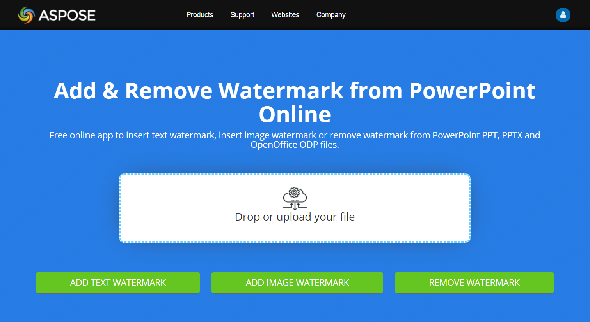

## **Wprowadzenie**

**Znak wodny** w prezentacji to znak tekstowy lub graficzny używany na jednej slajdzie lub we wszystkich slajdach prezentacji. Zazwyczaj znak wodny służy do wskazania, że prezentacja jest wersją roboczą (np. znak „Draft”), zawiera informacje poufne (np. znak „Confidential”), określa, do której firmy należy (np. znak „Nazwa Firmy”), identyfikuje autora prezentacji itp. Znak wodny pomaga zapobiegać naruszeniom praw autorskich, wskazując, że prezentacja nie powinna być kopiowana. Znaki wodne są używane zarówno w formatach prezentacji PowerPoint, jak i OpenOffice. W Aspose.Slides możesz dodać znak wodny do plików PowerPoint PPT, PPTX oraz OpenOffice ODP.

W [**Aspose.Slides**](https://products.aspose.com/slides/pl/cpp/) istnieje wiele sposobów tworzenia znaków wodnych w dokumentach PowerPoint lub OpenOffice oraz modyfikowania ich wyglądu i zachowania. Wspólnym elementem jest to, że aby dodać znak wodny tekstowy, należy używać interfejsu [ITextFrame](https://reference.aspose.com/slides/pl/cpp/aspose.slides/itextframe/), a aby dodać znak wodny graficzny, używać klasy [PictureFrame](https://reference.aspose.com/slides/pl/cpp/aspose.slides/pictureframe/) lub wypełnić kształt znaku wodnego obrazem. `PictureFrame` implementuje interfejs [IShape](https://reference.aspose.com/slides/pl/cpp/aspose.slides/ishape/), co pozwala korzystać ze wszystkich elastycznych ustawień obiektu kształtu. Ponieważ `ITextFrame` nie jest kształtem i jego ustawienia są ograniczone, jest on opakowywany w obiekt [IShape](https://reference.aspose.com/slides/pl/cpp/aspose.slides/ishape/).

Istnieją dwa sposoby zastosowania znaku wodnego: do pojedynczego slajdu lub do wszystkich slajdów prezentacji. Do zastosowania znaku wodnego we wszystkich slajdach używa się Master Slide – znak wodny jest dodawany do Master Slide, w pełni tam projektowany i stosowany do wszystkich slajdów, nie wpływając na możliwość modyfikacji znaku wodnego na poszczególnych slajdach.

Znak wodny jest zazwyczaj uznawany za niedostępny do edycji przez innych użytkowników. Aby zapobiec edycji znaku wodnego (a dokładniej jego nadrzędnego kształtu), Aspose.Slides udostępnia funkcję blokowania kształtów. Konkretny kształt można zablokować na zwykłym slajdzie lub na Master Slide. Gdy kształt znaku wodnego jest zablokowany na Master Slide, jest on zablokowany na wszystkich slajdach prezentacji.

Możesz nadać znakowi wodnemu nazwę, aby w przyszłości, gdy będziesz chciał go usunąć, móc odnaleźć go wśród kształtów slajdu po nazwie.

Znak wodny można zaprojektować w dowolny sposób; jednak zazwyczaj występują w nim wspólne cechy, takie jak wyśrodkowanie, obrót, pozycja z przodu itp. Poniżej pokażemy, jak ich używać w przykładach.

## **Znak wodny tekstowy**

### **Dodanie znaku wodnego tekstowego do slajdu**

Aby dodać znak wodny tekstowy w PPT, PPTX lub ODP, najpierw możesz dodać kształt do slajdu, a następnie dodać do tego kształtu ramkę tekstową. Ramka tekstowa jest reprezentowana przez interfejs [ITextFrame](https://reference.aspose.com/slides/pl/cpp/aspose.slides/itextframe/). Ten typ nie dziedziczy po [IShape](https://reference.aspose.com/slides/pl/cpp/aspose.slides/ishape/), który posiada szeroki zestaw właściwości umożliwiających elastyczne pozycjonowanie znaku wodnego. Dlatego obiekt [ITextFrame](https://reference.aspose.com/slides/pl/cpp/aspose.slides/itextframe/) jest opakowywany w obiekt [IAutoShape](https://reference.aspose.com/slides/pl/cpp/aspose.slides/iautoshape/). Aby dodać tekst znaku wodnego do kształtu, użyj metody [AddTextFrame](https://reference.aspose.com/slides/pl/cpp/aspose.slides/iautoshape/addtextframe/) tak, jak pokazano poniżej.

```cpp
#include <DOM/IAutoShape.h>
#include <DOM/IShapeCollection.h>
#include <DOM/ISlide.h>
#include <DOM/Presentation.h>
#include <DOM/ShapeType.h>
#include <system/smart_ptr.h>
using namespace Aspose::Slides;
using namespace System;

auto watermarkText = u"CONFIDENTIAL";

auto presentation = MakeObject<Presentation>();
auto slide = presentation->get_Slide(0);

auto watermarkShape = slide->get_Shapes()->AddAutoShape(ShapeType::Rectangle, 100, 100, 400, 40);
auto watermarkFrame = watermarkShape->AddTextFrame(watermarkText);

presentation->Dispose();
```

{} 
- [Jak używać klasy TextFrame](/slides/pl/cpp/text-formatting/)
{}

### **Dodanie znaku wodnego tekstowego do prezentacji**

Jeśli chcesz dodać znak wodny tekstowy do całej prezentacji (czyli do wszystkich slajdów jednocześnie), dodaj go do [MasterSlide](https://reference.aspose.com/slides/pl/cpp/aspose.slides/masterslide/). Reszta logiki jest taka sama, jak przy dodawaniu znaku wodnego do pojedynczego slajdu – utwórz obiekt [IAutoShape](https://reference.aspose.com/slides/pl/cpp/aspose.slides/iautoshape/) i następnie dodaj do niego znak wodny przy użyciu metody [AddTextFrame](https://reference.aspose.com/slides/pl/cpp/aspose.slides/iautoshape/addtextframe/).

```cpp
#include <DOM/IAutoShape.h>
#include <DOM/IMasterSlide.h>
#include <DOM/IShapeCollection.h>
#include <DOM/Presentation.h>
#include <DOM/ShapeType.h>
#include <system/smart_ptr.h>
using namespace Aspose::Slides;
using namespace System;

auto watermarkText = u"CONFIDENTIAL";

auto presentation = MakeObject<Presentation>();
auto masterSlide = presentation->get_Master(0);

auto watermarkShape = masterSlide->get_Shapes()->AddAutoShape(ShapeType::Rectangle, 100, 100, 400, 40);
auto watermarkFrame = watermarkShape->AddTextFrame(watermarkText);

presentation->Dispose();
```

{} 
- [Jak używać Master Slide](/slides/pl/cpp/slide-master/)
{}

### **Ustawienie przezroczystości kształtu znaku wodnego**

Domyślnie prostokątny kształt jest stylizowany kolorem wypełnienia i linii. Poniższe linie kodu sprawiają, że kształt jest przezroczysty.

```cpp
#include <DOM/FillType.h>
#include <DOM/IAutoShape.h>
#include <DOM/IFillFormat.h>
#include <DOM/ILineFillFormat.h>
#include <DOM/ILineFormat.h>
#include <DOM/IShapeCollection.h>
#include <DOM/ISlide.h>
#include <DOM/Presentation.h>
#include <DOM/ShapeType.h>
#include <system/smart_ptr.h>
using namespace Aspose::Slides;
using namespace System;

auto presentation = MakeObject<Presentation>();
auto slide = presentation->get_Slide(0);
auto watermarkShape = slide->get_Shapes()->AddAutoShape(ShapeType::Rectangle, 100, 100, 400, 40);

watermarkShape->get_FillFormat()->set_FillType(FillType::NoFill);
watermarkShape->get_LineFormat()->get_FillFormat()->set_FillType(FillType::NoFill);
```

### **Ustawienie czcionki dla znaku wodnego tekstowego**

Czcionkę znaku wodnego tekstowego możesz zmienić, jak pokazano poniżej.

```cpp
#include <DOM/Fonts/FontData.h>
#include <DOM/IAutoShape.h>
#include <DOM/IParagraph.h>
#include <DOM/IParagraphFormat.h>
#include <DOM/IPortionFormat.h>
#include <DOM/IShapeCollection.h>
#include <DOM/ISlide.h>
#include <DOM/ITextFrame.h>
#include <DOM/Presentation.h>
#include <DOM/ShapeType.h>
#include <system/smart_ptr.h>
using namespace Aspose::Slides;
using namespace System;

auto presentation = MakeObject<Presentation>();
auto slide = presentation->get_Slide(0);
auto watermarkShape = slide->get_Shapes()->AddAutoShape(ShapeType::Rectangle, 100, 100, 400, 40);
auto watermarkFrame = watermarkShape->AddTextFrame(u"CONFIDENTIAL");

auto textFormat = watermarkFrame->get_Paragraph(0)->get_ParagraphFormat()->get_DefaultPortionFormat();
textFormat->set_LatinFont(MakeObject<FontData>(u"Arial"));
textFormat->set_FontHeight(50);
```

### **Ustawienie koloru tekstu znaku wodnego**

Aby ustawić kolor tekstu znaku wodnego, użyj następującego kodu:

```cpp
#include <DOM/FillType.h>
#include <DOM/IAutoShape.h>
#include <DOM/IColorFormat.h>
#include <DOM/IFillFormat.h>
#include <DOM/IParagraph.h>
#include <DOM/IParagraphFormat.h>
#include <DOM/IPortionFormat.h>
#include <DOM/IShapeCollection.h>
#include <DOM/ISlide.h>
#include <DOM/ITextFrame.h>
#include <DOM/Presentation.h>
#include <DOM/ShapeType.h>
#include <drawing/color.h>
#include <system/smart_ptr.h>
using namespace Aspose::Slides;
using namespace System;
using namespace System::Drawing;

auto presentation = MakeObject<Presentation>();
auto slide = presentation->get_Slide(0);
auto watermarkShape = slide->get_Shapes()->AddAutoShape(ShapeType::Rectangle, 100, 100, 400, 40);
auto watermarkFrame = watermarkShape->AddTextFrame(u"CONFIDENTIAL");

auto alpha = 150, red = 200, green = 200, blue = 200;

auto fillFormat = watermarkFrame->get_Paragraph(0)->get_ParagraphFormat()->get_DefaultPortionFormat()->get_FillFormat();
fillFormat->set_FillType(FillType::Solid);
fillFormat->get_SolidFillColor()->set_Color(Color::FromArgb(alpha, red, green, blue));
```

### **Wyśrodkowanie znaku wodnego tekstowego**

Możliwe jest wyśrodkowanie znaku wodnego na slajdzie; aby to zrobić, wykonaj poniższe kroki:

```cpp
#include <DOM/IAutoShape.h>
#include <DOM/IShapeCollection.h>
#include <DOM/ISlide.h>
#include <DOM/ISlideSize.h>
#include <DOM/Presentation.h>
#include <DOM/ShapeType.h>
#include <drawing/size_f.h>
#include <system/smart_ptr.h>
using namespace Aspose::Slides;
using namespace System;

auto watermarkText = u"CONFIDENTIAL";

auto presentation = MakeObject<Presentation>();
auto slide = presentation->get_Slide(0);

auto slideSize = presentation->get_SlideSize()->get_Size();

auto watermarkWidth = 400;
auto watermarkHeight = 40;
auto watermarkX = (slideSize.get_Width() - watermarkWidth) / 2;
auto watermarkY = (slideSize.get_Height() - watermarkHeight) / 2;

auto watermarkShape = slide->get_Shapes()->AddAutoShape(
    ShapeType::Rectangle, watermarkX, watermarkY, watermarkWidth, watermarkHeight);

auto watermarkFrame = watermarkShape->AddTextFrame(watermarkText);
```

Poniższy obrazek przedstawia efekt końcowy.


## **Znak wodny graficzny**

### **Dodanie znaku wodnego graficznego do prezentacji**

Aby dodać znak wodny graficzny do slajdu prezentacji, możesz wykonać następujące czynności:

```cpp
#include <DOM/FillType.h>
#include <DOM/IAutoShape.h>
#include <DOM/IFillFormat.h>
#include <DOM/IImageCollection.h>
#include <DOM/IPPImage.h>
#include <DOM/IPictureFillFormat.h>
#include <DOM/ISlidesPicture.h>
#include <DOM/IShapeCollection.h>
#include <DOM/ISlide.h>
#include <DOM/PictureFillMode.h>
#include <DOM/Presentation.h>
#include <DOM/ShapeType.h>
#include <system/io/file.h>
#include <system/smart_ptr.h>
using namespace Aspose::Slides;
using namespace System;
using namespace System::IO;

auto presentation = MakeObject<Presentation>();
auto slide = presentation->get_Slide(0);
auto watermarkShape = slide->get_Shapes()->AddAutoShape(ShapeType::Rectangle, 100, 100, 400, 40);

auto imageStream = File::ReadAllBytes(u"watermark.png");
auto image = presentation->get_Images()->AddImage(imageStream);

watermarkShape->get_FillFormat()->set_FillType(FillType::Picture);
watermarkShape->get_FillFormat()->get_PictureFillFormat()->get_Picture()->set_Image(image);
watermarkShape->get_FillFormat()->get_PictureFillFormat()->set_PictureFillMode(PictureFillMode::Stretch);
```

## **Zablokowanie znaku wodnego przed edycją**

Jeśli konieczne jest zapobieżenie edycji znaku wodnego, użyj metody [IAutoShape::get_AutoShapeLock](https://reference.aspose.com/slides/pl/cpp/aspose.slides/iautoshape/get_autoshapelock/) na kształcie. Dzięki temu właściwość można chronić kształt przed wyborem, zmianą rozmiaru, przemieszczaniem, grupowaniem z innymi elementami, zablokowaniem edycji tekstu i wieloma innymi operacjami:

```cpp
#include <DOM/IAutoShape.h>
#include <DOM/IAutoShapeLock.h>
#include <DOM/IShapeCollection.h>
#include <DOM/ISlide.h>
#include <DOM/Presentation.h>
#include <DOM/ShapeType.h>
#include <system/smart_ptr.h>
using namespace Aspose::Slides;
using namespace System;

auto presentation = MakeObject<Presentation>();
auto slide = presentation->get_Slide(0);
auto watermarkShape = slide->get_Shapes()->AddAutoShape(ShapeType::Rectangle, 100, 100, 400, 40);

// Zablokuj kształt znaku wodnego przed modyfikacją
watermarkShape->get_AutoShapeLock()->set_SelectLocked(true);
watermarkShape->get_AutoShapeLock()->set_SizeLocked(true);
watermarkShape->get_AutoShapeLock()->set_TextLocked(true);
watermarkShape->get_AutoShapeLock()->set_PositionLocked(true);
watermarkShape->get_AutoShapeLock()->set_GroupingLocked(true);
```

## **Przeniesienie znaku wodnego na wierzch**

W Aspose.Slides kolejność warstw (Z‑order) kształtów można ustawić za pomocą metody [IShapeCollection::Reorder](https://reference.aspose.com/slides/pl/cpp/aspose.slides/ishapecollection/reorder/). Aby to zrobić, należy wywołać tę metodę na liście slajdów prezentacji, przekazując referencję do kształtu oraz jego numer kolejności. Dzięki temu można przenieść kształt na wierzch lub wysłać go na spód slajdu. Funkcjonalność jest szczególnie przydatna, gdy trzeba umieścić znak wodny przed zawartością prezentacji:

```cpp
#include <DOM/IAutoShape.h>
#include <DOM/IShapeCollection.h>
#include <DOM/ISlide.h>
#include <DOM/Presentation.h>
#include <DOM/ShapeType.h>
#include <system/smart_ptr.h>
using namespace Aspose::Slides;
using namespace System;

auto presentation = MakeObject<Presentation>();
auto slide = presentation->get_Slide(0);
auto watermarkShape = slide->get_Shapes()->AddAutoShape(ShapeType::Rectangle, 100, 100, 400, 40);

auto shapeCount = slide->get_Shapes()->get_Count();
slide->get_Shapes()->Reorder(shapeCount - 1, watermarkShape);
```

## **Ustawienie obrotu znaku wodnego**

Poniżej znajduje się przykład kodu, który pokazuje, jak dostosować obrót znaku wodnego, aby był ustawiony ukośnie na slajdzie:

```cpp
#include <DOM/IAutoShape.h>
#include <DOM/IShapeCollection.h>
#include <DOM/ISlide.h>
#include <DOM/ISlideSize.h>
#include <DOM/Presentation.h>
#include <DOM/ShapeType.h>
#include <drawing/size_f.h>
#include <system/math.h>
#include <system/smart_ptr.h>
using namespace Aspose::Slides;
using namespace System;

auto presentation = MakeObject<Presentation>();
auto slide = presentation->get_Slide(0);
auto watermarkShape = slide->get_Shapes()->AddAutoShape(ShapeType::Rectangle, 100, 100, 400, 40);
auto slideSize = presentation->get_SlideSize()->get_Size();

auto diagonalAngle = Math::Atan((slideSize.get_Height() / slideSize.get_Width())) * 180 / Math::PI;

watermarkShape->set_Rotation((float)diagonalAngle);
```

## **Nadanie nazwy znakowi wodnemu**

Aspose.Slides umożliwia nadanie nazwy kształtowi. Korzystając z nazwy kształtu, w przyszłości możesz uzyskać do niego dostęp w celu modyfikacji lub usunięcia. Aby ustawić nazwę kształtu znaku wodnego, przypisz ją metodzie [IAutoShape::set_Name](https://reference.aspose.com/slides/pl/cpp/aspose.slides/ishape/set_name/):

```cpp
#include <DOM/IAutoShape.h>
#include <DOM/IShapeCollection.h>
#include <DOM/ISlide.h>
#include <DOM/Presentation.h>
#include <DOM/ShapeType.h>
#include <system/smart_ptr.h>
using namespace Aspose::Slides;
using namespace System;

auto presentation = MakeObject<Presentation>();
auto slide = presentation->get_Slide(0);
auto watermarkShape = slide->get_Shapes()->AddAutoShape(ShapeType::Rectangle, 100, 100, 400, 40);

watermarkShape->set_Name(u"watermark");
```

## **Usunięcie znaku wodnego**

Aby usunąć kształt znaku wodnego, użyj metody [IAutoShape::get_Name](https://reference.aspose.com/slides/pl/cpp/aspose.slides/ishape/get_name/), aby odnaleźć go wśród kształtów slajdu. Następnie przekaż kształt znaku wodnego do metody [IShapeCollection::Remove](https://reference.aspose.com/slides/pl/cpp/aspose.slides/ishapecollection/remove/):

```cpp
#include <DOM/IShape.h>
#include <DOM/IShapeCollection.h>
#include <DOM/ISlide.h>
#include <DOM/Presentation.h>
#include <system/smart_ptr.h>
#include <system/string.h>
#include <system/string_comparison.h>
using namespace Aspose::Slides;
using namespace System;

auto presentation = MakeObject<Presentation>(u"presentation_with_watermark.pptx");
auto slide = presentation->get_Slide(0);

auto slideShapes = slide->get_Shapes()->ToArray();
for(auto shape : slideShapes)
{
    if (String::Compare(shape->get_Name(), u"watermark", StringComparison::Ordinal) == 0)
    {
        slide->get_Shapes()->Remove(shape);
    }
}
```

## **Przykład na żywo**

Możesz wypróbować **darmowe** narzędzia Aspose.Slides online: [Add Watermark](https://products.aspose.app/slides/pl/watermark) oraz [Remove Watermark](https://products.aspose.app/slides/pl/watermark/remove-watermark).



## **FAQ**

### Co to jest znak wodny i dlaczego powinienem go używać?

Znak wodny to nakładka tekstowa lub graficzna stosowana na slajdach, która pomaga chronić własność intelektualną, zwiększyć rozpoznawalność marki lub zapobiec nieautoryzowanemu użyciu prezentacji.

### Czy mogę dodać znak wodny do wszystkich slajdów w prezentacji?

Tak, Aspose.Slides umożliwia programowe dodanie znaku wodnego do każdego slajdu w prezentacji. Możesz iterować po wszystkich slajdach i stosować ustawienia znaku wodnego pojedynczo.

### Jak mogę regulować przezroczystość znaku wodnego?

Przezroczystość znaku wodnego możesz regulować, modyfikując ustawienia wypełnienia ([FillFormat](https://reference.aspose.com/slides/pl/cpp/aspose.slides/shape/get_fillformat/)) kształtu. Dzięki temu znak wodny będzie subtelny i nie będzie odciągał uwagi od treści slajdu.

### Jakie formaty obrazów są obsługiwane dla znaków wodnych?

Aspose.Slides obsługuje różne formaty obrazów, takie jak PNG, JPEG, GIF, BMP, SVG i inne.

### Czy mogę dostosować czcionkę i styl tekstowego znaku wodnego?

Tak, możesz wybrać dowolną czcionkę, rozmiar i styl, aby dopasować je do projektu swojej prezentacji i zachować spójność marki.

### Jak zmienić pozycję lub orientację znaku wodnego?

Pozycję i orientację znaku wodnego możesz programowo zmienić, modyfikując współrzędne, rozmiar oraz właściwości obrotu kształtu.