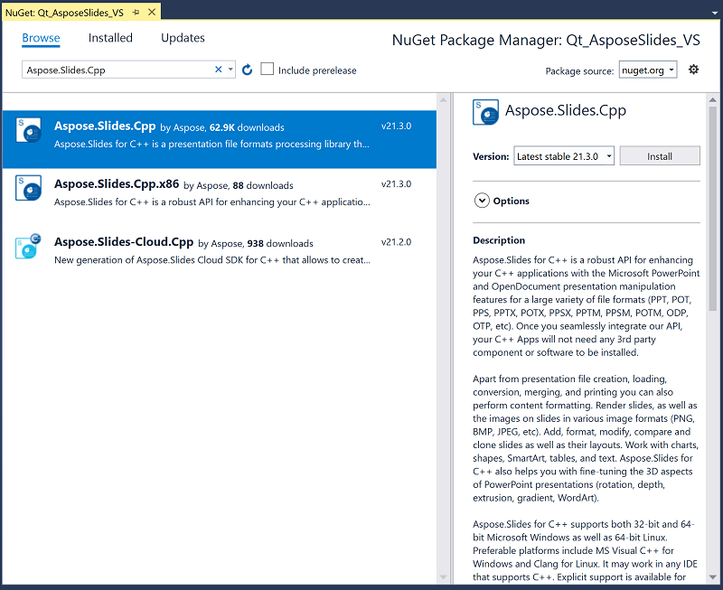

## **Wprowadzenie**

Qt jest opartym na C++ wieloplatformowym frameworkiem do tworzenia aplikacji, który jest szeroko używany do opracowywania różnorodnych aplikacji na komputery stacjonarne, urządzenia mobilne i systemy wbudowane. Aspose.Slides for C++ można zintegrować z Qt, aby tworzyć i modyfikować dokumenty PowerPoint w aplikacjach Qt.

## **Używanie Aspose.Slides for C++ w Qt Creator**

Aby używać Aspose.Slides for C++ w swojej aplikacji Qt, pobierz najnowszą wersję API z sekcji [downloads](https://downloads.aspose.com/slides/pl/cpp). Po pobraniu API możesz zintegrować bibliotekę C++ w Qt Creator lub Visual Studio.

Aby zintegrować i używać biblioteki Aspose.Slides for C++ w aplikacji konsolowej Qt tworzonej w Qt Creator, wykonaj poniższe kroki:

- Otwórz Qt Creator i utwórz nową *Qt Console Application*.

- Wybierz opcję QMake z listy rozwijanej *Build System*.

- Wybierz odpowiedni zestaw (kit) i zakończ kreatora.
- Skopiuj folder aspose-slides-cpp-21.02 z rozpakowanego pakietu Aspose.Slides for C++ do katalogu głównego projektu.

- Aby dodać ścieżki do folderów lib i include, kliknij prawym przyciskiem myszy projekt w lewym panelu i wybierz *Add Library*.

- Wybierz opcję External Library i przeglądaj ścieżki do folderów lib kolejno.

- Po zakończeniu, Twój plik projektu .pro będzie zawierał następujące wpisy:

- Zbuduj aplikację i zakończ integrację.  

{}

Uwaga: Zobacz [pełny projekt demonstracyjny](https://github.com/aspose-slides/Aspose.Slides-for-C/tree/master/QtDemos/QtCreator/Qt_AsposeSlides_QMake) po więcej informacji.

{}

## **Używanie Aspose.Slides for C++ w aplikacjach Qt w Visual Studio**

Aby tworzyć aplikację Qt przy użyciu Visual Studio, musisz zainstalować [Qt Visual Studio Tools](https://marketplace.visualstudio.com/items?itemName=TheQtCompany.QtVisualStudioTools-19123). Po zakończeniu instalacji pobierz najnowszą wersję API z sekcji [downloads](https://downloads.aspose.com/slides/pl/cpp) i wykonaj poniższe kroki:

- Otwórz Microsoft Visual Studio i utwórz nową *Qt Console Application*.

- Wybierz odpowiedni zestaw (kit) i zakończ kreatora.
- Aby zintegrować i używać biblioteki Aspose.Slides for C++, kliknij prawym przyciskiem myszy projekt i wybierz *Manage NuGet Packages...*.

- Znajdź i zainstaluj wymaganą paczkę *Aspose.Slides.Cpp*.

- Zbuduj projekt i zakończ integrację.  

{}

Uwaga: Zobacz [pełny projekt demonstracyjny](https://github.com/aspose-slides/Aspose.Slides-for-C/tree/master/QtDemos/Visual%20Studio/Qt_AsposeSlides_VS) po więcej informacji.

{}