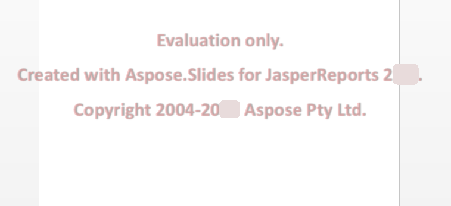

{} 

Aspose.Slides for JasperReports jest dostępny jako bezpłatna, czasowo nieograniczona wersja ewaluacyjna z [strony pobierania](https://downloads.aspose.com/slides/pl/jasperreport). Wersje ewaluacyjne i licencjonowane produktu są dostępne z tego samego pliku do pobrania.

Gdy będziesz zadowolony z wersji ewaluacyjnej, [kup licencję](https://purchase.aspose.com/buy). Upewnij się, że rozumiesz i akceptujesz warunki subskrypcji.

Licencja jest dostępna do pobrania ze strony zamówienia po opłaceniu zamówienia. Licencja jest plikiem XML w formacie czystego tekstu, cyfrowo podpisanym, który zawiera informacje takie jak nazwa klienta, zakupiony produkt oraz typ licencji. Nie modyfikuj w żaden sposób zawartości pliku licencji: spowoduje to unieważnienie licencji.

Pobierz licencję na swój komputer i skopiuj ją do odpowiedniego folderu (na przykład do folderu aplikacji lub **JasperReports\lib**).
{}

## **Ograniczenia wersji ewaluacyjnej**
Wersja ewaluacyjna Aspose.Slides (bez określonej licencji) zapewnia pełną funkcjonalność produktu, ale (przy zapisywaniu prezentacji) wstawia znak wodny ewaluacji na środku każdego slajdu, jak pokazano na poniższym rysunku:

 

## **Stosowanie licencji**
Istnieje kilka sposobów zastosowania licencji, w zależności od tego, czy pracujesz z JasperReports, czy JasperServer.

### **Stosowanie licencji dla JasperReports**
Użyj bezpośredniego wywołania metody setLicense, podobnie jak w Aspose.Slides dla Javy.

```java
import com.aspose.slides.jasperreports.License;

..... 

try {
    //Utwórz obiekt strumienia zawierający plik licencji
    FileInputStream fstream=new FileInputStream("Aspose.Slides.JasperReports.Developer.lic");
	
    //Zainicjalizuj klasę License
    License license = new License();
	
    //Ustaw licencję za pomocą obiektu strumienia
    license.setLicense(fstream);
} catch(Exception ex) {
    System.out.println(ex.toString());
}
```

Lub ustaw parametr eksportera w kodzie.

```java
ASPptExporter exporter = new ASPptExporter (); 
exporter.setParameter(ASExporterParameters.PPT_LICENSE, "Aspose.Slides.JasperReports.Developer.lic");
exporter.exportReport();
```

### **Stosowanie licencji na JasperServer**
Ustaw parametr eksportera w pliku applicationContext.xml.

``` xml
<bean id="asExportParametersBean" class="com.aspose.slides.jasperreports.ASExportParametersBean">
    <property name="licenseFile" value="C:/jasperserver-3.0/apache-tomcat/webapps/jasperserver/WEB-INF/Aspose.Slides.JasperReports.Developer.lic"/>
</bean>
```