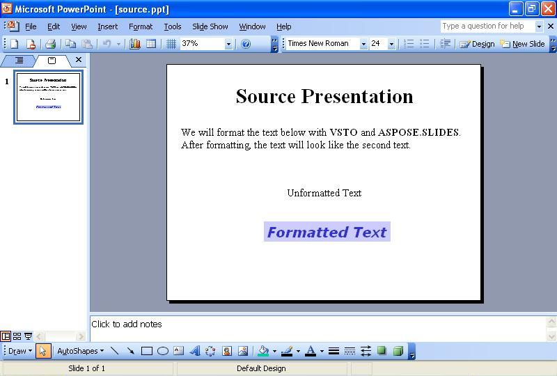

{} 
Czasami trzeba formatować tekst na slajdach programowo. Ten artykuł pokazuje, jak odczytać przykładową prezentację z tekstem na pierwszym slajdzie przy użyciu [VSTO](/slides/pl/java/format-text-using-vsto-and-aspose-slides-for-java/) oraz [Aspose.Slides for Java](/slides/pl/java/format-text-using-vsto-and-aspose-slides-for-java/). Kod formatuje tekst w trzecim polu tekstowym na slajdzie, aby wyglądał jak tekst w ostatnim polu tekstowym.
{} 
## **Formatowanie tekstu**
Zarówno metody VSTO, jak i Aspose.Slides wykonują następujące kroki:

1. Otwórz źródłową prezentację.
1. Uzyskaj dostęp do pierwszego slajdu.
1. Uzyskaj dostęp do trzeciego pola tekstowego.
1. Zmień formatowanie tekstu w trzecim polu tekstowym.
1. Zapisz prezentację na dysku.

Zrzuty ekranu poniżej pokazują przykładowy slajd przed i po wykonaniu kodu VSTO oraz Aspose.Slides for Java.

**Prezentacja wejściowa** 

### **Przykład kodu VSTO**
Poniższy kod pokazuje, jak przformatować tekst na slajdzie przy użyciu VSTO.

**Tekst sformatowany ponownie przy użyciu VSTO** 



### **Przykład Aspose.Slides for Java**
Aby sformatować tekst przy użyciu Aspose.Slides, dodaj czcionkę przed formatowaniem tekstu.

**Prezentacja wyjściowa utworzona przy użyciu Aspose.Slides** 

