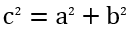

## **Przegląd**

PowerPoint przechowuje równania jako Office Math Markup Language (OMML). Z Aspose.Slides dla Java możesz programowo tworzyć ten sam rodzaj treści matematycznej: ułamki, pierwiastki, funkcje, granice, operatory N‑ary, macierze, tablice i sformatowane bloki matematyczne.

W PowerPoint użytkownicy zazwyczaj dodają równania z **Insert > Equation**:


Wynik to edytowalny tekst matematyczny na slajdzie:


Aspose.Slides buduje ten tekst matematyczny przy użyciu trzech głównych obiektów:

- Kształt matematyczny, tworzony za pomocą [addMathShape](https://reference.aspose.com/slides/pl/java/com.aspose.slides/ishapecollection/#addMathShape-float-float-float-float-), jest kształtem, który zawiera równanie.
- [MathPortion](https://reference.aspose.com/slides/pl/java/com.aspose.slides/mathportion/) przechowuje treść matematyczną w ramce tekstowej kształtu.
- [MathParagraph](https://reference.aspose.com/slides/pl/java/com.aspose.slides/mathparagraph/) zawiera jeden lub więcej obiektów [MathBlock](https://reference.aspose.com/slides/pl/java/com.aspose.slides/mathblock/).

Większość przykładów poniżej wykorzystuje [MathematicalText](https://reference.aspose.com/slides/pl/java/com.aspose.slides/mathematicaltext/) oraz płynne metody z [IMathElement](https://reference.aspose.com/slides/pl/java/com.aspose.slides/imathelement/), aby kod był krótki i czytelny.

W scenariuszach eksportu MathML zobacz [Export Math Equations from Presentations in Java](/slides/pl/java/exporting-math-equations/).

## **Utworzenie równania**

Ten przykład tworzy kształt matematyczny i dodaje twierdzenie Pitagorasa:



```java
Presentation presentation = new Presentation();
try {
    ISlide slide = presentation.getSlides().get_Item(0);

    IAutoShape mathShape = slide.getShapes().addMathShape(20, 20, 700, 120);
    IMathParagraph mathParagraph = ((MathPortion) mathShape.getTextFrame().getParagraphs()
            .get_Item(0).getPortions().get_Item(0)).getMathParagraph();

    IMathBlock equation = new MathematicalText("c")
            .setSuperscript("2")
            .join("=")
            .join(new MathematicalText("a").setSuperscript("2"))
            .join("+")
            .join(new MathematicalText("b").setSuperscript("2"));

    mathParagraph.add(equation);

    presentation.save("pythagorean-theorem.pptx", SaveFormat.Pptx);
} finally {
    presentation.dispose();
}
```

{}

`addMathShape` tworzy kształt, który już zawiera akapit matematyczny. Uzyskaj pierwszy `MathPortion`, pobierz jego `MathParagraph` i dodaj do niego bloki matematyczne lub elementy matematyczne.

{}

## **Dodawanie ułamków**

Użyj `divide`, aby stworzyć ułamek. Możesz wybrać styl ułamka za pomocą [MathFractionTypes](https://reference.aspose.com/slides/pl/java/com.aspose.slides/mathfractiontypes/).


```java
Presentation presentation = new Presentation();
try {
    ISlide slide = presentation.getSlides().get_Item(0);

    IAutoShape mathShape = slide.getShapes().addMathShape(20, 20, 700, 100);
    IMathParagraph mathParagraph = ((MathPortion) mathShape.getTextFrame().getParagraphs()
            .get_Item(0).getPortions().get_Item(0)).getMathParagraph();

    IMathFraction fraction = new MathematicalText("1")
            .divide("x", MathFractionTypes.Skewed);

    mathParagraph.add(new MathBlock(fraction));

    presentation.save("fraction.pptx", SaveFormat.Pptx);
} finally {
    presentation.dispose();
}
```

Aby uzyskać ułamek ze stosowanym paskiem, użyj `MathFractionTypes.Bar`:

```java
IMathFraction stackedFraction = new MathematicalText("x + 1").divide("y - 1", MathFractionTypes.Bar);
```

## **Dodawanie pierwiastków**

Użyj `radical`, aby stworzyć pierwiastek kwadratowy, sześcienny lub inny. Aktualny element staje się podstawą, a argument określa stopień.


```java
Presentation presentation = new Presentation();
try {
    ISlide slide = presentation.getSlides().get_Item(0);

    IAutoShape mathShape = slide.getShapes().addMathShape(20, 20, 700, 100);
    IMathParagraph mathParagraph = ((MathPortion) mathShape.getTextFrame().getParagraphs()
            .get_Item(0).getPortions().get_Item(0)).getMathParagraph();

    IMathRadical radical = new MathematicalText("x")
            .radical("n");

    mathParagraph.add(new MathBlock(radical));

    presentation.save("radical.pptx", SaveFormat.Pptx);
} finally {
    presentation.dispose();
}
```

## **Dodawanie funkcji i granic**

Użyj `asArgumentOfFunction` lub `function` dla funkcji takich jak `sin(x)`, `log(x)` lub własnych nazw funkcji. Dla granic umieść `lim` w [MathLimit](https://reference.aspose.com/slides/pl/java/com.aspose.slides/mathlimit/) lub użyj `setLowerLimit`.


```java
Presentation presentation = new Presentation();
try {
    ISlide slide = presentation.getSlides().get_Item(0);

    IAutoShape mathShape = slide.getShapes().addMathShape(20, 20, 700, 100);
    IMathParagraph mathParagraph = ((MathPortion) mathShape.getTextFrame().getParagraphs()
            .get_Item(0).getPortions().get_Item(0)).getMathParagraph();

    IMathFunction limit = new MathematicalText("lim")
            .setLowerLimit("x\u2192\u221E")
            .function("x");

    mathParagraph.add(new MathBlock(limit));

    presentation.save("functions-and-limits.pptx", SaveFormat.Pptx);
} finally {
    presentation.dispose();
}
```

Aby użyć własnej nazwy funkcji, ustaw nazwę funkcji jako aktualny element:

```java
IMathFunction customFunction = new MathematicalText("f").function("x + 1");
```

## **Dodawanie operatorów N‑ary i całek**

Użyj `nary` dla sum, unii, przecięć i innych dużych operatorów. Użyj `integral` dla całek. Obie metody pozwalają ustawić dolne i górne limity.


```java
Presentation presentation = new Presentation();
try {
    ISlide slide = presentation.getSlides().get_Item(0);

    IAutoShape mathShape = slide.getShapes().addMathShape(20, 20, 700, 120);
    IMathParagraph mathParagraph = ((MathPortion) mathShape.getTextFrame().getParagraphs()
            .get_Item(0).getPortions().get_Item(0)).getMathParagraph();

    IMathBlock summationBase = new MathematicalText("x")
            .setSuperscript("k")
            .join(new MathematicalText("a").setSuperscript("n-k"));

    IMathNaryOperator summation = summationBase.nary(MathNaryOperatorTypes.Summation, "k=0", "n");

    mathParagraph.add(new MathBlock(summation));

    presentation.save("nary-operators.pptx", SaveFormat.Pptx);
} finally {
    presentation.dispose();
}
```

Operatory N‑ary służą do dużych operatorów z opcjonalnymi limitami. Proste operatory takie jak `+`, `-` i `=` zazwyczaj dodaje się jako `MathematicalText` i łączy w wyrażeniu.

Dla całki użyj `integral`:

```java
IMathBlock integralBase = new MathematicalText("x").join(new MathematicalText("dx").toBox());
IMathNaryOperator integral = integralBase.integral(MathIntegralTypes.Simple, "0", "1");
```

## **Dodawanie macierzy**

Użyj [MathMatrix](https://reference.aspose.com/slides/pl/java/com.aspose.slides/mathmatrix/) dla wierszy i kolumn. Domyślnie macierze nie zawierają nawiasów, więc otocz je, gdy potrzebujesz nawiasów, kwadratów lub klamr.


```java
Presentation presentation = new Presentation();
try {
    ISlide slide = presentation.getSlides().get_Item(0);

    IAutoShape mathShape = slide.getShapes().addMathShape(20, 20, 700, 120);
    IMathParagraph mathParagraph = ((MathPortion) mathShape.getTextFrame().getParagraphs()
            .get_Item(0).getPortions().get_Item(0)).getMathParagraph();

    MathMatrix matrix = new MathMatrix(2, 3);
    matrix.set_Item(0, 0, new MathematicalText("1"));
    matrix.set_Item(0, 1, new MathematicalText("x"));
    matrix.set_Item(1, 0, new MathematicalText("x"));
    matrix.set_Item(1, 1, new MathematicalText("2"));
    matrix.set_Item(1, 2, new MathematicalText("y"));

    mathParagraph.add(new MathBlock(matrix));

    presentation.save("matrix.pptx", SaveFormat.Pptx);
} finally {
    presentation.dispose();
}
```

## **Dodawanie tablic równań**

Użyj `toMathArray`, gdy potrzebujesz wyrównanych równań lub pionowego stosu wyrażeń.


```java
Presentation presentation = new Presentation();
try {
    ISlide slide = presentation.getSlides().get_Item(0);

    IAutoShape mathShape = slide.getShapes().addMathShape(20, 20, 700, 140);
    IMathParagraph mathParagraph = ((MathPortion) mathShape.getTextFrame().getParagraphs()
            .get_Item(0).getPortions().get_Item(0)).getMathParagraph();

    IMathArray equationArray = new MathematicalText("x")
            .join("y")
            .toMathArray();

    mathParagraph.add(new MathBlock(equationArray));

    presentation.save("equation-array.pptx", SaveFormat.Pptx);
} finally {
    presentation.dispose();
}
```

## **Dodawanie funkcji trygonometrycznych**

Użyj `asArgumentOfFunction`, kiedy argument jest aktualnym elementem i nazwa funkcji jest znana.


```java
Presentation presentation = new Presentation();
try {
    ISlide slide = presentation.getSlides().get_Item(0);

    IAutoShape mathShape = slide.getShapes().addMathShape(20, 20, 700, 100);
    IMathParagraph mathParagraph = ((MathPortion) mathShape.getTextFrame().getParagraphs()
            .get_Item(0).getPortions().get_Item(0)).getMathParagraph();

    IMathFunction cosine = new MathematicalText("2x")
            .asArgumentOfFunction(MathFunctionsOfOneArgument.Cos);

    mathParagraph.add(new MathBlock(cosine));

    presentation.save("trigonometric-function.pptx", SaveFormat.Pptx);
} finally {
    presentation.dispose();
}
```

## **Dodawanie indeksów dolnych i górnych**

Użyj pomocników dolnych i górnych indeksów dla indeksów i potęg. Gdy indeksy muszą znajdować się po lewej stronie podstawy, użyj `setSubSuperscriptOnTheLeft`.


```java
Presentation presentation = new Presentation();
try {
    ISlide slide = presentation.getSlides().get_Item(0);

    IAutoShape mathShape = slide.getShapes().addMathShape(20, 20, 700, 100);
    IMathParagraph mathParagraph = ((MathPortion) mathShape.getTextFrame().getParagraphs()
            .get_Item(0).getPortions().get_Item(0)).getMathParagraph();

    IMathLeftSubSuperscriptElement scripts = new MathematicalText("Y")
            .setSubSuperscriptOnTheLeft("1", "n");

    mathParagraph.add(new MathBlock(scripts));

    presentation.save("subscript-superscript.pptx", SaveFormat.Pptx);
} finally {
    presentation.dispose();
}
```

## **Dodawanie delimitatorów**

Użyj `enclose`, aby umieścić wyrażenie w delimitatorach. Możesz także ustawić znak separatora dla wyrażeń delimitatorów zawierających kilka elementów.


```java
Presentation presentation = new Presentation();
try {
    ISlide slide = presentation.getSlides().get_Item(0);

    IAutoShape mathShape = slide.getShapes().addMathShape(20, 20, 700, 100);
    IMathParagraph mathParagraph = ((MathPortion) mathShape.getTextFrame().getParagraphs()
            .get_Item(0).getPortions().get_Item(0)).getMathParagraph();

    IMathDelimiter delimiter = new MathematicalText("x")
            .join("y")
            .join("z")
            .enclose('<', '>');
    delimiter.setSeparatorCharacter('|');

    mathParagraph.add(new MathBlock(delimiter));

    presentation.save("delimiters.pptx", SaveFormat.Pptx);
} finally {
    presentation.dispose();
}
```

## **Dodawanie ramki z obramowaniem**

Użyj `toBorderBox`, gdy samo równanie ma być otoczone ramką.


```java
Presentation presentation = new Presentation();
try {
    ISlide slide = presentation.getSlides().get_Item(0);

    IAutoShape mathShape = slide.getShapes().addMathShape(20, 20, 700, 100);
    IMathParagraph mathParagraph = ((MathPortion) mathShape.getTextFrame().getParagraphs()
            .get_Item(0).getPortions().get_Item(0)).getMathParagraph();

    IMathBorderBox boxedEquation = new MathematicalText("a")
            .setSuperscript("2")
            .join("=")
            .join(new MathematicalText("b").setSuperscript("2"))
            .join("+")
            .join(new MathematicalText("c").setSuperscript("2"))
            .toBorderBox();

    mathParagraph.add(new MathBlock(boxedEquation));

    presentation.save("border-box.pptx", SaveFormat.Pptx);
} finally {
    presentation.dispose();
}
```

## **Grupowanie wyrazów**

Użyj `group`, aby umieścić znak grupujący nad lub pod wyrażeniem. Dodaj limit, aby oznaczyć pogrupowane wyrazy.


```java
Presentation presentation = new Presentation();
try {
    ISlide slide = presentation.getSlides().get_Item(0);

    IAutoShape mathShape = slide.getShapes().addMathShape(20, 20, 700, 120);
    IMathParagraph mathParagraph = ((MathPortion) mathShape.getTextFrame().getParagraphs()
            .get_Item(0).getPortions().get_Item(0)).getMathParagraph();

    IMathLimit grouped = new MathematicalText("x + y")
            .group('\u23DF', MathTopBotPositions.Bottom, MathTopBotPositions.Top)
            .setLowerLimit("any text");

    mathParagraph.add(new MathBlock(grouped));

    presentation.save("grouped-terms.pptx", SaveFormat.Pptx);
} finally {
    presentation.dispose();
}
```

## **Formatowanie elementów matematycznych**

Używaj pomocników formatowania tylko tam, gdzie wyjaśniają formułę. Na przykład `overbar` umieszcza pasek nad elementem matematycznym.


```java
Presentation presentation = new Presentation();
try {
    ISlide slide = presentation.getSlides().get_Item(0);

    IAutoShape mathShape = slide.getShapes().addMathShape(20, 20, 700, 100);
    IMathParagraph mathParagraph = ((MathPortion) mathShape.getTextFrame().getParagraphs()
            .get_Item(0).getPortions().get_Item(0)).getMathParagraph();

    IMathBar overbar = new MathematicalText("ABC").overbar();

    mathParagraph.add(new MathBlock(overbar));

    presentation.save("overbar.pptx", SaveFormat.Pptx);
} finally {
    presentation.dispose();
}
```

## **Szybka referencja**

| Zadanie | Główne API |
| --- | --- |
| Utworzenie tekstu matematycznego | [MathematicalText](https://reference.aspose.com/slides/pl/java/com.aspose.slides/mathematicaltext/) |
| Połączenie elementów | [IMathElement.join](https://reference.aspose.com/slides/pl/java/com.aspose.slides/imathelement/#join-com.aspose.slides.IMathElement-) |
| Utworzenie ułamków | [IMathElement.divide](https://reference.aspose.com/slides/pl/java/com.aspose.slides/imathelement/#divide-com.aspose.slides.IMathElement-) |
| Dodanie indeksu górnego lub dolnego | [setSuperscript](https://reference.aspose.com/slides/pl/java/com.aspose.slides/imathelement/#setSuperscript-com.aspose.slides.IMathElement-), [setSubscript](https://reference.aspose.com/slides/pl/java/com.aspose.slides/imathelement/#setSubscript-com.aspose.slides.IMathElement-) |
| Dodanie funkcji | [function](https://reference.aspose.com/slides/pl/java/com.aspose.slides/imathelement/#function-com.aspose.slides.IMathElement-), [asArgumentOfFunction](https://reference.aspose.com/slides/pl/java/com.aspose.slides/imathelement/#asArgumentOfFunction-com.aspose.slides.IMathElement-) |
| Dodanie pierwiastków | [IMathElement.radical](https://reference.aspose.com/slides/pl/java/com.aspose.slides/imathelement/#radical-com.aspose.slides.IMathElement-) |
| Dodanie granic | [setLowerLimit](https://reference.aspose.com/slides/pl/java/com.aspose.slides/imathelement/#setLowerLimit-com.aspose.slides.IMathElement-), [setUpperLimit](https://reference.aspose.com/slides/pl/java/com.aspose.slides/imathelement/#setUpperLimit-com.aspose.slides.IMathElement-) |
| Dodanie skryptów po lewej stronie | [setSubSuperscriptOnTheLeft](https://reference.aspose.com/slides/pl/java/com.aspose.slides/imathelement/#setSubSuperscriptOnTheLeft-com.aspose.slides.IMathElement-com.aspose.slides.IMathElement-) |
| Dodanie sum i całek | [nary](https://reference.aspose.com/slides/pl/java/com.aspose.slides/imathelement/#nary-int-com.aspose.slides.IMathElement-com.aspose.slides.IMathElement-), [integral](https://reference.aspose.com/slides/pl/java/com.aspose.slides/imathelement/#integral-int-com.aspose.slides.IMathElement-com.aspose.slides.IMathElement-) |
| Dodanie macierzy | [MathMatrix](https://reference.aspose.com/slides/pl/java/com.aspose.slides/mathmatrix/) |
| Dodanie tablic równań | [toMathArray](https://reference.aspose.com/slides/pl/java/com.aspose.slides/imathelement/#toMathArray--) |
| Dodanie delimitatorów | [enclose](https://reference.aspose.com/slides/pl/java/com.aspose.slides/imathelement/#enclose-char-char-) |
| Dodanie kresek i obramowań | [overbar](https://reference.aspose.com/slides/pl/java/com.aspose.slides/imathelement/#overbar--), [toBorderBox](https://reference.aspose.com/slides/pl/java/com.aspose.slides/imathelement/#toBorderBox--) |
| Grupowanie wyrazów | [group](https://reference.aspose.com/slides/pl/java/com.aspose.slides/imathelement/#group-char-int-int-) |

## **FAQ**

**Czy mogę edytować istniejące równanie PowerPoint?**

Tak. Otwórz prezentację, znajdź kształt zawierający `MathPortion`, pobierz jego `MathParagraph` i zaktualizuj bloki matematyczne w tym akapicie.

**Czy równania są zapisywane jako edytowalna matematyka PowerPoint?**

Tak. Przy zapisie do PPTX Aspose.Slides zapisuje równanie jako edytowalną treść Office Math.

**Czy mogę wyeksportować równania do LaTeX?**

Aspose.Slides eksportuje równania matematyczne do MathML. Jeśli potrzebujesz LaTeX, najpierw wyeksportuj do MathML, a następnie przekształć MathML przy użyciu narzędzia obsługującego wybrany dialekt LaTeX.