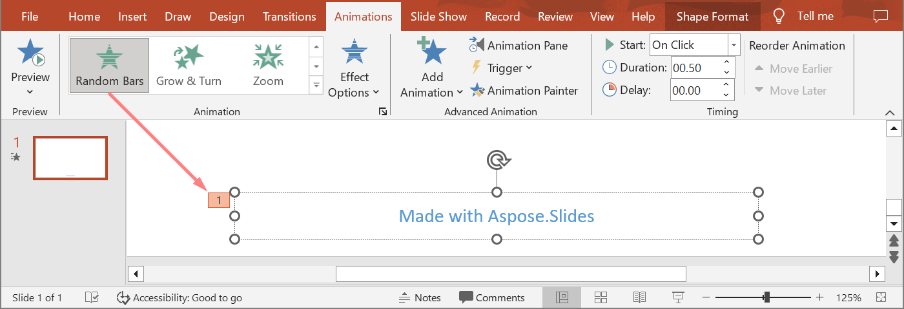

## **Wprowadzenie**

Animacje to efekty wizualne, które można zastosować do tekstów, obrazów, kształtów lub [wykresów](https://docs.aspose.com/slides/pl/java/animated-charts/). Ożywiają prezentacje lub ich elementy. 

## **Dlaczego używać animacji w prezentacjach?**

Używając animacji, możesz  

* kontrolować przepływ informacji  
* podkreślać ważne punkty  
* zwiększać zainteresowanie lub udział odbiorców  
* uczynić treść łatwiejszą do odczytania, przyswojenia lub przetworzenia  
* przyciągać uwagę czytelników lub widzów do ważnych części w prezentacji  

PowerPoint oferuje wiele opcji i narzędzi do animacji oraz efektów animacji w kategoriach **wejścia**, **wyjścia**, **podkreślenia** i **ścieżek ruchu**. 

## **Animacje w Aspose.Slides**

* Aspose.Slides dostarcza klasy i typy potrzebne do pracy z animacjami w przestrzeni nazw `Aspose.Slides.Animation`,  
* Aspose.Slides udostępnia ponad **150 efektów animacji** w wyliczeniu [EffectType](https://reference.aspose.com/slides/pl/java/com.aspose.slides/effecttype). Są to praktycznie te same (lub równoważne) efekty używane w PowerPoint.  

## **Zastosowanie animacji do pola tekstowego**

Aspose.Slides for Java pozwala zastosować animację do tekstu w kształcie. 

1. Utwórz instancję klasy [Presentation](https://reference.aspose.com/slides/pl/java/com.aspose.slides/Presentation).  
2. Uzyskaj referencję do slajdu za pomocą jego indeksu.  
3. Dodaj `rectangle` [IAutoShape](https://reference.aspose.com/slides/pl/java/com.aspose.slides/iautoshape).  
4. Dodaj tekst do [IAutoShape.TextFrame](https://reference.aspose.com/slides/pl/java/com.aspose.slides/IAutoShape#addTextFrame-java.lang.String-).  
5. Pobierz główną sekwencję efektów.  
6. Dodaj efekt animacji do [IAutoShape](https://reference.aspose.com/slides/pl/java/com.aspose.slides/iautoshape).  
7. Ustaw właściwość `TextAnimation.BuildType` na wartość z wyliczenia `BuildType`.  
8. Zapisz prezentację na dysku jako plik PPTX.  

Ten kod Java pokazuje, jak zastosować efekt `Fade` do AutoShape i ustawić animację tekstu na wartość *By 1st Level Paragraphs*:

```java
// Tworzy klasę prezentacji, która reprezentuje plik prezentacji.
Presentation pres = new Presentation();
try {
    ISlide sld = pres.getSlides().get_Item(0);

    // Dodaje nowy AutoShape z tekstem
    IAutoShape autoShape = sld.getShapes().addAutoShape(ShapeType.Rectangle, 20, 20, 150, 100);

    ITextFrame textFrame = autoShape.getTextFrame();
    textFrame.setText("First paragraph \nSecond paragraph \n Third paragraph");

    // Pobiera główną sekwencję slajdu.
    ISequence sequence = sld.getTimeline().getMainSequence();

    // Dodaje efekt animacji Fade do kształtu
    IEffect effect = sequence.addEffect(autoShape, EffectType.Fade, EffectSubtype.None, EffectTriggerType.OnClick);

    // Animuje tekst kształtu według paragrafów pierwszego poziomu
    effect.getTextAnimation().setBuildType(BuildType.ByLevelParagraphs1);

    // Zapisuje plik PPTX na dysku
    pres.save(path + "AnimText_out.pptx", SaveFormat.Pptx);
} finally {
    if (pres != null) pres.dispose();
}
```

{} 

Oprócz stosowania animacji do tekstu, możesz także zastosować animacje do pojedynczego [Paragraph](https://reference.aspose.com/slides/pl/java/com.aspose.slides/iparagraph). Zobacz [**Animated Text**](/slides/pl/java/animated-text/).

{} 

## **Zastosowanie animacji do PictureFrame**

1. Utwórz instancję klasy [Presentation](https://reference.aspose.com/slides/pl/java/com.aspose.slides/Presentation).  
2. Uzyskaj referencję do slajdu za pomocą jego indeksu.  
3. Dodaj lub pobierz [PictureFrame](https://reference.aspose.com/slides/pl/java/com.aspose.slides/pictureframe) na slajdzie.  
4. Pobierz główną sekwencję efektów.  
5. Dodaj efekt animacji do [PictureFrame](https://reference.aspose.com/slides/pl/java/com.aspose.slides/pictureframe).  
6. Zapisz prezentację na dysku jako plik PPTX.  

Ten kod Java pokazuje, jak zastosować efekt `Fly` do ramki obrazu:

```java
// Tworzy klasę prezentacji, która reprezentuje plik prezentacji.
Presentation pres = new Presentation();
try {
    // Wczytuje obraz do dodania do kolekcji obrazów prezentacji
    IPPImage picture;
    IImage image = Images.fromFile("aspose-logo.jpg");
    try {
        picture = pres.getImages().addImage(image);
    } finally {
        if (image != null) image.dispose();
    }

    // Dodaje ramkę obrazu do slajdu
    IPictureFrame picFrame = pres.getSlides().get_Item(0).getShapes().addPictureFrame(ShapeType.Rectangle, 50, 50, 100, 100, picture);

    // Pobiera główną sekwencję slajdu.
    ISequence sequence = pres.getSlides().get_Item(0).getTimeline().getMainSequence();

    // Dodaje efekt animacji Fly z lewej do ramki obrazu
    IEffect effect = sequence.addEffect(picFrame, EffectType.Fly, EffectSubtype.Left, EffectTriggerType.OnClick);

    // Zapisuje plik PPTX na dysku
    pres.save(path + "AnimImage_out.pptx", SaveFormat.Pptx);
} catch(IOException e) {
} finally {
    if (pres != null) pres.dispose();
}
```

## **Zastosowanie animacji do kształtu**

1. Utwórz instancję klasy [Presentation](https://reference.aspose.com/slides/pl/java/com.aspose.slides/Presentation).  
2. Uzyskaj referencję do slajdu za pomocą jego indeksu.  
3. Dodaj `rectangle` [IAutoShape](https://reference.aspose.com/slides/pl/java/com.aspose.slides/iautoshape).  
4. Dodaj `Bevel` [IAutoShape](https://reference.aspose.com/slides/pl/java/com.aspose.slides/iautoshape) (po kliknięciu tego obiektu animacja zostanie uruchomiona).  
5. Utwórz sekwencję efektów na kształcie bevel.  
6. Utwórz niestandardowy `UserPath`.  
7. Dodaj polecenia przemieszczania do `UserPath`.  
8. Zapisz prezentację na dysku jako plik PPTX.  

Ten kod Java pokazuje, jak zastosować efekt `PathFootball` (ścieżka football) do kształtu:

```java
// Tworzy instancję klasy Presentation, która reprezentuje plik PPTX.
Presentation pres = new Presentation();
try {
    ISlide sld = pres.getSlides().get_Item(0);

    // Tworzy efekt PathFootball dla istniejącego kształtu od podstaw.
    IAutoShape ashp = sld.getShapes().addAutoShape(ShapeType.Rectangle, 150, 150, 250, 25);
    ashp.addTextFrame("Animated TextBox");

    // Dodaje efekt animacji PathFootBall
    pres.getSlides().get_Item(0).getTimeline().getMainSequence().addEffect(ashp, EffectType.PathFootball,
            EffectSubtype.None, EffectTriggerType.AfterPrevious);

    // Tworzy pewnego rodzaju "przycisk".
    IShape shapeTrigger = pres.getSlides().get_Item(0).getShapes().addAutoShape(ShapeType.Bevel, 10, 10, 20, 20);

    // Tworzy sekwencję efektów dla tego przycisku.
    ISequence seqInter = pres.getSlides().get_Item(0).getTimeline().getInteractiveSequences().add(shapeTrigger);

     // Tworzy niestandardową ścieżkę użytkownika. Nasz obiekt zostanie przemieszczony dopiero po kliknięciu przycisku.
    IEffect fxUserPath = seqInter.addEffect(ashp, EffectType.PathUser, EffectSubtype.None, EffectTriggerType.OnClick);

     // Dodaje polecenia ruchu, ponieważ utworzona ścieżka jest pusta.
    IMotionEffect motionBvh = ((IMotionEffect)fxUserPath.getBehaviors().get_Item(0));

    Point2D.Float[] pts = new Point2D.Float[1];
    pts[0] = new Point2D.Float(0.076f, 0.59f);
    motionBvh.getPath().add(MotionCommandPathType.LineTo, pts, MotionPathPointsType.Auto, true);
    pts[0] = new Point2D.Float(-0.076f, -0.59f);
    motionBvh.getPath().add(MotionCommandPathType.LineTo, pts, MotionPathPointsType.Auto, false);
    motionBvh.getPath().add(MotionCommandPathType.End, null, MotionPathPointsType.Auto, false);

     // Zapisuje plik PPTX na dysku
    pres.save("AnimExample_out.pptx", SaveFormat.Pptx);
} finally {
    if (pres != null) pres.dispose();
}
```

## **Pobranie efektów animacji zastosowanych do kształtu**

Poniższe przykłady pokazują, jak używać metody `getEffectsByShape` z interfejsu [ISequence](https://reference.aspose.com/slides/pl/java/com.aspose.slides/isequence/) do pobrania wszystkich efektów animacji zastosowanych do kształtu.  

**Przykład 1: Pobranie efektów animacji zastosowanych do kształtu na normalnym slajdzie**

Poprzednio nauczyłeś się, jak dodawać efekty animacji do kształtów w prezentacjach PowerPoint. Poniższy przykład kodu pokazuje, jak pobrać efekty zastosowane do pierwszego kształtu na pierwszym normalnym slajdzie w prezentacji `AnimExample_out.pptx`.

```java
Presentation presentation = new Presentation("AnimExample_out.pptx");
try {
    ISlide firstSlide = presentation.getSlides().get_Item(0);

    // Pobiera główną sekwencję animacji slajdu.
    ISequence sequence = firstSlide.getTimeline().getMainSequence();

    // Pobiera pierwszy kształt na pierwszym slajdzie.
    IShape shape = firstSlide.getShapes().get_Item(0);

    // Pobiera efekty animacji zastosowane do kształtu.
    IEffect[] shapeEffects = sequence.getEffectsByShape(shape);

    if (shapeEffects.length > 0)
        System.out.println("The shape " + shape.getName() + " has " + shapeEffects.length + " animation effects.");
} finally {
    if (presentation != null) presentation.dispose();
}
```

**Przykład 2: Pobranie wszystkich efektów animacji, w tym dziedziczonych z placeholderów**

Jeśli kształt na normalnym slajdzie ma placeholdery znajdujące się na slajdzie układu i/lub slajdzie głównym, a efekty animacji zostały dodane do tych placeholderów, wszystkie efekty kształtu będą odtwarzane podczas pokazu, w tym te dziedziczone z placeholderów.  

Załóżmy, że mamy plik prezentacji PowerPoint `sample.pptx` zawierający jeden slajd z jedynym kształtem stopki o tekście "Made with Aspose.Slides" oraz zastosowanym efektem **Random Bars**.  



Załóżmy również, że efekt **Split** został zastosowany do placeholdera stopki na slajdzie **layout**.  


I w końcu, efekt **Fly In** został zastosowany do placeholdera stopki na slajdzie **master**.  


Poniższy przykład kodu pokazuje, jak używać metody `getBasePlaceholder` z interfejsu [IShape](https://reference.aspose.com/slides/pl/java/com.aspose.slides/ishape/) do uzyskania dostępu do placeholderów kształtu i pobrania efektów animacji zastosowanych do kształtu stopki, w tym dziedziczonych z placeholderów znajdujących się na slajdach układu i głównym.

```java
Presentation presentation = new Presentation("sample.pptx");

ISlide slide = presentation.getSlides().get_Item(0);

// Pobierz efekty animacji kształtu na normalnym slajdzie.
IShape shape = slide.getShapes().get_Item(0);
IEffect[] shapeEffects = slide.getTimeline().getMainSequence().getEffectsByShape(shape);

// Pobierz efekty animacji placeholdera na slajdzie układu.
IShape layoutShape = shape.getBasePlaceholder();
IEffect[] layoutShapeEffects = slide.getLayoutSlide().getTimeline().getMainSequence().getEffectsByShape(layoutShape);

// Pobierz efekty animacji placeholdera na slajdzie głównym.
IShape masterShape = layoutShape.getBasePlaceholder();
IEffect[] masterShapeEffects = slide.getLayoutSlide().getMasterSlide().getTimeline().getMainSequence().getEffectsByShape(masterShape);

System.out.println("Main sequence of shape effects:");
printEffects(masterShapeEffects);
printEffects(layoutShapeEffects);
printEffects(shapeEffects);

presentation.dispose();
```
```java
static void printEffects(IEffect[] effects)
{
    for (IEffect effect : effects)
    {
        String typeName = EffectType.getName(EffectType.class, effect.getType());
        String subtypeName = EffectSubtype.getName(EffectSubtype.class, effect.getSubtype());

        System.out.println(typeName + " " + subtypeName);
    }
}
```

Output:
```text
Main sequence of shape effects:
Fly Bottom
Split VerticalIn
RandomBars Horizontal
```

## **Zmienianie właściwości czasu efektu animacji**

Aspose.Slides for Java pozwala zmienić właściwości Timing efektu animacji.  

To jest panel **Animation Timing** w Microsoft PowerPoint:


Oto zestawienia pomiędzy Timing w PowerPoint a właściwościami [Effect.Timing](https://reference.aspose.com/slides/pl/java/com.aspose.slides/IEffect#getTiming--):

- Lista rozwijana PowerPoint Timing **Start** odpowiada właściwości [Effect.Timing.TriggerType](https://reference.aspose.com/slides/pl/java/com.aspose.slides/ITiming#getTriggerType--) .  
- PowerPoint Timing **Duration** odpowiada właściwości [Effect.Timing.Duration](https://reference.aspose.com/slides/pl/java/com.aspose.slides/ITiming#getDuration--) . Czas trwania animacji (w sekundach) to całkowity czas potrzebny na wykonanie jednego cyklu animacji.  
- PowerPoint Timing **Delay** odpowiada właściwości [Effect.Timing.TriggerDelayTime](https://reference.aspose.com/slides/pl/java/com.aspose.slides/ITiming#getTriggerDelayTime--) .  

Tak zmieniasz właściwości Timing efektu:

1. [Apply](#apply-animation-to-shape) lub pobierz efekt animacji.  
2. Ustaw nowe wartości właściwości [Effect.Timing](https://reference.aspose.com/slides/pl/java/com.aspose.slides/IEffect#getTiming--) zgodnie z potrzebami.  
3. Zapisz zmodyfikowany plik PPTX.  

```java
// Tworzy instancję klasy prezentacji, która reprezentuje plik prezentacji.
Presentation pres = new Presentation("AnimExample_out.pptx");
try {
    // Pobiera główną sekwencję slajdu.
    ISequence sequence = pres.getSlides().get_Item(0).getTimeline().getMainSequence();

    // Pobiera pierwszy efekt głównej sekwencji.
    IEffect effect = sequence.get_Item(0);

    // Zmienia TriggerType efektu na uruchamianie po kliknięciu
    effect.getTiming().setTriggerType(EffectTriggerType.OnClick);

    // Zmienia czas trwania efektu
    effect.getTiming().setDuration(3f);

    // Zmienia TriggerDelayTime efektu
    effect.getTiming().setTriggerDelayTime(0.5f);

    // Zapisuje plik PPTX na dysku
    pres.save("AnimExample_changed.pptx", SaveFormat.Pptx);
} finally {
    if (pres != null) pres.dispose();
}
```

## **Dźwięk efektu animacji**

Aspose.Slides udostępnia te właściwości, aby umożliwić pracę z dźwiękami w efektach animacji: 

- [setSound(IAudio value)](https://reference.aspose.com/slides/pl/java/com.aspose.slides/effect/#setSound-com.aspose.slides.IAudio-)  
- [setStopPreviousSound(boolean value)](https://reference.aspose.com/slides/pl/java/com.aspose.slides/effect/#setStopPreviousSound-boolean-)  

### **Dodaj dźwięk efektu animacji**

Ten kod Java pokazuje, jak dodać dźwięk efektu animacji i zatrzymać go, gdy rozpocznie się kolejny efekt:

```java
Presentation pres = new Presentation("AnimExample_out.pptx");
try {
    // Dodaje dźwięk do kolekcji audio prezentacji
    IAudio effectSound = pres.getAudios().addAudio(Files.readAllBytes(Paths.get("sampleaudio.wav")));

    ISlide firstSlide = pres.getSlides().get_Item(0);

    // Pobiera główną sekwencję slajdu.
    ISequence sequence = firstSlide.getTimeline().getMainSequence();

    // Pobiera pierwszy efekt głównej sekwencji
    IEffect firstEffect = sequence.get_Item(0);

    // Sprawdza, czy efekt nie ma dźwięku
    if (!firstEffect.getStopPreviousSound() && firstEffect.getSound() == null)
    {
        // Dodaje dźwięk do pierwszego efektu
        firstEffect.setSound(effectSound);
    }

    // Pobiera pierwszą interaktywną sekwencję slajdu.
    ISequence interactiveSequence = firstSlide.getTimeline().getInteractiveSequences().get_Item(0);

    // Ustawia flagę efektu "Stop previous sound"
    interactiveSequence.get_Item(0).setStopPreviousSound(true);

    // Zapisuje plik PPTX na dysku
    pres.save("AnimExample_Sound_out.pptx", SaveFormat.Pptx);
} finally {
    if (pres != null) pres.dispose();
}
```

### **Wyodrębnij dźwięk efektu animacji**

1. Utwórz instancję klasy [Presentation](https://reference.aspose.com/slides/pl/java/com.aspose.slides/presentation/) .  
2. Uzyskaj referencję do slajdu przez jego indeks.  
3. Pobierz główną sekwencję efektów.  
4. Wyodrębnij wbudowany w każdy efekt animacji [setSound(IAudio value)](https://reference.aspose.com/slides/pl/java/com.aspose.slides/effect/#setSound-com.aspose.slides.IAudio-) .  

Ten kod Java pokazuje, jak wyodrębnić dźwięk osadzony w efekcie animacji:

```java
// Tworzy instancję klasy prezentacji, która reprezentuje plik prezentacji.
Presentation presentation = new Presentation("EffectSound.pptx");
try {
    ISlide slide = presentation.getSlides().get_Item(0);

    // Pobiera główną sekwencję slajdu.
    ISequence sequence = slide.getTimeline().getMainSequence();

    for (IEffect effect : sequence)
    {
        if (effect.getSound() == null)
            continue;

        // Wyodrębnia dźwięk efektu jako tablicę bajtów
        byte[] audio = effect.getSound().getBinaryData();
    }
} finally {
    if (presentation != null) presentation.dispose();
}
```

## **Po animacji**

Aspose.Slides for Java pozwala zmienić właściwość **After animation** efektu animacji.  

To jest panel **Effect After animation** oraz rozszerzone menu w Microsoft PowerPoint:


Lista rozwijana PowerPoint Effect **After animation** odpowiada następującym właściwościom: 

- Właściwość [setAfterAnimationType(int value)](https://reference.aspose.com/slides/pl/java/com.aspose.slides/ieffect/#setAfterAnimationType-int-) opisująca typ po‑animacji:  
  * **More Colors** w PowerPoint odpowiada typowi [AfterAnimationType.Color](https://reference.aspose.com/slides/pl/java/com.aspose.slides/afteranimationtype/#Color);  
  * **Don't Dim** w PowerPoint odpowiada typowi [AfterAnimationType.DoNotDim](https://reference.aspose.com/slides/pl/java/com.aspose.slides/afteranimationtype/#DoNotDim) (domyślny typ po‑animacji);  
  * **Hide After Animation** w PowerPoint odpowiada typowi [AfterAnimationType.HideAfterAnimation](https://reference.aspose.com/slides/pl/java/com.aspose.slides/afteranimationtype/#HideAfterAnimation);  
  * **Hide on Next Mouse Click** w PowerPoint odpowiada typowi [AfterAnimationType.HideOnNextMouseClick](https://reference.aspose.com/slides/pl/java/com.aspose.slides/afteranimationtype/#HideOnNextMouseClick).  
- Właściwość [setAfterAnimationColor(IColorFormat value)](https://reference.aspose.com/slides/pl/java/com.aspose.slides/ieffect/#setAfterAnimationColor-com.aspose.slides.IColorFormat-) definiująca format koloru po‑animacji. Działa ona w połączeniu z typem [AfterAnimationType.Color](https://reference.aspose.com/slides/pl/java/com.aspose.slides/afteranimationtype/#Color). Jeśli zmienisz typ na inny, kolor po‑animacji zostanie wyczyszczony.  

Ten kod Java pokazuje, jak zmienić efekt po‑animacji:

```java
// Tworzy instancję klasy prezentacji, która reprezentuje plik prezentacji.
Presentation pres = new Presentation("AnimImage_out.pptx");
try {
    ISlide firstSlide = pres.getSlides().get_Item(0);

    // Pobiera pierwszy efekt głównej sekwencji
    IEffect firstEffect = firstSlide.getTimeline().getMainSequence().get_Item(0);

    // Zmienia typ po‑animacji na Color
    firstEffect.setAfterAnimationType(AfterAnimationType.Color);

    // Ustawia kolor przyciemnienia po‑animacji
    firstEffect.getAfterAnimationColor().setColor(Color.BLUE);

    // Zapisuje plik PPTX na dysku
    pres.save("AnimImage_AfterAnimation.pptx", SaveFormat.Pptx);
} finally {
    if (pres != null) pres.dispose();
}
```

## **Animuj tekst**

Aspose.Slides udostępnia te właściwości, aby umożliwić pracę z blokiem *Animate text* efektu animacji:  

- [setAnimateTextType(int value)](https://reference.aspose.com/slides/pl/java/com.aspose.slides/ieffect/#setAnimateTextType-int-) opisująca typ animacji tekstu efektu. Tekst w kształcie może być animowany:  
  - Wszystko jednocześnie ([AnimateTextType.AllAtOnce](https://reference.aspose.com/slides/pl/java/com.aspose.slides/animatetexttype/#AllAtOnce))  
  - Słowo po słowie ([AnimateTextType.ByWord](https://reference.aspose.com/slides/pl/java/com.aspose.slides/animatetexttype/#ByWord))  
  - Litera po literze ([AnimateTextType.ByLetter](https://reference.aspose.com/slides/pl/java/com.aspose.slides/animatetexttype/#ByLetter))  
- [setDelayBetweenTextParts(float value)](https://reference.aspose.com/slides/pl/java/com.aspose.slides/ieffect/#setDelayBetweenTextParts-float-) ustawia opóźnienie między częściami animowanego tekstu (słowami lub literami). Dodatnia wartość określa procent czasu trwania efektu, ujemna – opóźnienie w sekundach.  

Tak możesz zmienić właściwości **Animate text** efektu:

1. [Apply](#apply-animation-to-shape) lub pobierz efekt animacji.  
2. Ustaw właściwość [setBuildType(int value)](https://reference.aspose.com/slides/pl/java/com.aspose.slides/itextanimation/#setBuildType-int-) na wartość [BuildType.AsOneObject](https://reference.aspose.com/slides/pl/java/com.aspose.slides/buildtype/#AsOneObject), aby wyłączyć tryb animacji *By Paragraphs*.  
3. Ustaw nowe wartości właściwości [setAnimateTextType(int value)](https://reference.aspose.com/slides/pl/java/com.aspose.slides/ieffect/#setAnimateTextType-int-) oraz [setDelayBetweenTextParts(float value)](https://reference.aspose.com/slides/pl/java/com.aspose.slides/ieffect/#setDelayBetweenTextParts-float-).  
4. Zapisz zmodyfikowany plik PPTX.  

```java
// Tworzy instancję klasy prezentacji, która reprezentuje plik prezentacji.
Presentation pres = new Presentation("AnimTextBox_out.pptx");
try {
    ISlide firstSlide = pres.getSlides().get_Item(0);

    // Pobiera pierwszy efekt głównej sekwencji
    IEffect firstEffect = firstSlide.getTimeline().getMainSequence().get_Item(0);

    // Zmienia typ animacji tekstu efektu na "As One Object"
    firstEffect.getTextAnimation().setBuildType(BuildType.AsOneObject);

    // Zmienia typ animacji tekstu efektu na "By word"
    firstEffect.setAnimateTextType(AnimateTextType.ByWord);

    // Ustawia opóźnienie między słowami na 20% czasu trwania efektu
    firstEffect.setDelayBetweenTextParts(20f);

    // Zapisuje plik PPTX na dysku
    pres.save("AnimTextBox_AnimateText.pptx", SaveFormat.Pptx);
} finally {
    if (pres != null) pres.dispose();
}
```

## **FAQ**

**Jak mogę zapewnić, że animacje zostaną zachowane po opublikowaniu prezentacji w Internecie?**

[Export to HTML5](/slides/pl/java/export-to-html5/) i włącz opcje odpowiedzialne za animacje [shape](https://reference.aspose.com/slides/pl/java/com.aspose.slides/html5options/#setAnimateShapes-boolean-) oraz [transition](https://reference.aspose.com/slides/pl/java/com.aspose.slides/html5options/#setAnimateTransitions-boolean-). Zwykły HTML nie odtwarza animacji slajdów, natomiast HTML5 tak.  

**Jak zmiana kolejności warstw (z‑order) kształtów wpływa na animację?**

Kolejność animacji i kolejność rysowania są niezależne: efekt kontroluje czas i typ pojawiania/zanikania, a [z‑order](https://reference.aspose.com/slides/pl/java/com.aspose.slides/shape/#getZOrderPosition--) określa, co co przykrywa. Widoczny rezultat wynika z ich kombinacji. (To ogólne zachowanie PowerPoint; model efektów i kształtów Aspose.Slides podąża za tą samą logiką.)  

**Czy istnieją ograniczenia przy konwertowaniu animacji na wideo dla niektórych efektów?**

Ogólnie [animacje są wspierane](/slides/pl/java/convert-powerpoint-to-video/), ale w rzadkich przypadkach lub przy specyficznych efektach mogą być renderowane inaczej. Zaleca się przetestowanie używanych efektów oraz wersji biblioteki.