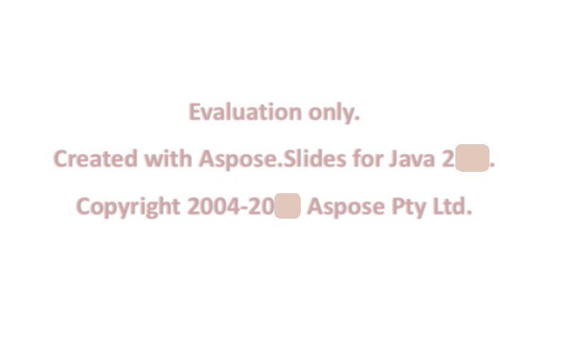

## **Aspose.Slides – wersja próbna**

Możesz łatwo pobrać Aspose.Slides do oceny. Pobranie wersji próbnej jest takie samo jak pobranie wersji zakupionej. Wersja próbna staje się licencjonowana po dodaniu kilku linii kodu służących do zastosowania licencji.

Wersja próbna Aspose.Slides (bez określonej licencji) zapewnia pełną funkcjonalność produktu, ale wstawia znak wodny oceny u góry dokumentu przy otwieraniu i zapisywaniu oraz ogranicza do jednego slajdu przy wyodrębnianiu tekstu z slajdów prezentacji.

{} 

Jeśli chcesz testować Aspose.Slides bez ograniczeń wersji próbnej, możesz również poprosić o 30‑dniową Tymczasową Licencję. Zapoznaj się z [Jak uzyskać tymczasową licencję?](https://purchase.aspose.com/temporary-license)

{}

## **FAQ**

**Czy mogę testować wiele prezentacji równocześnie w różnych wątkach w trybie wersji próbnej?**

Tak. Możesz przetwarzać różne dokumenty równolegle; nie powinieneś udostępniać tego samego obiektu prezentacji [wątkach](/slides/pl/java/multithreading/). Tryb wersji próbnej nie ma na to wpływu.

**Czy muszę zainstalować Microsoft PowerPoint, aby ocenić bibliotekę na serwerze lub w CI?**

Nie. Aspose.Slides jest samodzielnym silnikiem i nie wymaga zainstalowanego PowerPointa zarówno w trybie oceny, jak i w produkcji.

**Czy mogę w pełni przetestować konwersję PPT/PPTX do PDF i obrazów w trybie wersji próbnej?**

Tak. [Konwertery](/slides/pl/java/convert-presentation/) działają; wynik będzie zawierał znak wodny.

**Czy mogę użyć tymczasowej licencji do testów obciążeniowych bez znaku wodnego?**

Tak. 30‑dniowa tymczasowa licencja usuwa ograniczenia trybu wersji próbnej i pozwala na testowanie bez znaku wodnego.