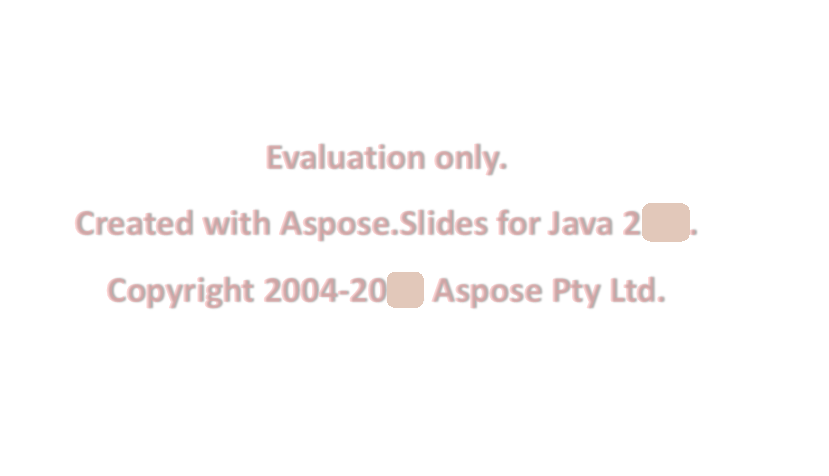

## **Ocena Aspose.Slides**

Możesz pobrać Aspose.Slides do oceny. Pobranie ewaluacyjne jest takie samo jak pobranie zakupione; staje się licencjonowane po dodaniu kilku linii kodu, aby zastosować licencję.

Bez licencji Aspose.Slides udostępnia pełną funkcjonalność w trybie oceny, z dwoma ograniczeniami: dodaje ramkę znakowania wodnego oceny do każdego slajdu każdej prezentacji, którą zapisuje, a tekst odczytywany przez Twój kod za pomocą API, włączając tekst, który właśnie ustawił, jest przycinany do kilku pierwszych znaków, po których następuje informacja o ograniczeniu wersji oceny. Tekst zapisywany przez Twój kod jest zachowywany w pełni. Metoda [getPresentationText](https://reference.aspose.com/slides/pl/java/com.aspose.slides/presentationfactory/#getPresentationText-java.lang.String-int-) , która wyodrębnia tekst bez ładowania całej prezentacji, zwraca tylko informacje o ocenie i nie zwraca tekstu slajdów.

{}
Jeśli chcesz przetestować Aspose.Slides bez ograniczeń wersji oceny, możesz również zwrócić się o 30‑dniową tymczasową licencję. Zobacz [Jak uzyskać tymczasową licencję?](https://purchase.aspose.com/temporary-license)
{}

## **FAQ**

### Czy mogę testować wiele prezentacji równolegle w różnych wątkach w trybie oceny?

Tak. Możesz przetwarzać różne dokumenty równolegle; nie powinieneś współdzielić tego samego obiektu prezentacji [przez wątki](/slides/pl/java/multithreading/). Tryb oceny nie ma na to wpływu.

### Czy muszę instalować Microsoft PowerPoint, aby ocenić bibliotekę na serwerze lub w CI?

Nie. Aspose.Slides jest samodzielnym silnikiem i nie wymaga zainstalowanego PowerPointa ani w trybie oceny, ani w produkcji.

### Czy mogę w pełni testować konwersję PPT/PPTX do PDF i obrazów w trybie oceny?

Tak. [KONWERTERY](/slides/pl/java/convert-presentation/) działają; wynik będzie zawierał znakowanie wodne.

### Czy mogę użyć tymczasowej licencji do testów obciążeniowych bez znakowania wodnego?

Tak. 30‑dniowa tymczasowa licencja usuwa ograniczenia trybu oceny i pozwala testować bez znakowania wodnego.