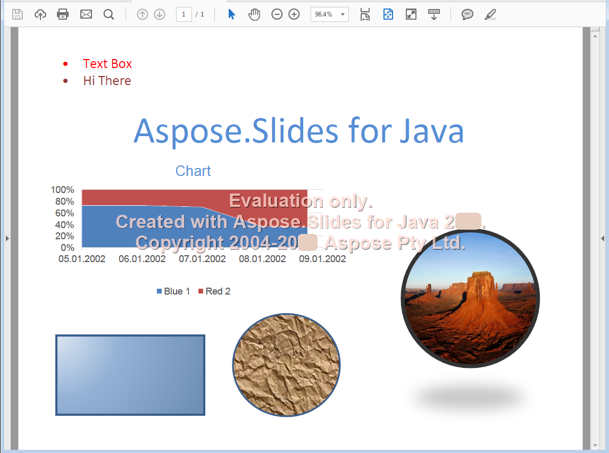

{}

To jest strona historyczna, zachowana dla istniejących linków. Nie opisuje aktualnej wersji Aspose.Slides for Java. Aby zobaczyć formaty, które Aspose.Slides for Java ładuje, importuje, zapisuje i renderuje, oraz API dla każdego z nich, zobacz [Supported File Formats](/slides/pl/java/supported-file-formats/). Aby uzyskać aktualny przewodnik konwersji PDF, zobacz [Convert PPT and PPTX to PDF](/slides/pl/java/convert-powerpoint-to-pdf/).

{}

{}

[Format Portable Document](https://en.wikipedia.org/wiki/PDF) jest formatem pliku stworzonym przez Adobe Systems do wymiany dokumentów między organizacjami. Celem tego formatu było zachowanie treści i układu identycznych, niezależnie od platformy, na której był wyświetlany. Aspose.Slides for Java umożliwia konwersję plików prezentacji do formatu PDF.

{}

## **PDF w Aspose.Slides for Java**
Każda prezentacja, którą można wczytać w Aspose.Slides for Java, może być skonwertowana do formatu PDF zgodnego z [PDF 1.5](https://en.wikipedia.org/wiki/PDF), [PDF/A-1a](https://en.wikipedia.org/wiki/PDF/A), [PDF/A-1b](https://en.wikipedia.org/wiki/PDF/A) lub [PDF/UA](https://en.wikipedia.org/wiki/PDF/UA), w zależności od wyboru. Aspose.Slides for Java eksportuje prezentacje do PDF i w większości przypadków wygenerowany plik PDF wygląda dokładnie tak jak oryginalna prezentacja.

Aspose.Slides obsługuje następujące elementy prezentacji przy konwersji do PDF:

- Obrazy, pola tekstowe i inne kształty.
- Tekst i formatowanie.
- Akapity i formatowanie.
- Hiperłącza.
- Nagłówki i stopki.
- Punktory.
- Tabele.

Możesz eksportować prezentacje do plików PDF bezpośrednio przy użyciu Aspose.Slides for Java: nie potrzebujesz żadnego innego komponentu. Ponadto możesz dostosować eksport prezentacji do PDF za pomocą różnych opcji, jak wyjaśniono w [Convert PPT and PPTX to PDF](/slides/pl/java/convert-powerpoint-to-pdf/).

**Prezentacja wejściowa**

**Prezentacja skonwertowana do PDF przy użyciu Aspose.Slides for Java**

