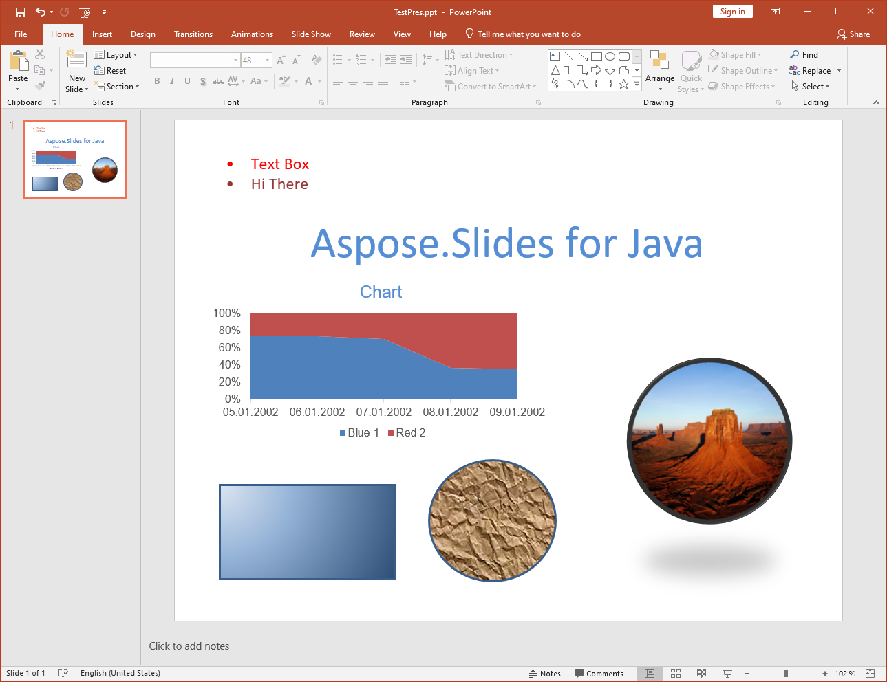

{}

To jest historyczna strona, zachowana dla istniejących odnośników. Nie opisuje bieżącej wersji Aspose.Slides for Java. Aby zobaczyć formaty, które Aspose.Slides for Java ładuje, importuje, zapisuje i renderuje, oraz API dla każdego z nich, zobacz [Obsługiwane formaty plików](/slides/pl/java/supported-file-formats/). Aby uzyskać aktualny przewodnik konwersji, zobacz [Konwertuj PPT do PPTX](/slides/pl/java/convert-ppt-to-pptx/).

{}

{}

Konwersja PPT do PPTX jest obsługiwana w Aspose.Slides for Java. Większość funkcji prezentacji — slajdy master, struktura i tak dalej — jest zachowywana po konwersji z jednego formatu na drugi, ale istnieje kilka ograniczeń.

{}
## **Funkcje obsługiwane w konwersji**
Aspose.Slides for Java zapewnia częściowe wsparcie dla konwersji formatu pliku PPT do PPTX. Wsparcie dla konwersji zostało właśnie wprowadzone w Aspose.Slides for Java, więc ma kilka ograniczeń i najlepiej sprawdza się w prostych prezentacjach. Główną zaletą, jaką oferuje Aspose.Slides for Java przy konwersji PPT do PPTX, jest łatwość użycia API. Aby zobaczyć przykłady kodu, zobacz [Konwertuj PPT do PPTX](/slides/pl/java/convert-ppt-to-pptx/). Poniższa lista przedstawia, które funkcje są obsługiwane w konwersji PPT do PPTX.

**Prezentacja źródłowa PPT**

**Po konwersji do PPTX**

## **Obsługiwane funkcje**
Poniższe funkcje są obsługiwane w konwersji:

- Konwertowanie struktury masterów, układów i slajdów.
- Konwertowanie wykresów.
- Kształty grupowe.
- Konwertowanie automatycznych kształtów, w tym prostokątów i elips.
- Kształty o niestandardowej geometrii.
- Tekstury i obrazy jako style wypełnienia dla automatycznych kształtów.
- Konwertowanie placeholderów.
- Konwertowanie linii i polilinii.
- Formaty linii i wypełnień.
- Style wypełnienia gradientowego.
- Ramki OLE, tabele, ramki wideo i audio itp.
- Właściwości animacji i pokazu slajdów.
- Konwertowanie tekstu w ramkach tekstowych i kontenerach tekstu.